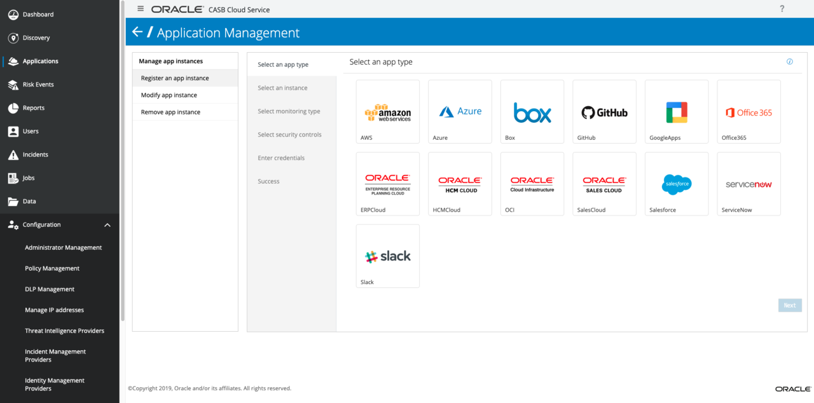
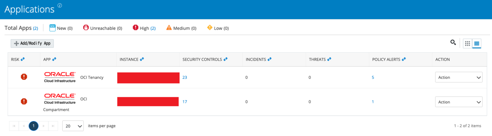
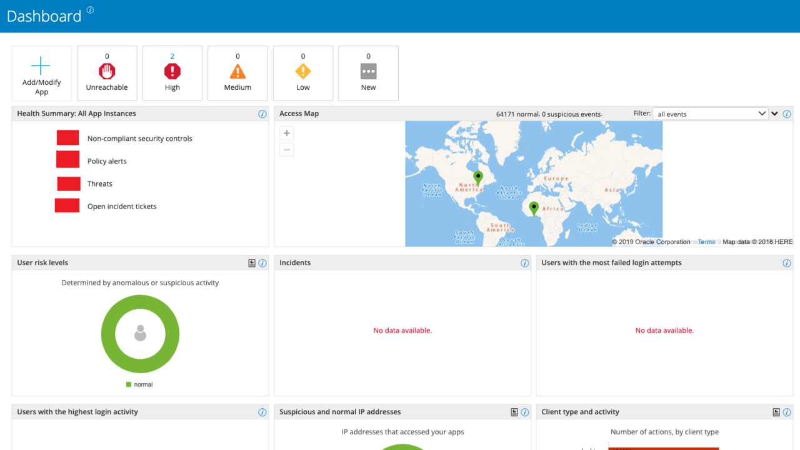

Oracle Cloud Infrastructure (OCI) のリソースに対する操作内容や、ユーザごとのログイン状況を監視し、セキュリティリスクが見つかった時にアラートを上げてくれる、**Oracle CASB** というサービスを使ってみた。

## 目次

## CASB とは

Oracle CASB というサービスの話に入る前に、まずは CASB の概念から。

**CASB (Cloud Access Security Broker・キャスビー)** というのは、ガートナーという IT 企業が2012年に提唱した概念。Office 365 や Google Drive など、複数のクラウドサービス (SaaS・PaaS・IaaS) を併用して仕事をするのが普通になってきて、企業としてはアカウントの管理とか重要だよね、ってことで考えられた仕組み。これまでも、個人所有のデバイスやアプリを職場に持ち込んで使う BYOD・BYOA は、情報漏洩に繋がりかねないとして問題になっていたけど、クラウドサービスが当たり前になってくると、企業が利用状況を把握できない IT 活用のケースが増えてきて、いわゆる「Shadow IT シャドー IT」が問題視されている。

そこで、この CASB と定義付けられたサービスは、ユーザとクラウドサービスとの通信を仲介するブローカーとして挟まって、不正アクセスなどのセキュリティリスクを検知し、通信をブロッキングするように働く。イメージとしては、社内ネットワークからインターネットに出ていく際のプロキシや、インターネットから入ってくるファイアウォール的な立ち位置で、ユーザのクラウド利用状況を監視・制限しましょう、というツールになる。

## Oracle CASB とは

ガートナーが提唱した CASB の概念でいくと、CASB サービスはプロキシ的に通信に介入してくるので、通信の遅延が出てきたり、万が一 CASB サービスで障害が発生すると、各クラウドサービスにログインできなくなってしまうリスクもある。

コレに対し、Oracle CASB は、このようなブローカーの形態は取っておらず、各クラウドサービスが提供する API から情報をもらって、セキュリティリスクを検出する仕組みを採用している。ユーザとクラウドサービス間の通信には仲介しないので、通信のレイテンシなどは発生しない。

この形態でも当然、不正ログインの形跡などは検知できるものの、その通信をブロッキングするような仕組みはほとんど持たないので、防御策としては微妙となる。よくよく考えたら_「ブローカー」_ではないのに、CAS_B_ と名前が付いているのよね。

CASB サービスを挟むことで通信速度や障害の影響を受けたくない、とか、脅威が炙り出せたら対応は自分たちでやります、という情強な人達なら、Oracle CASB のような API 型でも良いと思う。

## Oracle CASB で監視できるサービス

Oracle CASB で監視できるサービスは、現時点で以下のとおり。

- AWS・Azure・Box・GitHub・GoogleApps・Office365・Oracle ERP Cloud・Oracle HCM Cloud・OCI・Oracle Sales Cloud・Salesforce・ServiceNow・Slack

AWS は CloudTrail から情報を横流ししてもらって監視するみたい。今回は OCI の監視しか対象にしないので、他のサービスと連携してできることは省略。

## Oracle CASB で OCI を監視して分かること

続いて、Oracle CASB で OCI を監視して分かることはどんなことがあるかというと、以下のようなことが分かる。

- OCI 上のリソースの現状から分かるリスク
  - パブリック IP を持つ Compute Instance が存在する (不正アクセスに繋がりかねない、理想は Public IP を捨て、踏み台サーバを中継してアクセスするような構成)
  - `0.0.0.0/0` からのインバウンド通信を許可している Compute Instance が存在する (コレも不正アクセスに繋がりかねない)
  - テナンシー全体のリソースを操作できる OCI ユーザが存在する (その OCI ユーザのログイン情報が漏洩したら何でもできてしまう)
  - 他要素認証 (MFA) を有効にしていない OCI ユーザが存在する (セキュリティレベルを高めるためのアドバイス)
- OCI 上のリソースの操作
  - コンパートメントの追加・削除 (大きな変更なので、許可を得て計画的に行われたものかどうか監視できるようにしている)
  - ポリシーの追加・変更・削除 (OCI のリソース操作に関わる部分なので、同様に監視されている)
- OCI へのログイン情強
  - 同一の OCI ユーザが、複数のブラウザ、複数の IP アドレスからログインしてきた (アカウントの不正利用の可能性として検出してくれる)
  - 複数の OCI ユーザが、同一の IP アドレスからログインしてきた (アカウント情報の一覧が漏洩し、一つずつ侵入を試行しているのでは？という可能性を検出する)

この他にも沢山の監視ルールがプリセットとして用意されているし、自分で好きな監視ルールを決めることもできる。

## Oracle CASB の管理画面に入るまで

さて、Oracle CASB というモノを使ってみよう、と思ったのだが、Oracle CASB の管理画面に入るまでが一苦労だった。

まず、**Oracle Cloud のテナント管理者**に、以下の作業をやってもらう必要がある。

1. Oracle Cloud My Services の管理コンソールにて、自分に対し、_「Oracle CASB アプリケーション」へのアクセス権_を設定する
2. Oracle Identity Cloud Service (IDCS) の管理画面にて、自分に対し、_「Oracle CASB への SSO (シングル・サイン・オン)」権限_を設定する
3. Cloud My Services のメニューから「Oracle CASB」を選択し、Oracle CASB 管理コンソールに遷移する

コレで、まずテナントの管理者が、Oracle CASB の管理画面を触れる状態になった。

続いて、テナントの管理者以外のユーザにも Oracle CASB を使えるようにしたい場合、**テナントの管理者が**以下の作業を行う必要がある。

1. Oracle Cloud My Services の管理コンソールにて、「Oracle CASB にアクセスさせたいユーザ」に対し、_「Oracle CASB アプリケーション」へのアクセス権_を設定する
2. Oracle Identity Cloud Service (IDCS) の管理画面にて、「Oracle CASB にアクセスさせたいユーザ」に対し、_「Oracle CASB への SSO (シングル・サイン・オン)」権限_を設定する
3. Cloud My Services のメニューから「Oracle CASB」を選択し、Oracle CASB 管理コンソールに遷移する
4. Oracle CASB 管理コンソールの左メニューから「Configuration」→「Administrator Management」を選び、「Oracle CASB にアクセスさせたいユーザ」を追加する
    - 設定する権限は「Tenant Admin」にしておくと、「Tenant Admin (root)」権限を持っているテナント管理者と同じ操作ができるようになる

手順 1. と 2. は、Oracle CASB サービスへ SSO するための前準備として必要で、手順 4. で行ったユーザ追加をしないと、Oracle CASB 側が SSO を許可できない、ということになる。

で、この Oracle CASB 側にユーザを追加する作業が、_一番最初は Administrator がテナント管理者しかいない_ので、2人目の「Tenant Admin」ユーザを作るまでは、テナント管理者が作業しないといけない、というワケだ。

Oracle CASB 側で「Tenant Admin」権限を持ち、Oracle CASB にログインできるようになったユーザがテナント管理者以外にいれば、以降はその人がユーザ追加などができるので、必ずしもテナント管理者が作業する必要はなくなるが、**とにかく面倒臭い。**

また、Oracle CASB の管理画面で10分間無操作でいると、Oracle CASB のログイン画面らしきページに飛ばされるが、_この画面からはどうやっても再ログインできない_ので注意。必ず Cloud My Services ダッシュボードから Oracle CASB に遷移しないといけない。ホント面倒臭い…。

## OCI の監視を始めるための OCI ユーザ設定

Oracle CASB の管理画面に入れるようになったら、OCI の監視をすぐ始めたいところだが、そのための事前準備もいくつかあるので紹介。

要するに、OCI のテナンシー全体を自由に Read できる OCI ユーザを作っておいて、Oracle CASB はその OCI ユーザを API 経由で利用して、テナンシーの中を監視する、という仕組みになるのだ。

大まかな手順は以下のとおり。

1. OCI 上で「CASB 監視用ユーザ」を作る
2. CASB 管理画面で、API Key を発行する
    - 「CASB Key-Pair Management」を開くと「User public key」が表示されているのでコレをコピーする
3. OCI 上で、作った「CASB 監視用ユーザ」に先程の API Key を追加する
4. 「CASB 監視用グループ」を作る
5. 「CASB 監視用グループ」に「CASB 監視用ユーザ」を追加する
6. CASB 管理画面で、CASB 監視用のポリシー・ステートメントを取得する
    - CASB 管理画面の「CASB Key-Pair Management」ページ下部、黄色い枠内の「here」リンクを押下する
    - 「YourGroupNameGoesHere」欄に「CASB 監視用グループ」の名前を入れる
    - `Allow group …` で始まる合計6つのポリシーが表示されているはずなので、コレを控えておく
7. ルートコンパートメントで「CASB 監視用ポリシー」を作成する
    - 先程控えたステートメントを全部設定する

コレでユーザの準備は完了。いよいよ CASB 監視のための設定が始められる。

## OCI テナンシー全体を監視する

まずは OCI テナンシーへのログインや、ルートコンパートメント直下のリソースを監視するための設定を作る。1つのクラウドサービスと連携するための設定情報のことを、Oracle CASB では_「Application Instance」_と表現している。ココでは、OCI Tenancy を監視する Application Instance を作る、という表現になる。

1. CASB 管理画面の左メニューから「Applications」を選択し「Application Management」画面を開く
2. 「Select an app type」画面が表示されているので、「OCI」を選択し「Next」ボタンを押下する
3. 「Select an instance」画面、「Type a unique name for your instance」欄は適当に名前を入れ「Next」ボタンを押下する
4. 「Enter credentials」画面
    - 「Select the type of OCI Compartment that Oracle CASB Cloud will monitor:」は「Tenancy」を選択しておく
    - 「User public key fingerprint」が OCI の「CASB 監視用ユーザ」に登録した API Key のフィンガープリントと一致していることを確認する
    - 「Tenancy OCID」、「User OCID」を入力する
    - 「Test Credentials」ボタンを押下する
    - 「Successfully initiated direct connection」と表示されたら問題なし、「Submit」ボタンを押下する
5. 「Success」画面が表示されるはず。「Done」ボタンを押下する

コレで、テナンシーの監視設定ができた。

- 左メニュー「Dashboard」を押下し、「New」を選んでみる
- 登録したアプリケーションがあるので見てみると、「Health Summary」ポップアップが表示され、「Collecting initial data」中であるとのこと。

初回はデータ収集に30分から2時間ぐらいかかるので、しばらく待つ。

## コンパートメントを監視する

ココで残念なお知らせだが、ココまでで登録した OCI Tenancy の監視設定では、**コンパートメント内のリソースの監視はしてくれない**。監視したいコンパートメントごとに、Application Instance を登録する必要があるのだ。手順は次のとおり。

1. 左メニュー「Applications」を選択する
2. 「Applications」画面で「Add/Modify App」を押下する
3. 「Application Management」画面、「Select an app type」画面より「OCI」を選択して「Next」ボタンを押下する
4. 「Select an instance」画面。適当な名前を付ける
5. 「Enter credentials」画面
    - 「Compartment under a registered Tenancy」ラジオボタンを選択する
    - 「OCI Application instance」欄でさっき作った OCI Tenancy を監視する Application Instance を選択する
    - 「Tenancy」「Tenancy OCID」が自動入力される
    - 「Test Credentials」ボタンを押下する
    - 「Successfully initiated direct connection」と表示されたら OK
    - 「Compartment」欄が表示されるので、監視したいコンパートメント名を選ぶ
    - 「Compartment OCID」は自動入力される
    - 「Submit」ボタンを押下する
6. 「Success」画面が出たら OK

コレを監視したいコンパートメントの分だけ繰り返さないといけない…。

## 課金は Application Instance の数だけされる

そしてさらに残念なお知らせで、Oracle Cloud の課金体系としては**「Application Instance の数」で課金される。**つまり、OCI Tenancy と、コンパートメント1つを監視設定に追加したとすると、_合計2つの IaaS を監視している_ということで、2つの課金がされることになるのだ。

IaaS の Application Instance を1つ追加すると、**1時間あたり300円程度、1日で大体7,200円程度**の課金額になる。そしてコレが、「テナンシー全体 + 監視したいコンパートメントの数」で増えていくので、コンパートメントを1つ監視した時点で、この金額の2倍、1日で14,400円程度の課金を覚悟しないといけない。

課金額がエグいので、OCI を一旦紐付けて、イニシャルデータだけ収集させたらレポート CSV を出力し、急いで Application Instance を削除する、という使い方もアリかもしれない。以降の運用における内部ユーザの監視は金額的に諦めても、定期的なセキュリティリスクのチェックに用いるのも一つだと思う。

## 監視ログの見方色々

初回は2時間くらいデータ収集を待つことになるが、以降は1・2時間のタイムラグで常時データが収集される。

CASB 管理画面のトップページでは、検出したセキュリティリスクの件数が表示されたり、アクセス元が地図上に表示されたりしているので、ココからたどっていくと良さそう。

厳しすぎるポリシーは緩めたり除外設定を入れたりして調整していって、普段はセキュリティリスクが1件も検出されないように調整すると良い感じ。

この辺はひたすら画面みていじっていくことになるし、定常業務の中で改善していくことかなぁと。

## 以上

課金額が高いのが厳しいところだが、拾い上げられるリスク情報はなかなか参考になるし、設計時の見落としにも気が付けたりするので、OCI を利用する際は、少なくとも一度は組み合わせても良いかなと思った。

他のクラウドサービスとの連携についても、組織での統制を取っていく上では重宝すると思うので、一度 Oracle CASB の画面を見ておくと面白いかなと思う。
