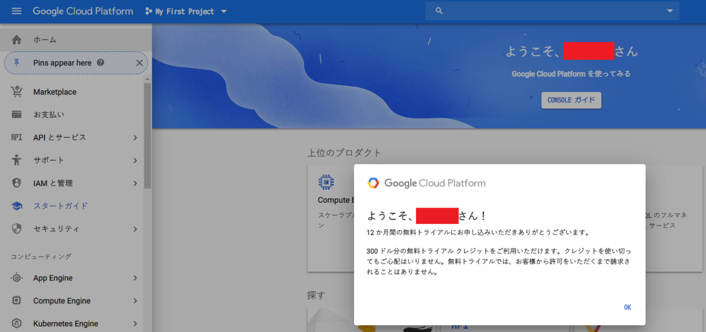
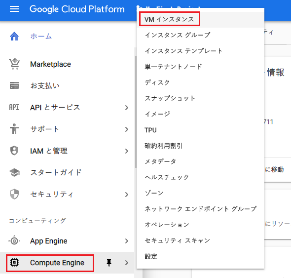
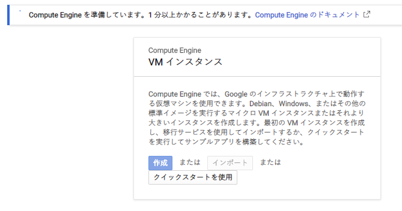
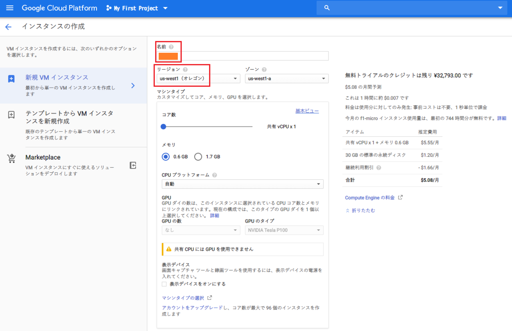
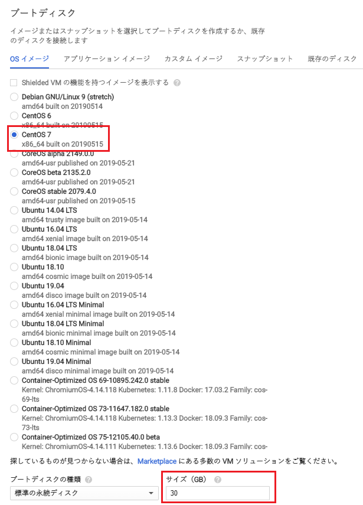
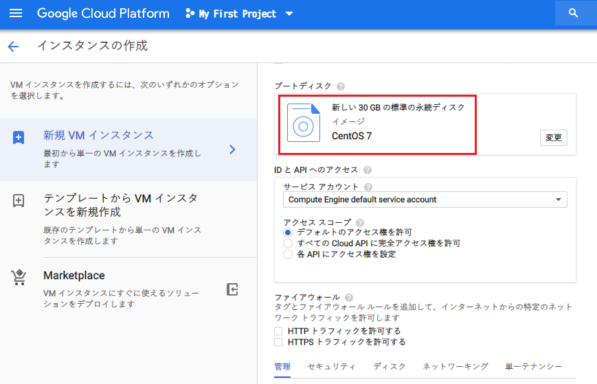
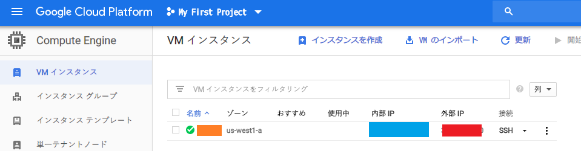
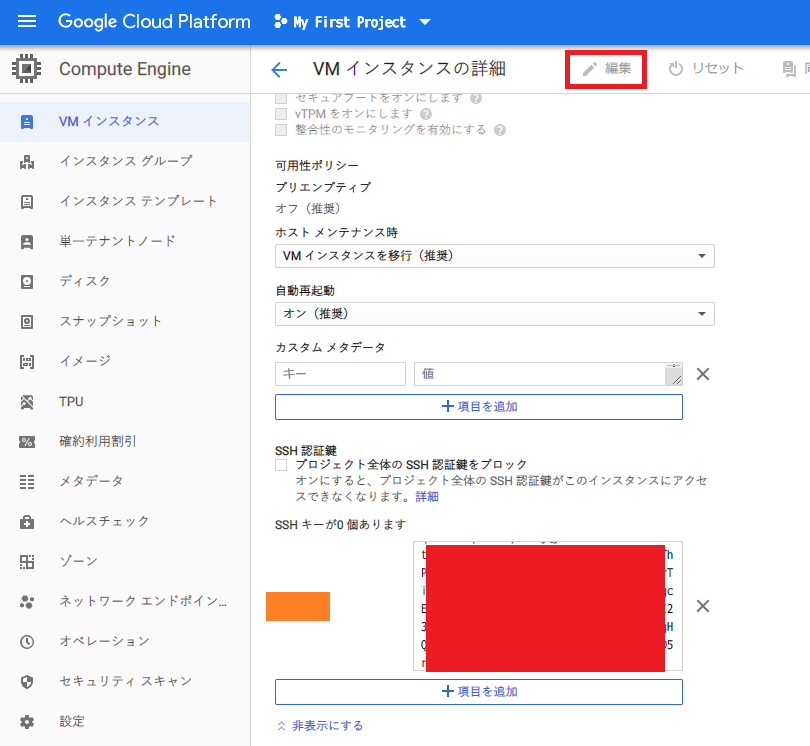

どういうワケか、Heroku で PaaS を触ったあと、Oracle Cloud Infrastructure (OCI) で IaaS 入門してしまった。せっかくなので *Google Cloud Platform (GCP)* も始めてみよう、と思い、GCP の中の「**Google Compute Engine (GCE)**」という仮想マシン (VM) を借りられるサービスを使ってみることにした。OCI でいうところの「Compute Instance」を借りるのと同じ領域だ。

ただ、GCE の凄いところは、**低スペックな VM を1台だけなら完全無料で借りられる**、というところだ。いわゆる「永久無料枠」というヤツなので、お金をかけずにお試しするにはもってこいだ。

今回は、GCP の初回登録から、GCE のインスタンス作成、そしてとりあえず SSH 接続するところまでを試してみる。

## 目次

## GCP の無料枠について

GCP の無料枠については、GCE 以外にもいくつかのサービスがある。詳しくは以下より。

- [GCP Free Tier - Free Extended Trials and Always Free  |  Google Cloud](https://cloud.google.com/free/)

GCP に登録すると、登録から1年間だけ使える、300ドル分のクレジットが無料でもらえる。つまり最初の1年間のうちは、300ドル分の有料サービスを使っても課金されない、ということだ。

また、この300ドルを超過したり、1年を超えて無料トライアル期間が終了しても、動かしていたサービスが止められるだけで、いきなり課金されることはない。最初にクレジットカード情報を登録するものの、手動で有料アカウントに設定しない限りは課金されないので安心だ。

## GCE の Always Free (永久無料枠) について

GCP の中の、VM を借りられる GCE については、以下の条件下であればずっと無料で使える。

1. f1-micro インスタンスが1台だけ借りられる
    - インスタンスは北バージニア (us-east4) 以外の米国リージョンで借りる必要がある。日本リージョンなどで借りると有料になってしまうので注意
    - 米国リージョンなので、通信のレイテンシがある他、f1-micro というインスタンス種別は一番スペックが低い VM なので、スペックには期待できない
2. 30GB 分の HDD まで
    - f1-micro インスタンスにアタッチできる記憶媒体は、30GB 分までの HDD のみ。それ以上の HDD を指定すると有料になる
3. 北米から全リージョン宛の下りネットワーク通信が1ヶ月あたり 1GB まで。中国とオーストラリアへの通信は最初から有料
    - VM から外にアクセスするネットワーク通信は、月に 1GB までが無料。大量にファイルをダウンロードするような通信をすると、通信部分が課金されるということだ

というワケで、VM を起動させっぱなしでも課金はされないが、アウトバウンド通信が多いと課金されるし、マシンスペックや HDD のサイズが必要な場合は無料枠では厳しいということになる。

## Google Cloud Platform に登録する

それではいよいよ GCP を始めよう。

まずは GCP に登録する。以下のページが無料枠の紹介ページも兼ねているので、ココで無料枠の内容を確認してから、「登録を開始」ボタンで登録していこう。

- [GCP Free Tier - Free Extended Trials and Always Free  |  Google Cloud](https://cloud.google.com/free/)

自分は Google AdSense を利用していて、クレジットカード情報を登録してあるアカウントがあったので、それを利用して GCP に登録することにした。



## GCE インスタンスを作成する

GCP に登録できたら、VM を作っていこう。GCP 管理コンソール画面左上のハンバーガーメニューから「Compute Engine」→「VM インスタンス」を選択する。



初回は1・2分待たされるが、「作成」ボタンを押下して次に進む。



「インスタンスの作成」画面に移動したら、次のように設定していく。

- 名前 : 半角英数字で任意。コレが VM のユーザ名になる
- リージョン : US リージョンを選ぶこと。日本から近いのは `us-west-1` など、西海岸のリージョン
- ゾーン : 選択した US リージョン内でお好きに
- マシンタイプ : micro (コレが f1-micro インスタンスのこと)
- イメージ : OS を選べる。デフォルトは Debian だと思うが、CentOS なども使える
  - ココでプリセット以外のイメージを選ぶと課金されてしまうので注意。Debian か CentOS のどちらかぐらいにしておこう
- ブートディスク : 上限の 30GB に設定しておく
- ファイアウォール : チェックボックスにより 80 (HTTP) ポートや 443 (HTTPS) ポートを簡単に開放できるが、今は開放しないでおく







設定した内容で本当に課金されないか確認するには、右ペインの費用計算を見てみれば良い。問題なければインスタンスを作成する。

作成が完了したら、VM の一覧で**パブリック IP (= 外部 IP)** が確認できるようになるはずなので、コレを控えておく。



この Public IP はインスタンスの終了ごとに変わってしまうもので、設定次第で固定 Public IP にもできるので、次回紹介する。今回はこの変動 Public IP をメモしておこう。

## SSH 鍵ペアを作成する

VM が作れたら、SSH 接続するための鍵ペアを作成する。

Windows GitBash や MacOS 標準ターミナルなどを開き、以下のようにコマンドを入力する。

```bash
$ ssh-keygen -t rsa -b 4096 -f ~/.ssh/my_gce_vm -N '' -C '【VM 作成時に入力した「名前」】'
```

VM 作成時に「名前」欄に入力した文字列を、`-C` (コメント) オプションに書くのが特徴。GCE の場合は、この `-C` オプションによるコメントが任意のコメントではなく、ユーザ名を特定するために使われているようなのだ。

コレで、`~/.ssh/` 配下に、`my_gce_vm` (秘密鍵) と `my_gce_vm.pub` (公開鍵) の2ファイルが生成されるはずだ。次の手順で使うので、公開鍵ファイルの中身をコピーしておく。

```bash
$ cat ~/.ssh/my_gce_vm.pub

# 以下のような文字列が表示されるはずなので全部コピーしておく
ssh-rsa xxxxxxxxxxxxxxxxxxxxxxxxxxxxxxxx 【VM 名】
```

## SSH 公開鍵を VM に設定する

GCP 管理コンソールで、作成した VM インスタンスを選び、編集画面に移動する。

「SSH 認証鍵」セクションに移動すると、SSH キーを入力できるテキストエリアが表示される。ココに、先程確認した公開鍵ファイル (`my_gce_vm.pub`) の内容を全量貼り付けて保存する。



## SSH 接続する

公開鍵設定が終わったので、いよいよ VM にアクセスしてみる。

以下の要領で SSH 接続できるはずだ。

```bash
# 秘密鍵ファイルを指定する
$ ssh -i ~/.ssh/my_gce_vm 【VM 名】@【Public IP】

# VM の名前が「neosvm」、パブリック IP が「38.154.10.0」だったとしたら、こんな風になる
$ ssh -i ~/.ssh/my_gce_vm neosvm@38.154.10.0
```

VM 名のユーザで SSH 接続できただろうか。このユーザは `$ sudo su -` で root 権限を利用できるので、VM 内でほとんど好きなようにできる。

## セキュリティ上やっておきたいことは次回

ココまでで、GCP に登録し、永久無料枠の GCE インスタンスを立て、そこに SSH 接続できた。

しかし、このままでは、セキュリティ上の問題や、使い勝手の悪い部分がある。例えば以下のような点だ。

- 万が一課金が発生した時に気が付きにくい
- SSH 接続用に22番ポートが開いており、侵入の危険性がある
- Public IP が VM の終了に応じて変動してしまう

それぞれ、「予算アラートを設定する」「22番ポートを閉じて別のポートで SSH 接続できるようにする」「固定 Public IP を割り当てる」といった作業で対処できるので、次回の記事も合わせて確認し、安全に利用できるよう設定をしてほしい。

今日のところはココまで。

- 参考 : [これから始めるGCP（GCE） 安全に無料枠を使い倒せ - Qiita](https://qiita.com/Brutus/items/22dfd31a681b67837a74)
- 参考 : [GCE の無料枠のサーバを立るときに、初見でハマりそうなところ - Qiita](https://qiita.com/ndxbn/items/7ef0a96e409a5b5837bd)
