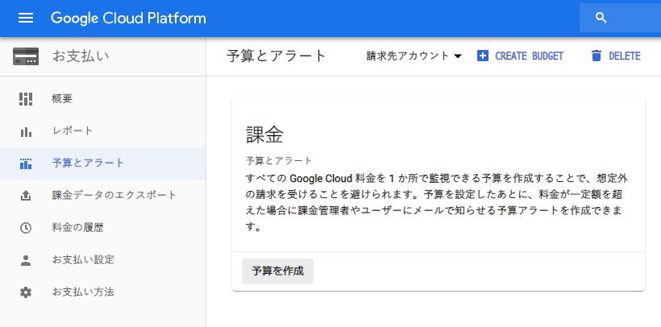
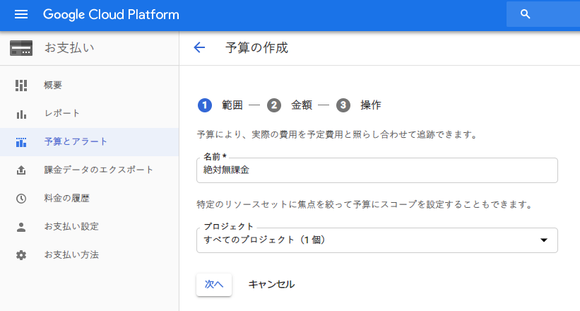
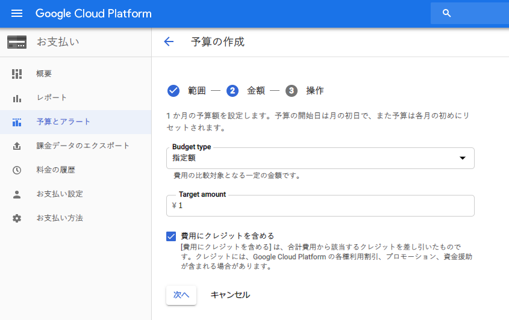
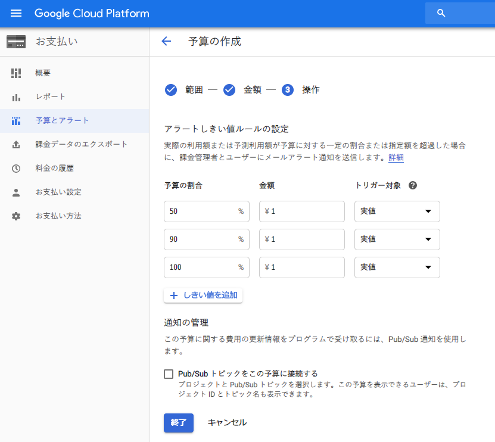
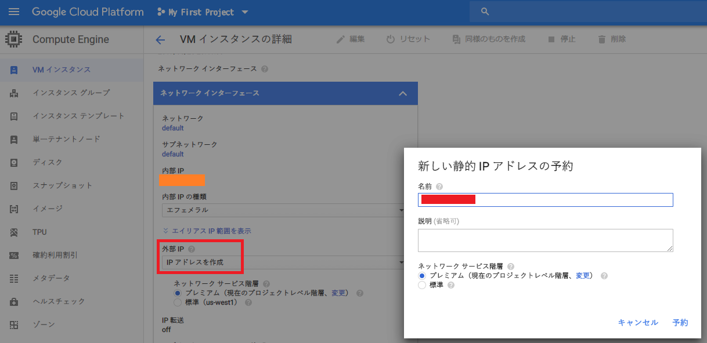
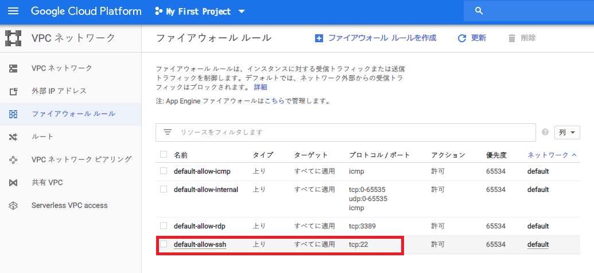
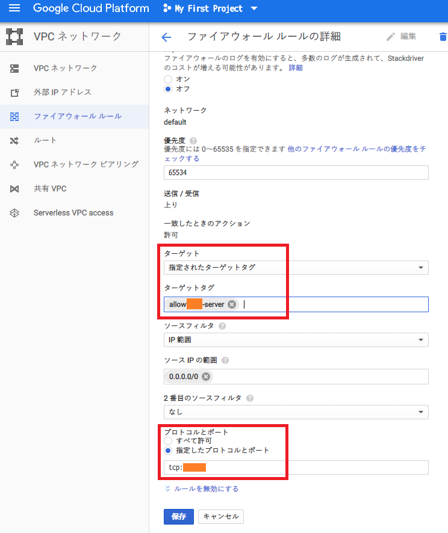
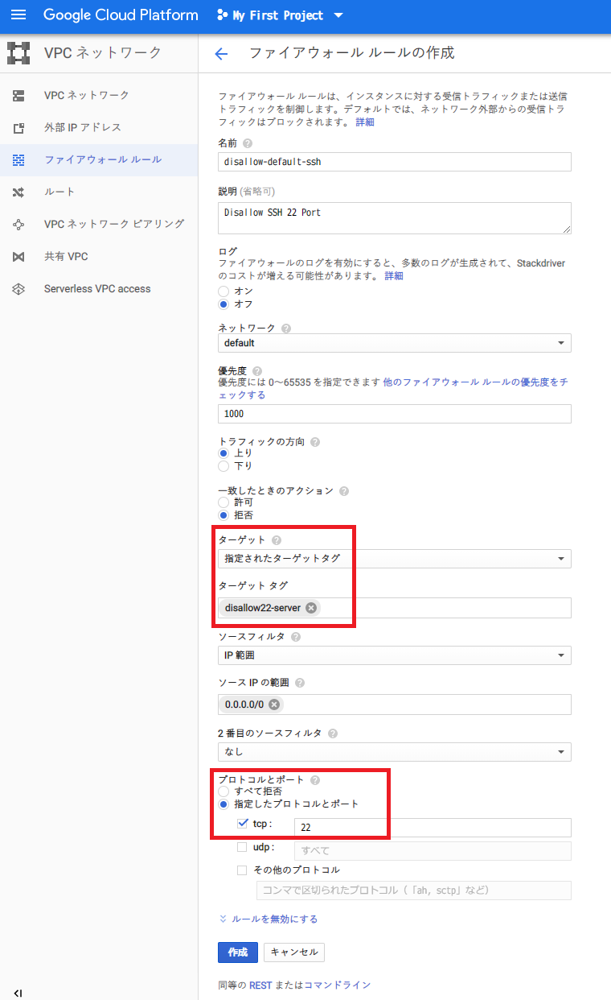
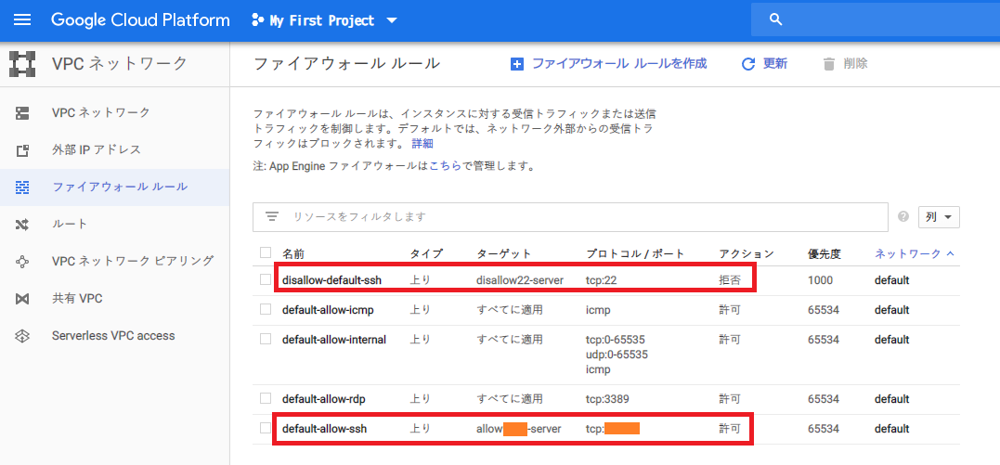
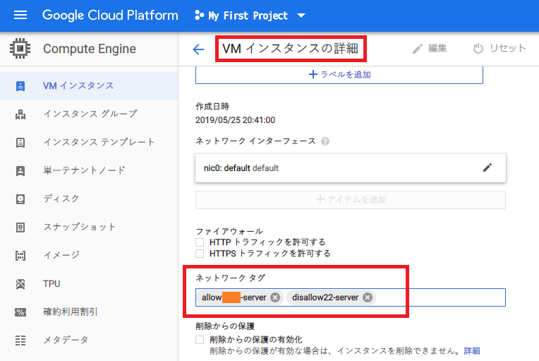

前回、*Google Cloud Platform (GCP)* に登録し、その中の **Google Compute Engine (GCE)** というサービスを使い、完全無料で使える仮想マシン (VM) を立ち上げて SSH 接続までこぎつけた。

今回は、立ち上げた VM をより安全に利用するための設定を紹介する。

## 目次

## 課金を通知する予算アラートを設定しておく

前回説明したとおり、GCP には無料枠と1年間の無料クレジットがあるし、有料アカウントに手動で移行するまでは課金されない。しかし、万が一のことを考えて、1円でも課金対象が発生したらメール通知が飛ぶよう、アラートを設定しておこう。

左上のハンバーガーメニューを開き、「お支払い」→「予算とアラート」と進み、「予算を作成」ボタンを押下する。



ココで、「予算額」を「￥ 1 (1円)」と設定する。予算アラートは 50%・90%・100% いずれも「1円」に設定しておく。







コレで、万が一不意に課金されても、メール通知が飛ぶので、すぐに気付いて対処できるだろう。

## VM に割り当てられる Public IP を固定する

VM に割り当てられるデフォルトのパブリック IP は、VM を終了するごとに変動してしまう。コレを、VM を終了しても同じパブリック IP が割り当てられるように設定する。

GCP の管理コンソールより GCE の管理画面に移動したら、当該 VM の編集画面を開き、「ネットワークインターフェス」セクションに移動する。

ココで「外部 IP」のセレクトボックスから「IP アドレスを作成」を選ぶと、静的 IP アドレスを予約でき、それを割り当てられる。



それまでの変動 Public IP (エフェメラル IP) は破棄されているはずだが、余計な課金対象として残らないように、「外部 IP アドレス」画面に未使用の IP が残っていないか確認しておこう。

## SSH 接続するためのポートを22番から他のポート番号に変更する

実は、VM を作成すると、その直後から GCP を狙った不正アクセスが世界中から仕掛けられている。VM 内の `/var/log/auth.log` ファイルを見ると、その形跡が確認できるだろう。

コレは、22番ポートが開いている Public IP を総当たりで調べてきていることによるもの。そこで、GCP の*ファイアウォール設定*を利用して、22番ポートへのアクセス自体を禁止し、SSH 接続する際のポート番号を他のモノに変更してセキュアにしておこう。

### ポートを変更する前に SELinux を無効化する

独自のポート番号を使用するためには、**SELinux の設定を無効化**しておく必要がある。まずは普通に22番ポートで SSH 接続し、以下の設定を行う。

```bash
# ファイアウォールを無効化する
$ sudo systemctl disable firewalld
Removed symlink /etc/systemd/system/multi-user.target.wants/firewalld.service.
Removed symlink /etc/systemd/system/dbus-org.fedoraproject.FirewallD1.service.

# 以下のファイルを編集し SELinux を無効化する
$ sudo vi /etc/selinux/config
# 'SELINUX=enforcing' の行を 'SELINUX=disabled' と変更する

# 設定を確認する
$ sudo systemctl is-enabled firewalld
disabled

$ sudo getenforce
Enforcing
```

ココで、`getenforce` コマンドの結果が `Disabled` ではないことが確認できる。まだ先程の設定変更が反映されていないのだ。変更を反映するには、GCP 管理コンソールより、対象の*インスタンスを再起動*する必要がある。

インスタンスを再起動した後、再度 SSH 接続してみよう。`getenforce` コマンドの結果が `Disabled` になっているはずだ。

```bash
$ sudo getenforce
Disabled
```

### SSH 接続に使用するポート番号を変更する

続いて、SSH 接続に使用するポート番号を22番から他の番号に変更する。一般的な1024番未満のポートでなければどの番号でも構わないが、今回は例として*10022番ポート*を使うことにした。

```bash
# ポート番号を変更する
$ sudo vi /etc/ssh/sshd_config
# '#Port 22' のコメント行をアンコメントし 'Port 10022' と変更する

# sshd を再起動する
$ sudo systemctl restart sshd

# 設定を確認・10022ポートをリッスンしていることが分かる
$ systemctl status sshd.service
● sshd.service - OpenSSH server daemon
   Loaded: loaded (/usr/lib/systemd/system/sshd.service; enabled; vendor preset: enabled)
   Active: active (running) since Sat 2019-05-25 12:22:54 UTC; 1min 2s ago
     Docs: man:sshd(8)
           man:sshd_config(5)
 Main PID: 2883 (sshd)
   CGroup: /system.slice/sshd.service
           └─2883 /usr/sbin/sshd -D

May 25 12:22:54 gce systemd[1]: Starting OpenSSH server daemon...
May 25 12:22:54 gce sshd[2883]: Server listening on 0.0.0.0 port 10022.
May 25 12:22:54 gce sshd[2883]: Server listening on :: port 10022.
May 25 12:22:54 gce systemd[1]: Started OpenSSH server daemon.
```

このあと、GCP のファイアウォール設定を変更するのだが、設定変更が完了するまでは、このターミナルの接続を切断せずに置いておいた方が良い。万が一設定が間違っていた時に、二度と SSH 接続できなくなる恐れがあるためだ。

(といっても、22番ポートを塞ぐと接続中の SSH 接続も切断されてしまうようなのだが、とりあえず気休めで)

### GCP のファイアウォール設定を変更する

GCP の管理コンソールを開き、「10022番ポートへのアクセスを許可」するルールと、「22番ポートへのアクセスを禁止」するルールをそれぞれ作成する。

「ネットワーキング」→「ファイアウォールルール」と開くと、22番ポートでの SSH 接続を許可しているルールがあるはずだ。



まずはコレを流用して、10022番ポートへのアクセス許可用ルールに変更しよう。

- ルール名 : `allow-10022` と変更する (命名はデフォルトルールに沿ったモノ)
- トラフィックの方角 : 上り
- 一致したときのアクション : 許可
- ターゲット : 「指定されたターゲットタグ」を選択する
- ターゲットタグ : **`allow10022-server`** と入力する (命名はデフォルトルールに沿ったモノ・このタグが付いている VM にのみ、このファイアウォールルールが適用される)
- ソース IP の種類 : `0.0.0.0/0` (全ての IP からのアクセスを許可する)
- プロトコルとポート : 「指定したプロトコルとポート」を選択し、*`tcp:10022`* と入力する
  - ココで、`tcp:22,10022` と入力すると、22番ポートでも10022番ポートでも SSH 接続できる状態になる。一度このような設定で SSH 接続確認しても良いかも



以上のように設定することで、10022番ポートでの SSH 接続を許可するルールができた。

続いて「22番ポートへの接続を許可しないためのルールを作る。新たなルールを作り、以下のように設定する。

- ルール名 : `disallow-22`
- トラフィックの方角 : 上り
- 一致したときのアクション : 拒否
- ターゲット : 「指定されたターゲットタグ」を選択する
- ターゲットタグ : **`disallow22-server`**
- ソース IP の種類 : `0.0.0.0/0`
- プロトコルとポート : 「指定したプロトコルとポート」を選択し、*`tcp:22`* と入力する



2つのファイアウォールルールを作った状態。



そしたら、GCE インスタンスの編集画面に移動する。

編集画面の中に「ネットワークタグ」を指定できる欄があるので、ココに、先程作ったファイアウォールルールの「ターゲットタグ」である、

- `allow10022-server`
- `disallow22-server`

の2つを入力する。



コレでファイアウォールルール自体の定義と、それを VM に適用するための設定ができた。

### 変更後のポート番号で SSH 接続する

恐らくこの設定中に、22番ポートで接続中のターミナルの接続は遮断されてしまうと思うが、VM 側の設定がうまく行っていない場合はこのターミナルで引き続き作業したいので、このターミナルウィンドウは触れずに置いておく。

別のターミナルウィンドウを開き、変更後のポート番号を指定して SSH 接続してみる。

```bash
# ポート番号を指定して SSH 接続する
$ ssh -i ~/.ssh/my_gce_vm -p 【ポート番号】 【VM 名】@【Public IP】

# 10022番ポートに変更した場合の例
$ ssh -i ~/.ssh/my_gce_vm -p 10022 neosvm@38.154.10.0
```

コレで接続できれば、`allow-10022` というファイアウォールルールが正常に働いていることが分かる。

ついでに、また別ターミナルを開いて、`-p 10022` 部分を削るか `-p 22` と書き直し、22番ポートで SSH 接続してみよう。恐らくどれだけ待っても応答がなく、タイムアウトになると思われる。コレが、`disallow-22` というファイアウォールルールが効いている証拠となる。

## 以上

コレで GCP の登録と、永久無料枠の GCE を使った VM インスタンスの環境構築が出来上がった。後はこの VM で自前の Web サーバを立ててみてもよし、別のインスタンスへの踏み台サーバとしてもよし。無料枠の中でも色々な使い方ができると思うので、お遊び用に作っておくと良いだろう。

- 参考 : [これから始めるGCP（GCE） 安全に無料枠を使い倒せ - Qiita](https://qiita.com/Brutus/items/22dfd31a681b67837a74)
- 参考 : [GCE の無料枠のサーバを立るときに、初見でハマりそうなところ - Qiita](https://qiita.com/ndxbn/items/7ef0a96e409a5b5837bd)
- 参考 : [Google Compute Engine（GCP）のポート（sshd）設定でハマった - Qiita](https://qiita.com/banrui/items/60d950fd7040fd7b3c5e)
- 参考 : [いつでも無料！Google Compute Engine 常時無料枠の使い方 | あぱーブログ](https://blog.apar.jp/web/6966/)
