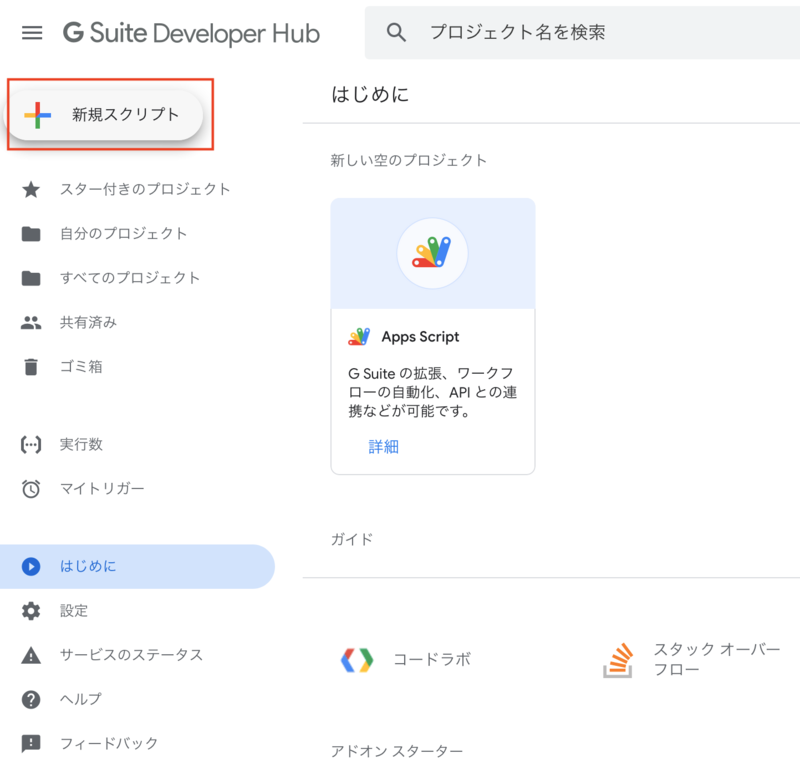
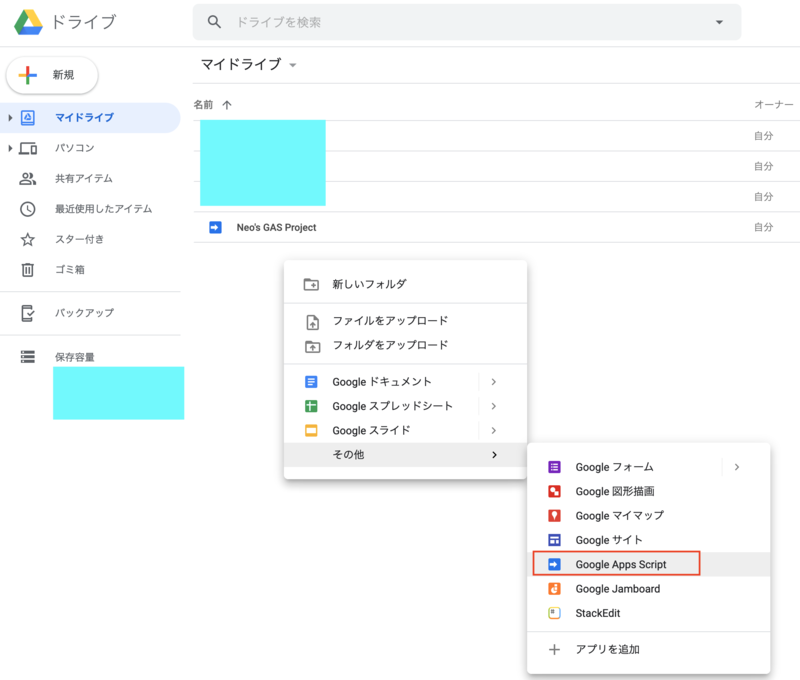
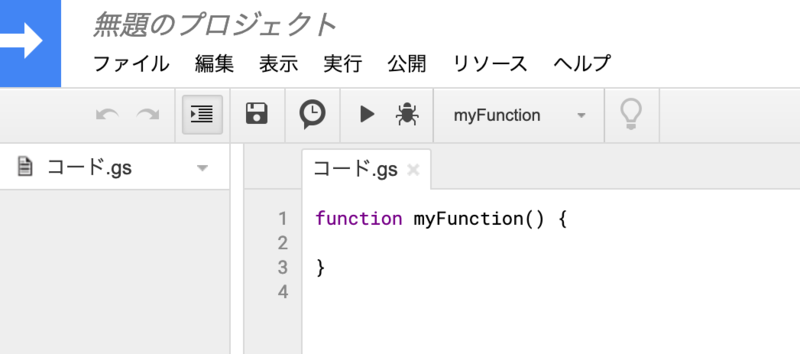
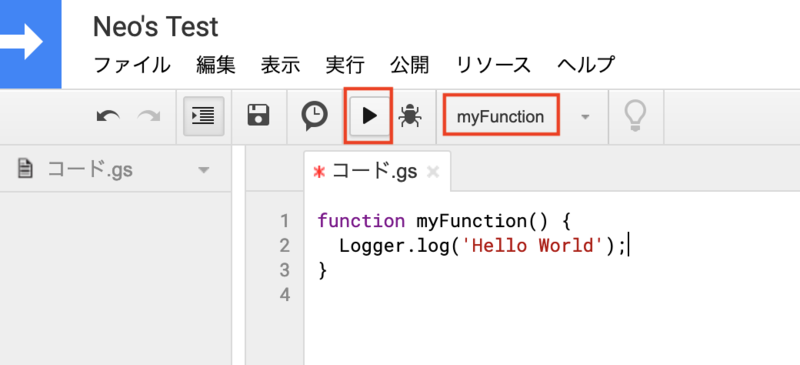
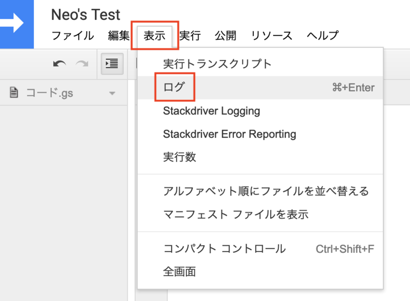
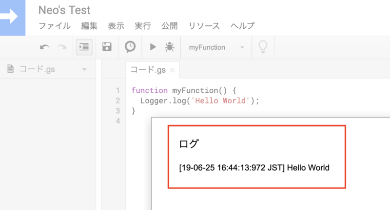

**Google Apps Script (GAS)** は、2009年に登場した、サーバサイド JavaScript の実行基盤。今でこそ Node.js が動作する PaaS はよくあるものの、2009年当時はかなり革新的なサービスだったのではないかと推測する (当時をよく知らない)。

GAS は G Suite プラットフォームの一機能として、スプレッドシートのマクロを構築するためのモノとしても使えるし、URL を発行して簡易的な API、Webhook サーバとしても使える。さながら FaaS というか、サーバレス的な仕組みも兼ね備えている。

ユーザが記述する開発言語は JavaScript だが、それ以降にデファクトスタンダードとなった Node.js との互換性はなく、GAS 独特な書き方を求められる部分が多々ある。それらの仕様を理解するのに少し苦労しそうなので、まずは最も簡単な GAS を作ってみよう。

## 目次

## GAS プロジェクトを作る

まずは GAS の「プロジェクト」を作る。イマイチ新規作成するやり方が分かりづらいのだが、

- 次の「G Suite Developer Hub」ページに飛んで、左上の「新規スクリプト」を選ぶ
  - [Apps Script – Google Apps Script](https://script.google.com/home/start)
- 次の「Google Drive マイドライブ」ページに飛んで、空欄で右クリック → 「その他」 → 「Google Apps Script」を選ぶ
  - [Google ドライブ - 1 か所であらゆるファイルを保管](https://drive.google.com/drive/my-drive)

のいずれかの方法で新規作成できる。





プロジェクトを作成すると、以下のような画面になると思う。ココがエディタだ。



## 「プロジェクト」と「スクリプトファイル」

プロジェクトのエディタが開いたら、最初に「`コード.gs`」というファイルが開かれているかと思う。

左にファイルツリーらしきペインが見えることから、*1つのプロジェクトには複数のファイルが格納できる*ことは分かるかと思う。1つのプロジェクト内には、複数の**「スクリプトファイル」**、すなわち `.gs` ファイルが作成・格納できる。

今回は紹介しないが、「ウェブアプリケーションとして導入」などで URL を発行する際、*URL はプロジェクトにつき1つ*発行される。スクリプトファイルは単にファイルを分けて管理できる、というだけだ。

Node.js であれば、`require` で別ファイルを読み込んで使えたりするが、GAS にはそのような仕組みはなく、*単にグローバル変数、グローバル関数が相互に参照できるだけ*である。内部的には `.gs` ファイルを名前順に `concat` (結合) して実行しているだけのようだ。

HTML ファイルなどもプロジェクト配下に置けて、簡易的に Web サイトを公開したりもできるので、可能性は無限大だが、基本的には1つのプロジェクトはミニマルに、1つのスクリプトファイルで把握できるような小規模なモノを作った方が良いだろう。

- 参考：[Google Apps Script（GAS）のプロジェクト内に複数のスクリプトファイルがある場合の実行順序 - Qiita](https://qiita.com/munieru_jp/items/0119ca5ee38caa23b8e4)

## お試し実装してみる

さて、`コード.gs` というファイルが最初から用意されているので、この中の `myFunction` 内に、お試しで実装してみよう。

今回は、GAS が提供しているオリジナルの関数 `Logger.log()` を使って、`console.log()` 的なコンソール出力を実現してみる。

```javascript
function myFunction() {
  Logger.log('Hello World');
}
```

コレだけ。



実装したら、上のツールバーから「実行」ボタンを押してみる。画面上は特に変化がないので、*「表示」メニュー → 「ログ」*を選択する。



すると、今実行した内容が確認できる「ログ」ダイアログが表示されるはずだ。



どうやらサーバサイド (Google のサーバ) で JavaScript コードが実行された、ということが分かるであろう。

## 今日はココまで

今日はとても簡単な例だったがココまで。

GAS は歴史が長く、独特な記法・API も多いが、同時にノウハウも沢山溜まっているので、ぜひとも色々な使い方をしてみて欲しい。

- 参考：[Google Apps Script - Wikipedia](https://en.wikipedia.org/wiki/Google_Apps_Script)
