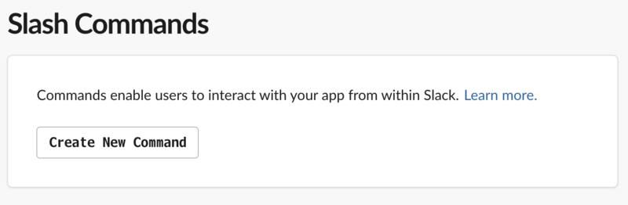

**Slack** というチャットツールには、サードパーティのアプリや「*スラッシュコマンド*」と呼ばれるコマンドを追加できる。そしてそれらは自作することもできる。

今回はバックエンドに **Google Apps Script (GAS)** を使って、投稿内容をオウム返しするだけの、シンプルなオリジナルのスラッシュコマンドを作ってみる。

## 目次

## GAS プロジェクトを作り URL を発行する

まずはスラッシュコマンドを受け取って処理を行うための GAS プロジェクトを作る。GAS プロジェクトの新規作成方法は以前の記事で紹介したとおり。

新規プロジェクトを作ったら、以下のように `doPost()` 関数を実装しておく。

```javascript
function doPost(event) {
  // Slash Command のメッセージ部分を取得する
  const text = event.parameter.text;
  // Slack へ応答メッセージを返す
  const response = {
    text: 'あなたは「 ' + text + ' 」と言いました'
  };
  return ContentService
    .createTextOutput(JSON.stringify(response))
    .setMimeType(ContentService.MimeType.JSON);
}
```

- GAS で `doPost()` メソッドを用意しておくと、POST リクエストを処理できるようになる
  - 今回は扱わないが `doGet()` メソッドもある
- `doPost()` 関数には `event` という仮引数があり、その中の `event.parameter` にパラメータが入っている
- レスポンスを JSON で返す時は `ContentService` という組み込みのクラスを使うと処理しやすい。ココはもうお決まりで覚えてしまう

実装できたら、メニューバーより「公開」→「ウェブアプリケーションとして導入」を選ぶ。


表示されたダイアログにて次のように設定する (以下のキャプチャは2回目以降の公開時の画面なので、初回は少し見た目が違うかも)。


- 「プロジェクトバージョン」プルダウン : 「**New**」を選ぶ。以降コードを変更した場合は、この「プロジェクトバージョン」を都度新しくしないと、*変更したコードが反映されない*ので注意
  - 「変更内容の説明」は適当に入力しておく
- 「次のユーザーとしてアプリケーションを実行」 : 「自分」を選ぶ
- 「アプリケーションにアクセスできるユーザー」 : 「*全員 (匿名ユーザーを含む)*」を選ぶ


コレで「導入」または「更新」ボタンを押下すると、次のように「*ウェブアプリケーションの URL*」が発行されるので、コレをコピーしておく。


「導入」ボタンを押下した時に、「このアプリは許可されていません」という SSL 証明書エラーみたいな画面が表示されるかもしれない。自分も一度遭遇したことがあるが、画面最下部より信頼して続行する的なリンクを押して進めていけば大丈夫。

以上で、「この URL に対して POST リクエストを投げれば JSON 形式でレスポンスが返ってくる」という GAS プロジェクトが出来上がった。

- 参考：[SlackとGoogleAppsScript(GAS)を連携する手順・事例 | TABI LABO TECH BLOG](https://tech.tabilabo.co.jp/598/)
- 参考：[Slash CommandsとGASでSlackのオリジナルコマンドをつくる - Qiita](https://qiita.com/chikuwa111/items/7a1a349b82318a5861cc)
- 参考：[Google Apps Scriptをウェブアプリケーションとして公開する手順](https://www.virment.com/how-to-deploy-google-apps-script-as-webapp/#URLURL)

## スラッシュコマンドを作る

次に、自分の Slack チャンネルに適用するスラッシュコマンドを作成する。

- [Slash Commands | Slack](https://api.slack.com/slash-commands)

上のページに飛び、「`1. Creating a Slash Command`」というセクションから「*Create your Slack app*」ボタンを押下する。


すると「Create a Slack App」というダイアログが表示されるので、適当な Slack App 名と、適用するワークスペースを選択する。


作成できると、「Your Apps」一覧画面に自分が作ったアプリが表示される。このアプリ名リンクを押下して、次の設定に移る。


「Basic Information」画面に移動したら、「Add features and functionality」の中から「*Slash Commands*」を選ぶ。


「Slash Commands」画面に移動したら「Create New Command」ボタンを押下する。



ココでスラッシュコマンドを定義する。


- Command : `/hoge` のように、コマンドを発動する好きな文字列を指定する
- Request URL : **先程 GAS から発行した URL を指定する**
- Short Description・Usage Hint : 任意

コマンドが作成できたら、左メニューの「Settings」欄から「Basic Information」を選んで元の画面に戻り、今度は「*Install your app to your workspace*」欄の「Install To Workspace」ボタンを押下する (以下のキャプチャは押下後なので「*Re*install App」と書かれているが同じ)。OAuth Access Token が発行されるが、今回は特に気にしなくて OK。


スラッシュコマンドの作成作業はココまで。

- 参考：[Slack Botの種類と大まかな作り方 - Qiita](https://qiita.com/namutaka/items/233a83100c94af033575)
- 参考：[Google Apps Scriptで作るslackのスラッシュコマンド 2018年6月版 - Qiita](https://qiita.com/skuroki@github/items/9dc4d0c40be27715e359)

## 動作確認

ココまでの作業を行えば、Slack のワークスペースで自作のスラッシュコマンドが打てるようになっているはずだ。


GAS の方はパラメータ (スラッシュコマンド以降の文字列) を受け取って Slack にレスポンスするように実装しているので、*`/【コマンド名】 【適当な文字列】`* と入力して送信してみよう。**自作のアプリが `あなたは「【適当な文字列】と言いました」` と応答**してくれるはずだ。

## 以上

簡単な例だったが、コレで自作のスラッシュコマンドの作り方が分かった。次回はもう少しコマンドらしく処理を行わせてみよう。
