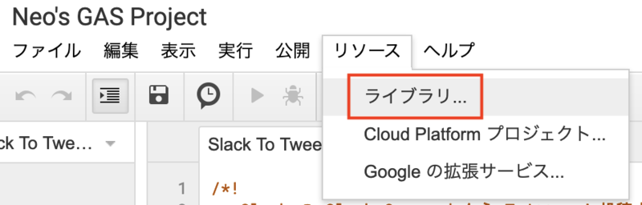
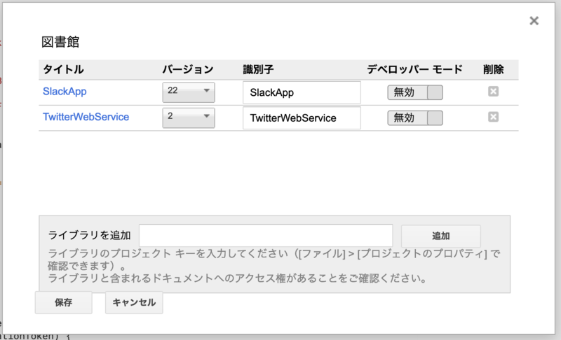
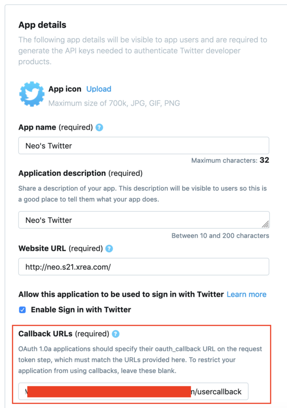
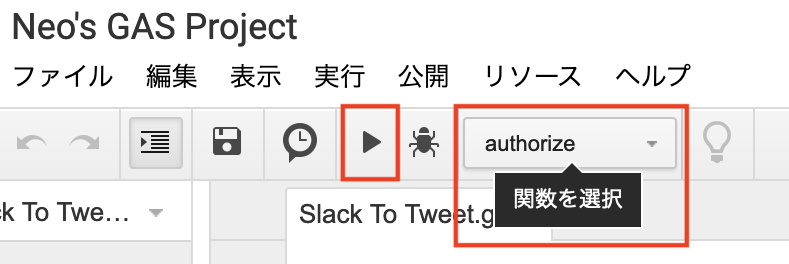

Slack のスラッシュコマンドを作ってみる第2弾。今回は、Slack から Twitter 投稿が行えるスラッシュコマンドを作ってみよう。

## 目次

## 前提条件

- GAS プロジェクトの作り方を理解していること
- スラッシュコマンドのひととおりの作り方を理解していること
  - 上2つは前回の記事を参照
- Twitter Developer Platform に登録し、Consumer API Key・Consumer API Secret Key の2つを発行してあること
  - 以前書いた以下の記事を参照
  - [Twitter Developer Platform に登録して Twitter API を使ってみた](/blog/2019/02/09-01.html)

## GAS プロジェクトにライブラリを追加する

まずは GAS プロジェクトを作る。

今回は、GAS から Twitter 投稿を行うためにライブラリを追加する。以下で紹介されている **TwitterWebService** というライブラリだ。

- [Google Apps Script (GAS) でTwitterへ投稿するだけの機能を実装してみる - Qiita](https://qiita.com/akkey2475/items/ad190a507b4a7b7dc17c)
- [TwitterWebService.gs · GitHub](https://gist.github.com/M-Igashi/750ab08718687d11bff6322b8d6f5d90)

このライブラリの*プロジェクトキー*は以下。

- `1rgo8rXsxi1DxI_5Xgo_t3irTw1Y5cxl2mGSkbozKsSXf2E_KBBPC3xTF`

GAS のプロジェクトエディタを開いたら、メニューより「リソース」→「ライブラリ」と選択する。



「図書館」(= ライブラリ…ｗ) ダイアログが開いたら、「ライブラリを追加」欄に上のプロジェクトキーを入力し追加する。



↑この画像では、TwitterWebService ライブラリ以外に、SlackApp ライブラリ (プロジェクトキー `M3W5Ut3Q39AaIwLquryEPMwV62A3znfOO`) をインストールしているが、SlackApp の方は使っていない。TwitterWebService ライブラリのバージョン「2」が選択できていれば OK だ。

ライブラリとは何かというと、簡単に言えば Node.js の `require` みたいなモノで、他所で実装された `TwitterWebService` というグローバル変数が参照できるようになっている状態だ。

## GAS のスクリプトを実装する

TwitterWebService ライブラリをインストールしたので、次のように実装する。

```javascript
/** Slack Verification Token */
var slackVerificationToken = '【Slack Verification Token を設定する】';

/** Twitter Consumer Key */
var twitterConsumerKey = '【Twitter Consumer Key を設定する】';
/** Twitter Consumer Secret */
var twitterConsumerSecret = '【Twitter Consumer Secret を設定する】';

/** Twitter ライブラリ */
var Twitter = TwitterWebService.getInstance(twitterConsumerKey, twitterConsumerSecret);

/** Slack からの Slash Command を受け取る */
function doPost(event) {
  // Slack トークンチェック
  const verificationToken = event.parameter.token;
  if(verificationToken !== slackVerificationToken) {
    throw new Error('Invalid Token');
  }
  
  // Slash Command のメッセージ部分を取得する
  const text = event.parameter.text;
  // Twitter に投稿する
  postTweet(text);
  // Slack へ応答メッセージを返す
  const response = {
    text: '「 ' + text + ' 」 と Twitter 投稿しました。'
  };
  return ContentService
    .createTextOutput(JSON.stringify(response))
    .setMimeType(ContentService.MimeType.JSON);
}

/** Twitter に投稿する */
function postTweet(text) {
  const twitter = Twitter.getService();
  const endPointUrl = 'https://api.twitter.com/1.1/statuses/update.json';
  const response = twitter.fetch(endPointUrl, {
    method: 'post',
    payload: {
      status: text
    }
  });
}

/** Twitter 事前認証 */
function authorize() {
  Twitter.authorize();
}

/** Twitter 認証後のコールバック */
function authCallback(request) {
  return Twitter.authCallback(request);
}

/** Twitter 認証解除 */
function reset() {
  Twitter.reset();
}
```

コード修正が必要なのは先頭に書いた3つの変数のみ。

- `slackVerificationToken` : 自作の Slack App の「Basic Information」ページを開き、「App Credentials」欄の最下部「Verification Token」欄に表示されているトークン文字列をコピペする
  - スラッシュコマンドを新規作成する場合は、後でトークン文字列を設定し、新しいバージョンで「ウェブアプリケーションとして導入」(更新) すれば良い
- `twitterConsumerKey`・`twitterConsumerSecret` : それぞれ Twitter API で払い出した Consumer Key と Consumer Secret Key をコピペする

## GAS プロジェクトを公開する

実装ができたら、メニューバーより「公開」→「ウェブアプリケーションとして導入」を選ぶ。

表示されたダイアログにて次のように設定する。

- 「プロジェクトバージョン」プルダウン : 「**New**」を選ぶ
- 「次のユーザーとしてアプリケーションを実行」 : 「自分」を選ぶ
- 「アプリケーションにアクセスできるユーザー」 : 「*全員 (匿名ユーザーを含む)*」を選ぶ

コレでウェブアプリケーションの URL が発行されるので、コレをメモしておく。

## Twitter API のコールバック設定を行う

このあと、自作 Twitter アプリの連携・認証設定を行う必要がある。手順としては以下のようになる。

1. GAS プロジェクトに実装した `authorize()` メソッドを実行する
2. Twitter の認証画面に移動し、認証する
3. *予め自作 Twitter アプリに設定しておいたコールバック URL* に遷移する
4. GAS プロジェクトに実装した `authCallback()` メソッドが実行され、認証が完了する

この中の手順 3. で必要になる、「コールバック URL」の設定を先に行っておく。

先程発行した GAS のウェブアプリケーション URL は、次のようになっているはずだ。

- `https://script.google.com/macros/s/【ランダムな文字列】/exec`

この URL を元に、コールバック URL を以下のように作成する

- `https://script.google.com/macros/d/【ランダムな文字列】/usercallback`

違うのは `/s/` → `/d/` と、`/exec` → `/usercallback` 部分。

このコールバック URL が用意できたら、Twitter の App 設定を開き、「*Callback URLs*」欄にコピペする。



## Twitter 事前認証を行う

コールバック URL の設定ができたので、いよいよ Twitter の事前認証を行う。

GAS プロジェクトのメニューバーにある「関数を選択」プルダウンより、「`authorize`」関数を選択し、実行ボタンを押下する。



実行後、画面上は何の変化もないと思うので、*「表示」メニュー → 「ログ」* と選択する。すると、ログの中に以下のような URL が出力されているかと思う。

- `https://api.twitter.com/oauth/authorize?oauth_token=XXXXXXXXXXXXXXXXXXXXXXXXXXX`

**この URL をコピペしてブラウザで遷移**すると、Twitter の認証画面が表示されるので、ログインして認証する。

認証に成功すると、「Success」とだけ書かれた画面が表示されるであろう。コレが `authCallback()` 関数の処理によるモノだ。

コレで Twitter 認証完了だ。少々面倒臭いが、最初に1度だけ行えば良いので、もう気にしなくて良い。

- 参考 : [Google Apps ScriptからTwitterのAPIを叩けなくなったら - Qiita](https://qiita.com/kazooou/items/8049e3ceba6f9b85585f)
- 参考 : <https://cyuraharuto.com/gas-twitter-api-oauth-1/#toc3>

## スラッシュコマンドを用意する

スラッシュコマンドの作り方は前回の記事で紹介したとおり。作成した GAS のウェブアプリケーション URL を指定してスラッシュコマンドを作る。コマンド名は `/tw` とでもしておくと打ちやすいだろう。

既存のスラッシュコマンドを流用して、設定変更で実装する場合は、事前に Verification Token が分かっていると思うが、新規で Slack App を作る場合は、Slack App を作成し、Verification Token を取得した後に、GAS コードを修正して、新しいバージョンで「ウェブアプリケーションとして導入」を再実行 (更新) してやることで、Verification Token を反映できるだろう。

Verification Token は何かというと、リクエスト元が自作の Slack App からであることを確認するためのモノ。GAS の `doPost()` 自体は、URL さえ分かればいくらでも踏めてしまうので、URL が流出した時におかしなリクエストを投げられて、余計な処理をされないようにするために仕込んでおく。

## 完成

1. Twitter App 作成
2. GAS 作成 (実装・Consumer Key 設定)
3. GAS 公開 (URL 取得)
4. Twitter App の Callback に GAS URL を指定
5. Twitter App 事前認証 (GAS `authorize` 実行 → URL 遷移 → Twitter 認証 → `authCallback` 呼び出し)
6. Slack App・Slash Command 作成 (Verification Token 取得)
7. GAS 更新 (Verification Token 設定)
8. GAS 再公開 (バージョン更新)

…という以上の手順で、Slack から Twitter 投稿を行うスラッシュコマンドが作成できた。初期設定は色々と手間がかかったが、一度作ってしまえば以降いつでも `/tw 【ツイートしたい内容】` などとコマンドを送信するだけで、Slack から Twitter に投稿できるようになった。

GAS も Slack App も、無料で使えるし、様々な可能性を秘めている。Twitter に限らず色々なウェブサービスとの連携処理を考えてみると面白いだろう。
