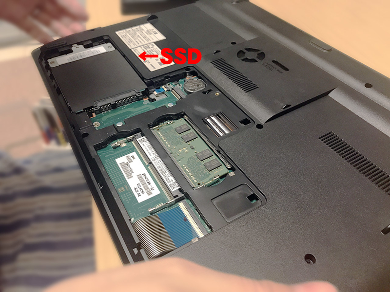
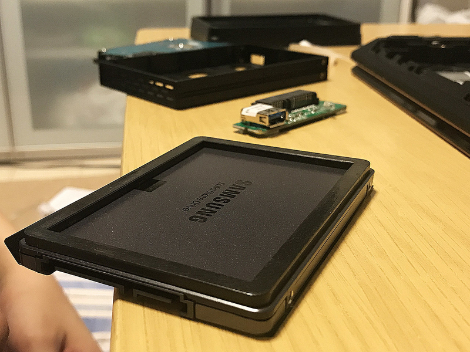
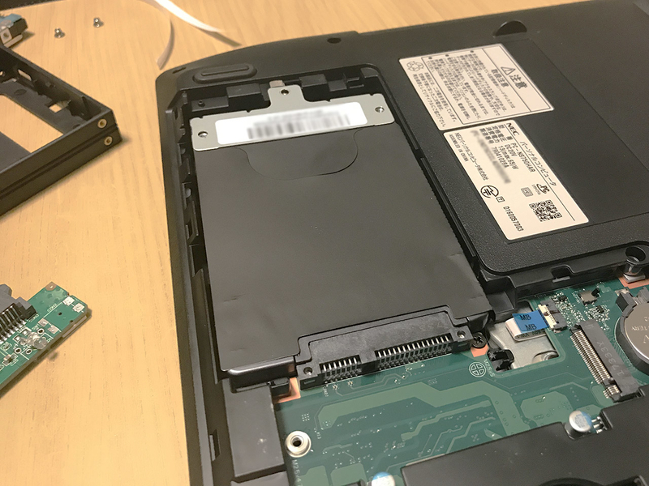
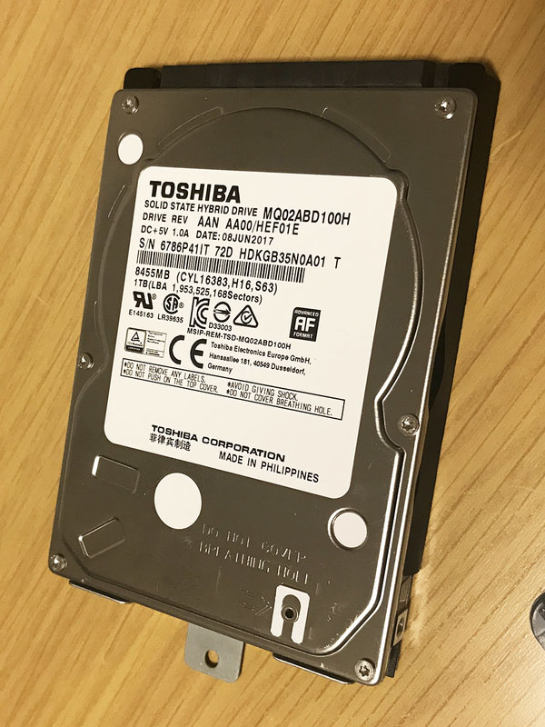

嫁さんが愛用している、__NEC LAVIE Note Standard PC-NS750GAR__ というノート PC。

- [彼女が NEC LAVIE Note Standard PC-NS750GAR を買った](/blog/2018/02/28-01.html)

今回はこのノート PC に内蔵されている __SSHD__ を、_SSD_ に換装した話。

## 目次

## SSHD は遅い

Core i7・メモリ 8GB で増設可能なスロットも残っている状態で、性能は良い方なのだが、ストレージが _1TB SSHD_ で、コイツのせいで動作が物凄く遅い。特に起動には5・6分近くかかり、普通の HDD のパソコンよりも遅く感じるほどだ。

SSHD とは、小容量の SSD と HDD を組み合わせたモノで、_速度は速いが高価な SSD と、速度は遅いが安価な HDD の合の子_なドライブだ。SSD 部分の容量は 8GB 程度なので、バックグラウンドで HDD から SSD にデータを移しておき、よく使われるデータを高速に読み出せるように作られている。

聞こえは良いのだが、SSD・HDD 間のデータ転送が頻繁に行われており、実際の体感速度は HDD と大して変わらないか、下手すると HDD よりもディスクアクセスが多くて遅く感じたりする。あまり成功した製品とはいえず、SSHD は一瞬で廃れてしまった。

__最近は 1TB の内蔵 SSD でも1万円ちょっとで買える__ようになり、HDD と比べても特別高いワケではないので、今回は思い切って SSHD から SSD に換装してみることにした次第。

## ビックカメラの店員に聞く

ネットで少し調べると、SSHD ないしは HDD から SSD に換装するのは簡単っぽいが、実際どうやったら良いのか経験がなかったので、ビックカメラで店員に聞いてみた。

最低限購入する必要があるのは以下のとおり。

1. 換装する内蔵 SSD
2. SSD を PC に繋ぐ USB ケーブル
3. 現行の SSHD のデータを SSD に移行するためのツール

一つずつ見ていこう。

## 換装する内蔵 SSD の選び方

まずはどういう規格の SSD に載せ替えられるか調べる必要がある。ノート PC のスペック表を見たり、裏面のネジを外して実物を見たり、お店の人に調べてもらうなどして、「規格サイズ」と「厚さ」、「接続インターフェース」を押さえておこう。

今回換装するマシン (NEC LAVIE) の場合は、2.5インチサイズの SSHD が載っていて、「シリアル ATA (SATA)」という端子で接続されているタイプだった。

ということは、2.5インチサイズの SATA 規格に対応している SSD を買えば良い、というワケだ。

厚さについては、搭載されている SSHD は _9.5mm_ という厚さだった。2.5インチ規格の場合、7mm・9.5mm・15mm といった厚さの種類があるが、コレは必ずしもサイズを合わせる必要はない。

勿論、元のモノより分厚いドライブは搭載するスペースがなくて無理だが、元のモノより薄い分には、換装用の__スペーサー__を別途購入して SSD に貼り付ければ良い。ドライブと PC 本体はネジ留めなどしないので、スペーサーを用意しないと、内部でガタついてしまうことになる。

今回は、7mm 厚の2.5インチ SSD を購入し、別途スペーサーを購入した。

SSD は Samsung の 1TB のモノを買った。_スペーサー_というのはプラスチック板みたいな。PC 側は 9.5mm 厚の規格でスペースを作ってあるから、7mm 厚の SSD を入れるとブカブカしちゃうので、こういうプラ板を両面テープでくっつけるというワケ。いくらもしない。

## SSD を PC に繋ぐ USB ケーブル

元の SSHD の内部データは、換装後の SSD にそのまま移したい。そのためには、元の SSHD が搭載されている状態で、換装後の SSD を外部ドライブのようにして接続し、データクローンソフトを使う必要がある。

内蔵 SSD を外部ドライブのように接続したいので、今回の場合は、_SATA → USB の変換ケーブル_を購入する必要があった。

こうした変換ケーブルは色々な種類があり、単純なケーブルだけの製品もあれば、内蔵ドライブを外付けドライブのように取り付けられるキット製品もあったりする。

今回は、換装後の SSHD を外付け SSHD として使おうとも考えていたので、内蔵ドライブを外付けドライブのように取り扱えるキット品を購入した。換装前はコレを使って SSD を外部から接続し、換装後はコレを使って SSHD を外部接続してデータ保存用ドライブとして使うつもりだ。

ケースタイプは、プラスチックのガワが付いてるだけなので、コレもいくらもしない。

## 現行の SSHD のデータを SSD に移行するためのツール

データをクローン移行するツールは、SSD を購入すると付属していることが多い。今回は Samsung の内蔵 SSD を購入したが、Samsung の場合はネットから__「Samsung Data Migration Software」__という移行ツールをダウンロードできた。というワケで別途購入は不要だった。

- 参考：[SSD ツール＆ソフトウェア | タイプ別 Download | サポート | Samsung Semiconductor Global Website](https://www.samsung.com/semiconductor/minisite/jp/support/tools/)

## 1万5千円程度でお買い上げ

1. 換装する内蔵 SSD (データ移行ツールは付属)
2. SSD の厚さを揃えるためのスペーサー
3. SSD を PC に繋ぐ SATA / USB ケーブル = 外付けドライブ化するキット品
4. Windows10 バックアップ用の 32GB USB メモリ (ついでに)

以上4点をお買い上げ。SSD が1万3千円程度で、その他はいくらもしない感じ。バックアップ用の USB メモリは、NEC LAVIE の場合は 32GB USB メモリが必要だったので買っておいた。

## 個人データは予め外付け HDD に逃がしておく

データマイグレーションツールがあるものの、データ移行に時間がかかったり、失敗してデータが破損したりしては困るので、換装する前に、個人データの類は全て外付け HDD の方に移動しておいた。

データを外出ししたので SSHD の使用量が減り、心なしか動作が快適になった気がするが、もう換装すると決めたのだ。

USB メモリにシステムバックアップを記録したら準備完了 (SSHD 故か、バックアップするだけでも2時間くらいかかったがｗ)。いよいよ換装を始める。

## SSD をフォーマットしておく

購入した内蔵 SSD を「外付けドライブ化キット」に取り付け、ノート PC に USB 接続する。キット品はそんなに重厚な作りではなかったので、基盤を破損しないように慎重に取り付けた。

ツールを使ってデータを移行する前に、SSD のフォーマット処理をしておいた方が良いと、ビックカメラの店員に言われた。

「ディスクの管理」を開いて、現行の SSHD のパーティション方式を確認する。SSHD の項目上で右クリックすると、「_MBR_ ディスクに変換」というメニューが見えていたので、SSHD のパーティション方式は __GPT__ 方式であると分かる。MBR 方式より GPT 方式の方が新しく、メリットしかないので、換装する SSD のパーティション方式も GPT 方式に揃えてフォーマットすることにする。

USB 接続している SSD を選択し、「ディスクの初期化」を行う。パーティション方式は先程確認したとおり __GPT__ 方式を選択する。データが何も入っていないので、すぐに終わるだろう。

- 参考：[SSDドライブのフォーマット手順【Windows10編】 - マネー報道 MoneyReport](http://moneyreport.hatenablog.com/entry/ssd_format_windows10)

## SSHD から SSD にデータ移行

SSD のフォーマットが終わったので、データ移行に移る。

ノート PC に Samsung のデータマイグレーションツールをインストールして起動すると、「内蔵 SSHD から、外付け SSD にデータをクローンしますか？」といった画面が表示されるので、ウィザードに沿ってデータ移行する。だいたい_2時間くらい待つ_と、データ移行が完了した。

コレで、内部的には SSHD と SSD が完全に同一のドライブであるかのようにクローン化できた。あとはドライブを物理的にノート PC に載せ替えれば良いだけだ。

## ドライブ換装作業

NEC LAVIE の電源を落とし、裏面のネジを外すと、ドライブとメモリの取り付け部分が現れた。

↑ 「SSD」とテロップを書いたが、この写真はまだ SSHD が載っている。

7mm 厚である SSD の方にはスペーサーを取り付け、SSHD と同じ 9.5mm 厚に揃える。

↑ スペーサーはこんな感じ。

SSHD に繋がっている SATA ケーブルを外し、今度はスペーサー付きの SSD を接続する。

↑ SSD を取り付けたところ。

裏フタを取り付け、ネジ留めすれば、実際の換装作業は終了だ。

↑ 取り外した SSHD。東芝製だった。コレは SATA・USB ケーブル付きのケースにしまって外付け SSHD として使う。

## 再起動して確認

さて、マシンを再起動してみる。何事もなかったようにマシンが起動し、先程まで見ていたデスクトップが表示された。ドライブのクローンツールは正常に成功したようだ。

さすが SSD。起動はとても高速で、エクスプローラもかつてのようにはモタつかない。システム上もおかしな動きなどは一切なく、正常に SSD に換装できた。

SSHD だった頃のパフォーマンスを計測し忘れたが、_起動に5・6分_かかっていたのが、__30秒〜1分以内で起動するようになった__ので、その効果はお察しいただけるだろう。

## SSHD のデータを初期化する

取り外した SSHD を、今度は「外付けドライブ化キット」に取り付け、USB 接続する。外部ドライブとして認識されるのだが、クローンした SSD と完全に同じドライブと認識されてしまっているので、「ディスクの管理」からいきなりフォーマットできなかった。

厳密には、「署名」と呼ばれる ID のような情報がクローンされているために、このようなおかしな状態になっているようだ。

- 参考：[価格.com - 『コピー後のHDDの認識』 玄人志向 KURO-DACHI/CLONE/U3 のクチコミ掲示板](https://bbs.kakaku.com/bbs/K0000357665/SortID=18681312/)

調べてみると、コマンドプロンプトから `diskpart` コマンドで操作することで、パーティションを強制削除し、ディスク署名が重複しているドライブをフォーマットできるようになった。手順は以下のサイトをほぼそのまま。

- 参考：[HDDのシステム領域を削除する | ここは俺の実験室だ！](https://kokoore.com/delete-partition)

コレでなんとか SSHD をフォーマットでき、データ保存用の「外付け SSHD」として使い回せるようになった。

## 以上

SSHD から SSD への換装はとっても簡単だった。事前にサイズなどの規格は確認が必要だが、それも大体決まっているので、迷うことはないだろう。データ移行ツールも優秀で、ほとんど指示に従って操作するだけ。SSHD の遅さのために待たされるところはあったが、実働時間は数十分といったところだろう。

移行作業自体は簡単だったし、SSD も大変お安くなっているので、HDD や SSHD の遅さを感じている人は、ぜひとも換装にトライしてみて欲しい。
