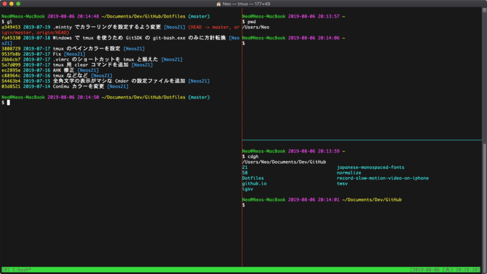
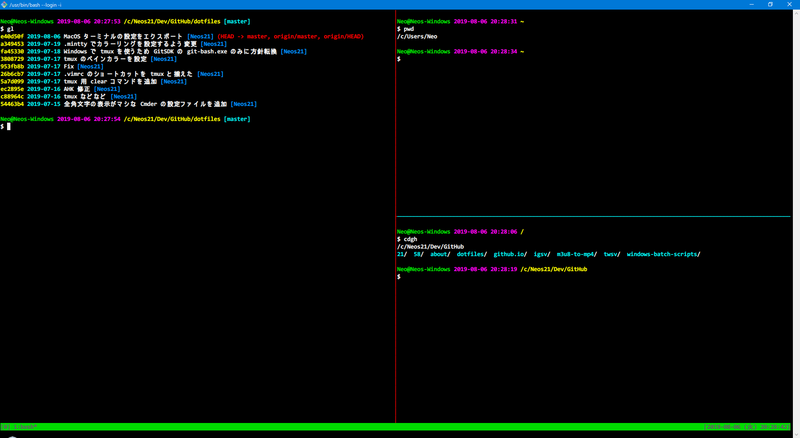
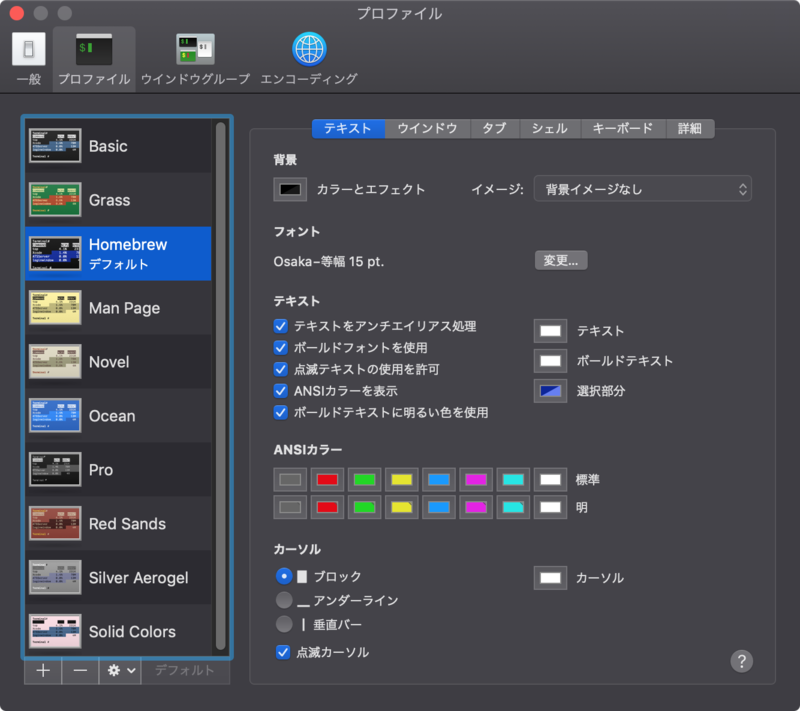
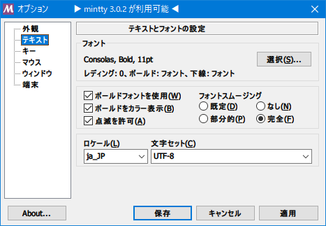

先日、[Inkdrop](https://inkdrop.app/) というアプリを開発している [TAKUYA](https://twitter.com/craftzdog/) さんの動画を見て衝撃を受けた。

- [tmuxとvimによる開発作業フロー (動画)](https://blog.craftz.dog/my-dev-workflow-using-tmux-vim-48f73cc4f39e)

tmux と vim を組合せて開発をしているのだが、キーボード操作が抜群に速い。マウス操作がほとんど出てこないからこそ実現できる開発速度で、VSCode 使いの自分も tmux + vim の世界に魅了されてしまった。

ただ、自分の信条として、「**オレオレ設定を極めすぎないこと**」というモノも掲げている。一般的な客先常駐の SE は、好みのマシンやハードウェアを中々選べなかったりするし、数年で異動すると以前の環境をそのまま持ち込むことができなかったりするからだ。

- [オレオレ環境・オレオレ設定を極めすぎない](/blog/2018/03/27-01.html)

VSCode も使い慣れているし、VSCode を捨てる気はない。ただ、「ちょっとしたカスタマイズ (※)」の範囲で、tmux + vim の便利な環境を作れたらいいなと思い、tmux + vim 道に入門することにした。

- ※「ちょっとしたカスタマイズ」の自分定義 : ネットに繋がらない環境で、暗記している情報だけで復元できる設定の範囲。複雑なスクリプトを書かないといけないとか、いくつかのソフトを入れないといけない、みたいなモノは極力省きたい。

以下、MacOS を中心に、Windows でも同様の環境を実現しようとしているので、OS ごとに分けて説明する。

## 目次

## 先にどんなターミナルが出来上がるか紹介

セットアップを始める前に、このセットアップを行うとどんなターミナルが出来上がるのか紹介しよう。

まずは MacOS。



次は Windows。



それぞれセットアップ手順を紹介していこう。

## ツールのインストール : MacOS 編

まずは MacOS で、tmux + vim の環境を整えてみる。使用するターミナルは OS 標準の「ターミナル.app」。

### vim の用意

MacOS は標準で `vi` と `vim` が使えるが、いずれも `--version` を見ると、*`-clipboard`* という表記が見える。コレは、Vim と MacOS とでクリップボードを共有できない、ということだ。

そこで、クリップボード共有ができる Vim を Homebrew でインストールする。

```bash
$ brew install vim
```

Homebrew でインストールした Vim が優先的に使われるよう PATH を直して、ついでに `alias vi='vim'` なんかも入れておこう。Homebrew でインストールした `vi` も、クリップボード共有機能が使えないからだ。

`$ vim --version` を見て、**`+clipboard`** という表記が見えていれば、Vim の準備は完了。あとは、後述する `~/.vimrc` を導入するだけ。

### tmux の用意

tmux も Homebrew で入れられる。MacOS で tmux とクリップボード共有をするためには、**`reattach-to-user-namespace`** というツールを使う必要があるので、一緒にインストールしておく。

```bash
$ brew install tmux reattach-to-user-namespace
```

`$ tmux -V` でバージョンが確認できたら OK。自分がインストールしたのは `2.9a` というバージョンだった。あとは後述する `~/.tmux.conf` を導入するだけ。

## ツールのインストール : Windows 編

Windows の場合は、Pacman というパッケージ管理ツールが使える「*GitSDK*」と、それに付属する「GitBash (`git-bash.exe`)」を使用する。GitSDK については以下の記事を参照。

- [Git For Windows よりコマンドが豊富な Git For Windows SDK を試してみる](/blog/2018/10/11-02.html)

### vim の用意

GitSDK 付属の Vim で OK。あとは後述する `~/.vimrc` を入れるだけ。

### tmux の用意

Windows における tmux は、GitSDK を開き、`pacman` コマンドでインストールする。MacOS の場合は `reattach-to-user-namespace` を一緒にインストールしたが、Windows におけるクリップボード共有は標準の `clip.exe` を使うので特にインストールは不要。

```bash
$ pacman -S tmux
```

コチラも `$ tmux -V` でバージョンが確認できれば OK。あとは後述する `~/.tmux.conf` を入れるだけ。

## 設定ファイルを導入する

tmux と vim のインストールが終わったので、設定ファイルを用意する。拙作の Dotfiles に現物があるので、そちらも参考にされたし。

- [Neos21/dotfiles](https://github.com/Neos21/dotfiles)

### `~/.vimrc` (とカラースキーム)

ホームディレクトリ直下に、**`.vimrc`** という名前のファイルを作り、以下の内容をコピペする。

```bash
" ================================================================================
" .vimrc
" ================================================================================

" 文字コードを UFT-8 に設定する
set fenc=utf-8
" バックアップファイルを作らない
set nobackup
" スワップファイルを作らない
set noswapfile
" 編集中のファイルが変更されたら自動で読み直す
set autoread
" バッファが編集中でもその他のファイルを開けるようにする
set hidden
" 入力中のコマンドをステータスに表示する
set showcmd
" クリップボード連携を有効にする (MacOS の場合は unnamedplus ではなく unnamed で有効にできた・vi ではなく vim を使うこと)
set clipboard&
set clipboard^=unnamed
" クリップボード連携を有効にした時に BackSpace (Delete) が効かなくなるので設定する
set backspace=indent,eol,start

" 見た目
" ------------------------------------------------------------

" Monokai カラースキーム
syntax on
colorscheme monokai
" 範囲選択が見づらいので変更する
hi Visual ctermbg=227

" 行番号を表示する
set number
" 現在の行を強調表示する
set cursorline
" カーソルラインの色をクリアする
hi clear CursorLine
" 行末の1文字先までカーソルを移動できるようにする
set virtualedit=onemore
" スマートインデントにする
set smartindent
" ビープ音を可視化する
set visualbell
" 括弧入力時の対応する括弧を表示する
set showmatch
" ステータスラインを常に表示する
set laststatus=2
" コマンドライン補完を有効にする
set wildmode=list:longest
" 折り返し時に表示行単位での移動をできるようにする
nnoremap j gj
nnoremap k gk

" Tab 文字
" ------------------------------------------------------------

" 不可視文字を可視化 (タブが「▸-」と表示される)
set list listchars=tab:\▸\-
" Tab 文字を半角スペースにする
set expandtab
" 行頭以外の Tab 文字の表示幅 (スペースの数)
set tabstop=2
" 行頭での Tab 文字の表示幅
set shiftwidth=2

" 検索
" ------------------------------------------------------------

" 検索文字列が小文字の場合は大文字小文字を区別なく検索する
set ignorecase
" 検索文字列に大文字が含まれている場合は区別して検索する
set smartcase
" 検索文字列入力時に順次対象文字列にヒットさせる
set incsearch
" 検索時に最後まで行ったら最初に戻る
set wrapscan
" 検索語をハイライト表示する
set hlsearch

" ウィンドウ
" ------------------------------------------------------------

" t + \ ・ t + | でウィンドウを垂直縦分割する
nmap t<Bslash> :vsplit<Return><C-w>w
nmap t<Bar> :vsplit<Return><C-w>w
" t + - でウィンドウを水平横分割する
nmap t- :split<Return><C-w>w

" t + hjkl でウィンドウ移動する
map th <C-w>h
map tj <C-w>j
map tk <C-w>k
map tl <C-w>l
" Ctrl + w → 矢印キーでウィンドウをリサイズする
nmap tH <C-w>>
nmap tJ <C-w>-
nmap tK <C-w>+
nmap tL <C-w><

" t + 矢印キーでウィンドウ移動する
map t<Left> <C-w>h
map t<Down> <C-w>j
map t<Up> <C-w>k
map t<Right> <C-w>l
" Ctrl + w → 矢印キーでウィンドウをリサイズする
nmap <C-w><Left> <C-w>>
nmap <C-w><Down> <C-w>-
nmap <C-w><Up> <C-w>+
nmap <C-w><Right> <C-w><

" Space でウィンドウ移動する
nmap <Space> <C-w>w

" Tab・Space + Tab でタブ移動
nmap <Tab> :tabnext<Return>
nmap <S-Tab> :tabprev<Return>

" Ctrl + z で元に戻す (u)
nnoremap <C-z> u
" Ctrl + y でやり直す (Ctrl + r)
nnoremap <C-y> <C-r>

" Esc 連打で :nohlsearch が出ないようにする
nnoremap <Esc><Esc> <Esc>
```

- [dotfiles/.vimrc at master · Neos21/dotfiles · GitHub](https://github.com/Neos21/dotfiles/blob/master/.vimrc)

また、`~/.vim/colors/` というディレクトリを作り、その下に以下のリポジトリにある `monokai.vim` を入れておく。

- [tomasr/molokai](https://github.com/tomasr/molokai)

コレは Monokai カラースキームなので、お好みで変更されたし。

- [dotfiles/monokai.vim at master · Neos21/dotfiles · GitHub](https://github.com/Neos21/dotfiles/blob/master/.vim/colors/monokai.vim)

### `~/.tmux.conf`

続いて tmux。コチラもホームディレクトリ直下に **`.tmux.conf`** というファイルを作り、以下の内容をコピペする。*MacOS でも Windows GitSDK でも動作するよう調整してある。*

```bash
# ================================================================================
# .tmux.conf
# ================================================================================

# Session Global Option (set-option -g)
# ================================================================================

# Prefix を Ctrl + t にする
set-option -g prefix C-t

# ペインの番号を 1 から開始する (デフォルトは 0)
set-option -g base-index 1

# tmux 上の vi で colorscheme が有効にならないため設定する
set-option -g default-terminal screen-256color

# 通常の枠線を水色にする
set-option -g pane-border-style fg="colour51"

# アクティブなペインの枠線を赤色にする
set-option -g pane-active-border-style fg="colour196"

# マウス操作を有効にする
set-option -g mouse on

# キーストロークのディレイを減らす
set-option -sg escape-time 1

# リフレッシュ間隔を変更する
set-option -g status-interval 1

# ステータスバーの右部分に時計を表示する
set-option -g status-right "[%Y-%m-%d (%a) %H:%M:%S]"

# MacOS : reattach-to-user-namespace を使用してクリップボード共有を有効にする
if -b 'command -v reattach-to-user-namespace > /dev/null 2>&1'  'set-option -g default-command "reattach-to-user-namespace -l bash"'

# Window Global Option (set-window-option)
# ================================================================================

# ウィンドウの番号を 1 から開始する (デフォルトは 0)
set-window-option -g pane-base-index 1

# コピーモード (Prefix + [ で開始) で vi キーバインドを使う
set-window-option -g mode-keys vi

# Bind Key
# ================================================================================

# Prefix + \ ・ Prefix + | でペインを縦に分割する
bind-key \ split-window -h
bind-key | split-window -h
# Prefix + - でペインを横に分割する
bind-key - split-window -v

# Prefix + hjkl でペイン移動
bind-key -r h select-pane -L
bind-key -r j select-pane -D
bind-key -r k select-pane -U
bind-key -r l select-pane -R

# Prefix + Shift + hjkl でペインをリサイズする
bind-key -r H resize-pane -L 5
bind-key -r J resize-pane -D 5
bind-key -r K resize-pane -U 5
bind-key -r L resize-pane -R 5

# Prefix + r で設定ファイルをリロードする
bind-key r source-file ~/.tmux.conf \; display "Reloaded."

# Prefix + o で tmux 用の画面クリアコマンドを入力する
bind-key o send-keys "clear && tmux clear-history" \; send-keys Enter

# Prefix + v でコピーモードを開始する (デフォルトは Prefix + [)
bind-key v copy-mode \; display "Copy Mode!"

# Prefix + Ctrl + p でペースト (デフォルトは Prefix + ]・クリップボード共有しているので Cmd + V でも OK)
bind-key C-p paste-buffer

# コピーモード中 v か Space で選択を始める
bind-key -T copy-mode-vi v send -X begin-selection \; display "Copy Start."
bind-key -T copy-mode-vi Space send -X begin-selection \; display "Copy Start."
# コピーモード中 V で行選択を始める
bind-key -T copy-mode-vi V send -X select-line \; display "Copy Line Start."
# コピーモード中 Ctrl + v で矩形選択を始める
bind-key -T copy-mode-vi C-v send -X rectangle-toggle \; display "Copy Rectangle Start."

# コピーモード中 y か Enter でヤンク (コピー)
# MacOS : reattach-to-user-namespace を使用
if -b 'command -v reattach-to-user-namespace > /dev/null 2>&1'  'bind-key -T copy-mode-vi y     send-keys -X copy-pipe-and-cancel "reattach-to-user-namespace pbcopy" \; display "Copied!"'
if -b 'command -v reattach-to-user-namespace > /dev/null 2>&1'  'bind-key -T copy-mode-vi Enter send-keys -X copy-pipe-and-cancel "reattach-to-user-namespace pbcopy" \; display "Copied!"'
# Windows : tmux save-buffer で echo しパイプを使って clip.exe に渡す
if -b 'command -v clip.exe                   > /dev/null 2>&1'  'bind-key -T copy-mode-vi y     send-keys -X copy-pipe-and-cancel "tmux save-buffer - | clip.exe" \; display "Copied!"'
if -b 'command -v clip.exe                   > /dev/null 2>&1'  'bind-key -T copy-mode-vi Enter send-keys -X copy-pipe-and-cancel "tmux save-buffer - | clip.exe" \; display "Copied!"'

# コピーモード中 Esc で中止
bind-key -T copy-mode-vi Escape send -X cancel
```

- [dotfiles/.tmux.conf at master · Neos21/dotfiles · GitHub](https://github.com/Neos21/dotfiles/blob/master/.tmux.conf)

## ターミナルのカラー・フォント設定を揃える

あとはターミナルのカラーやフォントの設定を調整しておく。

### MacOS ターミナル

標準で入っている Homebrew テーマをベースに、テキストの色を緑から白にしておく。色はお好みで明るめに。フォントは *Osaka 等幅*。メイリオ改を使ったりしていたが、結局コレが一番見やすい。



### Windows Git SDK

GitBash は青色が特に見づらいので、`~/.minttyrc` にてカラーを設定してやることにする。`ThemeFile` プロパティは空にしておくことで、カラー指定が有効にできる。

```bash
# ================================================================================
# .minttyrc
# ================================================================================

Charset  = UTF-8
Language = ja
Locale   = ja_JP

Columns  = 120
Rows     = 25

Font          = Consolas
FontHeight    = 11
FontWeight    = 700
FontIsBold    = yes
FontSmoothing = full
BoldAsColour  = yes
BoldAsFont    = yes

AllowBlinking     = yes
CursorType        = block
OpaqueWhenFocused = yes
Term              = xterm-256color
ThemeFile         =

ForegroundColour = 240,240,240
BackgroundColour =   0,  0,  0
CursorColour     = 240,240,240
Black            = 100,100,100
BoldBlack        = 100,100,100
Red              = 240,  0,  0
BoldRed          = 240,  0,  0
Green            =   0,220,  0
BoldGreen        =   0,220,  0
Yellow           = 255,255,  0
BoldYellow       = 255,255,  0
Blue             =   0,140,255
BoldBlue         =   0,140,255
Magenta          = 255,  0,240
BoldMagenta      = 255,  0,240
Cyan             =   0,240,240
BoldCyan         =   0,240,240
White            = 255,255,255
BoldWhite        = 255,255,255
```

フォントはメイリオ改や Osaka 等幅を使いたかったが、いずれも `tmux` で罫線が狂ってしまった。日本語表示が一番マシな英語フォントの **Consolas** を選んでお茶を濁した。



## コレで完了

コレで設定完了。あとは使っていくだけ…。

## カスタマイズした内容を確認する

…とはいっても、いきなり設定ファイルを渡してさあどうぞ、というのも難しいと思うので、設定ファイルでカスタマイズした内容の詳細を見ていき、それに合わせて使い方を解説しよう。

### Vim

- Vim で苦労したのはクリップボード共有。最終的には以下のように設定することで対応できた。

```bash
" クリップボード連携を有効にする (MacOS の場合は unnamedplus ではなく unnamed で有効にできた・vi ではなく vim を使うこと)
set clipboard&
set clipboard^=unnamed
" クリップボード連携を有効にした時に BackSpace (Delete) が効かなくなるので設定する
set backspace=indent,eol,start
```

`unnamed` と `unnamedplus` が調べてもよく分からずじまいだったが、とりあえず上の設定で、MacOS も Windows も動作した。ただ、コレを入れると、インサートモードで BackSpace (Delete) キーが効かなくなる問題があったので、`set backspace` も入れた次第。

- 参考 : [vimでクリップボード連携を有効にした話 - pockestrap](https://pocke.hatenablog.com/entry/2014/10/26/145646)
- 参考 : [Vimメモ : 挿入モードでバックスペースが効かない - もた日記](https://wonderwall.hatenablog.com/entry/2016/03/23/232634)

次。

- Monokai カラースキームは、ビジュアルモードの文字列選択がグレーで見づらいので、薄い黄色にハイライトするよう調整した。

```bash
" Monokai カラースキーム
syntax on
colorscheme monokai
" 範囲選択が見づらいので変更する
hi Visual ctermbg=227
```

- Vim のウィンドウ分割をショートカットキーで設定した
  - 縦に垂直分割する時は、US キーボードにおける「バックスラッシュ / バーティカルバー」のキーを押下する。Shift 押下が面倒なのでバックスラッシュでも動作するようにした
  - 横に水平分割する時はハイフン
  - いずれも、記号が分割する方向を示す
  - ノーマルモードで押下するキーは `t` とした。コレは後述する tmux の Prefix キー (`Ctrl + t`) と同じキーにした

```bash
" t + \ ・ t + | でウィンドウを垂直縦分割する
nmap t<Bslash> :vsplit<Return><C-w>w
nmap t<Bar> :vsplit<Return><C-w>w
" t + - でウィンドウを水平横分割する
nmap t- :split<Return><C-w>w
```

- ウィンドウ (ペイン) の移動を hjkl と矢印キーでできるようにした
  - デフォルトでは Ctrl + w を押下してからの操作になるので簡略化

```bash
" t + hjkl でウィンドウ移動する
map th <C-w>h
map tj <C-w>j
map tk <C-w>k
map tl <C-w>l

" t + 矢印キーでウィンドウ移動する
map t<Left> <C-w>h
map t<Down> <C-w>j
map t<Up> <C-w>k
map t<Right> <C-w>l
```

- ウィンドウ (ペイン) のリサイズを HJKL (Shfit 押下) と矢印キーでできるようにした
  - リサイズのデフォルトは `Ctrl + w` の後に `<` とか `>` とか `+` とか `-` とか、とにかく面倒なので簡略化

```bash
" t + HJKL でウィンドウをリサイズする
nmap tH <C-w>>
nmap tJ <C-w>-
nmap tK <C-w>+
nmap tL <C-w><

" Ctrl + w → 矢印キーでウィンドウをリサイズする
nmap <C-w><Left> <C-w>>
nmap <C-w><Down> <C-w>-
nmap <C-w><Up> <C-w>+
nmap <C-w><Right> <C-w><
```

- Undo と Redo を Windows 風にした
  - MacOS の「元に戻す」「やり直す」は `Cmd + z`・`Cmd + Shift + z` だが、Vim は Shift 押下のコンビネーションを登録できないっぽいので、Windows 風な `Ctrl + z`・`Ctrl + y` に揃えることにした
  - 参考 : [mapをCtrl+Shift+Bのような登録はできないでしょうか？ · Issue #756 · vim-jp/issues · GitHub](https://github.com/vim-jp/issues/issues/756)
  - そもそも Vim の Undo・Redo は「インサートモード」から「ノーマルモード」に戻った時を1回とカウントするので、普通のメモ帳や IDE みたいには使えない

```bash
" Ctrl + z で元に戻す (u)
nnoremap <C-z> u
" Ctrl + y でやり直す (Ctrl + r)
nnoremap <C-y> <C-r>
```

### tmux

tmux の設定は `set` (= `set-option`)、`setw` (= `set-window-option`)、`bind` (`bind-key`) などがある。

- Prefix を `Ctrl + t` にした。別途 *CapsLock キーを Ctrl (Control) キーに変更*しておくと、**左手の位置を大きく動かさずに押せる**ようになるのでオススメ

```bash
# Prefix を Ctrl + t にする
set-option -g prefix C-t
```

- マウス操作は有効にしておく。コレを入れておくだけで良い
  - マウスドラッグで範囲選択モードに入るが、マウスボタンを離すとただキャンセルされてしまうので、*範囲選択が終わったところで `y` キーを離してからマウスボタンを離すことでコピーする*ようにしよう

```bash
# マウス操作を有効にする
set-option -g mouse on
```

- MacOS の場合はクリップボード共有に `reattach-to-user-namespace` を使うので、その設定をしておく
  - `if -b '【条件となるシェルスクリプト】' '【真の時に実行する処理】'` と書ける。ココでは `command` コマンドを使い、`reattach-to-user-namespace` の存在を確認して設定している

```bash
# MacOS : reattach-to-user-namespace を使用してクリップボード共有を有効にする
if -b 'command -v reattach-to-user-namespace > /dev/null 2>&1'  'set-option -g default-command "reattach-to-user-namespace -l bash"'
```

- コピーモードで vi と同じキーバインドを使う。定石

```bash
# コピーモード (Prefix + [ で開始) で vi キーバインドを使う
set-window-option -g mode-keys vi
```

- ペイン分割のショートカットを設定する
  - 通常は `tmux split-window -h` などと入力して実現するペイン分割。コレを `Control + t → バックスラッシュ` などで実現できるようにした
  - 記号類は Vim の方に設定したものと同じ

```bash
# Prefix + \ ・ Prefix + | でペインを縦に分割する
bind-key \ split-window -h
bind-key | split-window -h
# Prefix + - でペインを横に分割する
bind-key - split-window -v
```

- ペイン移動を hjkl でできるようにする
  - ペインのリサイズも同様

```bash
# Prefix + hjkl でペイン移動
bind-key -r h select-pane -L
bind-key -r j select-pane -D
bind-key -r k select-pane -U
bind-key -r l select-pane -R

# Prefix + Shift + hjkl でペインをリサイズする
bind-key -r H resize-pane -L 5
bind-key -r J resize-pane -D 5
bind-key -r K resize-pane -U 5
bind-key -r L resize-pane -R 5
```

- 設定ファイルの変更をその場でリロードするショートカットを用意

```bash
# Prefix + r で設定ファイルをリロードする
bind-key r source-file ~/.tmux.conf \; display "Reloaded."
```

- tmux で `Cmd + k` によるクリアを行うと表示がバグるため、`clear` コマンドと `tmux clear-history` コマンドを叩くショートカットを用意した
  - 参考 : [terminal - How can I clear scrollback buffer in Tmux? - Stack Overflow](https://stackoverflow.com/questions/10543684/how-can-i-clear-scrollback-buffer-in-tmux)
  - tmux で開いたペインで SSH などしていて、`tmux` コマンドが存在しない環境だと失敗するので注意

```bash
# Prefix + o で tmux 用の画面クリアコマンドを入力する
bind-key o send-keys "clear && tmux clear-history" \; send-keys Enter
```

- コピーモードの開始キーを `v` にして Vim に揃える
  - 以降の操作も Vim に倣ったキー設定にしている

```bash
# Prefix + v でコピーモードを開始する (デフォルトは Prefix + [)
bind-key v copy-mode \; display "Copy Mode!"

# Prefix + Ctrl + p でペースト (デフォルトは Prefix + ]・クリップボード共有しているので Cmd + V でも OK)
bind-key C-p paste-buffer

# コピーモード中 v か Space で選択を始める
bind-key -T copy-mode-vi v send -X begin-selection \; display "Copy Start."
bind-key -T copy-mode-vi Space send -X begin-selection \; display "Copy Start."
# コピーモード中 V で行選択を始める
bind-key -T copy-mode-vi V send -X select-line \; display "Copy Line Start."
# コピーモード中 Ctrl + v で矩形選択を始める
bind-key -T copy-mode-vi C-v send -X rectangle-toggle \; display "Copy Rectangle Start."
```

- コピー時の操作を OS ごとに設定する
  - 前述の `if -b` イディオムを使って各コマンドの存在を確認して設定している
  - Windows の場合は `tmux save-buffer -` コマンドで、ヤンクした内容を出力できるので、それをパイプで `clip.exe` に渡すことでクリップボードにコピーさせている

```bash
# コピーモード中 y か Enter でヤンク (コピー)

# MacOS : reattach-to-user-namespace を使用
if -b 'command -v reattach-to-user-namespace > /dev/null 2>&1'  'bind-key -T copy-mode-vi y     send-keys -X copy-pipe-and-cancel "reattach-to-user-namespace pbcopy" \; display "Copied!"'
if -b 'command -v reattach-to-user-namespace > /dev/null 2>&1'  'bind-key -T copy-mode-vi Enter send-keys -X copy-pipe-and-cancel "reattach-to-user-namespace pbcopy" \; display "Copied!"'

# Windows : tmux save-buffer で echo しパイプを使って clip.exe に渡す
if -b 'command -v clip.exe                   > /dev/null 2>&1'  'bind-key -T copy-mode-vi y     send-keys -X copy-pipe-and-cancel "tmux save-buffer - | clip.exe" \; display "Copied!"'
if -b 'command -v clip.exe                   > /dev/null 2>&1'  'bind-key -T copy-mode-vi Enter send-keys -X copy-pipe-and-cancel "tmux save-buffer - | clip.exe" \; display "Copied!"'
```

…こんな感じ。

基本的には Vim の操作を覚えていれば、その流れで Vim のペイン操作や tmux のペイン操作ができるようにしてある。覚えるのは `|-` (ペイン分割)、`hjkl` (移動関連)、`vyp` (ヤンク周り) ぐらいだ。

## 以上

あんまりガッツリと tmux + vim を触ることはないけど、ちょっとした時に使いたい、というライトな人向けの、`~/.tmux.conf` と `~/.vimrc` 設定を紹介した。
