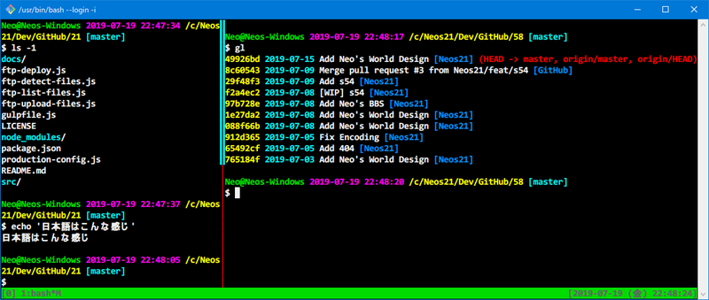

これまで Windows 環境では **ConEmu** を使って Git For Windows ないしは Git SDK を動かしていた。

- [Windows のターミナル環境を劇的に改善する「ConEmu」を入れてみた](/blog/2016/10/19-01.html)

しかし、`tmux` を導入するにあたって不具合が多く、色々と試した結果、「**標準の GitBash (`git-bash.exe`) が最善なんじゃねえの…？**」となったので、その軌跡を残しておく。

## 目次

## ConEmu の動作

### ConEmu で tmux の表示がバグる

以下の記事で紹介した Task 定義で、ConEmu から GitBash を開いてみた。

- [Git SDK を ConEmu で使う設定](/blog/2019/02/05-01.html)

```bash
set "PATH=C:\git-sdk-64\usr\bin;%PATH%" & "C:\git-sdk-64\git-cmd.exe" --no-cd --command=%ConEmuBaseDirShort%\conemu-msys2-64.exe /usr/bin/bash.exe -l -i -new_console:p%
```

↑コレ。元はというと以下の記事で書いたように、256色表示とかを上手くやるための `conemu-msys2-64.exe` (**[cygwin-connector](https://github.com/Maximus5/cygwin-connector)**) を噛ませて `bash.exe` を起動している。

- [GitBash in ConEmu で256色を表示させるまでの軌跡](/blog/2016/11/05-01.html)

この状態で `tmux` を開くと、画面がどんどん上にスクロールしていくかのような描画になり、画面がバグってまともに使えない。

また、`tmux` を使っていない通常時も**日本語 (全角) 文字を入力したり消したりしているとカーソル位置がおかしくなるバグ**があり、かなりつらい。

### 違う Task 定義で動かすと tmux が使えなくなる

続いて、以下のような Task 定義に修正してみた。

```bash
set "PATH=C:\git-sdk-64\usr\bin;%PATH%" & cmd /c "C:\git-sdk-64\usr\bin\bash -l -i" -new_console:p
```

コチラは Windows コマンドの `cmd /c` コマンドを使い、直接 `bash.exe` を実行している。

コレでターミナルを起動すると、日本語入力時にカーソル位置がバグる問題は解消するが、`tmux` を起動しようとすると以下のようなエラーが出てしまう。

```bash
$ tmux
open terminal failed: not a terminal
```

どうも `$TERM` が `xterm-256color` ではなく `cygwin` になっていることが原因っぽいが、環境変数を後から書き換えたりするだけでは使えるようにできなかった。

## Cmder

ココで登場したのが **Cmder**。ConEmu を改良したモノに、Git For Windows を同梱しているというツール。

- [Cmder | Console Emulator](https://cmder.net/)

内部的には ConEmu なのだが、細部が異なっている。例えば、同梱されている cygwin-connector `conemu-msys2-64.exe` の詳細を見ると、バージョン番号が違う。

- ConEmu 同梱版 : v1.2.0.0
- Cmder 同梱版 : v1.2.5.0

両者でファイルを入れ替えて使ってみたりしたが、正常に起動しなくなるため、Cmder 特有の調整が入っているようだ。

ConEmu で発生する日本語文字の表示が崩れる問題が、Cmder だと発生しなくなる、ということで入れてみた。

### cygwin-connector を挟んでいると、tmux は正常に動作するが、日本語入力がバグる

さて、cygwin-connector 入りの Task を Cmder で使ってみる。すると、`tmux` が正常に動作した。

*`tmux` の罫線が消えたりする問題は、僕がお気に入りで使っている MeiryoKe などの和文フォントではなく、Consolas や Menlo など英文フォントを指定すれば回避できる。*

コレはやったか？！と思ったら、**日本語入力時のバグり方が ConEmu よりひどい。**

- 参考：[cmderでカーソル位置が一文字ずれたときの対処法 - Qiita](https://qiita.com/kenji0x02/items/c85466cfb6df25f0724e)
- 参考：[Windows Creaters Update(バージョン1703)でconemuの全角文字のカーソル位置がずれる(解決済) - Qiita](https://qiita.com/imidorf/items/309c989aa44d0cd670e8)

事象は上の記事のスクショを見てもらうと分かりやすいだろう。

> コマンドプロンプトの設定で従来のコンソールを使うのチェックを入れると何故かなおる。

というのもやってみたが、直らず。

実は cygwin-connector 自体の GitHub Issues に、CJK 文字に関するバグは挙がっているのだが、対応がされていないようなのだ。

- 参考：[CJK is not handled properly · Issue #18 · Maximus5/cygwin-connector · GitHub](https://github.com/Maximus5/cygwin-connector/issues/18)

コレまでのどこかのタイミングでは、Windows OS 側と何か上手く都合が付けられるタイミングがあり、不具合が解消できたのかもしれないが、本稿執筆時点では上手く制御できなくなっていた。日本語が壊滅的に使えないのはダメだなぁ…。

### cygwin-connector を挟まないとやっぱり tmux が使えない

それでは `cmd /c` で `bash.exe` を直起動したらどうかというと、日本語入力はバグらずできるようになるが、代わりに ConEmu 同様 tmux が起動できなくなる。

## GitBash

それじゃあ Git SDK に同梱の GitBash (`git-bash.exe`) の動きも見ておこうか、ということで試してみた。

`tmux` は難なく起動する。罫線が崩れる件は英文フォントを指定することで回避。

英文フォントにない日本語文字は、**フォントリンク**というレジストリをイジってやれば、お気に入りなメイリオ改を使わせたりできるのだが、なんだか間延びして表示されていて、*実害はないが見た目がダサい。*

- 参考：[欧文フォントを日本語に対応させる Tipsというかメモ](http://tm.root-n.com/misc:consolas)
- 参考：[Windowsの欧文フォントを日本語に対応させる – Mohmongar](https://mohmongar.net/?p=1549)
- 参考：[フォントリンクの方法 - Desktop Customize Lab.](http://desktopcustomize.blog37.fc2.com/blog-entry-20.html)

見た目のダサさはおいておくと、日本語入力してもカーソル位置がバグったりしないし、`tmux` も動作する。一番実害が少なく使えるソフトは、GitBash だったのだ…。

## 3者のまとめ

ということで3者の挙動をまとめる。

<table>
  <thead>
    <tr>
      <th colspan="3">ソフト情報</th>
      <th colspan="3">接続方式別の挙動</th>
    </tr>
    <tr>
      <th>ソフト名</th>
      <th>タブ機能</th>
      <th>日本語描画</th>
      <th>接続方式</th>
      <th>日本語入力</th>
      <th>tmux</th>
    </tr>
  </thead>
  <tbody>
    <tr>
      <th>GitBash</th>
      <td>×</td>
      <td>△ 汚い (崩れはなし)</td>
      <td>-</td>
      <td>○ 正常</td>
      <td>○ 動作する</td>
    </tr>
    <tr>
      <th rowspan="2">ConEmu</th>
      <td rowspan="2">○</td>
      <td rowspan="2">○ 正常</td>
      <td>cygwin-connector 使用</td>
      <td>× バグあり</td>
      <td>○ 動作する</td>
    </tr>
    <tr>
      <td>cygwin-connector 未使用</td>
      <td>○ 正常</td>
      <td>× 起動しない</td>
    </tr>
    <tr>
      <th rowspan="2">Cmder</th>
      <td rowspan="2">○</td>
      <td rowspan="2">○ 正常</td>
      <td>cygwin-connector 使用</td>
      <td>× ひどいバグ</td>
      <td>○ 動作する</td>
    </tr>
    <tr>
      <td>cygwin-connector 未使用</td>
      <td>○ 正常</td>
      <td>× 起動しない</td>
    </tr>
  </tbody>
</table>

「日本語表示」は、いずれの環境も「Consolas」あたりの英字フォントを選択していることが前提。`tmux` の罫線記号も、日本語フォントを指定していると崩れやすい。この辺、日本語含めてターミナル利用で最適なフォントの決定版を見付けたいところ…。

GitBash はタブ機能がないが、`tmux` が一番まともに動く。ConEmu や Cmder は本体にタブ機能があり `tmux` 相当のことができるが、`tmux` を正常に動かせてかつ日本語入力もまともにできる環境はない。

色々と天秤にかけてみたけど、MacOS の「ターミナル.app」の「タブ機能」をどのくらい使うか考えたところ、結局「ウィンドウ」に分けて使うことの方が多いので、別にソフト側がタブ機能を持たなくても良い気がしてきた。

そもそも GitBash なら本体付属でポータブルだし、ConEmu や Cmder のような別ソフトをさらにいれる手間は省ける。日本語の文字が汚いのが難点だが、Windows VSCode のターミナルだとマシだから、より使用頻度の少ないターミナル本体は GitBash で良いかな、と思うことにした。

## `.minttyrc` を本腰入れて直しておく

つーわけで、`tmux` を使うために ConEmu と Cmder を捨て、Git SDK に統一することにした。

- [Git For Windows よりコマンドが豊富な Git For Windows SDK を試してみる](/blog/2018/10/11-02.html)

ついでに `.minttyrc` をイジって、MacOS ターミナルの「Homebrew」カラーをもう少しドギツくしたカラーリングにしてみた。フォントは Consolas を使うと日本語もまぁまぁ見られる。

```bash
# ================================================================================
# .minttyrc
# ================================================================================

Charset  = UTF-8
Language = ja
Locale   = ja_JP

Columns  = 120
Rows     = 25

Font          = Consolas
FontHeight    = 11
FontWeight    = 700
FontIsBold    = yes
FontSmoothing = full
BoldAsColour  = yes
BoldAsFont    = yes

AllowBlinking     = yes
CursorType        = block
OpaqueWhenFocused = yes
Term              = xterm-256color
ThemeFile         =

ForegroundColour = 240,240,240
BackgroundColour =   0,  0,  0
CursorColour     = 240,240,240
Black            = 100,100,100
BoldBlack        = 100,100,100
Red              = 240,  0,  0
BoldRed          = 240,  0,  0
Green            =   0,220,  0
BoldGreen        =   0,220,  0
Yellow           = 255,255,  0
BoldYellow       = 255,255,  0
Blue             =   0,140,255
BoldBlue         =   0,140,255
Magenta          = 255,  0,240
BoldMagenta      = 255,  0,240
Cyan             =   0,240,240
BoldCyan         =   0,240,240
White            = 255,255,255
BoldWhite        = 255,255,255
```

- [dotfiles/.minttyrc at master · Neos21/dotfiles · GitHub](https://github.com/Neos21/dotfiles/blob/master/Windows/.minttyrc)



以上！
