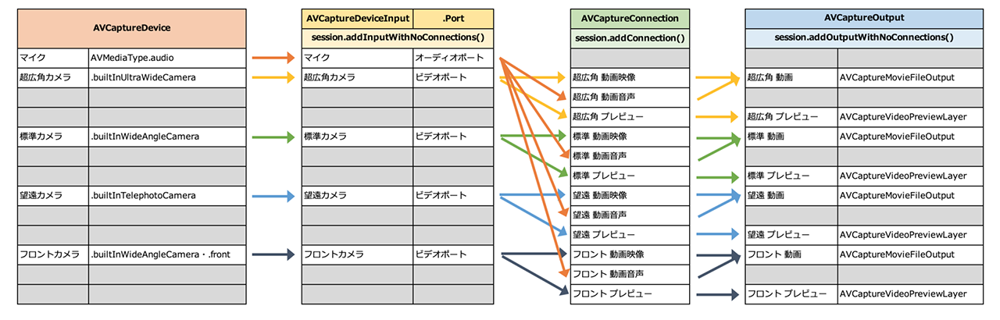

iOS 13 から登場した __`AVCaptureMultiCamSession`__ という API を使うと、1台の iPhone に搭載されている_複数のカメラデバイスを同時に_使用できる。例えば、バックの標準カメラで被写体を写しながら、フロントカメラで撮影者自身も同時に撮影したり、といった感じだ。

今回はこの `AVCaptureMultiCamSession` を使って、__複数のカメラで同時に動画を撮影する iOS アプリを作った__ので紹介する。

## 目次

## アプリの様子

アプリが動作しているスクリーンショットは以下。


左上が超広角カメラ、右上が標準カメラ、右下がフロントのインカメラを表示している。下部の「Start」ボタンを押下すると、プレビューが表示されているカメラのそれぞれで動画の録画が開始される。


コチラは標準カメラ (右上) の代わりに、望遠カメラ (左下) を起動したパターン。後述するが、__4カメラを同時に録画することはできなかった__ので、このような挙動になっている。

動画を撮影し始めると「Start」ボタンが「Stop」ボタンになり、「Stop」ボタンを押すと、動画ファイルが「写真」アプリ (カメラロール) に書き出される仕組み。例えば_3カメラで同時に撮影していれば、3つの動画ファイルがカメラロールに追加される。_

## コードは GitHub で公開中

コードの全量は GitHub にアップしてあるので、各自で導入して試してみてほしい。

- [Neos21/multi-cam](https://github.com/Neos21/multi-cam)

## 動作検証環境

- 検証端末 : iPhone 11 Pro Max
- 検証 OS : iOS 13.0・iOS 13.1
- 現状同時に撮影できる最大デバイス数：__3台__
- 撮影される動画ファイルの仕様 : 1920x1080px・29.58fps (バックカメラ・フロントカメラともに同じ)
- 開発環境：Xcode 11.0 (11A420a)

検証に使ったのは、2019-09-21 に購入した iPhone 11 Pro Max。

- [iPhone 11 Pro Max を買った・使えた液晶ガラスフィルム・レンズ保護フィルム・ケースの話も](/blog/2019/09/22-01.html)

プリインストールの iOS 13.0 と、2019-09-25 に配信された iOS 13.1 とで動作確認した。OS のマイナーバージョンアップによる挙動の違いはなかった。

動画を撮影できるアプリとして開発したが、撮影できている動画ファイルはいずれも、フル HD サイズ (1920x1080px) で 29.58fps (= 30fps) だった。コレはフレームレートや画質設定を一切せずに撮影できているスペックなので、設定したらもしかしたら 60fps 撮影とかもできるのかもしれない。

## 4カメ同時撮影はできなかった

ご存知のとおり、iPhone 11 Pro Max には

1. バック・超広角レンズ
2. バック・標準 (広角) レンズ
3. バック・望遠レンズ
4. フロントレンズ

の、合計4つのレンズが付いている。

iPhone 11 の製品発表イベントでデモンストレーションされていた、_「FiLMic Pro」_アプリによる4カメラ同時撮影を再現してみたくてアプリを作ったのだが、今回試した限りでは_実現できなかった。_

- 参考：[3眼レンズ＋新しい｢FilMic Pro｣の組み合わせ、すっごい！ #AppleEvent | ギズモード・ジャパン](https://www.gizmodo.jp/2019/09/198536.html)

なぜ4つ同時がダメだったかというと、__4つ目のカメラを使おうとするとエラーが出てしまうため__で、内部的な詳細を追っていくと、どうも現段階では __`AVCaptureMultiCamSession` に4つの `AVCaptureDeviceInput` を追加することはできない__ようだ。

## `AVCaptureMultiCamSession` の仕組み

__そもそも `AVCaptureMultiCamSession` に関する文献が今の段階ではまるでなく__、探り探りの中で実装した。見つかった資料は以下ぐらい。

- [AVCaptureMultiCamSession - AVFoundation | Apple Developer Documentation](https://developer.apple.com/documentation/avfoundation/avcapturemulticamsession) … 公式のリファレンス
- [AVMultiCamPiP: Capturing from Multiple Cameras | Apple Developer Documentation](https://developer.apple.com/documentation/avfoundation/cameras_and_media_capture/avmulticampip_capturing_from_multiple_cameras) … サンプルコード
- [WWDC/README.md at master · Blackjacx/WWDC · GitHub](https://github.com/Blackjacx/WWDC/blob/master/README.md#introducing-multi-camera-capture-for-ios) … WWDC のメモ

`AVCaptureMultiCamSession` の使い方は以下のような流れになる。

1. `AVCaptureMultiCamSession` を生成する
2. 目的のカメラレンズ = `AVCaptureDevice` を探す
3. そのレンズからの映像を取得するための `AVCaptureDeviceInput` を取得する
4. 取得した Input を `AVCaptureMultiCamSession` に追加する (`addInputWithNoConnections()`)
5. その映像の出力先となる `AVCaptureOutput` (のサブクラスである `AVCaptureMovieFileOutput` など) を用意する
6. 用意した Output を `AVCaptureMultiCamSession` に追加する (`addOutputWithNoConnections()`)
7. `AVCaptureDeviceInput` から `Port` を取得し、`AVCaptureOutput` との紐付け = `AVCaptureConnection` を作る
8. 作った Connection を `AVCaptureMultiCamSession` に追加する (`addConnection()`)
9. `AVCaptureMultiCamSession` を開始 (`startRunning()`) し、プレビュー表示を開始。録画開始に備える

準備するモノが多く、ローレベルな実装をコツコツしないといけないのだ。

今回は「各カメラのプレビュー表示があって、音声付きの動画をそれぞれ書き出す」というアプリとして作ったので、以下のようなリソースを用意する必要があった。



Input と Output は `AVCaptureMultiCamSession` に追加しておき、Input と Output の紐付けは `AVCaptureConnection` という定義体を作ることで実現できる。上の図の矢印は一方通行になっているが、実装的には前述のとおり、Input と Output を用意してから `AVCaptureConnection` を作ることになる。

## 4つのカメラを `AVCaptureMultiCamSession` に追加するとどうなるか

`AVCaptureDeviceInput` を `AVCaptureMultiCamSession` に追加する際は、以下のようなコードを書くことになる。コレを、使用したいカメラの台数分だけ、異なる `AVCaptureDeviceInput` を指定して実行することになる。

```swift
self.avCaptureMultiCamSession.addInputWithNoConnections(avCaptureDeviceInput)
```

例えば、超広角カメラを追加 → 標準カメラを追加 → 望遠カメラを追加、というところまでは正常に処理が進んだ後、4つ目のフロントカメラを追加しようとして上のようなコードを実行すると、そこでエラーが発生し、以下のようなエラーメッセージがコンソールに出力される。

```
*** Terminating app due to uncaught exception 'NSInvalidArgumentException', reason: '*** -[AVCaptureMultiCamSession addInputWithNoConnections:] These devices may not be used simultaneously. Use -[AVCaptureDeviceDiscoverySession supportedMultiCamDeviceSets]'
```

`NSInvalidArgumentException`、何やら「引数がダメ」という扱いになっている。

それではと、実装の順番を変えて、フロントカメラを追加 → 超広角カメラを追加 → 標準カメラを追加、という順にすると、この3つまでは正しく追加できるが、その次に望遠カメラを追加しようとすると、同様のエラーが発生する。つまり、「フロントカメラを追加」する処理のコード自体には引数誤りはないということなのだ。

もう少し読んでみると、`These devices may not be used simultaneously.` とある。これらのデバイスは同時に使えないよ、と明言されてしまった。

## 同時に使えるカメラの組合せを調べる：`supportedMultiCamDeviceSets`

じゃあどういう組合せなら同時に使えるの？というと、`Use -[AVCaptureDeviceDiscoverySession supportedMultiCamDeviceSets]` と書いてある。同時に使える組合せを知るための __`supportedMultiCamDeviceSets`__ というプロパティがあるようだ。

ということで以下のように実装して、実際に `supportedMultiCamDeviceSets` の中身を見てみた。

```swift
let discoverySession = AVCaptureDevice.DiscoverySession.init(deviceTypes: [
  // カメラ単体のデバイス種別
  AVCaptureDevice.DeviceType.builtInWideAngleCamera,
  AVCaptureDevice.DeviceType.builtInUltraWideCamera,
  AVCaptureDevice.DeviceType.builtInTelephotoCamera,
  // 以下は複数カメラを切り替えながら使うデバイス種別
  AVCaptureDevice.DeviceType.builtInDualCamera,
  AVCaptureDevice.DeviceType.builtInDualWideCamera,
  AVCaptureDevice.DeviceType.builtInTripleCamera,
  // コレは TrueDepth カメラの定義
  AVCaptureDevice.DeviceType.builtInTrueDepthCamera
], mediaType: AVMediaType.video, position: AVCaptureDevice.Position.unspecified)

let deviceSets = discoverySession.supportedMultiCamDeviceSets

print("\(deviceSets)")
```

`deviceTypes` に指定するのは、最初の3つの DeviceType だけで良い。それ以降の DeviceType は、全量を調べるためにとりあえず書いてみたモノだが、結果に大した違いはなかった。

`print()` した結果は以下のとおり。

```swift
[
  Set([
    [Back Dual Camera][com.apple.avfoundation.avcapturedevice.built-in_video:3]
  ]),
  Set([
    [Back Dual Wide Camera][com.apple.avfoundation.avcapturedevice.built-in_video:6]
  ]),
  Set([
    [Back Triple Camera][com.apple.avfoundation.avcapturedevice.built-in_video:7]
  ]),
  Set([
    [Back Camera][com.apple.avfoundation.avcapturedevice.built-in_video:0],
    [Front Camera][com.apple.avfoundation.avcapturedevice.built-in_video:1]
  ]),
  Set([
    [Back Camera][com.apple.avfoundation.avcapturedevice.built-in_video:0],
    [Back Ultra Wide Camera][com.apple.avfoundation.avcapturedevice.built-in_video:5]
  ]),
  Set([
    [Back Camera][com.apple.avfoundation.avcapturedevice.built-in_video:0],
    [Back Telephoto Camera][com.apple.avfoundation.avcapturedevice.built-in_video:2]
  ]),
  Set([
    [Front TrueDepth Camera][com.apple.avfoundation.avcapturedevice.built-in_video:4],
    [Back Camera][com.apple.avfoundation.avcapturedevice.built-in_video:0]
  ]),
  Set([
    [Front Camera][com.apple.avfoundation.avcapturedevice.built-in_video:1],
    [Back Ultra Wide Camera][com.apple.avfoundation.avcapturedevice.built-in_video:5]
  ]),
  Set([
    [Front Camera][com.apple.avfoundation.avcapturedevice.built-in_video:1],
    [Back Telephoto Camera][com.apple.avfoundation.avcapturedevice.built-in_video:2]
  ]),
  Set([
    [Front Camera][com.apple.avfoundation.avcapturedevice.built-in_video:1],
    [Back Dual Camera][com.apple.avfoundation.avcapturedevice.built-in_video:3]
  ]),
  Set([
    [Back Dual Wide Camera][com.apple.avfoundation.avcapturedevice.built-in_video:6],
    [Front Camera][com.apple.avfoundation.avcapturedevice.built-in_video:1]
  ]),
  Set([
    [Back Ultra Wide Camera][com.apple.avfoundation.avcapturedevice.built-in_video:5],
    [Back Telephoto Camera][com.apple.avfoundation.avcapturedevice.built-in_video:2]
  ]),
  Set([
    [Front TrueDepth Camera][com.apple.avfoundation.avcapturedevice.built-in_video:4],
    [Back Ultra Wide Camera][com.apple.avfoundation.avcapturedevice.built-in_video:5]
  ]),
  Set([
    [Front TrueDepth Camera][com.apple.avfoundation.avcapturedevice.built-in_video:4],
    [Back Telephoto Camera][com.apple.avfoundation.avcapturedevice.built-in_video:2]
  ]),
  Set([
    [Front TrueDepth Camera][com.apple.avfoundation.avcapturedevice.built-in_video:4],
    [Back Dual Camera][com.apple.avfoundation.avcapturedevice.built-in_video:3]
  ]),
  Set([
    [Back Dual Wide Camera][com.apple.avfoundation.avcapturedevice.built-in_video:6],
    [Front TrueDepth Camera][com.apple.avfoundation.avcapturedevice.built-in_video:4]
  ]),
  Set([
    [Back Ultra Wide Camera][com.apple.avfoundation.avcapturedevice.built-in_video:5],
    [Back Camera][com.apple.avfoundation.avcapturedevice.built-in_video:0],
    [Front Camera][com.apple.avfoundation.avcapturedevice.built-in_video:1]
  ]),
  Set([
    [Back Telephoto Camera][com.apple.avfoundation.avcapturedevice.built-in_video:2],
    [Back Camera][com.apple.avfoundation.avcapturedevice.built-in_video:0],
    [Front Camera][com.apple.avfoundation.avcapturedevice.built-in_video:1]
  ]),
  Set([
    [Back Telephoto Camera][com.apple.avfoundation.avcapturedevice.built-in_video:2],
    [Back Camera][com.apple.avfoundation.avcapturedevice.built-in_video:0],
    [Back Ultra Wide Camera][com.apple.avfoundation.avcapturedevice.built-in_video:5]
  ]),
  Set([
    [Front TrueDepth Camera][com.apple.avfoundation.avcapturedevice.built-in_video:4],
    [Back Camera][com.apple.avfoundation.avcapturedevice.built-in_video:0],
    [Back Ultra Wide Camera][com.apple.avfoundation.avcapturedevice.built-in_video:5]
  ]),
  Set([
    [Front TrueDepth Camera][com.apple.avfoundation.avcapturedevice.built-in_video:4],
    [Back Camera][com.apple.avfoundation.avcapturedevice.built-in_video:0],
    [Back Telephoto Camera][com.apple.avfoundation.avcapturedevice.built-in_video:2]
  ]),
  Set([
    [Back Telephoto Camera][com.apple.avfoundation.avcapturedevice.built-in_video:2],
    [Front Camera][com.apple.avfoundation.avcapturedevice.built-in_video:1],
    [Back Ultra Wide Camera][com.apple.avfoundation.avcapturedevice.built-in_video:5]
  ]),
  Set([
    [Front TrueDepth Camera][com.apple.avfoundation.avcapturedevice.built-in_video:4],
    [Back Ultra Wide Camera][com.apple.avfoundation.avcapturedevice.built-in_video:5],
    [Back Telephoto Camera][com.apple.avfoundation.avcapturedevice.built-in_video:2]
  ])
]
```

コレを見ると分かるとおり、利用可能なデバイスの組合せは、__最大で3カメラ分までの定義しか見つからなかった。__

`AVCaptureMultiCamSession#addInputWithNoConnections()` を実行すると、裏では引数で指定された `AVCaptureDeviceInput` の組合せを、この `supportedMultiCamDeviceSets` と突合して確認していて、それに合わない組合せだとエラーになるのだろう。`supportedMultiCamDeviceSets` には4台の組合せが存在しないので、エラーになったというワケだ。

生の調査記録は量が多いので、本記事末尾にまとめて書いておく。

ということで、 __本稿執筆時点では、最大3つまでのカメラレンズを使っての同時撮影なら可能__、という結果になった。

アプリの実装上は、4つのカメラレンズが使えるようになった時も動作するようにしてあるので、今後のアップデートとかで4カメ同時撮影ができるようになったりしたら、この実装のまま対応できるかと思う。

## バックグラウンドに移行した時のエラーは何？

もう一つ気になったことがあった。ホーム画面に戻ったりしてアプリがバックグラウンドに移ると、Xcode のデバッグコンソールに以下のエラーが出力されていた。

```
Can't end BackgroundTask: no background task exists with identifier 1 (0x1), or it may have already been ended. Break in UIApplicationEndBackgroundTaskError() to debug.
```

動画録画中かどうかには関係なく表示されていた。

以下の記事を見ると、デバッグの仕方が書いてあったのでデバッグしてみたが、詳しいことは分からず。

- 参考：[Break in UIApplicationEndBackgroundTaskError() ... |Apple Developer Forums](https://forums.developer.apple.com/thread/22836)

> In Xcode, switch to the breakpoint navigator (View > Navigators > Show Breakpoint Navigator) then push the + button in the bottom left and select Add Symbolic Breakpoint and enter "UIApplicationEndBackgroundTaskError" as the symbol.

でも、この記事のおかげでブレイクポイントを打ってデバッグするやり方を覚えたので、そのやり方だけメモしとく。

Xcode の左ペインの上側から、「Breakpoint Navigator」カラムを表示するアイコンを押下する。メニューバーの「View」→「Navigators」→「Show Breakpoint Navigator」と移動しても良い。

そしたらその左ペインの左下にある「+」ボタンを押下し、メニューから「Symbolic Breakpoint...」を選択する。


表示された枠の「Symbol」欄に「`UIApplicationEndBackgroundTaskError`」と入れれば OK。


あとはこの状態でアプリを起動し、ホーム画面に戻るなどすると、ブレイクポイントで処理が止まり、デバッグができるようになる。

このエラーは、`AVCaptureMultiCamSession` に関する唯一の公式サンプルコードである、以下のプロジェクトでも同様に発生していた。

- 参考：[AVMultiCamPiP: Capturing from Multiple Cameras | Apple Developer Documentation](https://developer.apple.com/documentation/avfoundation/cameras_and_media_capture/avmulticampip_capturing_from_multiple_cameras)
  - __AVMultiCamPiP: Capturing from Multiple Cameras__

もしかしたら気にしなくて良いモノなのかもしれないが、原因も対処法も分からないままだ。

## 探り探り実装したのでまだまだバギー

自分の iOS アプリの開発スキルは素人レベル。過去にスローモーション動画を撮影するための実装を紹介したことがあるが、コレをベースにした個人用のアプリを作ったぐらいしか経験がない。

- [iOS アプリで 120fps・240fps のスローモーション動画を撮るための Swift 4 実装](/blog/2018/06/04-01.html)

素の `AVCaptureSesion` すら仕組みを理解していなくて怪しかったので、最初は以下あたりの記事のコードを参考に、単体カメラを操るところから復習した。

- 参考：[ささっとカメラアプリを作ってみた@Swift - Goalist Developers Blog](http://developers.goalist.co.jp/entry/2017/01/19/171612)
- 参考：[【Swift】この時期だから見直すiOS10の新機能 AVCapturePhotoOutput AVCaptureSettings など - Qiita](https://qiita.com/shiz/items/d7738f998e4be2d37c0f)
- 参考：[Swift で動画を撮影・保存するサンプル その１ - シンプル編 - Qiita](https://qiita.com/takecian/items/2cee0f958c8bed00a69a)
  - この辺の記事はいずれも最新の Xcode プロジェクトにコピペしても動かず、ちょこちょこと手直しは必要

Action や Outlet の接続方法も忘れていたので覚え直し。

- 参考：[【Xcode/Swift】Action接続、Outlet接続の外し方（削除する方法） | おすすめのプログラミングスクール比較！最短で上達するなら？](https://pg-happy.jp/xcode-delete-action-outlet-connection.html)
- [Swift で iOS アプリを開発するチュートリアルをやってみる](/blog/2018/06/03-01.html)

フロントカメラを使うのは初めてだったので、プレビューを鏡写しにするところを覚えた。

- 参考：[iOSでの動画処理における「回転」「向き」の取り扱いでもう混乱したくない - Qiita](https://qiita.com/shu223/items/057351d41229861251af)

そういえば、Xcode プロジェクトを新規作成したところ、`SceneDelegate.swift` なる知らないファイルがあった。コレは複数の UI のインスタンスを作るためのモノで、iOS13 からの新機能によるファイルらしい。今回は必要なかったのでファイルごと消し、`Info.plist` の `Application Scene Manifest` キーを消した。

- 参考：[iOS 13 から導入されるSceneDelegateとは - Yappli Tech Blog](https://tech.yappli.io/entry/scenedelegate)

プレビューを作る時、`AVCaptureVideoPreviewLayer(self.session)` と、第1引数に `session` を入れてやったら以下のエラーが出た。

```
<AVCaptureConnection: 0x2810a64e0> cannot be added because AVCaptureVideoPreviewLayer only accepts one connection of this media type at a time, and it is already connected'
```

宣言時に `session` を指定せず、`AVCaptureVideoPreviewLayer()` でインスタンスを作り、`previewLayer.setSessionWithNoConnection(self.session)` と書いて接続したら回避できた。この辺よー分からん。

公開したコードでは回避できてはいるが、`AVCaptureMultiCamSession` に追加した Input や Output などを除去する、`removeInput()` などを実装していたところ、その後に再度動画録画を始めようとすると以下のようなエラーが出た。

```
*** Terminating app due to uncaught exception 'NSRangeException', reason: 'Cannot remove an observer <AVCaptureMultiCamSession 0x28084e7a0> for the key path "enabled" from <AVCaptureConnection 0x2808066c0> because it is not registered as an observer.'
```

Observer よく分からん。公式サンプルコードの _AVMultiCamPiP_ の中では、色々 Observer を操作したり、色んなタイミングでのエラーハンドリングを細かくやっていたりするのは分かるのだが、それがどうしてどういう理由で必要なのかが読み解けなかった。結局、今の実装は `AVCaptureMultiCamSession` ごと作り直すことで対処している。

Swift の言語仕様でいうと、以下あたりを知った。

- `defer` って何やねん → その関数内で、例外が発生したりしても最後に必ずやりたい処理を書いておく。`finally` 的なモノ
- `if let hoge = self.hoge` って何やねん → 代入することで、Optional な値である `self.hoge` が `nil` でないことを確認できるイディオムらしい

動画を録画し始めたあと、アプリがバックグラウンドに移行した時に、動画の撮影を終了して、フォトライブラリに書き出したいなぁと思って色々コネコネしたんだけど、挙動がバギーだ。

- 参考：[Swift iOSのバックグラウンド処理について - Qiita](https://qiita.com/teamhimeH/items/51efb4fc68d3f1d2ebb9)

もう少しド直球に、`AVCaptureMultiCamSession` のコードを GitHub で探してみたのだが、以下の4つしか見つけられなかった。

- [dbleTake/CaptureViewController.swift at master · Dinalli/dbleTake · GitHub](https://github.com/Dinalli/dbleTake/blob/master/dbleTake/ViewControllers/CaptureViewController.swift)
  - コメントの日付が 2019-09-12 なので、iOS 13 のベータ版で書いたコードっぽい
- [MultiCamCapture/ViewController.swift at master · huiping192/MultiCamCapture · GitHub](https://github.com/huiping192/MultiCamCapture/blob/master/PiP/ViewController.swift)
- [SODualCamera/ViewController.swift at master · spaceotech/SODualCamera · GitHub](https://github.com/spaceotech/SODualCamera/blob/master/SODualCamera/ViewController.swift)
  - ほぼ公式のコードそのまま
- [iOS13 camera test/CameraViewController.swift at master · tatetate55 GitHub](https://github.com/tatetate55/iOS13_camera_test/blob/master/AVMultiCamPiP/CameraViewController.swift)
  - 日本人らしい

## 終わり

_Swift ちから_がまだまだ全然足りなくて、

- バックグラウンド移行を始めとした様々なイベントに対するエラーハンドリング
- iPhone 11 Pro Max 以外の端末で動かした場合のレイアウト、動作 (他の端末での動作検証はできてないし、端末ごとのレイアウト調整もしてない)
- カメラやフォトライブラリへのアクセス許可が拒否されている場合の動作
- 公式サンプルコードでは何やら処理している、負荷量を監視してフレームレートや解像度を下げたりする安全な作り (逆に、頑張れば複数カメラで 4K とか、スローとかが撮れたりする？)

などなど、至らぬ点は重々認識しているが、どうやって解決していったら良いか分かっていないところも多い。コメントやプルリクで色々教えてもらえたら嬉しい。4カメ同時に使うテクニックが編み出されたりしたら取り入れたい。

有料の FiLMic Pro がリリースされるよりも先に、同等のアプリを無料で公開できたらいいなーと思い、急ぎ作ってコードごと公開した次第。拙いコードだし、AppStore で公開してはいないが、ひとしきり動作するアプリとしては世界初の事例になったのではないか？と思っている。

ぜひ感想、改善点などお寄せください。

- [Neos21/multi-cam](https://github.com/Neos21/multi-cam)

## AVCaptureMultiCamSession : SupportedMultiCamDeviceSets on iPhone 11 Pro Max

- `AllBuiltInCameras.swift`

```swift
// iOS13.0 iPhone 11 Pro Max
let discoverySession = AVCaptureDevice.DiscoverySession.init(deviceTypes: [
  AVCaptureDevice.DeviceType.builtInWideAngleCamera,
  AVCaptureDevice.DeviceType.builtInUltraWideCamera,
  AVCaptureDevice.DeviceType.builtInTelephotoCamera,
  AVCaptureDevice.DeviceType.builtInDualCamera,
  AVCaptureDevice.DeviceType.builtInDualWideCamera,
  AVCaptureDevice.DeviceType.builtInTripleCamera,
  AVCaptureDevice.DeviceType.builtInTrueDepthCamera
], mediaType: AVMediaType.video, position: AVCaptureDevice.Position.unspecified)
let deviceSets = discoverySession.supportedMultiCamDeviceSets
print("\(deviceSets)")

[
  Set([
    [Back Dual Camera][com.apple.avfoundation.avcapturedevice.built-in_video:3]
  ]),
  Set([
    [Back Dual Wide Camera][com.apple.avfoundation.avcapturedevice.built-in_video:6]
  ]),
  Set([
    [Back Triple Camera][com.apple.avfoundation.avcapturedevice.built-in_video:7]
  ]),
  Set([
    [Back Camera][com.apple.avfoundation.avcapturedevice.built-in_video:0],
    [Front Camera][com.apple.avfoundation.avcapturedevice.built-in_video:1]
  ]),
  Set([
    [Back Camera][com.apple.avfoundation.avcapturedevice.built-in_video:0],
    [Back Ultra Wide Camera][com.apple.avfoundation.avcapturedevice.built-in_video:5]
  ]),
  Set([
    [Back Camera][com.apple.avfoundation.avcapturedevice.built-in_video:0],
    [Back Telephoto Camera][com.apple.avfoundation.avcapturedevice.built-in_video:2]
  ]),
  Set([
    [Front TrueDepth Camera][com.apple.avfoundation.avcapturedevice.built-in_video:4],
    [Back Camera][com.apple.avfoundation.avcapturedevice.built-in_video:0]
  ]),
  Set([
    [Front Camera][com.apple.avfoundation.avcapturedevice.built-in_video:1],
    [Back Ultra Wide Camera][com.apple.avfoundation.avcapturedevice.built-in_video:5]
  ]),
  Set([
    [Front Camera][com.apple.avfoundation.avcapturedevice.built-in_video:1],
    [Back Telephoto Camera][com.apple.avfoundation.avcapturedevice.built-in_video:2]
  ]),
  Set([
    [Front Camera][com.apple.avfoundation.avcapturedevice.built-in_video:1],
    [Back Dual Camera][com.apple.avfoundation.avcapturedevice.built-in_video:3]
  ]),
  Set([
    [Back Dual Wide Camera][com.apple.avfoundation.avcapturedevice.built-in_video:6],
    [Front Camera][com.apple.avfoundation.avcapturedevice.built-in_video:1]
  ]),
  Set([
    [Back Ultra Wide Camera][com.apple.avfoundation.avcapturedevice.built-in_video:5],
    [Back Telephoto Camera][com.apple.avfoundation.avcapturedevice.built-in_video:2]
  ]),
  Set([
    [Front TrueDepth Camera][com.apple.avfoundation.avcapturedevice.built-in_video:4],
    [Back Ultra Wide Camera][com.apple.avfoundation.avcapturedevice.built-in_video:5]
  ]),
  Set([
    [Front TrueDepth Camera][com.apple.avfoundation.avcapturedevice.built-in_video:4],
    [Back Telephoto Camera][com.apple.avfoundation.avcapturedevice.built-in_video:2]
  ]),
  Set([
    [Front TrueDepth Camera][com.apple.avfoundation.avcapturedevice.built-in_video:4],
    [Back Dual Camera][com.apple.avfoundation.avcapturedevice.built-in_video:3]
  ]),
  Set([
    [Back Dual Wide Camera][com.apple.avfoundation.avcapturedevice.built-in_video:6],
    [Front TrueDepth Camera][com.apple.avfoundation.avcapturedevice.built-in_video:4]
  ]),
  Set([
    [Back Ultra Wide Camera][com.apple.avfoundation.avcapturedevice.built-in_video:5],
    [Back Camera][com.apple.avfoundation.avcapturedevice.built-in_video:0],
    [Front Camera][com.apple.avfoundation.avcapturedevice.built-in_video:1]
  ]),
  Set([
    [Back Telephoto Camera][com.apple.avfoundation.avcapturedevice.built-in_video:2],
    [Back Camera][com.apple.avfoundation.avcapturedevice.built-in_video:0],
    [Front Camera][com.apple.avfoundation.avcapturedevice.built-in_video:1]
  ]),
  Set([
    [Back Telephoto Camera][com.apple.avfoundation.avcapturedevice.built-in_video:2],
    [Back Camera][com.apple.avfoundation.avcapturedevice.built-in_video:0],
    [Back Ultra Wide Camera][com.apple.avfoundation.avcapturedevice.built-in_video:5]
  ]),
  Set([
    [Front TrueDepth Camera][com.apple.avfoundation.avcapturedevice.built-in_video:4],
    [Back Camera][com.apple.avfoundation.avcapturedevice.built-in_video:0],
    [Back Ultra Wide Camera][com.apple.avfoundation.avcapturedevice.built-in_video:5]
  ]),
  Set([
    [Front TrueDepth Camera][com.apple.avfoundation.avcapturedevice.built-in_video:4],
    [Back Camera][com.apple.avfoundation.avcapturedevice.built-in_video:0],
    [Back Telephoto Camera][com.apple.avfoundation.avcapturedevice.built-in_video:2]
  ]),
  Set([
    [Back Telephoto Camera][com.apple.avfoundation.avcapturedevice.built-in_video:2],
    [Front Camera][com.apple.avfoundation.avcapturedevice.built-in_video:1],
    [Back Ultra Wide Camera][com.apple.avfoundation.avcapturedevice.built-in_video:5]
  ]),
  Set([
    [Front TrueDepth Camera][com.apple.avfoundation.avcapturedevice.built-in_video:4],
    [Back Ultra Wide Camera][com.apple.avfoundation.avcapturedevice.built-in_video:5],
    [Back Telephoto Camera][com.apple.avfoundation.avcapturedevice.built-in_video:2]
  ])
]
```

- `iOS13.1SupportedMultiCamDeviceSets.swift`

```swift
// iOS13.1 iPhone 11 Pro Max
// Cameras
[
  Set([
    [Back Camera][com.apple.avfoundation.avcapturedevice.built-in_video:0],
    [Front Camera][com.apple.avfoundation.avcapturedevice.built-in_video:1]
  ]),
  Set([
    [Back Ultra Wide Camera][com.apple.avfoundation.avcapturedevice.built-in_video:5],
    [Back Camera][com.apple.avfoundation.avcapturedevice.built-in_video:0]
  ]),
  Set([
    [Back Camera][com.apple.avfoundation.avcapturedevice.built-in_video:0],
    [Back Telephoto Camera][com.apple.avfoundation.avcapturedevice.built-in_video:2]
  ]),
  Set([
    [Back Ultra Wide Camera][com.apple.avfoundation.avcapturedevice.built-in_video:5],
    [Front Camera][com.apple.avfoundation.avcapturedevice.built-in_video:1]
  ]),
  Set([
    [Front Camera][com.apple.avfoundation.avcapturedevice.built-in_video:1],
    [Back Telephoto Camera][com.apple.avfoundation.avcapturedevice.built-in_video:2]
  ]),
  Set([
    [Back Ultra Wide Camera][com.apple.avfoundation.avcapturedevice.built-in_video:5],
    [Back Telephoto Camera][com.apple.avfoundation.avcapturedevice.built-in_video:2]
  ]),
  Set([
    [Back Ultra Wide Camera][com.apple.avfoundation.avcapturedevice.built-in_video:5],
    [Back Camera][com.apple.avfoundation.avcapturedevice.built-in_video:0],
    [Front Camera][com.apple.avfoundation.avcapturedevice.built-in_video:1]
  ]),
  Set([
    [Back Telephoto Camera][com.apple.avfoundation.avcapturedevice.built-in_video:2],
    [Back Camera][com.apple.avfoundation.avcapturedevice.built-in_video:0],
    [Front Camera][com.apple.avfoundation.avcapturedevice.built-in_video:1]
  ]),
  Set([
    [Back Ultra Wide Camera][com.apple.avfoundation.avcapturedevice.built-in_video:5],
    [Back Camera][com.apple.avfoundation.avcapturedevice.built-in_video:0],
    [Back Telephoto Camera][com.apple.avfoundation.avcapturedevice.built-in_video:2]
  ]),
  Set([
    [Back Ultra Wide Camera][com.apple.avfoundation.avcapturedevice.built-in_video:5],
    [Front Camera][com.apple.avfoundation.avcapturedevice.built-in_video:1],
    [Back Telephoto Camera][com.apple.avfoundation.avcapturedevice.built-in_video:2]
  ])
]


// All Devices
[
  Set([
    [Back Dual Camera][com.apple.avfoundation.avcapturedevice.built-in_video:3]
  ]),
  Set([
    [Back Dual Wide Camera][com.apple.avfoundation.avcapturedevice.built-in_video:6]
  ]),
  Set([
    [Back Triple Camera][com.apple.avfoundation.avcapturedevice.built-in_video:7]
  ]),
  Set([
    [Front Camera][com.apple.avfoundation.avcapturedevice.built-in_video:1],
    [Back Camera][com.apple.avfoundation.avcapturedevice.built-in_video:0]
  ]),
  Set([
    [Back Ultra Wide Camera][com.apple.avfoundation.avcapturedevice.built-in_video:5],
    [Back Camera][com.apple.avfoundation.avcapturedevice.built-in_video:0]
  ]),
  Set([
    [Back Telephoto Camera][com.apple.avfoundation.avcapturedevice.built-in_video:2],
    [Back Camera][com.apple.avfoundation.avcapturedevice.built-in_video:0]
  ]),
  Set([
    [Front TrueDepth Camera][com.apple.avfoundation.avcapturedevice.built-in_video:4],
    [Back Camera][com.apple.avfoundation.avcapturedevice.built-in_video:0]
  ]),
  Set([
    [Front Camera][com.apple.avfoundation.avcapturedevice.built-in_video:1],
    [Back Ultra Wide Camera][com.apple.avfoundation.avcapturedevice.built-in_video:5]
  ]),
  Set([
    [Back Telephoto Camera][com.apple.avfoundation.avcapturedevice.built-in_video:2],
    [Front Camera][com.apple.avfoundation.avcapturedevice.built-in_video:1]
  ]),
  Set([
    [Back Dual Camera][com.apple.avfoundation.avcapturedevice.built-in_video:3],
    [Front Camera][com.apple.avfoundation.avcapturedevice.built-in_video:1]
  ]),
  Set([
    [Front Camera][com.apple.avfoundation.avcapturedevice.built-in_video:1],
    [Back Dual Wide Camera][com.apple.avfoundation.avcapturedevice.built-in_video:6]
  ]),
  Set([
    [Back Telephoto Camera][com.apple.avfoundation.avcapturedevice.built-in_video:2],
    [Back Ultra Wide Camera][com.apple.avfoundation.avcapturedevice.built-in_video:5]
  ]),
  Set([
    [Front TrueDepth Camera][com.apple.avfoundation.avcapturedevice.built-in_video:4],
    [Back Ultra Wide Camera][com.apple.avfoundation.avcapturedevice.built-in_video:5]
  ]),
  Set([
    [Back Telephoto Camera][com.apple.avfoundation.avcapturedevice.built-in_video:2],
    [Front TrueDepth Camera][com.apple.avfoundation.avcapturedevice.built-in_video:4]
  ]),
  Set([
    [Back Dual Camera][com.apple.avfoundation.avcapturedevice.built-in_video:3],
    [Front TrueDepth Camera][com.apple.avfoundation.avcapturedevice.built-in_video:4]
  ]),
  Set([
    [Front TrueDepth Camera][com.apple.avfoundation.avcapturedevice.built-in_video:4],
    [Back Dual Wide Camera][com.apple.avfoundation.avcapturedevice.built-in_video:6]
  ]),
  Set([
    [Back Ultra Wide Camera][com.apple.avfoundation.avcapturedevice.built-in_video:5],
    [Front Camera][com.apple.avfoundation.avcapturedevice.built-in_video:1],
    [Back Camera][com.apple.avfoundation.avcapturedevice.built-in_video:0]
  ]),
  Set([
    [Back Telephoto Camera][com.apple.avfoundation.avcapturedevice.built-in_video:2],
    [Front Camera][com.apple.avfoundation.avcapturedevice.built-in_video:1],
    [Back Camera][com.apple.avfoundation.avcapturedevice.built-in_video:0]
  ]),
  Set([
    [Back Ultra Wide Camera][com.apple.avfoundation.avcapturedevice.built-in_video:5],
    [Back Telephoto Camera][com.apple.avfoundation.avcapturedevice.built-in_video:2],
    [Back Camera][com.apple.avfoundation.avcapturedevice.built-in_video:0]
  ]),
  Set([
    [Back Ultra Wide Camera][com.apple.avfoundation.avcapturedevice.built-in_video:5],
    [Front TrueDepth Camera][com.apple.avfoundation.avcapturedevice.built-in_video:4],
    [Back Camera][com.apple.avfoundation.avcapturedevice.built-in_video:0]
  ]),
  Set([
    [Back Telephoto Camera][com.apple.avfoundation.avcapturedevice.built-in_video:2],
    [Front TrueDepth Camera][com.apple.avfoundation.avcapturedevice.built-in_video:4],
    [Back Camera][com.apple.avfoundation.avcapturedevice.built-in_video:0]
  ]),
  Set([
    [Back Telephoto Camera][com.apple.avfoundation.avcapturedevice.built-in_video:2],
    [Front Camera][com.apple.avfoundation.avcapturedevice.built-in_video:1],
    [Back Ultra Wide Camera][com.apple.avfoundation.avcapturedevice.built-in_video:5]
  ]),
  Set([
    [Back Telephoto Camera][com.apple.avfoundation.avcapturedevice.built-in_video:2],
    [Front TrueDepth Camera][com.apple.avfoundation.avcapturedevice.built-in_video:4],
    [Back Ultra Wide Camera][com.apple.avfoundation.avcapturedevice.built-in_video:5]
  ])
]
```

- `SupportedMultiCamDeviceSets.swift`

```swift
// iOS13.0 iPhone 11 Pro Max
let discoverySession = AVCaptureDevice.DiscoverySession.init(deviceTypes: [
      AVCaptureDevice.DeviceType.builtInWideAngleCamera,
      AVCaptureDevice.DeviceType.builtInUltraWideCamera,
      AVCaptureDevice.DeviceType.builtInTelephotoCamera
], mediaType: AVMediaType.video, position: AVCaptureDevice.Position.unspecified)
let deviceSets = discoverySession.supportedMultiCamDeviceSets
print("\(deviceSets)")

[
  Set([
    [Back Camera][com.apple.avfoundation.avcapturedevice.built-in_video:0],
    [Front Camera][com.apple.avfoundation.avcapturedevice.built-in_video:1]
  ]),
  Set([
    [Back Camera][com.apple.avfoundation.avcapturedevice.built-in_video:0],
    [Back Ultra Wide Camera][com.apple.avfoundation.avcapturedevice.built-in_video:5]
  ]),
  Set([
    [Back Camera][com.apple.avfoundation.avcapturedevice.built-in_video:0],
    [Back Telephoto Camera][com.apple.avfoundation.avcapturedevice.built-in_video:2]
  ]),
  Set([
    [Front Camera][com.apple.avfoundation.avcapturedevice.built-in_video:1],
    [Back Ultra Wide Camera][com.apple.avfoundation.avcapturedevice.built-in_video:5]
  ]),
  Set([
    [Front Camera][com.apple.avfoundation.avcapturedevice.built-in_video:1],
    [Back Telephoto Camera][com.apple.avfoundation.avcapturedevice.built-in_video:2]
  ]),
  Set([
    [Back Ultra Wide Camera][com.apple.avfoundation.avcapturedevice.built-in_video:5],
    [Back Telephoto Camera][com.apple.avfoundation.avcapturedevice.built-in_video:2]
  ]),
  Set([
    [Back Camera][com.apple.avfoundation.avcapturedevice.built-in_video:0],
    [Front Camera][com.apple.avfoundation.avcapturedevice.built-in_video:1],
    [Back Ultra Wide Camera][com.apple.avfoundation.avcapturedevice.built-in_video:5]
  ]),
  Set([
    [Back Camera][com.apple.avfoundation.avcapturedevice.built-in_video:0],
    [Front Camera][com.apple.avfoundation.avcapturedevice.built-in_video:1],
    [Back Telephoto Camera][com.apple.avfoundation.avcapturedevice.built-in_video:2]
  ]),
  Set([
    [Back Camera][com.apple.avfoundation.avcapturedevice.built-in_video:0],
    [Back Ultra Wide Camera][com.apple.avfoundation.avcapturedevice.built-in_video:5],
    [Back Telephoto Camera][com.apple.avfoundation.avcapturedevice.built-in_video:2]
  ]),
  Set([
    [Back Telephoto Camera][com.apple.avfoundation.avcapturedevice.built-in_video:2],
    [Front Camera][com.apple.avfoundation.avcapturedevice.built-in_video:1],
    [Back Ultra Wide Camera][com.apple.avfoundation.avcapturedevice.built-in_video:5]
  ])
]
```
