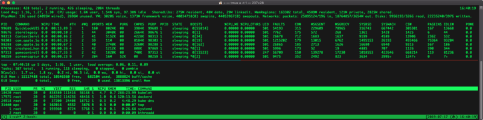

`top` コマンドで CPU 使用率やメモリ使用率を見たいなーと思ったのだが、MacOS と Linux (CentOS) とでオプションがかなり違うので、よく使うモノを整理することにした。

## 目次

## 環境確認

本記事の `top` コマンドの内容は以下のとおり。

- MacOS
  - MacOS Mojave 同梱の `top` コマンド
- Linux : CentOS 7
  - `$ top -v` の結果は `procps-ng version 3.3.10` だった

## 普通に `top` コマンドを打った画面

普通に `top` コマンドを打った画面から、見えるモノが全然違う。以下のスクリーンショットは、上半分が MacOS、下半分が Linux だ。



オプションを何も指定していない場合のソート順は、

- MacOS : PID の降順 (大きな値から順)
- Linux : CPU 使用率の降順 (高い順)

となっている。

- 参考 : [Mac OS XのtopはCPU順でない | Pistolfly](https://www.pistolfly.com/weblog/2016/11/mac-os-x%E3%81%AEtop%E3%81%AFcpu%E9%A0%86%E3%81%A7%E3%81%AA%E3%81%84.html)

## CPU 使用率順にソートする

MacOS の場合は、

```bash
$ top -o cpu
```

と起動する。

もしくは、`$ top` で起動後、*`o`* と入力し、`primary key [-pid]:` といった表示が出たら、**`cpu`** と入力して Return キーを押下すれば良い。

- 参考 : [MacOSのtopコマンドでCPU使用順にソート | ex1-lab](https://ex1.m-yabe.com/archives/2858)

Linux の場合は `top` コマンドのみで起動すれば CPU 使用率順になるが、

```bash
$ top -o %CPU
```

とカラム名を指定してソートしても良い。

もしくは、`$ top` コマンドで起動後、**`Shift + p`** を押下しても CPU 使用率順でソートできる。

## メモリ使用率順にソートする

MacOS の場合は

```bash
$ top -o mem
```

もしくは、起動後に `o` → `mem` でソート可能。

Linux の場合は

```bash
$ top -o %MEM
```

もしくは **`Shift + m`** でソート可能。

- 参考 : [topコマンドでソート対象のフィールドを指定する - Qiita](https://qiita.com/todok-r/items/e3255328d8653d950802)

## プロセス ID を指定して確認する

MacOS の場合は、

```bash
$ top -pid 【PID】
```

で表示可能。

Linux の場合は

```bash
$ top -p 【PID】
```

で表示可能。

- 参考 : [topコマンドの使い方 - Qiita](https://qiita.com/k0kubun/items/7368c323d90f24a00c2f)

## まとめ

チートシートにまとめるとこんな感じ。

| したいこと               | MacOS              | Linux            |
|--------------------------|--------------------|------------------|
| デフォルトのソート順     | PID 降順           | CPU 使用率降順   |
| CPU 使用率でソート起動   | `top -o cpu`       | `top -o %CPU`    |
| 起動後 CPU 使用率ソート  | `o` → `cpu`       | `Shift + p`      |
| メモリ使用率でソート起動 | `top -o mem`       | `top -o %MEM`    |
| 起動後メモリ使用率ソート | `o` → `mem`       | `Shift + m`      |
| PID を指定して起動       | `top -pid 【PID】` | `top -p 【PID】` |

それぞれ微妙にお作法が違ってて面倒臭い…。
