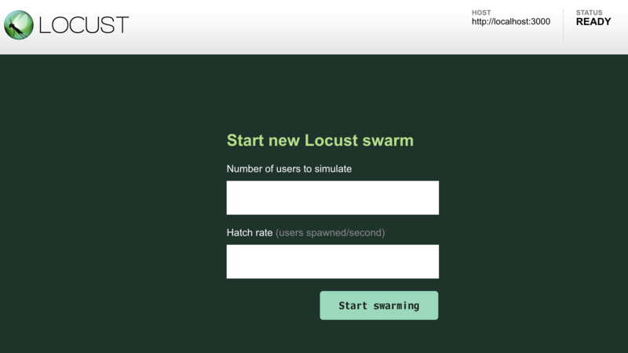

以前、負荷テストに *JMeter* を使ったことがあった。GUI で設定・監視でき、使用感自体はそこまで悪くなかった。

- [Apache JMeter のタイムスタンプを日付形式に直す](/blog/2017/01/23-03.html)

今回、また負荷テストをやることになり、コマンドラインでサクッと設定できるようなモノはないのかなーと思って調べてみたところ、**Locust** というツールを見つけたので紹介する。

## 目次

## インストール

Locust は Python 製のツールなので、`pip` を使ってインストールする。MacOS と CentOS で試してみたのでそれぞれやり方を書いておく。

- 参考 : [Installation — Locust 0.10.0 documentation](https://docs.locust.io/en/stable/installation.html)

### MacOS Mojave の場合

MacOS の場合は、先に Homebrew を使って `python3` と、Locust が使う `libev` という依存ツールをインストールしておく必要がある。

```bash
$ brew install python3 libenv
```

Python3 の PATH 設定とかは説明を省略。以下のコマンドで Locust をインストールする。

```bash
$ python3 -m pip install locustio
```

インストールできたら、以下のように `locust` コマンドが使えるようになっているか確認しよう。

```bash
$ locust --version
[2019-07-03 14:36:58,742] mac-mbp.local/INFO/stdout: Locust 0.11.0
```

### Linux CentOS 7 の場合

CentOS の場合は Yum で Python および pip を用意する。

```bash
$ sudo yum install python-pip
$ sudo pip install pip --upgrade
```

そしたら Locust をインストール。

```bash
$ sudo pip install locustio
```

…すると、`requests` というモジュール関連のエラーが出てしまった。調べたら以下のように `--ignore-installed` オプションで回避できるみたいなのでやり直す。

```bash
$ sudo pip install locustio --ignore-installed requests
```

コレで `$ locust` コマンドが使えるようになった。

## タスクを定義する

Locust が使えるようになったら、実行したいタスクを定義する。「どこにアクセスして何をする」といった処理を「タスク」として定義するのだが、Python で実装する。

ファイル名は `locustfile.py` という名前がデフォルトだ。試しに以下のように実装する。

```python
# -*- coding: utf-8 -*-

# Python2 の場合は以下2行をアンコメントして入れておく
# from __future__ import absolute_import
# from __future__ import unicode_literals

from locust import HttpLocust, TaskSet, task

# クラス名は任意の名前
class UserTaskSet(TaskSet):
  # 数字は実行比率を表す。例えば @task(2) は @task(1) の倍の数だけ実行される
  @task(1)
  def index(self):
    # トップページにアクセスするだけ
    self.client.get("/")

# コレもクラス名は任意
class WebsiteUser(HttpLocust):
  task_set = UserTaskSet
  # タスク実行の最短待ち時間 (ミリ秒)
  min_wait = 100
  # タスク実行の最大待ち時間 (ミリ秒)
  max_wait = 1000
  # それぞれのタスクの実行間隔は min_wait と max_wait の間のランダム値になる
```

こんな感じ。

接続するホスト名はまだ指定していないが、どこかのホストのルート `/` に GET リクエストを投げるだけの簡単なスクリプトだ。

## テスト対象のサーバを用意する

テスト対象のサーバを用意しておこう。後で URL 指定するので、既にどこぞに立ててあるサイトを IP アドレスやドメインで指定しても良いし、`localhost` でも良い。

今回は `http://localhost:3000/` でアクセスできるサーバを立ててあるテイとする。

## Locust を起動する

`locustfile.py` ファイルを用意したら、そのファイルがあるディレクトリで以下のようにコマンドを実行する。

```bash
# 末尾にスラッシュを付けないこと (付けるとスラッシュが2つ付いてしまう)
$ locust -H http://localhost:3000

[2019-07-22 13:34:10,170] NeosMacBook.local/INFO/locust.main: Starting web monitor at *:8089
[2019-07-22 13:34:10,171] NeosMacBook.local/INFO/locust.main: Starting Locust 0.11.0
```

`http://localhost:3000` にリクエストを投げるテストを始めるよー、ということで `-H` (`--host`) オプションを指定している。

コマンドを実行すると、ターミナルは起動したままになる。テストの開始や設定は、Locust が起動した簡易サーバで行う。デフォルトでは

- `http://localhost:8089/`

にブラウザでアクセスすると、Locust の画面が登場する。



テキストボックスが2つ表示されるが、意味は以下のとおり。

- `Number of users to simulate` : 最大でいくつの同時アクセス数にするか (コレを「ユーザ数」と表現)
- `Hatch rate (users spawned/second)` : 1秒間で何ユーザ増やしていくか (上のユーザ数に達するまでの期間となる)

今回は、最大で同時に10アクセスさせるようにし、1秒に1ユーザずつ増やしていこうと思うので、上の欄に `10`・下の欄に `1` と入力し、「Start swarming」ボタンを押すと、テストが始まる。

Locust の Web UI はとても見やすいので、特に迷うこともないと思う。累計リクエスト数、エラーレスポンスの数、レスポンスまでの時間などの情報が表示される。気が済んだら右上の方にある「Stop」ボタンを押せば処理が止まる。

停止後、「New test」ボタンを押下すると再度先程のテキストボックスが表示されるので、今度はさらにリクエスト数を多くしたりして、テストが再開できる。

テストを終えたくなったら、起動しっぱなしのターミナルに戻って `Ctrl + C` を押下すれば良い。

## CUI のみでテストを行う

MacOS でテストする場合は、このようにターミナルとブラウザを行き来すればテストできるが、CUI のみの CentOS などでテストする場合は、GUI ブラウザが開けない。そこで、`locust` コマンドのオプション引数を使ってテストを設定してやる。

```bash
$ locust -H http://localhost:3000 --no-web -c 10 -r 1
```

- `--no-web` : CUI モードにする場合は必須
- `-c` (`--clients`) : 「Number of users to simulate」に同じ
- `-r` (`--hatch-rate`) : 「Hatch rate」に同じ

このように、テキストボックスに入力していた情報を `-c` と `-r` オプションで渡してやると、その場でテストが開始する。中止する場合は `Ctrl + C` で、最後にまとまったレポートがコンソール出力される。

## 大量リクエストで `HTTPConnectionPool` 関連のエラーが出る場合は…

少ないユーザ数でテストしている場合は正常なのに、ユーザ数を多くすると `HTTPConnectionPool` 関連のエラーで Fail となる場合は、Locust を実行する環境の「*ファイルディスクリプタ*」の上限に達していることが原因。

- 例えばこんなエラーが出る時。

```
ConnectionError(MaxRetryError("HTTPConnectionPool(host='localhost', port=3000): Max retries exceeded with url: / (Caused by NewConnectionError('<urllib3.connection.HTTPConnection object at 0x....>: Failed to establish a new connection: [Errno 8] nodename nor servname provided, or not known'))"))

ConnectionError(MaxRetryError("HTTPConnectionPool(host='localhost', port=3000): Max retries exceeded with url: / (Caused by NewConnectionError('<urllib3.connection.HTTPConnection object at 0x....>: Failed to establish a new connection: [Errno 24] Too many open files'))"))

ConnectionError(ProtocolError('Connection aborted.', ConnectionResetError(54, 'Connection reset by peer')))
```

本来はどれだけファイルが開けるか、という上限設定なのだが、ソケット通信でも使われるので、この項目が影響している。

- 参考 : [Linux サーバでの「Too many open files」対策について - akishin999の日記](http://akishin.hatenablog.jp/entry/20130213/1360711554)

MacOS の場合、上限値は以下のように確認できる。

```bash
$ ulimit -a
core file size          (blocks, -c) 0
data seg size           (kbytes, -d) unlimited
file size               (blocks, -f) unlimited
max locked memory       (kbytes, -l) unlimited
max memory size         (kbytes, -m) unlimited
open files                      (-n) 256        # ← ココ
pipe size            (512 bytes, -p) 1
stack size              (kbytes, -s) 8192
cpu time               (seconds, -t) unlimited
max user processes              (-u) 1418
virtual memory          (kbytes, -v) unlimited
```

現在の上限値は `256` なので、以下のように増やしてやろう。

```bash
$ ulimit -S -n 2048
```

再度 `$ ulimit -a` で確認すれば、`open files` の値が上昇していることが分かるだろう。

この効果はそのターミナル (セッション) のみなので、Locust を実行するターミナルタブで設定してやること。

- 参考 : [Installation — Locust 0.11.1 documentation](https://docs.locust.io/en/latest/installation.html#increasing-maximum-number-of-open-files-limit)
- 参考 : [Locust starts throwing failures when users > 130 (OS X) · Issue #496 · locustio/locust · GitHub](https://github.com/locustio/locust/issues/496)

## POST 送信する時は

先程の `locustfile.py` の例は、単純な GET 通信だったが、POST リクエストを投げたい場合はどうするかというと、こうする。

```python
class UserTaskSet(TaskSet):
  @task(1)
  def index(self):
    params = {
      "data": [
        { "userId": "u001", "name": "Jane Doe" },
        { "userId": "u002", "name": "John Smith" }
      ]
    }
    res = self.client.post("/register", json=params)
```

こんな風に POST 送信する JSON を組み立てて、`self.client.get()` ではなく `self.client.post()` で投げれば良い。

## 以上

Locust の使い方を簡単ではあったが紹介した。

BASIC 認証を通り抜けて次の画面である操作をして…というような複雑なタスクも定義できるので、使い方次第でかなり細かな負荷テストができるだろう。
