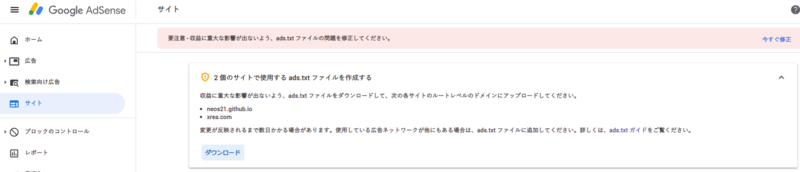

ある日、Google AdSense の管理画面に以下のような警告が出るようになった。

> 要注意 – ads.txt ファイルが含まれていないサイトがあります。収益に重大な影響が出ないよう、この問題を今すぐ修正してください。



ロボット検索エンジンのために `robots.txt` というファイルを置いておく、という話は昔からあったが、最近は何やら `ads.txt` というファイルを置いておくことで、適切な広告が表示されているかチェックする仕組みができたらしい。

で、この `ads.txt` ファイルを作って置いておかないと、あなたのサイトが不確かな広告を出してるサイトとしてブロックされちゃうかもよ、という渓谷が出るようになったのである。

仕様を詳しく知らなかったので、勉強しながら置いてみる。

## 目次

## とりあえず対処するなら簡単

とりあえず対処するだけであれば簡単だ。Google AdSense の警告文にあるリンクを辿ると、自分用の `ads.txt` がダウンロードできる。中身は以下のような内容で1行のテキストファイルになっているであろう。

```
google.com, pub-0000000000000000, DIRECT, f08c47fec0942fa0
```

`pub-0000000000000000` 部分は、自分の Google AdSense のアカウント ID になっている。他の部分は誰でも同じ内容だ。このテキストファイルは BOM なし UTF-8 エンコーディングで保存しておくこと。

この `ads.txt` を、サイトのルードディレクトリ直下にアップロードする。例えば `example.com` というサイトを運営しているのであれば、

- `http://example.com/ads.txt`

という URL でアクセスできるような位置でアップロードするだけだ。

やるべきことはコレだけ。あとは Google がこのファイルをクロールしてくれるのを待つだけだ。

- 参考：[ads.txt に関するガイド - AdSense ヘルプ](https://support.google.com/adsense/answer/7532444?hl=ja)
- 参考：[Googleアドセンスでads.txtの警告が出たので対応した手順 | 俺の開発研究所](https://itlogs.net/google-adsense-ads-txt/)

## サブドメイン式のサイトはルートドメイン直下と一緒に指定が必要

自分のアカウントの場合、以下の2サイトに対する警告が出ていた。

- [Neo's World](http://neo.s21.xrea.com/) : `http://neo.s21.xrea.com/`
- [Neo's GitHub Pages](https://neos21.github.io/) : `https://neos21.github.io/`

いずれも `xrea.com`・`github.io` というルートドメインの、サブドメイン形式の URL である。

サブドメインのサイトの場合は、管理画面からダウンロードする `ads.txt` をサブドメインのルートディレクトリ直下に置くだけでは足りず、ルートドメインで以下の作業が必要だ。

- ルートドメイン直下の `ads.txt` で、サブドメインの URL を指定する
  - 今回の自分の場合だと、以下のような感じ
  - コレを `http://xrea.com/ads.txt` なり `https://github.io/ads.txt` なり、といった位置にアップする

```
subdomain=neo.s21.xrea.com
```

- サブドメインの直下の `ads.txt` で広告情報を指定する
  - 管理画面からダウンロードできるヤツ、先程示した以下のような内容
  - コレを `http://neo.s21.xrea.com/ads.txt` や `https://neos21.github.io/ads.txt` といった位置にアップする

```
google.com, pub-0000000000000000, DIRECT, f08c47fec0942fa0
```

…さて、ココまで話していてお分かりかと思うが、`xrea.com` や `github.io` などの__ルートドメイン直下に、ユーザがファイルをアップロードすることはできない。__コレはこのようなレンタルサーバの宿命で、XREA や GitHub Pages に限った話ではないので、__どうしようもない。__

「どうしようもない、って…でも警告出てるし、どうしたらいいの？」と思うかもしれない。でも、__何もできないので警告は無視して放置するしかない__のだ。

- 参考：[グーグルアドセンスからads.txt警告が届く！その対処法は？ - ウェイクで行く車中泊の旅](https://www.pisukechin.com/entry/2019/06/03/230711)

以前は Google AdSense のヘルプに以下のような質問と回答があったようだが、本稿執筆時点では出典を探せなかった。

> ルートドメインにファイルを追加できません。どうすればよいですか？
> 
> __ads.txt を使用する必要はありません。__ただし、ルートドメインにすでに ads.txt ファイルが存在する場合は、ウェブマスターに連絡して、自分のサイト運営者 ID をファイルに追記してもらいましょう。

広告配信がちゃんとされていないようなトラブルが発生していたら、ルートドメインの管理者に連絡してみる感じでいいのかも。

ちなみに Google AdSense の管理画面を見ると、XREA の方はルートドメインが `xrea.com` と判定されていて、`neo.s21.xrea.com` はサブドメインと認識されていたが、`neos21.github.io` の方はこのサブドメイン自体をルートドメインと認識してくれている様子だった。GitHub Pages の方は `github.io` 直下で上手く何か処理してくれているのかもしれない？

- 参考：[Googleアドセンスのads.txtエラーに対処したけど消えない時の解決策 | FREE SWORDER](https://freesworder.net/adsense-ads-txt/)
- 参考：[話題の「ads.txt」っていったい何？ 広告主なら必ず知っておきたい広告不正の手口と基礎知識 | Web担当者Forum](https://webtan.impress.co.jp/e/2018/02/08/28001)

## というワケで

…というワケで、レンタルサービスでサブドメイン形式の URL を持っている場合は、基本的に対処法がないのが残念だが、今回はとりあえず気休めで、

- `http://neo.s21.xrea.com/ads.txt`
- `https://neos21.github.io/ads.txt`

この位置にテキストファイルを置いておき、以降の警告は無視することにした。

何だかこう、キチッとしないといけないことが増えてきて、Web が生きづらくなった感がするのう…。
