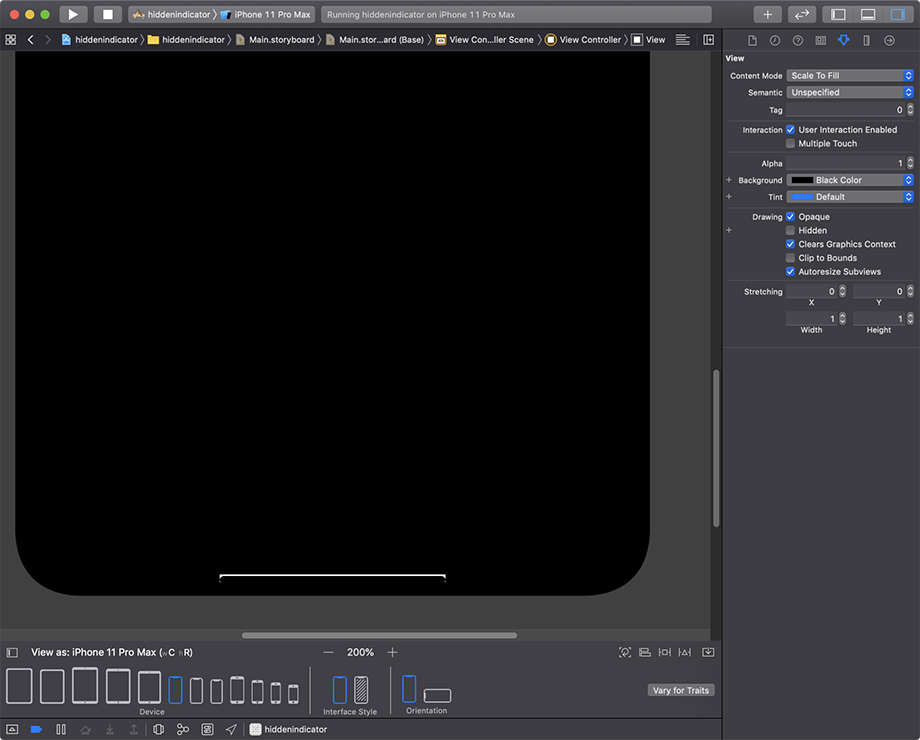
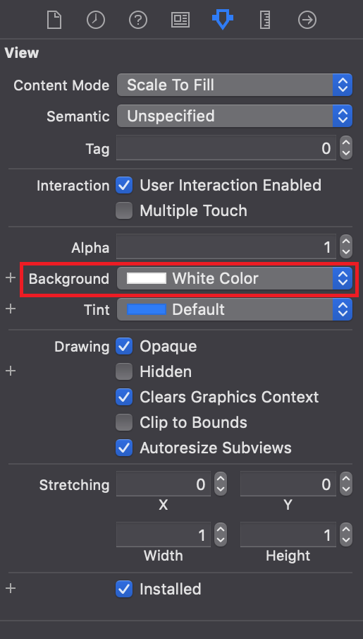
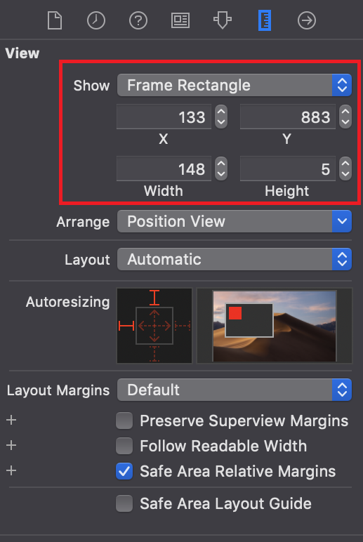
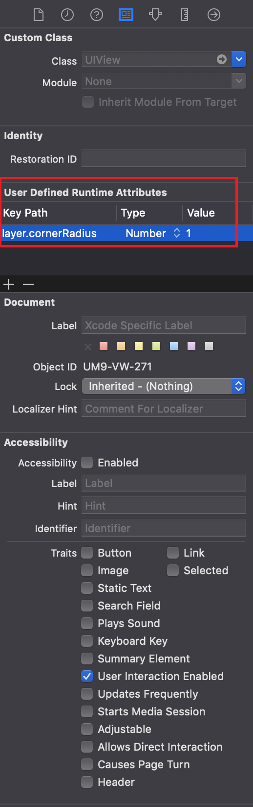
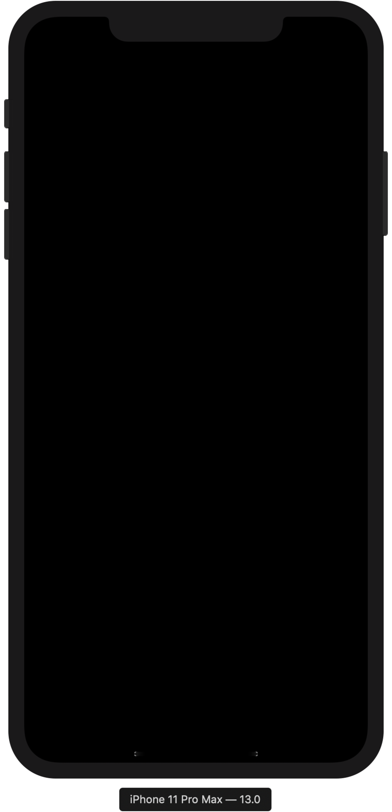
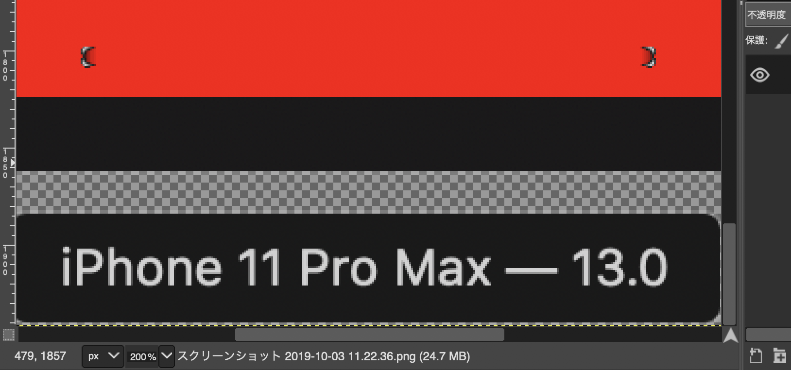
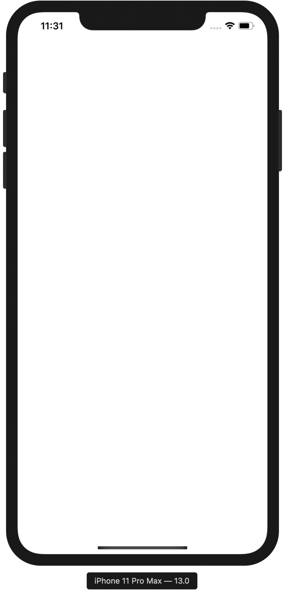

iPhoneX 以降はホームボタンがなくなり、代わりに画面下部に*ホームバー Home Indicator* と呼ばれるバーが表示されるようになった。

コレを普段非表示にするには、`ViewController.swift` に以下のようなコードを入れれば良い。

```swift
override func prefersHomeIndicatorAutoHidden() -> Bool {
  return true
}
```

しかしこのコードでは、*画面にタップしていない間だけしか非表示にならない*。画面にタップするとホームバーが表示されてしまうのだ。

そこで、少々強引な技を使って、**ホームバーを常に非表示にしてみる。**

*Storyboard の全体を黒背景*にしたら、**UIView** を配置し、以下のように配置する。

- 背景色 : White
- X 座標 : 133
- Y 座標 : 833
- Width : 148
- Height : 5
- User Defined Runtime Attributes
  - Key Path : `layer.cornerRadius`
  - Type : `Number`
  - Value : `1`

このように配置すると、Storyboard のプレビュー欄にあるホームバーに重なり、少し上にズレたような位置に、白いバーが配置されることになる。



改めて、UIView に設定した背景色はこのスクショのとおり。`White` を選ぶ。



座標・サイズはこのように。



- X : 133
- Y : 833
- Width : 148
- Height : 5

`layer.cornerRadius` という設定は、UIView を角丸にするためのモノ。適当に `1` とか少し丸めておく。

- 参考：[【Xcode】StoryboardでViewを角丸にする - Qiita](https://qiita.com/turmeric/items/046acb987c4353b3f308)



なお、上述の `prefersHomeIndicatorAutoHidden()` 関数は設定しないこと。

以上のように設定し、iPhone 11 Pro Max の Simulator を起動してみると、こんな感じに見える。



ホームバーは表示されているのだが、**白い UIView の上にホームバーが配置されることで、ホームバーが反対色である黒色に変わり**、*黒背景と馴染んで一面真っ暗に見える*というワケだ。

この Simulator のスクリーンショットを撮り、GIMP で赤色に「塗りつぶし」してみる。よーくみると、角丸の度合いがピッタリ合っておらず、ホームバーの左右端から、下に置いた白い UIView がほんの少し見えている。この辺はもう少し調整が必要だろう。



ちなみに、白背景の Storyboard 上に、黒い UIView をバー状に配置したら、黒いホームバーは白くなるのか？というと、ホームバーは*グレーになるだけ*で、ハッキリ見えてしまうので要注意。



ということで、「ホームバーがその下にある要素の色によって反対色を選ぼうとする」習性を利用し、背景色と同色のホームバーを作り出した。コレで、あたかもホームバーが表示されていないかのように見える、というワケだ。

この状態で App Store の審査が通るとは思えないので、開発者向けということで…。

- 参考：[iPhoneX の下のバー(Home Indicator)を常に消す方法 ※実用性はありません！！ - Qiita](https://qiita.com/homyu/items/4e03a9787b8032dc7d46)
