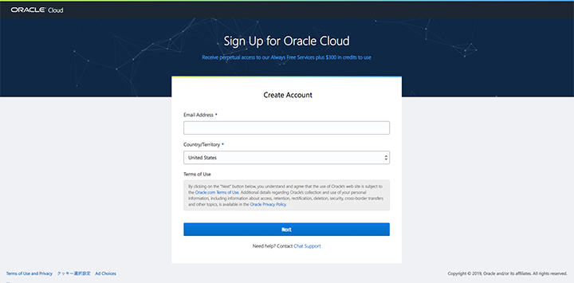

仕事で Oracle Cloud を使っていたが、最近 Always Free、いわゆる_永久無料枠_が発表され、VM や Autonomous DB を2台ずつ立てられるようになった。無料枠の GCE や Heroku Postgres を併用したりせずとも、Oracle Cloud だけで Web AP サーバと DB サーバを無料でまかなえるかもしれない、と思い、個人でアカウントを登録してみることにした。

アカウント登録の手順は以下の記事どおり。

- 参考：[【OCI】oracle cloud -アカウントの登録編- - Qiita](https://qiita.com/manaki079/items/d8684f8e15ccf09bdc4e)

次の URL から「Start for free」ボタンを押下し、登録を始める。

- [Oracle Cloud Free Tier | Oracle 日本](https://www.oracle.com/jp/cloud/free/)




後述するが、無料枠を使う上で重要になる_ホームリージョン_の指定がある画面。


携帯電話番号での認証もある。


パスワード設定。


クレジットカード情報も記載するが、無料枠に含まれる約3万円分を使い果たした後も、いきなり課金されることはないので安心。


アカウントを作成中。このあとメールが届くので、そのメールからアカウントにログインする。


メールはこんな感じ。


ログイン情報を入れる。


こんな画面に辿り着けたら OK。


どうも、「Gen2 Cloud」と呼ばれる第2世代のオラクル・クラウド基盤に移行中みたいで、「以前使っていた Cloud My Services はどこ？」とか、「このリージョンでは PaaS が Gen1 基盤を使ってしまって違う画面に飛ばされる」とか、色々と整備が追いついてない感じ…。

## エラーが出た時は : 無料枠が作れないかも

Compute Instance を作成しようとしたら、**「Out of host capacity.」**というエラーが出た。


どうやら無料枠を公開したことで利用者が殺到しているらしく、無料枠のリソースを作成できないようだ。気長に待つしかない。どうも月初は少し登録しやすいみたい。

なお、登録時に選択したリージョン = ホームリージョン以外では、Always Free なリソースを作れない。North America の Ashburn リージョンなんかだと、Tokyo リージョンよりは無料枠のリソースが作りやすいかもしれない。とりあえず無料枠が使えれば良くて、海をまたいだデータセンターでも良ければ、登録時に北米リージョンなどを選択しても良いかも。

## インスタンスを作ってみた

今回はテナンシ (ルートコンパートメント) 直下にリソースを作っていく。細かく説明するのが**面倒臭い**ので、雑に紹介。

1. VCN (Virtual Cloud Network) を作る
    - CIDR Block はデフォルトの `10.0.0.0/16` でも良いが、他の Oracle Cloud サービスと Local Peering する時は CIDR Block が重複していてはいけないので、`20.0.0.0/16` とか適当に違う CIDR にしておく。
    - デフォルトの Route Table を確認。Internet Gateway がアタッチしてあれば、その VCN 内からインターネットへ、通信が出られるようになる。
    - デフォルトの Security List を確認。通信を許可するポートや IP レンジを指定する。デフォルトで SSH するための22番ポートが許可されている。
2. Subnet を作る
    - VCN の CIDR Block 内で、`20.0.1.0/24` など適当に。
    - この Subnet の中に、Compute Instance (VM) を配置していく。
3. Compute Instance を作る
    - `VM.Standard.E2.1.Micro` というシェイプが、無料で作れるインスタンス。
    - Public IP は後で付与するので、一旦はナシで良い。
    - SSH 接続するための公開鍵を設定しておかないと、SSH 接続する術がなくなるので注意。  
     `$ ssh-keygen -t rsa -b 4096 -N '' -C 'my-instance' -f ~/.ssh/my-instance` みたいなコマンドで鍵ペアを作り、`my-instance.pub` ファイルをアップしておこう。
4. Reserved Public IP を作る
    - 予約済 Public IP。Networking → Public IPs と進み「Create Reserved Public IP」で Public IP を発行する。
5. Compute Instance の VNIC に Reserved Public IP を指定する
    - Compute → Instances → Attached VNICs → Primary VNIC を選択 → IP Addresses → Primary IP の「Edit」を選択する。
    - Public IP Address 欄で「Reserved Public IP」を選択し、先程作った Reserved Public IP を選択する。
    - コレで、Compute Instance に、不変な Public IP を割り当てられた。

あとは、Public IP を指定して、以下のように SSH 接続してみよう。

```bash
# Public IP アドレスを指定する
$ ssh -i ~/.ssh/my-instance opc@140.0.0.0
```

`opc` というユーザが、Compute Instance 作成時に作られる初期ユーザ。このユーザの `authorized_keys` に、`my-instance.pub` (公開鍵) が設定されている、という関係だ。

あとはお好きなようにインスタンスをいじくり回してみよう。Web サーバとして公開したいのであれば、_Security List_ で80番ポートや443番ポートへのアクセス (Ingress) を許可してやる必要がある。

## 以上

今回は作成しなかったが、Oracle Autonomous DB も永久無料枠で2つまで作れるので、色々遊べそうだ。
