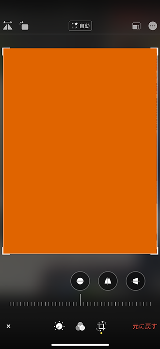
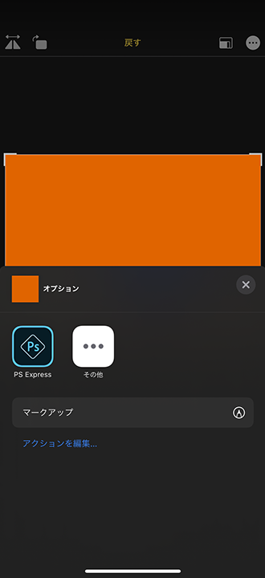
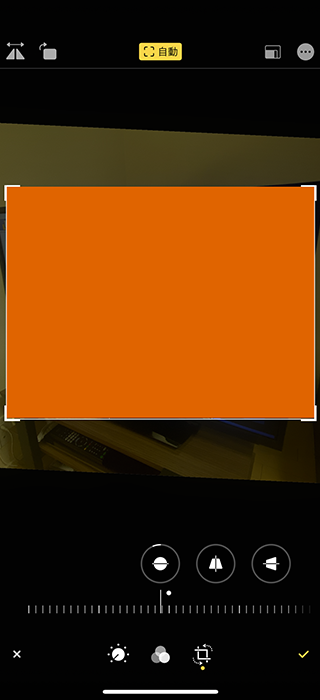
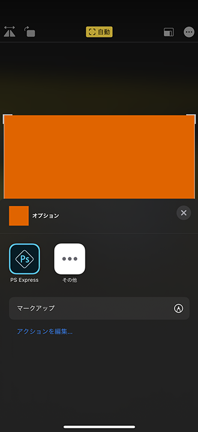

超広角レンズが搭載された iPhone 11 以降で、「設定」アプリ → 「カメラ」と移動し、「構図 (COMPOSITION)」欄を見ると、

- 写真のフレームの外側を含めて撮影
  - Photos Capture Outside the Frame
- ビデオのフレームの外側を含めて撮影
  - Videos Capture Outside the Frame

という設定がある。これらをオンにすると、

- *調整を自動適用*
  - Auto Apply Adjustments

という項目が登場する。コレについて、設定画面のすぐ下には以下のような説明がある。

> 写真またはビデオのフレームの外側の領域を撮影することで構図を改善することができます。フレームの外側の領域が補正に使用されなかった場合は30日後に削除されます。
> 
> Capture the area outside the frame of the photo or video to improve composition. If the area around the frame is not used to make corrections, it will be deleted after 30 days.

以下の記事でも「調整を自動適用」については少し触れたのだが、効果が現れるタイミングがよく分からないうえに、最近また違う表記を見つけたので、まとめてみる。

## 目次

## カメラロールで写真の右上に青色の「自動」バッジが表示されるパターン

恐らく、この「調整を自動適用」が有効になった写真は、このパターンのことなのかなと思っている。

カメラロールで撮影した写真を見ていると、写真の右上に青色の「自動」バッジが表示されることがある。コレを押下すると、超広角レンズで撮影したデータを合成して、うまく構図を調整してくれる。

↑右上の青色の「自動」バッジ。コレが自動調整適用済の状態。

↑タップすると自動調整が外れて元に戻る。

この写真について、「編集」メニューを押下し、トリミングモードに移ると、次のような挙動になると思う。

- **上部・中央に「自動」のアイコン**が出て、コレをタップすると黄色の「自動」アイコンに変化。青色の「自動」バッジのタップと同じように構図調整される
  - 
  - 
- 右上の「3点リーダ `…`」アイコンをタップして表示されるメニューに *「フレームの外側の撮影内容を使用」の項目がない*
  - 

一見、フレームの外側の撮影内容を使えないように見えるが、実際は超広角レンズのデータがあり、それを併用して構図の自動調整はされる、とな。

## カメラロールで写真の右上には星マークしかなく、編集時に自動調整ができないパターン

次からがよく分からないパターンたち。

カメラロールで写真を見ていると、右上に、点線で描かれた四角と、星 `★` のマークの白いアイコンが表示されるモノがある。このアイコンは前述の「青色の自動バッジ」にも併記されているモノで、*フレームの外側を超広角レンズで撮影したデータが存在することを表している。*

↑コレの右上。四角と星のマークが付いている。

「編集」メニューを押下し、トリミングモードに移ると、次のような挙動になる。

- 上部・中央に「自動」のアイコンが表示されていない (フレーム外の画像を使うよう調整すると「戻す」というボタンが出る)
  - 
  - 
- 右上の「3点リーダ `…`」アイコンをタップして表示されるメニューに *「フレームの外側の撮影内容を使用」の項目がない*
  - 

## カメラロールで写真の右上には星マークしかないが、編集時に自動調整ができるパターン

上と似ているが、編集画面で「自動」調整ができるパターン。

↑カメラロールでの見え方は同じ。

- 上部・中央に「自動」のアイコンが表示されている
  - 
  - 
- 右上の「3点リーダ `…`」アイコンをタップして表示されるメニューに *「フレームの外側の撮影内容を使用」の項目がない*
  - 

## カメラロールで写真の右上には星マークしかないが、「フレームの外側の撮影内容を使用」ができるパターン

コレだけが「**フレームの外側の撮影内容を使用**」という項目が選べるパターン。

↑カメラロールでの見え方は上2つと同じ。青色の「自動」バッジは出ていない。

「編集」メニューを押下し、トリミングモードに移ると、次のような挙動になる。

- 上部・中央に「自動」のアイコンが表示されている。タップすると黄色の「自動」アイコンに変化し、構図補正が行われる
- 右上の「3点リーダ `…`」アイコンをタップして表示されるメニューに「フレームの外側の撮影内容を使用」の項目が**ある**。タップした後は「オリジナルの撮影内容を使用」という表示に変わる
  - 
  - 

コチラも「編集」メニューには「自動」の項目があるのだが、カメラロール上では青色の「自動」バッジが表示されないのだ。

さらに、青色の「自動」バッジが表示されるパターンの写真には表示されなかった、「フレームの外側の撮影内容を使用」という項目が登場する。

---

これらの明確な違いがよく分からない、というお話だ。

フレームの外側を撮影するかどうかは、撮影環境の明るさが影響していそうだが、「必ず超広角レンズでも撮影しておく」ということはできない。それは分かった。

しかし、*「編集」メニューに「自動」アイコンが表示されていて、自動で構図編集ができるというのに、青色の「自動」アイコンが表示されたりされなかったりするパターンがあるのは何なのか*。コレがよく分からない。

何が違いの条件になるのか、分かった人がいたら教えてください。

- 参考 : [How to use the over-capture feature in the new iPhone camera to crop and adjust images later | Macworld](https://www.macworld.com/article/3444637/how-to-use-the-over-capture-feature-in-the-new-iphone-camera-to-crop-and-adjust-images-later.html)
