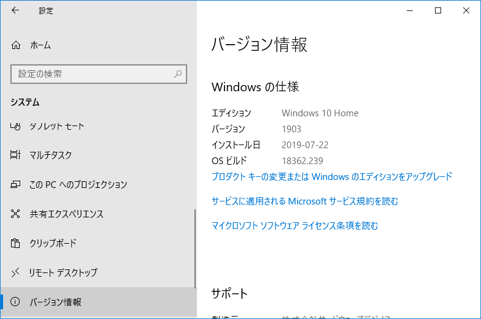
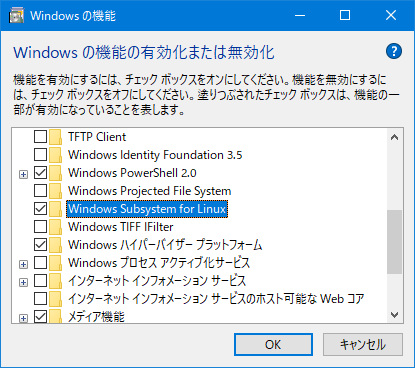
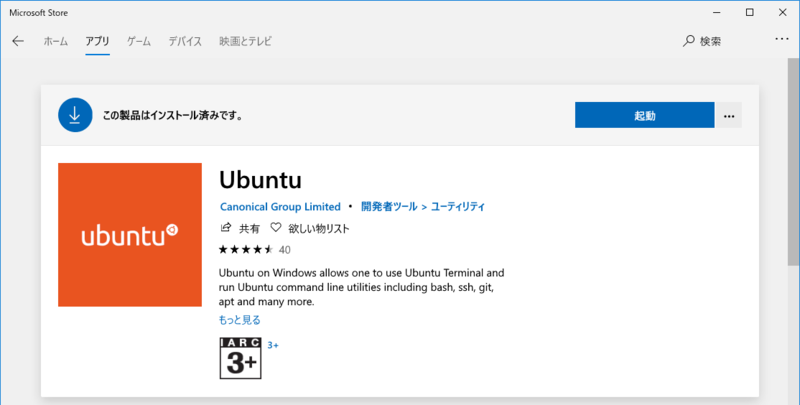
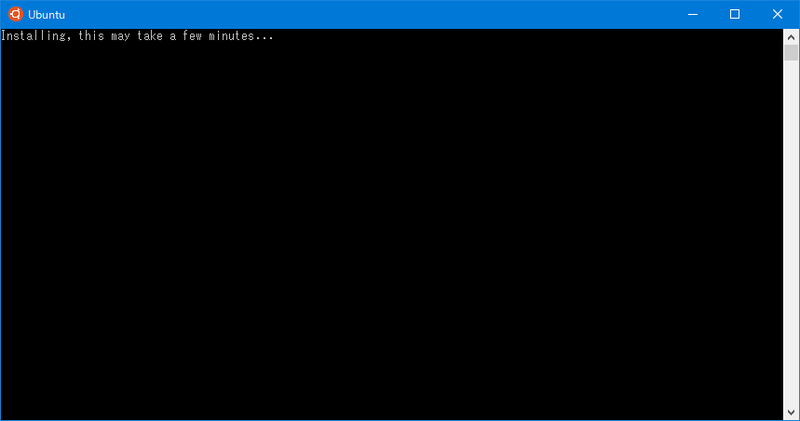
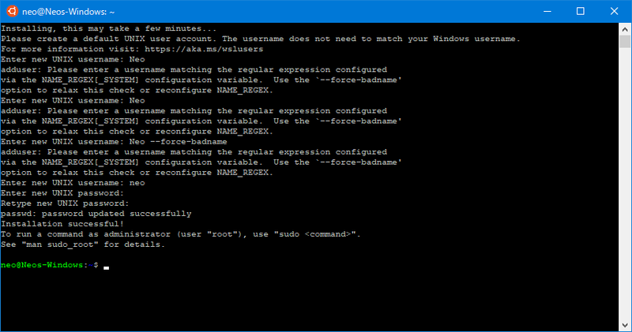
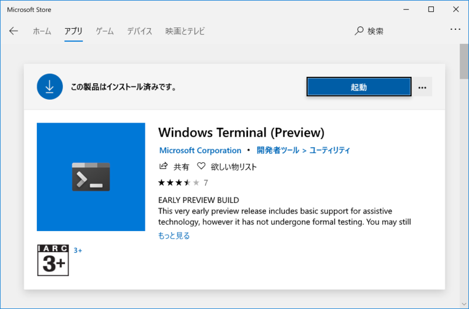
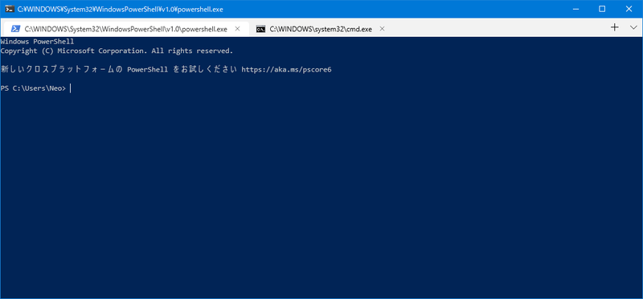
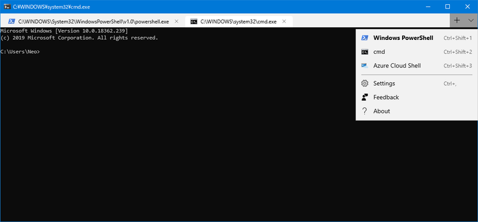

2017年4月、当時は*「Bash on Ubuntu on Windows」*という名前だったが、Windows 上で Linux を動かす方法を検証した。

- [Bash on Ubuntu on Windows を導入するまでの道のり](/blog/2017/04/13-02.html)

あれから2年、まずサービス名称が変わり、今では**「Windows Subsystem For Linux (WSL)」**と呼ばれている。当時は Insider Program に参加してプレビュー版をインストールしないと使えなかったが、現在は Microsoft Store から簡単に導入できるようになっている。

で、現在一般的に導入できるのは *WSL 1* というバージョンで、本稿執筆時点では Windows 10 Pro の Insider Preview Build 18917 以降で **WSL 2** が使える状態だ。

WSL2 にも興味はあるのだが、まだプレビュー版なので、今回は Insider Program などが必要なく導入できる、WSL1 の導入方法を改めて紹介する。

## 目次

## WSL の導入方法

1. Windows のバージョン確認。PC 設定 → システム → バージョン情報 → 「Windows の仕様」欄 → バージョン を確認。自分は Windows 10 Home の *1903* というバージョンで以降の作業を行った
    - 
2. コントロールパネル → プログラムと機能 → Windows の機能の有効化または無効化 → **「Windows Subsystem for Linux」**と「Windows ハイパーバイザープラットフォーム」にチェックを入れて再起動する。最初からチェック状態だった人は WSL が使える状態が既に出来ている
    - 
3. Microsoft Store にて「Ubuntu」と検索。以下のように Ubuntu をインストールする
    - 
4. インストールが完了すると、スタートメニュー → アプリ → Ubuntu というメニューが追加されているので、コレを押下して起動する。初回は以下のように `Installing, this may take a few minutes...` と表示されるので待つ
    - 
5. 少し待つと、ユーザ名とパスワードを設定することになる。ユーザ名は大文字を入れられず小文字のみなので注意。入力が終わると初期設定が完了し、プロンプトが表示される
    - 

以上。以降はインストールした「Ubuntu」ショートカットから WSL を起動すれば良い。

## Ubuntu 環境のアップデート・日本語化

WSL が起動できたら、最初に以下のコマンドを叩いて Ubuntu 環境を最新版にアップデートしておこう。

```bash
# パッケージリストの更新
$ sudo apt update
# パッケージのアップデート
$ sudo apt upgrade -y
# 上のコマンドで保留されたパッケージのアップデート
$ sudo apt dist-upgrade -y
# 不要になったパッケージの削除
$ sudo apt autoremove -y
```

また、日本語化は以下の要領で可能。

```bash
$ sudo apt install -y language-pack-ja
$ sudo update-locale LANG=ja_JP.UTF8
```

## WSL のバージョン確認方法

本稿執筆時点で一般的にインストールできるのは WSL1 系となる。

WSL2 系では、管理者権限で PowerShell を開き、以下のコマンドを実行することで、WSL のバージョン確認ができるようだ。

```powershell
> wsl -l -v

# もしくは
> wsl --list --verbose
```

また、WSL2 をインストールしたあとは、WSL1 環境の Linux を WSL2 にアップデートする時、`--set-version` というオプションも使えたりする。

`-v`・`--verbose` や `--set-version` というオプションは、WSL1 系では用意されていないので、実行してみると `コマンド ライン オプションが無効です:` というエラーが出て、コマンドのヘルプが表示されると思う。このような表示になったら、まだ WSL2 がインストールできていなくて、WSL1 が使われているということ。

## ついでに：Windows Terminal のプレビュー版がインストールできた

そういえば、Microsoft Store アプリを見ていて気付いたのだが、Windows Terminal というターミナルアプリのプレビュー版が一般でもインストールできるようになっていた。Windows 10 は最新版にアップデートする必要があるようだ。



起動してみるとこんな感じ。フォントにアンチエイリアスがちょっとかかってて見やすいかも。



Windows コマンドプロンプトも開けるし、Azure にも接続できるみたい。



## 参考

- [Windowsで環境を極力汚さずにPythonを動かす方法 (WSL利用 Windows10, version 1607以降限定) - Qiita](https://qiita.com/rhene/items/ff11c7850a9a7617c50f)
- [Install WSL 2 | Microsoft Docs](https://docs.microsoft.com/en-us/windows/wsl/wsl2-install)
- [Install Windows Subsystem for Linux (WSL) on Windows 10 | Microsoft Docs](https://docs.microsoft.com/en-us/windows/wsl/install-win10)
- [Windows 10 20H1で導入された「WSL 2」を使用する方法 | ソフトアンテナブログ](https://www.softantenna.com/wp/tips/windows-10-20h1-wsl-2/)
- [WSL2を使ってみる (InsiderPreview) - Qiita](https://qiita.com/namoshika/items/53a9ac2df7eace656870)
- [Windowsユーザーに贈るLinux超入門(28) Visual Studio CodeとWSLでPython開発に挑戦してみよう | マイナビニュース](https://news.mynavi.jp/article/liunx_win-28/)
