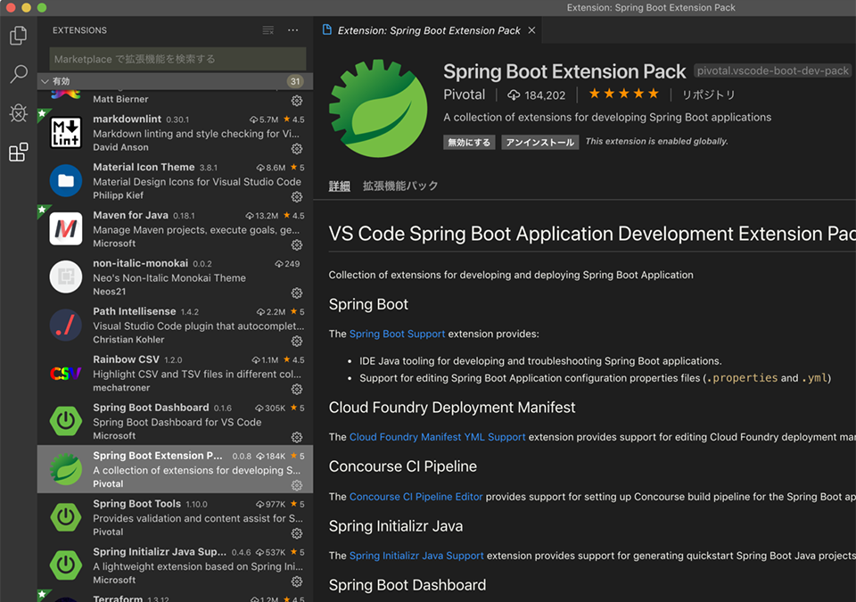
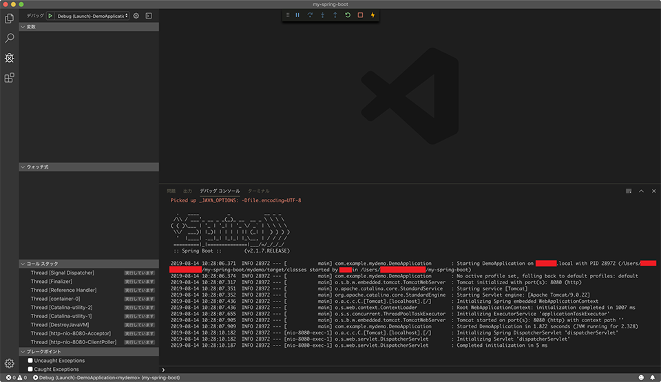

僕の Java 経験というと、長らく Struts1 を業務で使わされてきていて、Struts2 や Spring などはコードをチラ見してデバッグしたりすることはあったものの、イチから作ってみたことがなかった。

そこで今回、Spring ベースのアプリケーションを簡単に構築できる **Spring Boot** を触ってみようと思い立った。さらに今回は、Java 開発でお馴染みの Eclipse ではなく、Node.js 開発で使い慣れた _VSCode_ を IDE として使ってみようと思い、そのための設定も調べてみた。

## 目次

## ソースコードと参考文献

今回行う手順は、以下の記事を参考にしたモノである。

- [VSCodeでSpringBootのプロジェクト作成からアプリケーションの実行まで - Qiita](https://qiita.com/syamshig/items/ff829561238440437b99)

また、作成したソースコードは以下の GitHub リポジトリで公開しているので、コミット履歴ともども追ってみてほしい。

- [Neos21/practice-spring-boot](https://github.com/Neos21/practice-spring-boot)

## 前提環境確認

まずは前提環境を確認する。今回は MacOS Mojave にて、JDK と VSCode をテキトーにインストールしてある状態を前提とする。

```bash
# MacOS 専用のこんなコマンドがあるのね…
$ sw_vers
ProductName:    Mac OS X
ProductVersion: 10.14.5
BuildVersion:   18F132

$ java -version
Picked up _JAVA_OPTIONS: -Dfile.encoding=UTF-8
java version "1.8.0_202"
Java(TM) SE Runtime Environment (build 1.8.0_202-b08)
Java HotSpot(TM) 64-Bit Server VM (build 25.202-b08, mixed mode)

$ code -version
1.37.0
036a6b1d3ac84e5ca96a17a44e63a87971f8fcc8
x64
```

- 参考：[【Mac】macOSのバージョンをターミナル(terminal)で確認する - tweeeetyのぶろぐ的めも](https://tweeeety.hateblo.jp/entry/2016/11/28/135031)
  - > (`sw_vers`) software version の略とかでしょうか。

この JDK1.8 はどうやって入れたんだっけなぁ、忘れた。多分 Oracle のサイトからテキトーにダウンロードしてインストールしただけだと思う。JDK に関する環境変数は `~/.bash_profile` にてこんな感じで指定してある。

```bash
export JAVA_HOME="/Library/Java/JavaVirtualMachines/jdk1.8.0_202.jdk/Contents/Home"
export _JAVA_OPTIONS='-Dfile.encoding=UTF-8'
export PATH="${JAVA_HOME}/bin:${PATH}"
```

## VSCode 拡張機能を準備する

まずは VSCode で Java 開発、および Spring Boot 開発を行うために、拡張機能パックをインストールする。バージョンは本稿執筆時点のモノなので、特に気にせず最新版をインストールすれば良いかと。

- Java Extension Pack (v0.7.1)
  - 
- Spring Boot Extension Pack (v0.0.8)
  - 

## プロジェクトを作成する

それではプロジェクトを作成していく。`Cmd + Shift + P` でコマンドパレットを開き、`Spring` と入力すると、

- `Spring Initializr: Generate a Maven Project`

という項目が見えるはずなので、コレを選択する。


`Specify project language.` で `Java` を選択する。


`Input Group Id for your project.` でパッケージ名 (Group ID) を入力する。ドメインの逆順で入力するいつものアレ。


`Input Artifact Id for your project.` でプロジェクト名 (Artifact ID) を入力する。`demo` という単語だけだとダメっぽい？ので、`mydemo` とか適当な名前にした。ハイフンケースも使えるが、Maven プロジェクトで問題が起こることもあるっぽい。この辺ベストプラクティスがよく分からん。

- 参考：[vscode-java-debug/Troubleshooting.md at master · microsoft/vscode-java-debug · GitHub](https://github.com/Microsoft/vscode-java-debug/blob/master/Troubleshooting.md#reason)
  - > The project 'demo' is not a valid java project.
  - ココが気になったので `demo` というプロジェクト名を避けた。


`Specify Spring Boot version.` で Spring Boot のバージョンを選択する。今回は `2.1.7` を選んだ。


`Search for dependenies.` で、依存関係を選択する。今回は2つほど選択する。


1つ目は _`Spring Web Starter`_。一般的なウェブアプリを作るための一式。


選択すると、`Selected 1 dependency` と表示され、`Spring Web Starter` にチェックが付く。


2つ目は _`Thymeleaf`_。テンプレート HTML を作るためのモノ。


選択すると `Thymeleaf` にもチェックが付くので、このまま Enter を押下する。


保存先ディレクトリを選択する。


コレでボイラープレートコードが出力された。


出力されたファイル群はこのとおり。`target/` ディレクトリはコンパイルされた `.class` ファイルが吐かれる場所なので気にしなくて OK。


エントリポイントは

- `./src/main/java/【パッケージ名】/【プロジェクト名】/DemoApplication.java`

というファイル。このファイルだけだと、サーバが起動するだけで、何のページも表示されない。


## サンプルページを作ってみる

前述の記事に沿って、サンプルページを作ってみる。

- `./src/main/java/【パッケージ名】/【プロジェクト名】/`

の下に `controller/` ディレクトリを作り、その下に `SampleController.java` ファイルを作る。

- `./src/main/java/【パッケージ名】/【プロジェクト名】/controller/SampleController.java`

```java
package 【パッケージ名】.【プロジェクト名】.controller;

import org.springframework.stereotype.Controller;
import org.springframework.web.bind.annotation.RequestMapping;

@Controller
public class SampleController {
  // URL を指定する
  @RequestMapping("/sample")
  public String sample() {
    // テンプレート名を指定する
    return "sample";
  }
}
```


続いて、

- `./src/main/resources/templates/`

配下に `sample.html` ファイルを作る。

- `./src/main/resources/templates/sample.html`

```html
<!DOCTYPE html>
<html lang="ja">
  <head>
    <meta charset="UTF-8">
    <title>Sample</title>
  </head>
  <body>
    <h1>Hello World</h1>
    <p>こんにちは世界</p>
  </body>
</html>
```


## デバッグ開始

ファイルを作ったので、デバッグを開始して動きを見てみる。

VSCode の左端から、虫アイコン「デバッグ」を選択する。「デバッグ」欄は最初、「構成がありません」と表示されていると思うが、構わず再生アイコン「デバッグの開始」を選択する。すると「環境の選択」というダイアログが表示されるので、_「Java」_を選択する。


コレで `./.vscode/launch.json` ファイルが自動生成される。


再度「デバッグ」ペインに戻り、

- `Debug (Launch)-DemoApplication`

を選択して「デバッグの開始」とする。


### `Build failed, do you want to continue?` のエラーが出る場合は…

ココで自分は、**`Build failed, do you want to continue?`** というエラーが出てしまい、上手くサーバを起動できなかった。


調べてみると、以下に答えがあった。

- 参考：[VS CodeでSpring Boot を起動しようとしたら「Build failed, do you want to continue?」と表示されて起動しない - だだだだだだいありー](http://k6i.hateblo.jp/entry/2018/08/02/225848)

> - F1 キー押す
> - Java: Open Java Language Server log file を選択
> - 6行目に
> 
> `Command-line arguments: -data C:\Users\xxxx\AppData\Roaming\Code\User\workspaceStorage\56838f4e76654cb1f380037ac07c0b54\redhat.java\jdt_ws`
> 
> ってあるので、56838f4e76654cb1f380037ac07c0b54 のフォルダを削除するかリネームする。（VS Code 一旦終了してする）
> 
> Java Language Server が workspace を持ってるみたい。

このとおりやってみる。

まずは `F1` キーを押下し、コマンドパレットから

- `Java: Open Java language server log file`

を選択する。


すると `.log` というファイルが開かれるので、その6行目にあるはずの `Command-line arguments:` 行に書かれたディレクトリパスを控えておく。


MacOS の場合は

- `/Users/【ユーザ名】/Library/Application Support/Code/User/workspaceStorage/`

配下に、ランダムな英数字のディレクトリができているようだ。

そこでこのディレクトリを削除する。以下のスクリーンショットでは VSCode 内のターミナルから消しているが、**実際は VSCode を完全に閉じてから削除するべき。**


_ディレクトリを削除したら VSCode を再起動_し、再度「デバッグの開始」を押下する。

1回やっただけだと上手く行かなかったりするが、2回繰り返したりすると解消したりした。

## デバッグ開始後…

つまづいたところもあったが、ようやくデバッグサーバが起動できた。



「デバッグコンソール」が上のように出力されたら問題ないはずだ。ブラウザで `http://localhost:8080/sample` にアクセスして、自分で実装した `SampleController.java` を通って `sample.html` が表示されていることを確認する。


デバッグサーバを停止する場合は、VSCode の上部中央に表示されているコントローラ群から、赤い四角 **`□`** のアイコンを押下すれば止められる。

## 以上

VSCode で Java 開発するための拡張機能の導入は簡単だし、Eclipse のようなモッサリ感がなくて嬉しい。独特なビルドエラーにつまづいたものの、案外サクサクと環境構築できた。

まだ Spring Boot の学習基盤を作った程度ではあるが、実装がシンプルで、「とりあえず思ったモノを実現する」にはもってこいだと感じた。もう少し凝ったアプリも作れるように学習していこう。
