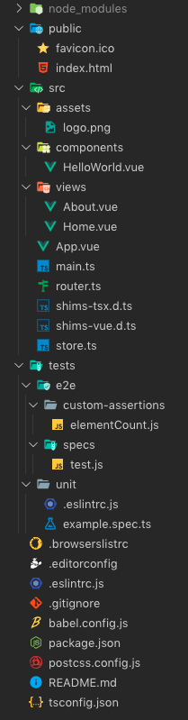
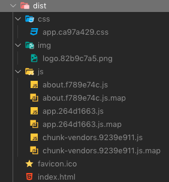

`create-react-app` で少しだけ React を触ったあと、ガッツリ **Angular** 人間になっていたので、今回は *Vue.js* にも手を出してみることにした。

## 目次

## Angular・React・Vue の比較色々

これら3者を比較する記事は色々あるので、個人的に気になったところだけ。

### Angular 寄りな感想

僕は Angular が気に入っている。Angular はフロントエンドアプリ開発に必要なモノがフルスタックで揃っていて、キチッとした作りなのが好み。

それと比べると、React や Vue は、(個人的には悪い意味で)「柔軟性が高い」作りだと感じている。コンポーネントを関数としても、クラスとしても実装できてしまったり、1つのファイルに HTML・CSS・JS をまとめても書けるし、まとめなくても書ける、みたいな。それがなんともやりづらい気がしている。

### Next.js とか Nuxt.js とかって何？

いずれも SSR (サーバ・サイド・レンダリング) に対応できるようになった、ラッパー・フレームワーク。Next.js・Nuxt.js の対応関係は次のとおり。

- N*e*xt.js … R*e*act
- N**u**xt.js … V**u**e

2文字目が一致するモノ同士、と覚えると良い。

### その他

- Angular は Google、React は Facebook が作ったモノ。Vue はこうした企業がバックにいない、個人開発
- React は3者の中で一番柔軟性がありそう
- Vue は3者の中で一番フレームワーク本体のサイズが小さい。学習コストもこの中では低い方

## どうやって Vue を学習するか

Vue をどうやって始めるか、いくつかの方法がある。

1. CDN で Vue.js を読み込み、HTML ファイルの `script` 要素にゴリゴリ書いていく
    - 参考：<https://jp.vuejs.org/v2/guide/installation.html>
    - 最もミニマルに作れる。学習用らしいが、分かりやすいのだろうか？
2. npm で `vue` をインストールして使う
    - 設定類は自分でやるってことみたい
3. Vue CLI `@vue/cli` を使う
    - 参考：<https://cli.vuejs.org/guide/installation.html>
    - 次に挙げる Nuxt.js との使い分けは…？
4. Nuxt.js を使う
    - 参考：<https://ja.nuxtjs.org/guide/installation/>
    - `create-nuxt-app` という npm パッケージがある様子

自分は Angular から入った、カッチリした構成が好きなタイプなので、Vue CLI か Nuxt.js のレールに乗っかりたいと思っている。しかし、これらをどう使い分けたら良いものか。

### Vue CLI と Nuxt.js の違いを探る

本稿執筆時点の Vue CLI は v3.10.0、Nuxt.js は v2.9.1。この2つで比較する。

- Vue 公式は「いきなり Vue CLI 使うのは敷居が高いからオススメしないよ」としている。本当にド素人向けの書きぶりだと思う
- Nuxt.js は SSR をしない SPA も作れるので、守備範囲は Vue CLI と大きく変わらない
- Nuxt.js が採用している Vue は v2 系なので、v3 系になっている Vue CLI と比べて遅れている。Vue v2 に Vue Router と Vuex (状態管理ライブラリ) を足し込んだようなフレームワークらしい
- Nuxt.js は CoC (設定より規約) なので、ファイルの配置だけでルーティングが決まったりする。Rails ちっくな感じ？
- Nuxt.js は日本語の公式ドキュメントがあるが、Vue CLI には日本語ドキュメントがない
- Vue CLI でも Vue Router や Vuex は導入できる。TypeScript もサポートしている
- Vue CLI はホットリロードの開発サーバ、UT、E2E も揃う。Angular CLI に近い感じ

…こんな感じかな。Vue を使って *SSR がしたいなら Nuxt.js。*そうでなければ、TypeScript サポートなども充実している **Vue CLI 3** を選んで良いんじゃないかな。

自分は SSR やる気がないので、Vue CLI を使うことにする。

## いよいよコトハジメ・Vue CLI をインストールする

Vue CLI の公式サイトを順に見ながら始めていく。環境は MacOS Mojave・Node.js v10.7.0・npm v6.10.3。

- [Vue CLI](https://cli.vuejs.org/)

まずは「Installation」ページに沿って、Vue CLI を npm でグローバルインストールする。

```bash
$ npm install -g @vue/cli

$ vue --version
3.10.0
```

インストールできた。

- 参考：[Installation | Vue CLI](https://cli.vuejs.org/guide/installation.html)

## プロジェクトを作る

Vue CLI 公式サイトには、「Installation」に続いて「Instant Prototyping」というページがあり、`vue serve` コマンドを紹介している。コレは `.vue` ファイルを単体で生成し、`vue serve -o` コマンドでそのファイル単体を動かせるコマンドだ。*このコマンドについては省略。*

- 参考：[Installation | Vue CLI](https://cli.vuejs.org/guide/installation.html)
- 参考：[Installation | Vue CLI](https://cli.vuejs.org/guide/installation.html)

で、「Creating a Project」に移る。次のコマンドでプロジェクトを作成する。

```bash
$ vue create neos-first-vue-app
```

アプリ名は大文字を含められない。

コマンドを実行すると次のようなプロンプトに切り替わる。

```bash
Vue CLI v3.10.0
? Please pick a preset: (Use arrow keys)
❯ default (babel, eslint)
  Manually select features
```

最もシンプルに始めるなら `default` でいいのだろうが、色々いじってみたいので `Manually select features` を選択する。すると次のようなプロンプトに変わる。

```bash
Vue CLI v3.10.0
? Please pick a preset: Manually select features
? Check the features needed for your project: (Press <space> to select, <a> to toggle all, <i> to invert selection)
❯◉ Babel
 ◯ TypeScript
 ◯ Progressive Web App (PWA) Support
 ◯ Router
 ◯ Vuex
 ◯ CSS Pre-processors
 ◉ Linter / Formatter
 ◯ Unit Testing
 ◯ E2E Testing
```

`Space` キーで組み込む要素が指定できるようだ。

自分は　Angular CLI で Angular アプリをよく作ってきたので、TypeScript を使いたいし、Router、CSS Pre-processors、Linter / Formatter、Unit Testing、E2E Testing は入れてみたい。ついでに状態管理の Vuex も試してみたい。PWA Support は要らないかな、と思うので次のように選択。

```bash
Vue CLI v3.10.0
? Please pick a preset: Manually select features
? Check the features needed for your project:
 ◉ Babel
 ◉ TypeScript
 ◯ Progressive Web App (PWA) Support
 ◉ Router
 ◉ Vuex
 ◉ CSS Pre-processors
 ◉ Linter / Formatter
 ◉ Unit Testing
❯◉ E2E Testing
```

以降のプロンプトはこんな感じで回答した。

```bash
Vue CLI v3.10.0
? Please pick a preset: Manually select features
? Check the features needed for your project: Babel, TS, Router, Vuex, CSS Pre-processors, Linter, Unit, E2E

# class スタイルでコンポーネントを定義するかどうか。Yes とした
? Use class-style component syntax? (Y/n) Yes

# TypeScript と一緒に Babel を使うか。効能がイマイチ分からないが Yes とした
? Use Babel alongside TypeScript (required for modern mode, auto-detected polyfills, transpiling JSX)? Yes

# Router で History モードを使うかどうか。恐らく History API を使うか Hashbang を使うか、ってことかな？Yes とした
? Use history mode for router? (Requires proper server setup for index fallback in production) Yes

# CSS プリプロセッサ : node-sass 版で SCSS にする
? Pick a CSS pre-processor (PostCSS, Autoprefixer and CSS Modules are supported by default):
  Sass/SCSS (with dart-sass)
❯ Sass/SCSS (with node-sass)
  Less
  Stylus

# Linter の選択 : Prettier は好みじゃないので無視、TypeScript の Lint も TSLint ではなく ESLint に移行するようなので、Standard config を選択
? Pick a linter / formatter config:
  TSLint
  ESLint with error prevention only
  ESLint + Airbnb config
❯ ESLint + Standard config
  ESLint + Prettier

# Lint するタイミングなど
? Pick additional lint features: (Press <space> to select, <a> to toggle all, <i> to invert selection)
❯◉ Lint on save
 ◯ Lint and fix on commit

# UT のツール : 使ったことがある Mocha と Chai にする
? Pick a unit testing solution: (Use arrow keys)
❯ Mocha + Chai
  Jest

# E2E のツール : Chrome 以外のブラウザも動かしてみたいので Nightwatch にしておく
? Pick a E2E testing solution:
  Cypress (Chrome only)
❯ Nightwatch (Selenium-based)

# 設定をどのファイルに書くか。それぞれのツール向けのファイルに書く
? Where do you prefer placing config for Babel, PostCSS, ESLint, etc.? (Use arrow keys)
❯ In dedicated config files
  In package.json

# この設定をプリセットとして保存するか
? Save this as a preset for future projects? No

# ココまででプロンプト終了。あとは初期設定を待つ

Vue CLI v3.10.0
✨  Creating project in /Users/Neo/neos-first-vue-app.
🗃  Initializing git repository...
⚙  Installing CLI plugins. This might take a while...

🚀  Invoking generators...
📦  Installing additional dependencies...

⚓  Running completion hooks...

📄  Generating README.md...

🎉  Successfully created project neos-first-vue-app.
👉  Get started with the following commands:

 $ cd neos-first-vue-app
 $ npm run serve
```

長かったが以上でプロジェクトの雛形が作成できた。ファイル構成はこんな感じ。



## 動かしてみる

さて、ファイルが色々できたので、`package.json` を見てみる。

```json
{
  "name": "neos-first-vue-app",
  "version": "0.1.0",
  "private": true,
  "scripts": {
    "serve": "vue-cli-service serve",
    "build": "vue-cli-service build",
    "lint": "vue-cli-service lint",
    "test:e2e": "vue-cli-service test:e2e",
    "test:unit": "vue-cli-service test:unit"
  },

// 以下略…
```

大体察しがつくが、Angular CLI と同等のコマンド (npm-run-scripts) が用意されている。

`$ npm run serve` でホットリロード機能付きの開発サーバを立ち上げてみる。`http://localhost:8080/` でページが表示された。

### 雛形ファイルを見ていく

`$ npm run serve` で起動したページを見つつ、雛形として生成されたファイルをいじくって内容を確認してみる。

ページとなる HTML ファイルは `./public/index.html` で、この中に `<div id="app">` と書いてある。この中に Vue のコンポーネントが配置されるようだ。

Vue アプリケーションのエントリポイントは `./src/main.ts` で、Vue の表示領域全体は `./src/App.vue` で定義されている。このファイル内に `<template>` → `<div id="app">` とネストされた記述があり、この `#app` 要素が `./public/index.html` と対応付いているようだ。

ルーティングは `./src/router.ts` に書いてあるようだ。最初に表示されるのは `Home` コンポーネントのようだ。このコンポーネントのファイルは `./src/views/Home.vue` となる。

コイツはビューコンポーネントとでも呼べるファイルで、HTML・TypeScript が混在している。そして `./src/components/HelloWorld.vue` を `import` していて、HTML 内で `<HelloWorld>` 要素で指定している。このあたりはお作法に違いがあるものの、Angular にもあった*「親コンポーネント・子コンポーネント」*と同じ考え方のようだ。

そうそう、VSCode で `.vue` ファイルを開く時は、**Vetur** という拡張機能を入れておくと、シンタックスハイライトが効くようになる。

- 参考：[Vue.jsをVSCodeで書く時はVeturを入れてjsconfig.jsonを書こう - Qiita](https://qiita.com/nyallpo/items/c50909926e465fabdb55)
- 参考：[vscodeでVue.jsを書くときに使っているプラグインとか - Qiita](https://qiita.com/dayoshix/items/c61a75a971331418c348)

ブラウザで開いたページを見ると、「About」ページに遷移できることが分かる。`router.ts` を見ると、`About.vue` は Lazy Load しているようだ。`About.vue` には TypeScript Class の定義がないのだが、何でコレで動くんだろ？試しに空の `class` を置いてみたが、動作に変化なし。

```html
<template>
  <div class="about">
    <h1>This is an about page</h1>
  </div>
</template>

↓ 以下を追加した。
<script lang="ts">
import { Component, Vue } from 'vue-property-decorator'

@Component({})
export default class About extends Vue {}
</script>
```

### リンクの書き方

Vue Router を使った Vue アプリ内のリンクはどうやっているかというと、`App.vue` を見れば分かる。

```html
<router-link to="/">Home</router-link>
<router-link to="/about">About</router-link>
```

こんな感じ。Angular の場合は `<a routerLInk="">` とかで指定できたと思うので、書き方が少し違う。

### テンプレート構文によるバインディング

テンプレート構文は、Angular と同じ二重の波括弧 `{{ }}` を使う。公式ガイドでは Mustache 構文と表現している。

- 参考：[テンプレート構文 — Vue.js](https://jp.vuejs.org/v2/guide/syntax.html)

先程、空の `About` クラスを作った `About.vue` に、テンプレートを入れてみる。

```html
<template>
  <div class="about">
    <h1>This is an about page</h1>
    <p>Test {{ hoge }} Test</p>  <!-- ← ココを追加 -->
  </div>
</template>

<script lang="ts">
import { Component, Vue } from 'vue-property-decorator'

@Component({})
export default class About extends Vue {}
</script>
```

これだけだと、まだ `hoge` に何も入れていないので、画面上は「Test Test」としか出ない。

`HelloWorld.vue` を見るとバインディングっぽいことをしていたので、真似てみる。*`@Prop()` というデコレータはあってもなくても動いた。*もしかしたらコレは子コンポーネントへの注入用かも、だとしたら書かなくて良いモノだ。

```html
<template>
  <div class="about">
    <h1>This is an about page</h1>
    <p>Test {{ hoge }} Test</p>
  </div>
</template>

<script lang="ts">
import { Component, Prop, Vue } from 'vue-property-decorator'

@Component({})
export default class About extends Vue {
  // 以下2行を追加
  @Prop()
  private hoge: string = 'Foooo';
}
</script>
```

コレで画面上は「Test Foooo Test」と表示された。

## ビルドしてみる

最後に `$ npm run build` コマンドを実行して、今回は終わりにする。

コマンドを実行すると `./dist/` ディレクトリができ、ファイルが生成される。雰囲気は Angular CLI におけるビルドとよく似ている。



## 以上

というワケで、Vue CLI を使えばすんなりと Vue のプロジェクト環境が作れた。

バインディングやルーティングについては Angular とよく似た作りだが、Vuex を使った状態管理はまだ触れていないだろうから、これから試していこうと思う。
