GitHub 上で CI/CD を実現できるコンテナ・パイプライン機能である **GitHub Actions** を使ってみた。

お試ししたリポジトリは以下。

- [Neos21/practice-github-actions](https://github.com/Neos21/practice-github-actions)

## 目次

## まずはテキトーに動かしてみる

使い方がよく分からないが、いきなり解説記事を読んでもやっぱりよく分からないので、試しに動かしてみる。

新規リポジトリを作り、「Actions」タブに移動する。

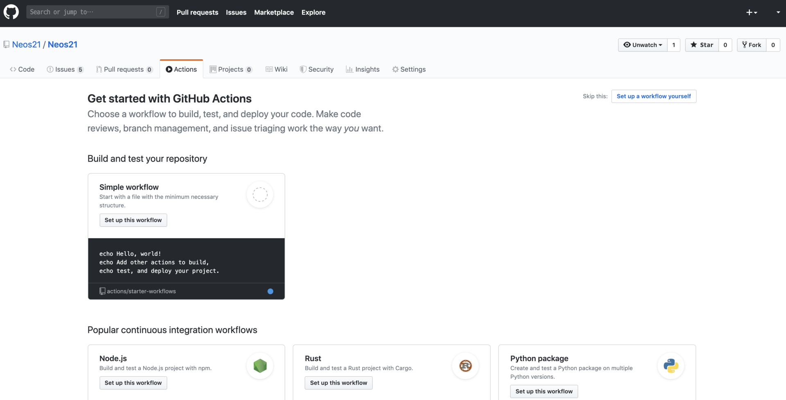

「Simple workflow」というサンプルっぽいヤツを試してみる。「Set up this workflow」ボタンを押す。

すると次のようなエディタ画面に移動する。自分で調べながらコメントを付け足してみた。

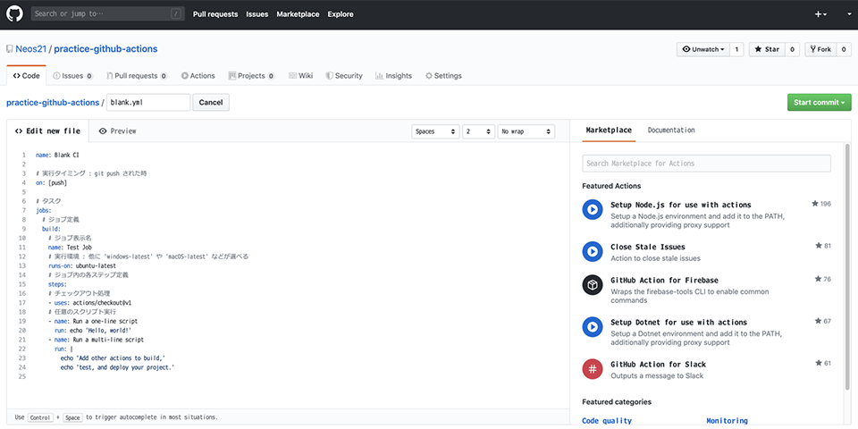

GitHub 画面上でこのファイルをコミットしてみると、早速ワークフローが動いた。トリガーとなるイベントを `on: [push]` と実装していたので、GitHub 画面上でコミットした場合は `git push` と同じ扱いになり、動作したというワケ。

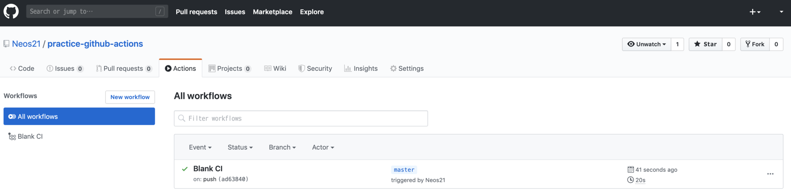

ジョブを選択し、右端の3点リーダアイコン `…` から `View raw logs` を押下すると、詳細なログが見える。

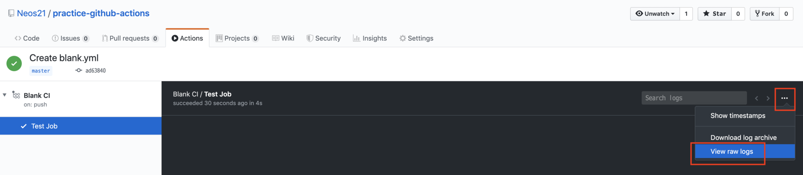

見てみると、確かにワークフローで実装していた `echo` コマンドの動作が確認できた。

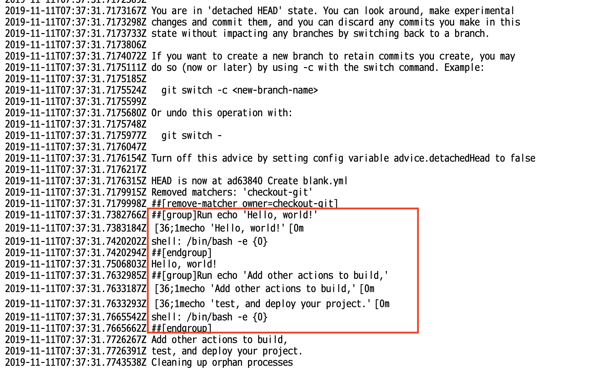

## Secret : クレデンシャル情報を渡してみる

続いて、よくありそうな仕組みとして、アクセストークンやパスワードなどの*クレデンシャル情報*を別に定義しておいて、ジョブ内で使用するというモノだ。

GitHub 画面の「Settings」タブより「Secrets」メニューに進み、「Add a new secret」リンクを押してシークレットを追加する。

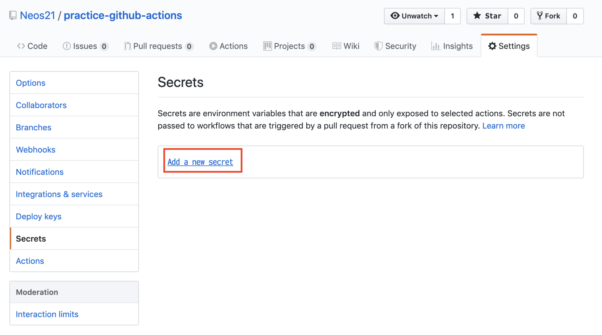

今回はサンプルとしてどうでもいい文字列を追加した。`my-password-value` が、パスワードとして使用する文字列の「テイ」だ。

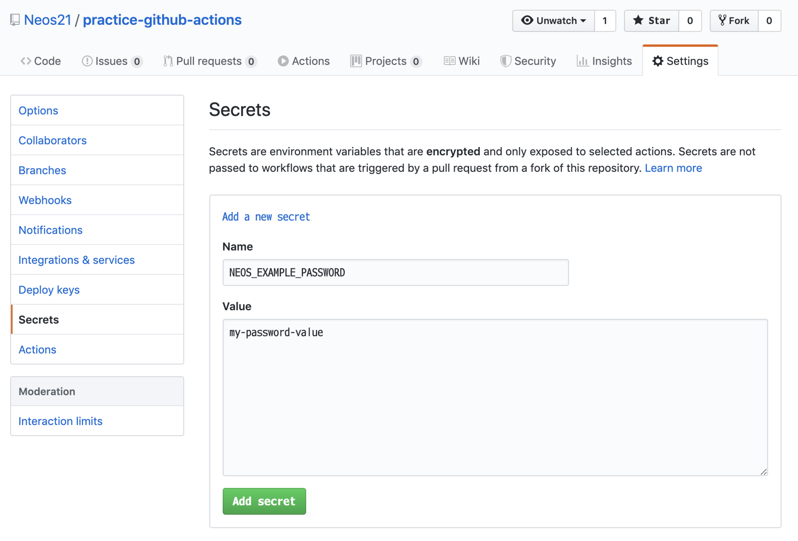

追加するとこのような画面になる。一度追加したシークレットは、中身を参照したり変更したりできないので注意。値を変更したい場合は一度「Remove」してから同名で作成することになる。

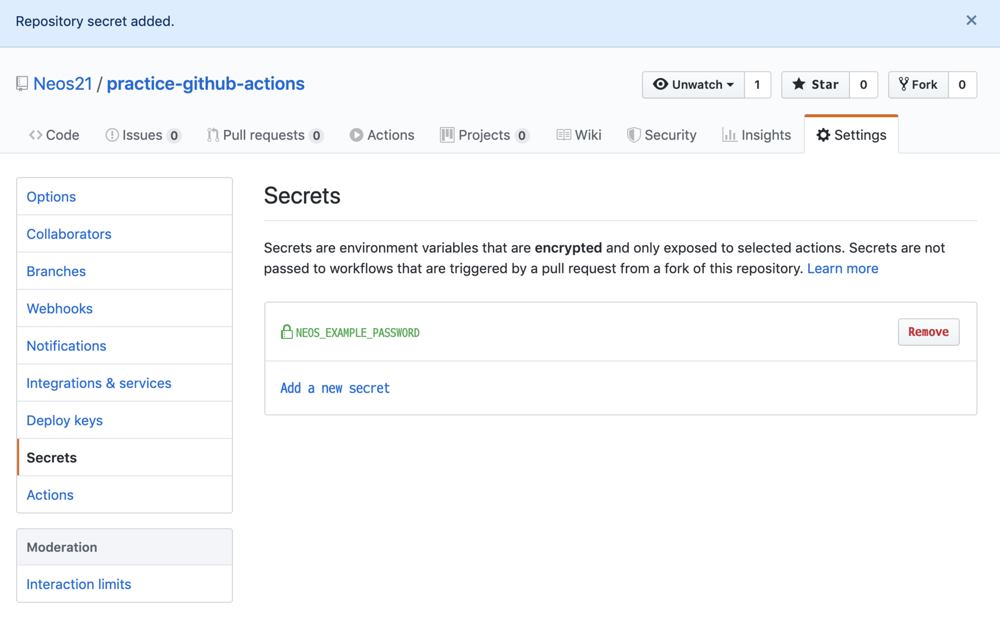

このシークレットを、ワークフロー内のシェルスクリプトで利用してみる。シェルスクリプト内の環境変数として利用できるようにするには、`env` プロパティにてシークレットを渡しておく必要がある。

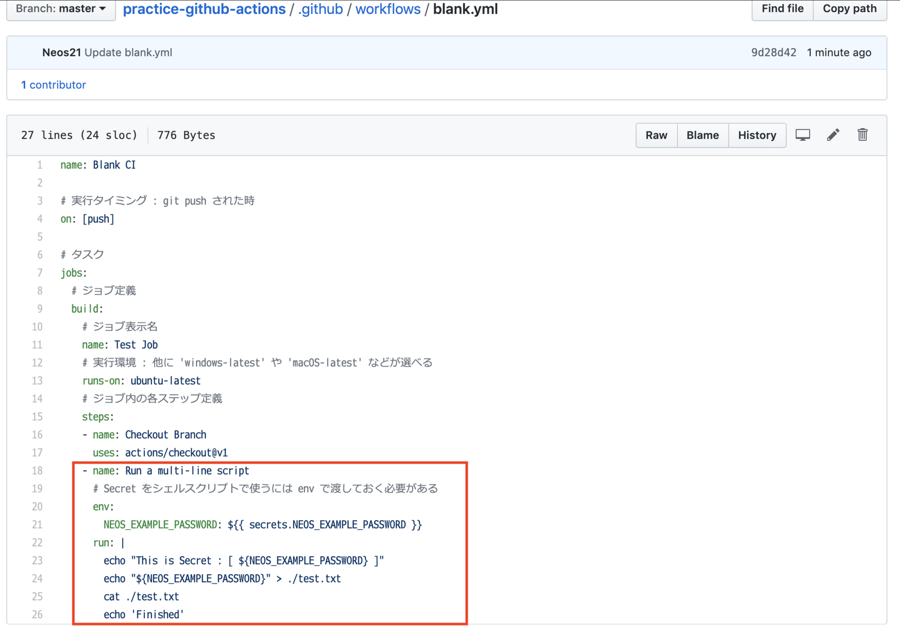

```yaml
- name: Run a multi-line script
  env:
    NEOS_EXAMPLE_PASSWORD: ${{ secrets.NEOS_EXAMPLE_PASSWORD }}
  run: |
    echo "This is Secret : [ ${NEOS_EXAMPLE_PASSWORD} ]"
    echo "${NEOS_EXAMPLE_PASSWORD}" > ./test.txt
    cat ./test.txt
    echo 'Finished'
```

ちょっとイジワルだが、シークレット情報を `echo` したり、ファイルに書き出して `cat` したりしてみる例だ。

コレをコミットして実行させてみたが、*ログには一切パスワード文字列が出力されなかった*。コレは安全である。

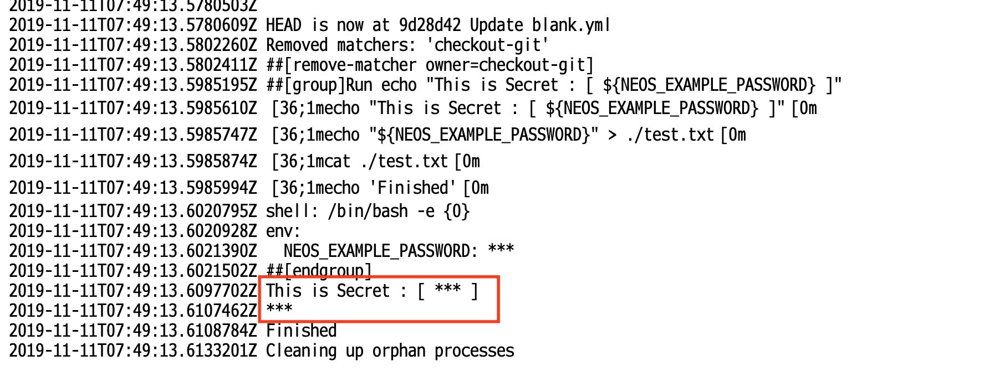

ちなみに、ワークフローの YAML ファイルに問題があったりすると、次のようにエラーとなる。

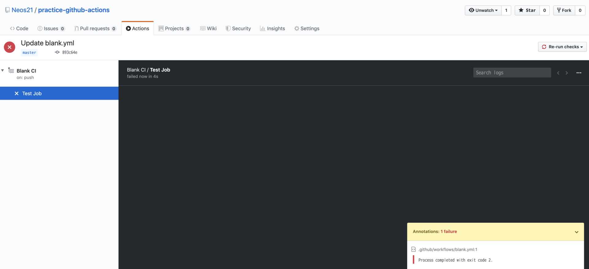

成功・失敗・実行中というステータスの他、「手動でジョブを中断 (Cancel)」ということもできる。

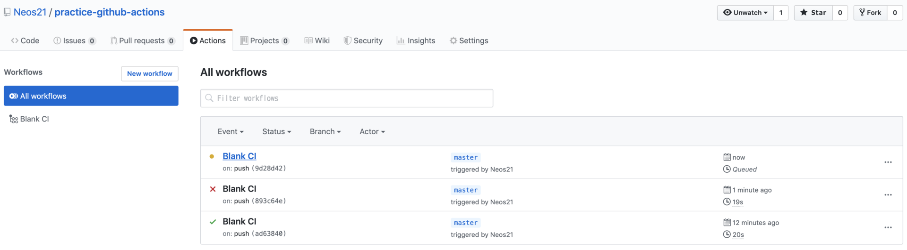

もう少し複雑な例として、Node.js スクリプトから、あるサーバに FTP 接続する、というスクリプトを作ってみた。

- `./.github/workflows/nodejs.yaml`

```yaml
name: Node CI
on: [push]
jobs:
  build:
    name: Node.js Job
    runs-on: ubuntu-latest
    steps:
    - name: Checkout
      uses: actions/checkout@v1
    - name: Use Node.js v10
      uses: actions/setup-node@v1
      with:
        node-version: '10.x'
    - name: Run npm Scripts
      env:
        MY_FTP_PASS: ${{ secrets.MY_FTP_PASS }}
      run: |
        npm install
        npm run ftp
```

`package.json` の `scripts` にて、`npm run ftp` が動作するよう npm-run-scripts を定義しておく。

```json
{
  "scripts": {
    "ftp": "node ftp.js"
  }
}
```

`ftp.js` 内の実装、`promise-ftp` という npm パッケージを使って FTP 接続するようにしている。シークレットで定義した `MY_FTP_PASS` を環境変数から読み取るため、次のように実装している。

```javascript
const PromiseFtp = require('promise-ftp');
const promiseFtp = new PromiseFtp();

promiseFtp.connect({
  user    : 'example-user',
  password: process.env.MY_FTP_PASS,
  host    : 'example.com'
})
  .then((serverMessage) => {
    console.log('★ Connected ', serverMessage);
  });
```

Node.js は `process.env.MY_FTP_PASS` という風に書くことで環境変数を参照できるので、このように書いている。

コレを実行してみると、*無事シークレット情報が渡されて正常動作した*のだが、全角文字 (上のコードの `★` 部分) が文字化けしていた。

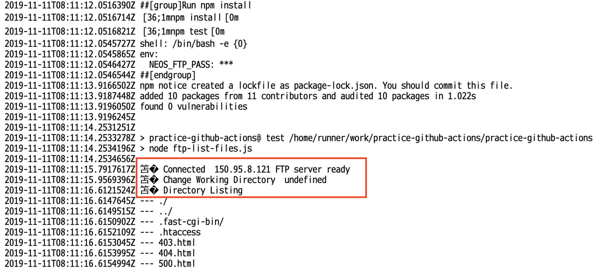

日本語のログ出力には対応していなさそうなので、注意が必要だ。

## 結構使えるやんけ！

以上がザッと使ってみた例。結構使えそうだ。

## 構文の勉強

もう少し使い方を調べるため、以下の公式の記事を見てみた。

- 参考 : [GitHub Actionsのワークフロー構文 - GitHub ヘルプ](https://help.github.com/ja/actions/automating-your-workflow-with-github-actions/workflow-syntax-for-github-actions)

最初はなかなかとっつきにくかったが、ひとしきりサンプルの Workflow や Action を使ってみた後に読むとよく分かった。

- ワークフロー (1ファイル・トリガーとなるイベントを定義できる単位) → ジョブ (ワークフロー内で行う処理の塊) → ステップ (ジョブ内の1つの処理) という関係
- ワークフローは複数作成できる。それぞれのワークフローに同じ `on` イベントを指定しておくと、並列実行される
- ジョブはデフォルトで並列実行されるが、`jobs.【Job ID】.needs` で依存ジョブを指定すれば順序の制御もできる
  - `needs: job1` とか `needs: [job1, job2]` とか書く
- `jobs.【Job ID】.runs-on` は、そのジョブを実行するホスト環境
  - コレ自体も仮想環境ではあるが、イメージ的には Jenkins サーバみたいに、1つのジョブを実行するマシン1台、と捉えて良い。CPU や RAM などのスペックが一応公開されている
      - 参考 : [Virtual environments for GitHub-hosted runners - GitHub ヘルプ](https://help.github.com/ja/actions/automating-your-workflow-with-github-actions/virtual-environments-for-github-hosted-runners)
  - 1つのジョブにつき1つのホスト環境を指定した上で、`jobs.【Job ID】.container` や `jobs.【Job ID】.steps.uses` でさらに Docker コンテナを指定したりできる
  - `runs-on` で指定したデフォルト環境ではグローバルにコマンドが足りなかったりする時は、ジョブ単位やステップ単位で Docker コンテナないしは Actions を利用することで拡張できるイメージ
- `jobs.【Job ID】.steps.name` は省略できる
- Action 1つは、1つの Step として実行することになる
  - Action とは「再利用可能なコードの単位」。コマンドを提供する、もしくはコマンドを実行する Docker コンテナを指定する、ぐらいのイメージでいいかな
  - `uses: docker://apline:3.8` のように DockerHub のイメージを直接指定して使ったりもできる
- `jobs.【Job ID】.steps.run` でシェルコマンドを実行できる
  - `shell` プロパティで PowerShell やコマンドプロンプトなども設定できる (`runs-on` で指定した環境が Windows じゃないとダメ)
  - Windows マシンでも `shell: bash` は動作する。GitBash が使用されるようだ

その他、構文に関しては以下の記事が参考になった。

- [GitHub Actionsの使い方 | 純規の暇人趣味ブログ](https://jyn.jp/github-actions-usage/)

## 他に何ができるの？の参考に

その他にどんなことができそうかは、具体的なコードを見た方がイメージが湧くと思うので、Qiita で色々記事を集めてみた。参考までに。

- [GitHub Actions を用いて Pull-Request で shellcheck をする方法 - Qiita](https://qiita.com/osakiy/items/27d5382e41107de482a4)
  - シェルスクリプトの Lint ツール `shellcheck` は標準の Ubuntu 環境にプリインストール済
- [GitHub Actions v2 で Windows Driver Kit を使ったビルドをする - Qiita](https://qiita.com/SnowCait/items/aa9e38478c73d3717ba6)
  - GitHub Actions は Azure Pipelines と同じイメージを使っているらしい
- [Github Actions で GCPに向けてTerraform を実行する - Qiita](https://qiita.com/kentakozuka/items/e0d356df38f29ee7587e)
  - HCL (JSON みたいな) 構文は廃止予定。今後は YAML で書く
  - `hashicorp/terraform-github-actions` が `terraform` コマンドのサブコマンド単位で Actions を公開している
- [Github Actions で Selenium を動かしてみる - Qiita](https://qiita.com/okitan/items/675b92ad7cd7a7832919)
  - GitHub 上に Visual Editor もあったようだが、古い話みたい
- [【GitHub Actions】CIを使って毎日自動でGitHubに草を生やそうｗｗｗ - Qiita](https://qiita.com/ykhirao/items/65fee829ee0478187027)
  - `on.schedule.cron` を使用した定期実行の例
- [GitHub Actions を用いて issue が更新されたら LINE に通知する方法 - Qiita](https://qiita.com/osakiy/items/dd77a31bf25d27dd0679)
  - `on.issues.types: opened` や `on.issue_comment.types: created` をトリガーにした例
  - `env` で指定する変数の値はベタ書きでも良い。`env.URL` は `run` の中で `${URL}` として呼べる
- [GitHub Actionsでキャッシュが使えるようになって嬉しい！ - Qiita](https://qiita.com/ngmr_mo/items/0576bfcea8c4487a6b47)
  - `actions/cache@preview` でキャッシュすることで `npm install` などの時間を短縮
- [GitHub ActionsでAngularプロジェクトの自動テストを実行してみる - Qiita](https://qiita.com/teracy55/items/126797b14f701941f9f3)
  - `actions/setup-node@v1` で `npm` を使えるようにする
- [GitHub Actionsでキャッシュが使えるようになって嬉しい！ - Qiita](https://qiita.com/ngmr_mo/items/0576bfcea8c4487a6b47)
  - `actions/setup-python@v1` で Python・pipenv を使う例
- [Flutter for WebとGitHub Actionsで自分のポートフォリオを自動デプロイする - Qiita](https://qiita.com/taigamikami/items/348878ee606cf9352e84)
  - `subosito/flutter-action@v1`。これらの Action はグローバルなコマンドをインストールするためのモノと考えてもよさそう
  - その後の Step で `run: flutter` のように `flutter` コマンドが使えるようになっている
- [GitHub Actions による GitHub Pages への自動デプロイ - Qiita](https://qiita.com/peaceiris/items/d401f2e5724fdcb0759d)
  - `peaceiris/actions-gh-pages@v2.4.0` で GitHub Pages にデプロイできる
  - `ssh-keygen` で鍵ペアを作り、Settings → Deploy Keys に公開鍵、Secrets に秘密鍵を登録すると使えるようになる
- [GitHub ActionsでSSHを使う - Qiita](https://qiita.com/shimataro999/items/b05a251c93fe6843cc16)
  - `shimataro/ssh-key-action@v1` で SSH 接続のフォロー
- [GitHub Actions + Selenium でスクレイピングを定期実行 - Qiita](https://qiita.com/otuhs_d/items/0953e237119178fd796e)
  - `jobs.【Job ID】.services` で、サービスとして動かす Docker コンテナ・プロセスを指定できる
  - この記事の例では Selenium をサービスとして動かしている
- [Github Actions+AppiumでAndroid Emulatorを動かす - Qiita](https://qiita.com/takeya0x86/items/77bf718ba982a2d59d23)
  - Appium・Android エミュレータも動作する
- [Github Actions で Xcode プロジェクトをビルドしてみる - Qiita](https://qiita.com/koogawa/items/ddf86b56d6b82ae11473)
  - Xcode ビルド・iOS シミュレータも動作する
- [GitHub Actions で Windows IE11 と Mac Safari を selenium-webdriver で動かす - Qiita](https://qiita.com/mizchi/items/9c03df347748ba5f5a11)
- [GitHub Actions の matrix と cache 使ってe2eワークフローを作る - Qiita](https://qiita.com/mizchi/items/d4b027f47d664ece5087)
  - Windows・MacOS を使っている例
- [GitHub Actions でステータスバッジを表示する - Qiita](https://qiita.com/SnowCait/items/487d70b342ffbe2f33d8)
  - ステータスバッジの付け方
- [Solved: GitHub Actions Manual Trigger / Approvals - GitHub Community Forum](https://github.community/t5/GitHub-Actions/GitHub-Actions-Manual-Trigger-Approvals/td-p/31504)
  - GitHub Actions を手動で実行するには？ → 「手動実行」のための機能はないらしい
  - *`on: repository_dispatch`* イベントを指定しておき、GitHub API を叩くと実行できるが、ブランチ指定はできず最終コミットが利用される
  - [GitHubActionsの`repository_dispatch`を試す - Qiita](https://qiita.com/kazuhei/items/8bf53f26c3f54f5827ef)
  - [GitHub Ationsで任意のタイミングでトリガーを発火させる - notebook](https://swfz.hatenablog.com/entry/2019/03/31/235440)
- [GitHub - SamKirkland/FTP-Deploy-Action: Deploys a GitHub project to a FTP server using GitHub actions](https://github.com/SamKirkland/FTP-Deploy-Action)
  - FTP デプロイを行えるアクション

## 以上

実行基盤に Ubuntu だけでなく、Windows と MacOS も使えるようなので、クロスブラウザテストや iOS アプリのテストなんかもできそうだ。

無料でガンガン使えるので、どんどん活用していこうと思う。
