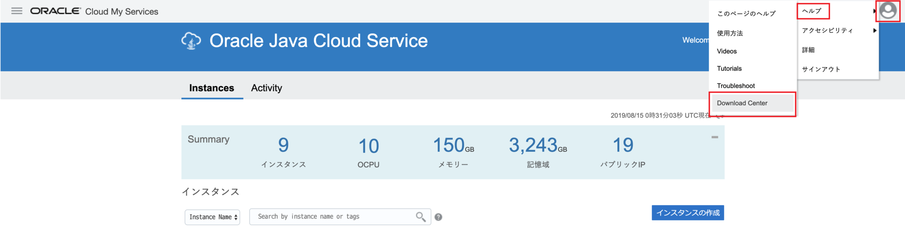
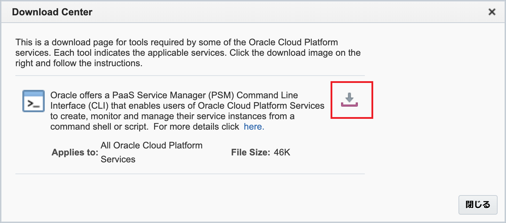
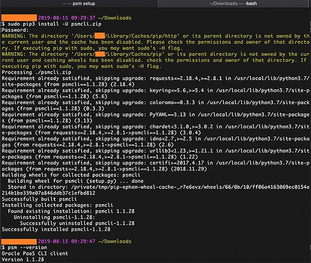
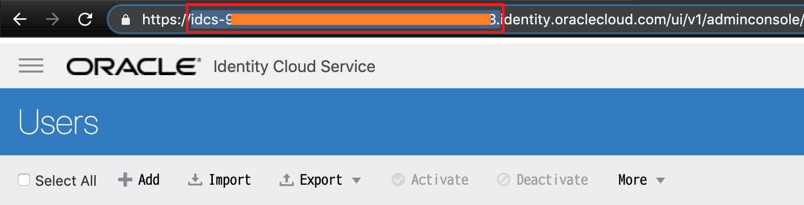
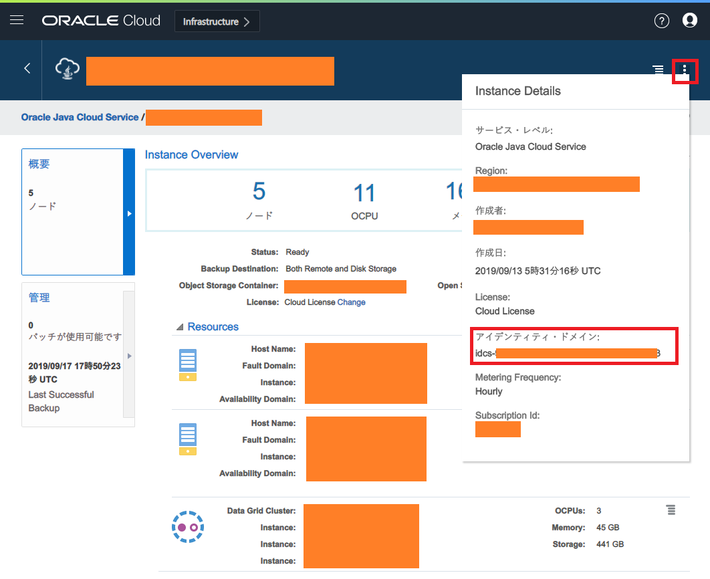

**Oracle Java Cloud Service (JCS)** という PaaS を使ってみた。サーバの台数を指定するだけで、クラスタリングされた WebLogic Server が立ち上がり、あとはアプリをデプロイするだけというサービスだ。

Oracle Cloud の「PaaS」は、Oracle Cloud Infrastructure という IaaS 環境に、PaaS が自動的に作ったリソースを間借りして配備する形になる。JCS インスタンスは「ManagedCompartmentForPaaS」というコンパートメント内に自動配備される。

- 参考 : [Oracle Cloud InfrastructureのOracle Platform Servicesの前提条件](https://docs.oracle.com/cd/E97706_01/Content/General/Reference/PaaSprereqs.htm)

PaaS といいながらほとんど IaaS で、SSH 接続はできるし、OCI 管理画面から Load Balancer や Security List などのネットワーク構成を設定できたりするし、通常は「WLS をプリインストールした VM を払い出してくれるだけのサービス」としか思えない。一応、スケールアウト (台数増)・スケールイン (台数減) をボタン一つで簡単にできるといったメリットもあるが、WLS クラスタを保つためなのか、謎に管理用の Oracle DB を作る必要があったりして、課金がエグい。

そんな残念ポイントの多い、愛されキャラの JCS だが、コイツも、以前紹介した **PSM CLI** で操作できる。

- [Oracle Application Container Cloud をコマンドラインで操作できる PSM CLI と、さらにもうちょっとだけ便利にするシェルスクリプト](/blog/2019/03/23-01.html)

以前紹介した時は、*Oracle Application Container Cloud (ACC)* という別の PaaS (コチラは Heroku とかに近いかな) を操作するために PSM CLI を使ったが、*PSM* は *PaaS Service Manager* の略なので、このコマンドラインツールでその他の Oracle PaaS も操作できるというワケだ。

## 目次

## PSM CLI のダウンロード方法

以前の記事でも紹介したが、PSM CLI のダウンロード方法が若干分かりにくいので、改めて今回はスクリーンショット込みで紹介する。

まずは Oracle Cloud My Services より「Java」サービスを選び、Java Cloud Service の管理コンソール画面に遷移する。

そしたら右上のユーザアイコンを押下し、「ヘルプ」から「*Download Center*」を選択する。



この「ダウンロード・センター」さえ出せれば後は流れでイケるのだが、ココが分かりにくい。

Download Center のダイアログが以下のように開いたら、ダウンロードアイコンを押せば、PSM CLI の Zip ファイルがダウンロードできる。



あとはダウンロードした `psmcli.zip` を、`pip3` でインストールすれば良い。



```bash
$ sudo pip3 install -U psmcli.zip
```

`$ psm --version` でバージョンが確認できたらインストールは完了。本稿執筆時点では v1.1.28 だった。

## PSM CLI の初期設定

次に、CLI が操作する対象の環境を指定しないといけない。コマンドは `$ psm setup` で開始できるのだが、この中で特に迷うのは **「`idcs-` から始まるアイデンティティ・ドメイン文字列」とやらをどうやって知ったら良いか**、という点だろう。

```bash
$ psm setup
Username:  # 【ユーザ名】
Password:  # 【パスワード】
Retype Password:  # 【パスワード 再入力】
Identity domain:  # 【「idcs-」から始まるアイデンティティ・ドメイン文字列】
Region [us]:  # リージョン。US ならこのまま Enter、日本リージョンにしたければ「aucom」と入力する
Output format [short]:  # 結果の出力形式。空白のまま Enter で良い、JSON 形式にしたければ「json」と入力する
Use OAuth? [n]:  # 空白のまま Enter
----------------------------------------------------
'psm setup' was successful. Available services are:
```

いくつか方法があるので、簡単な方法を2つほど紹介しておく。

### 1. IDCS (Identity Cloud Service) の URL から取得する

「Oracle Cloud アカウントのサインイン」画面や、IDCS 管理画面などにアクセスした時の、URL 文字列から取得できる。JCS 管理コンソール画面に到達するまでの間に通り過ぎている画面の URL から確認できるであろう、ということだ。



`https://idcs-00000000000000.identity.oraclecloud.com/` というような URL になっていると思うので、この文字列から *`idcs-00000000000000`* 部分を抜き取れば良い。

### 2. JCS インスタンス詳細画面の「Instance Details」から取得する

JCS のアプリケーションインスタンスを作ったあと、詳細画面に移動し、右上にある「*縦に並んだ3点リーダ `…` みたいなアイコン*」、コレが「Instance Details」アイコンなのだが、コレを押下する。

すると「Instance Details」というダイアログが表示され、その中に「アイデンティティ・ドメイン : 」という項目があるので、ココから `idcs-` で始まる文字列を取得できる。



コレを `$ psm setup` 時に指定すれば良い。

### JSON ファイルを読み込ませて `psm setup` を一発で終わらせる

ちなみに、対話形式になる `$ psm setup` が面倒であれば、以下のような JSON ファイルを用意しておいて、それを流し込むことで初期設定を終えることもできる。

- `psm-setup-payload.json` (ファイル名は適当に)

```json
{
  "username"      : "【ユーザ名】",
  "password"      : "【パスワード】",
  "identityDomain": "【「idcs-」から始まるアイデンティティ・ドメイン文字列】",
  "region"        : "【リージョン。「us」とか「aucom」とか】",
  "outputFormat"  : "【結果の出力形式。「short」とか「json」とか】"
}
```

以下のように `-c` オプションを使い、ファイル名を指定して実行すれば良い。

```bash
$ psm setup -c psm-setup-payload.json
```

CI/CD パイプラインの中で自動化したりする時にやりやすいかも。

## PSM CLI でできる JCS の主な操作

PSM CLI を使えば、JCS の色々な操作ができるが、中でもよく使いそうなモノを挙げておく。

### インスタンス一覧を取得する

```bash
$ psm jcs services
```

コレで作成してあるインスタンスの一覧が取得できる。出力形式を JSON にし、`jq` でパースすると、インスタンス名と状態だけを引っ張ってきたりしやすい。

```bash
$ psm jcs services --output='json' | jq -r '.services | to_entries | map(.key + " : " + .value.state)[]'
```

こんな感じ。

### インスタンスを起動する

JCS インスタンスを起動するためのコマンド。実行するためには「ペイロード・JSON ファイル」が必要になる。この JSON ファイル次第で、クラスタ構成のサーバ群のうち、一部だけを起動・停止したりできるらしい。ただ、基本的には何台構成になっていようと、「全部起動する」「全部停止する」だろうから、お決まりの内容で良い。

```bash
# ペイロード・JSON ファイルを生成しておく
$ echo '{ "allServiceHosts": true }' > ./payload.json

# インスタンスを起動する
$ psm jcs start --service-name='【インスタンス名】' --config-payload='./payload.json' --output-format='json' --wait-until-complete='true'
```

`--wait-until-complete` を `true` にしておけば、インスタンスの起動が完了するまでプロンプトが返って来なくなる。インスタンスの起動を待って次の処理をしたい、といったスクリプトを書く時には良いかも。起動命令だけ出しておけば良いのであれば `false` を指定する。

### インスタンスを停止する

起動と停止はほとんど同じ。ペイロード・JSON ファイルも同じ内容が使い回せる。

```bash
# ペイロード・JSON ファイルを生成しておく
$ echo '{ "allServiceHosts": true }' > ./payload.json

# インスタンスを起動する
$ psm jcs stop --service-name='【インスタンス名】' --config-payload='./payload.json' --output-format='json' --wait-until-complete='true'
```

## 以上

とりあえずこんなところか。

コマンドラインで色々操作できるのは大変便利だ。
