__Zeit__ という企業が提供する、__NOW__ というウェブサービスがある。当初はゼロコンフィグで静的サイトをデプロイできる、とかいう話で Netlify みたいな感じのサービスだったと思うのだが、最近見てみたら V2 (第2世代) となっていて、Node.js や Python などのプログラムも動作するようになっていた。Heroku よりもさらにお手軽に使える PaaS になっているっぽい。サービス名のググラビリティが低いので、ココでは _Zeit Now v2_ と表現する。

今回はこの Zeit Now v2 を使って、Vue プロジェクトをビルドし、静的サイトとしてデプロイしてもらおうと思う。Zeit Now のアカウントを登録するところから紹介する。

<ins class="ins-block">

2020年には Vercel にサービス名を改称している。

</ins>

## 目次

## Zeit Now に登録する

まずは Zeit Now に登録する。

サイトに移動して「Join Free」ボタンを押下。

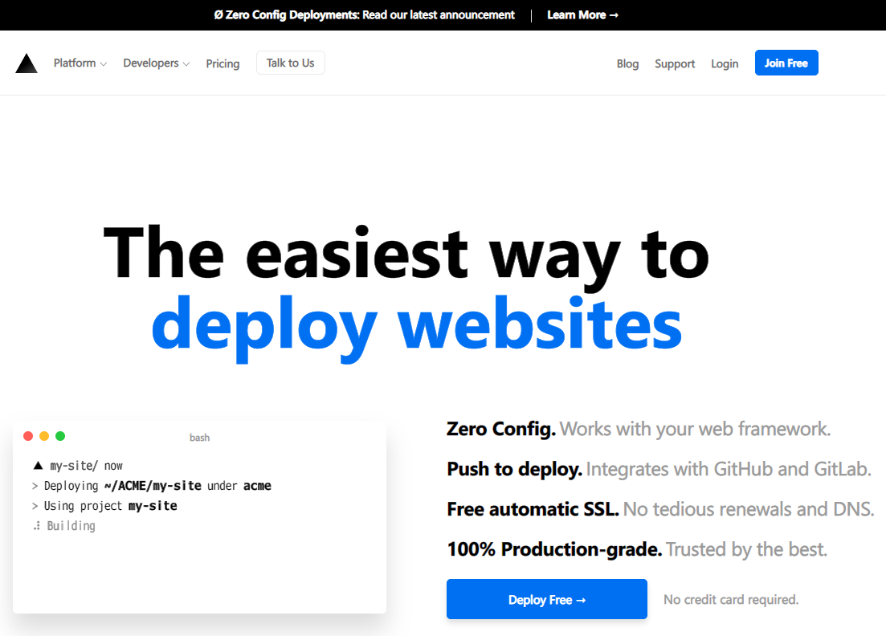

「Continue With GitHub」ボタンを押下すると、GitHub アカウントと連携する形で Zeit Now のアカウントが用意される。

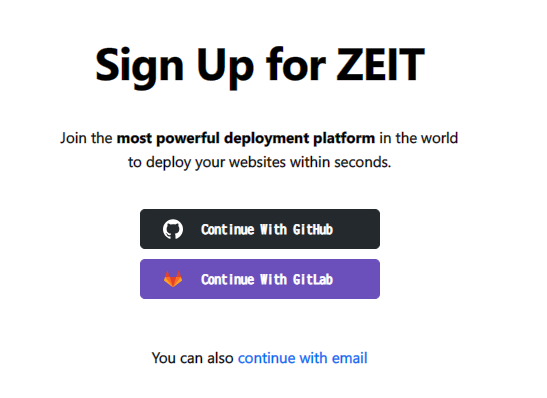

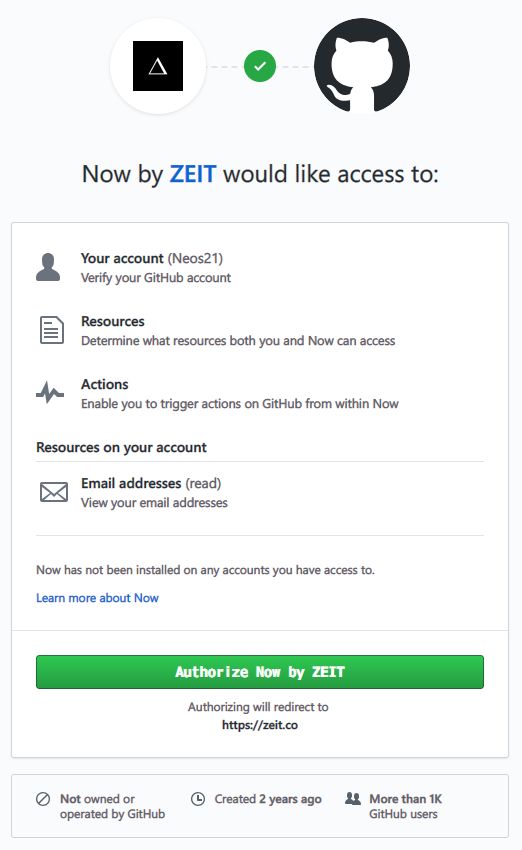

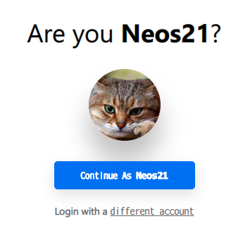

連携したら初期設定やプロフィールを入れていく。

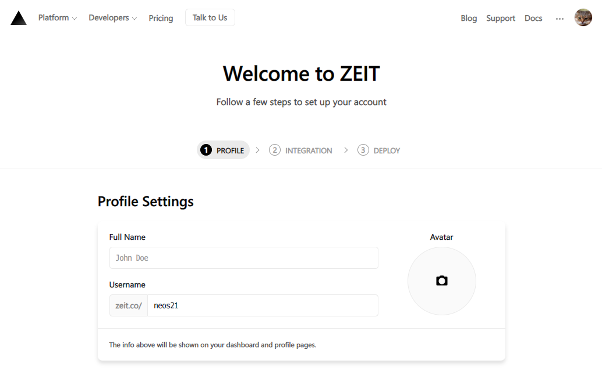

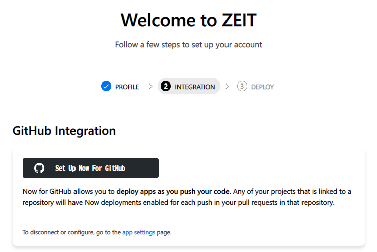

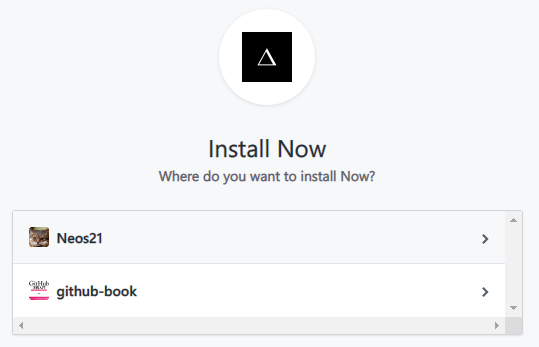

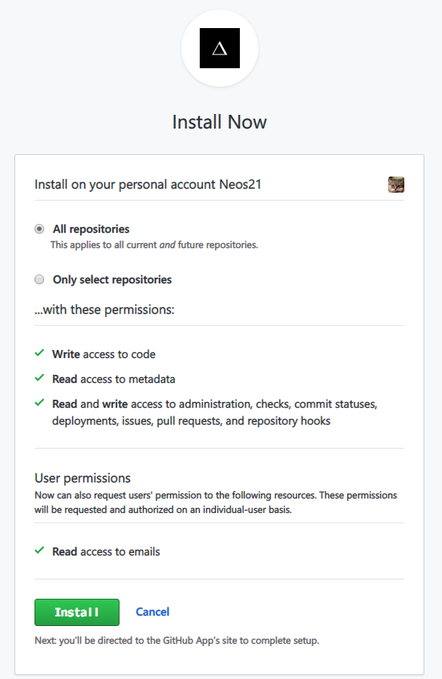

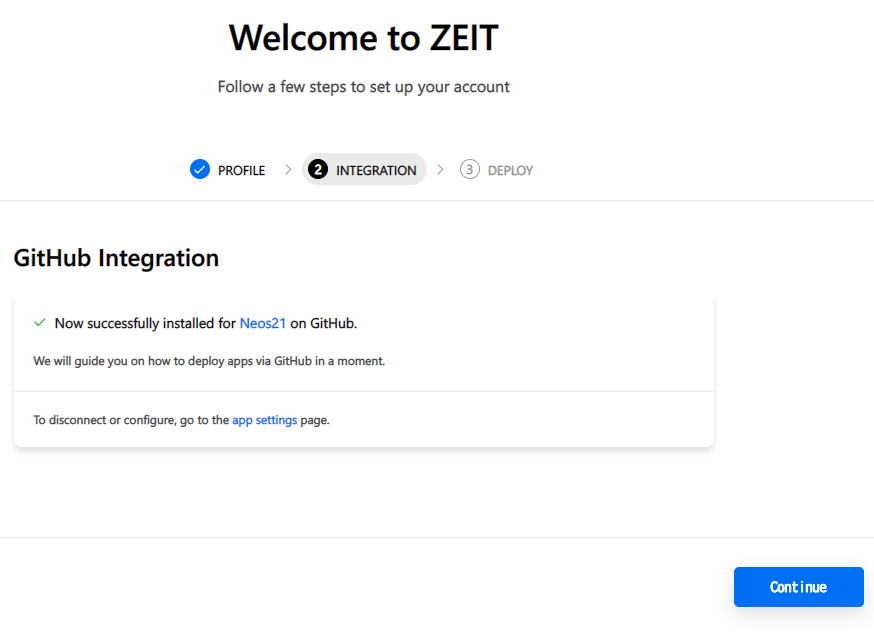

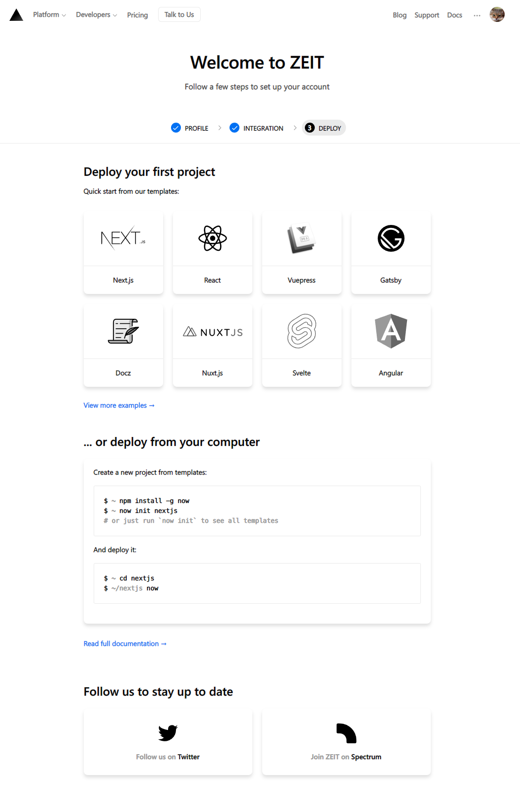

ココまで到達できれば登録は OK。

## Git Integration (連携) 機能を使って GitHub リポジトリの内容をデプロイする

コード作成済みの GitHub リポジトリがあって、あとは Zeit Now に任せてゼロコンフィグでデプロイしたい、という場合は、このまま画面上で作業していくだけでデプロイが完了する。

Zeit Now の画面で「New Project」のプルダウンを選択し、「From GitHub」を選択する。

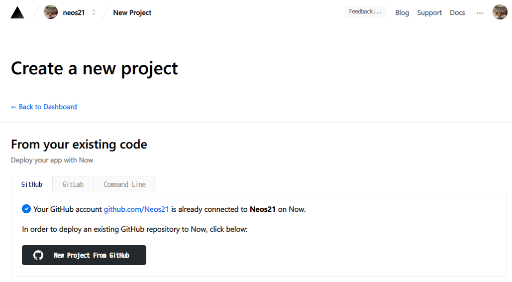

すると自分の GitHub リポジトリ一覧が表示されるので、任意のリポジトリを選択する。

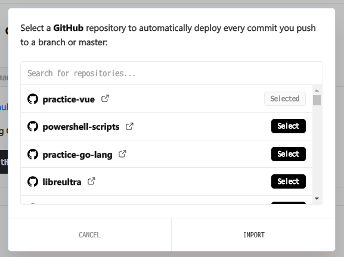

すると、Zeit Now がリポジトリの内容を取得し、自動的にプロジェクトの言語やフレームワークを特定、イイカンジにビルド・デプロイが行われる。

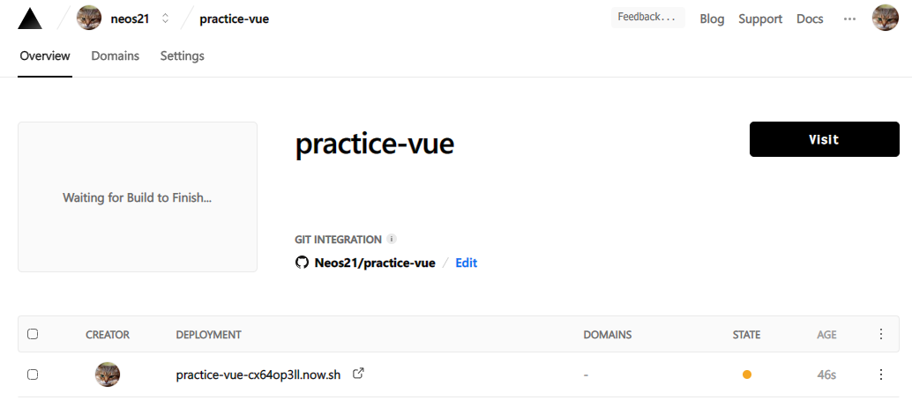

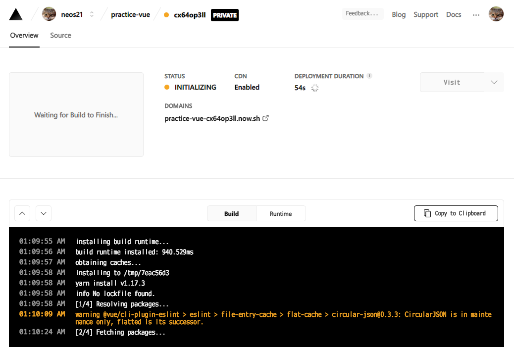

初期設定のままだと、

- `https://【プロジェクト名】-【ランダム文字列】.now.sh`

という URL でデプロイされる。このような URL は、GitHub のコミットごとや、後で紹介する Zeit Now CLI を使う度に、URL が自動生成されて作られる。平たくいうと、コミットごとに別々の URL を持った GitHub Pages ができる感じ。

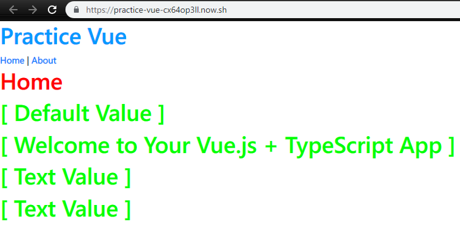

コレとは他に、

- `https://【プロジェクト名】-git-master.【アカウント名】.now.sh`

という URL も出来る。Git Integration を使い、ブランチ名が含まれるという URL になる。コチラはそのプロジェクトで最新のビルド・デプロイ先を参照するエイリアスになっている。

過去のデプロイは URL が異なるので全て残っている。勿論古いデプロイを削除することもできる。

## Zeit Now CLI を使ってデプロイしてみる

ココまでで、やりたかったデプロイは出来てしまったのだが、あまりにもゼロコンフィグすぎて、少しくらい自分が意図したとおりに設定ファイルを書いて安心したい気持ちがある。

そこで、Git Integration 機能を使わず、__Zeit Now CLI__ を使ってデプロイをしてみる。

Zeit Now CLI は npm でインストール可能。グローバルインストールする。

```bash
$ npm install -g now
```

次に、CLI でアカウントにログインするため、`$ now login` コマンドを実行する。

```bash
$ now login
(node:15852) ExperimentalWarning: The http2 module is an experimental API.
> We sent an email to 【メールアドレス】. Please follow the steps provided
  inside it and make sure the security code matches Snowy Liger.
√ Email confirmed
> Congratulations! You are now logged in. In order to deploy something, run `now`.
```

メールアドレスを入れると、そのメール宛に確認のメールが飛ぶ。そのメールから Velify すると、動的にコマンドラインが進んでログインが完了する。

## `now.json` を書いてみる

Zeit Now にデプロイするための設定は、_`.now.json`_ というファイルをプロジェクトルートに用意し、そこに書き込んでいく。

何をどう書いたら良いのか、公式のガイドを見てもイマイチ分からなかったので、見様見真似で書いてみた結果を記す。

### `now dev` を使う

Vue のプロジェクトがあるディレクトリのルートに、こんな設定ファイルを置いた。

- `now.json`

```json
{
  "version": 2,
  "name": "practice-vue",
  "alias": "practice-vue.neos21.now.sh"
}
```

- `version` : Zeit Now の v2 系を使うため `2` を指定
- `name` : プロジェクト名
- `alias` : エイリアスとなる URL。`now.sh` まで含めて書く。アカウントを作ってあるので、`【アカウント名】.now.sh` と書いている

まずは `$ now dev` というコマンドで、ローカル開発サーバを立てて動作確認できるようなので、コレを試してみる。

Vue Build (`$ npm run build`) してから、`./dist/` ディレクトリを指定して開いてみる。

```bash
$ npm run build

$ now dev ./dist/
(node:3500) ExperimentalWarning: The http2 module is an experimental API.
> Now CLI 16.2.0 dev (beta) — https://zeit.co/feedback/dev
> NOTE: Serving all files as static
> Ready! Available at http://localhost:3000
```

コレで `http://localhost:3000/` で Vue のページが開いた。

### 初めての `$ now`

`now.json` にもう少し書き加えて、`package.json` を見つけてうまくビルドしてくれ、という内容を書いてみる。

```json
{
  "version": 2,
  "name": "practice-vue",
  "alias": "practice-vue.neos21.now.sh",
  "builds": [
    {
      "src": "package.json",
      "use": "@now/static-build",
      "config": {
        "distDir": "dist"
      }
    }
  ]
}
```

ビルド結果は `./dist/` ディレクトリに吐かれるので、それを指定している。`routes` プロパティがなくていいのか分からない。

`@now/static-build` を使うと、`package.json` の中の `now-build` という名前の npm-run-scripts を自動実行してくれる。ということで `package.json` に `now-build` スクリプトを定義しておこう。

- `package.json`

```json
{
 "scripts": {
    "serve": "vue-cli-service serve",
    "build": "vue-cli-service build",
    "lint": "vue-cli-service lint",
    "now-build": "npm run build"
  }
}
```

コレで `$ now dev` としてみたが、`$ now dev` は `now.json` を読み込んだ形跡がなく、動きが変わらなかった。

```bash
$ now dev
(node:7600) ExperimentalWarning: The http2 module is an experimental API.
> Now CLI 16.2.0 dev (beta) — https://zeit.co/feedback/dev
> Creating initial build

# コレでコンソールが終了してしまう
```

ということで、_`$ now dev` する時は事前に `$ npm run build` して `$ now dev ./dist/` とするしかなさそう。_

それじゃあ仕方ない、ということでいよいよ `$ now` コマンドでデプロイしてみる。

```bash
$ now
(node:17304) ExperimentalWarning: The http2 module is an experimental API.
> Deploying C:\Neos21\practice-vue under neos21
> Using project practice-vue
> Synced 2 files (1.27KB) [514ms]
> https://practice-vue-tkg1kf9pf.now.sh [v2] [863ms]
> Ready! Deployed to https://practice-vue.neos21.now.sh [in clipboard] [2m]
```

`routes` プロパティを書いていないが、__コレで上手くデプロイされていた。__

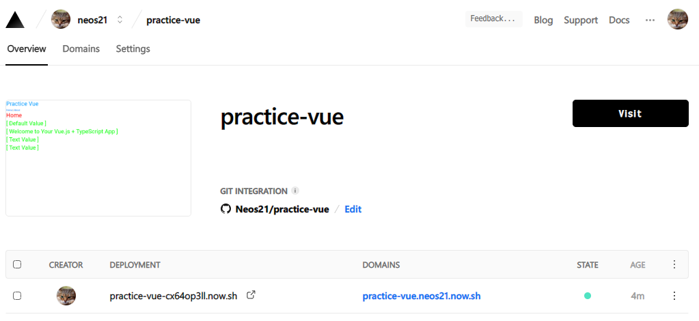

### 再度 Git Integration を有効にしてみる

Zeit Now CLI で作ったプロジェクトに対し、また Git Integration で GitHub リポジトリ連携してみた。その上で `git push` してみたところ、Zeit Now のプロジェクトページで Build ログが見られた。

```
installing build runtime...
build runtime installed: 837.717ms
obtaining caches...
missing `engines` in `package.json`, using default range: 8.10.x
installing to /tmp/403d1885
yarn install v1.17.3
info No lockfile found.
[1/4] Resolving packages...
warning @vue/cli-plugin-eslint > eslint > file-entry-cache > flat-cache > circular-json@0.3.3: CircularJSON is in maintenance only, flatted is its successor.
[2/4] Fetching packages...
info fsevents@1.2.9: The platform "linux" is incompatible with this module.
info "fsevents@1.2.9" is an optional dependency and failed compatibility check. Excluding it from installation.
[3/4] Linking dependencies...
warning " > bootstrap@4.3.1" has unmet peer dependency "jquery@1.9.1 - 3".
warning " > sass-loader@7.3.1" has unmet peer dependency "webpack@^3.0.0 || ^4.0.0".
[4/4] Building fresh packages...
success Saved lockfile.
Done in 45.45s.
running "yarn run now-build"
yarn run v1.17.3
$ npm run build
npm

WARN lifecycle The node binary used for scripts is /tmp/yarn--1568727154064-0.21926342155500111/node but npm is using /node8/bin/node itself. Use the `--scripts-prepend-node-path` option to include the path for the node binary npm was executed with.

> practice-vue@0.0.0 build /tmp/403d1885
> vue-cli-service build

-  Building for production...
Starting type checking service...
Using 1 worker with 2048MB memory limit
=============

WARNING: You are currently running a version of TypeScript which is not officially supported by typescript-estree.

You may find that it works just fine, or you may not.

SUPPORTED TYPESCRIPT VERSIONS: >=3.2.1 <3.6.0

YOUR TYPESCRIPT VERSION: 3.6.3

Please only submit bug reports when using the officially supported version.

=============
=============

WARNING: You are currently running a version of TypeScript which is not officially supported by typescript-estree.

You may find that it works just fine, or you may not.

SUPPORTED TYPESCRIPT VERSIONS: >=3.2.1 <3.6.0

YOUR TYPESCRIPT VERSION: 3.6.3

Please only submit bug reports when using the officially supported version.

=============
 WARNING  Compiled with 2 warnings13:33:05

 warning

asset size limit: The following asset(s) exceed the recommended size limit (244 KiB).
This can impact web performance.
Assets:
  js/chunk-vendors.d524f53c.js (501 KiB)

 warning

entrypoint size limit: The following entrypoint(s) combined asset size exceeds the recommended limit (244 KiB). This can impact web performance.
Entrypoints:
  app (951 KiB)
      css/chunk-vendors.e660d170.css
      js/chunk-vendors.d524f53c.js
      css/app.66c18c29.css
      js/app.61fa0a97.js

  File                                   Size              Gzipped

  dist/js/chunk-vendors.d524f53c.js      500.82 KiB        140.61 KiB
  dist/js/app.61fa0a97.js                9.20 KiB          3.18 KiB
  dist/js/about.d8e476a7.js              1.61 KiB          0.81 KiB
  dist/css/chunk-vendors.e660d170.css    222.81 KiB        29.95 KiB
  dist/css/app.66c18c29.css              217.84 KiB        25.21 KiB

  Images and other types of assets omitted.

 DONE  Build complete. The dist directory is ready to be deployed.
 INFO  Check out deployment instructions at https://cli.vuejs.org/guide/deployment.html

Done in 32.80s.
done
done
```

大変長ったらしいが、途中で _`running "yarn run now-build"`_ と出力されているように、`package.json` に書いた `now-build` スクリプトが動いていることが分かる。上手くビルド・デプロイされた。

### `routes` を書いてみる

`now.json` にルーティング定義を書いてみる。

```json
{
  "version": 2,
  "name": "practice-vue",
  "alias": "practice-vue.neos21.now.sh",
  "builds": [
    {
      "src": "package.json",
      "use": "@now/static-build",
      "config": {
        "distDir": "dist"
      }
    }
  ],
  "routes": [
    { "src": "/(.*)", "dest": "/dist/$1" }
  ]
}
```

念のためローカルで `./dist/` ディレクトリは削除しておき、Zeit Now 上でビルドがされることを確認できるようにした。

この内容で `$ now` してみた。デプロイは完了し、Vue アプリが表示されたので、Zeit Now 上でビルドされたモノが参照できているようだ。

## マジでゼロコンフィグかよ…


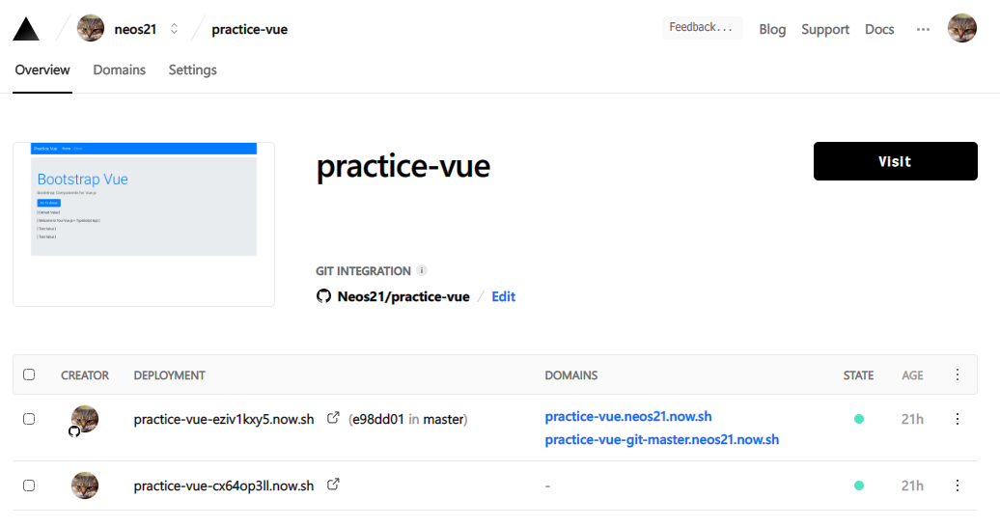

何か色々試したけど、`now.json` で指定したいのは `alias` の URL くらいで、ビルドもルーティングも、Zeit Now に自動認識させてうまいことやってもらう内容で十分だ。少なくとも Vue プロジェクトは何も考えずにデプロイできてしまった。

Git Integration 機能で GitHub 連携している時は、もはや `$ now` コマンドすら不要で、`$ git push` すれば自動的にビルド・デプロイされるので、ホントに何の管理も必要ない、夢のゼロコンフィグが実現されていた。

なお、今回 Zeit Now にデプロイしたプロジェクトは以下。2つの URL はいずれも最新のコミットからビルドされている。

- [Practice Vue](https://practice-vue.neos21.now.sh/)
- [Practice Vue](https://practice-vue-git-master.neos21.now.sh/)

GitHub リポジトリは以下。

- [GitHub - Neos21/practice-vue: Practice Vue](https://github.com/Neos21/practice-vue)

## 参考文献

- [Now でクラウドの複雑さから解放されよう、今すぐに - Qiita](https://qiita.com/aggre/items/f0cb9f8b8e8c54768e50)
- [Now 2 にアップグレードした](https://aggre.io/post/now-2)
- [ZEIT NOWにNuxtをデプロイする - Qiita](https://qiita.com/gemetasu1103/items/ae45bd38035c2076f282)
- [now: リアルタイム・グルーバル・デプロイメント - Qiita](https://qiita.com/nkzawa/items/8bf62549f79ebbcaafd8)
- [Now をつかおう。 - Now (ZEIT now.sh) の簡単な使い方](https://jpn.now.sh/)
- [Vue.jsアプリをNow（zeit.co）にデプロイするまでの手順と使い方](https://www.virment.com/deploying-vuejs-app-to-now/)
- [hugo に続いてコマンドでサイト公開。](https://balloon.gq/2018/12/hugo-%E3%81%AB%E7%B6%9A%E3%81%84%E3%81%A6%E3%82%B3%E3%83%9E%E3%83%B3%E3%83%89%E3%81%A7%E3%82%B5%E3%82%A4%E3%83%88%E5%85%AC%E9%96%8B/)
