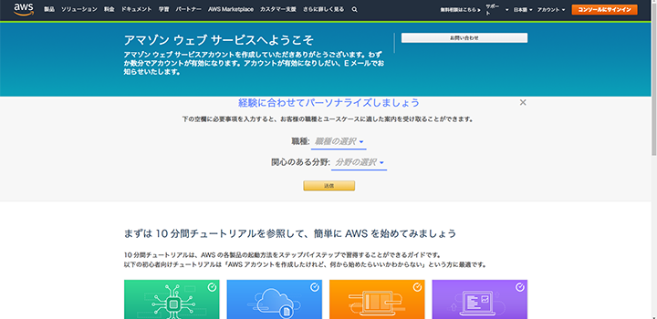
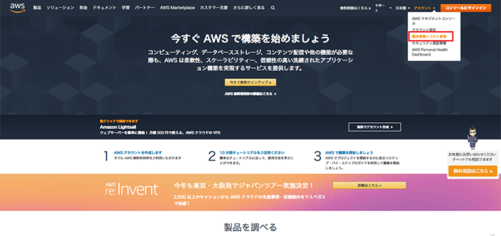

この前、GCP (Google Cloud Platform) に登録し、永久無料枠だけを使うため1円も課金されないよう予算アラートを設定した。

- [永久無料枠で Google Compute Engine (GCE) インスタンスを立ち上げる : その1](/blog/2019/08/01-01.html)
- [永久無料枠で Google Compute Engine (GCE) インスタンスを立ち上げる : その2](/blog/2019/08/02-01.html)

今回は **AWS** に登録して、コチラも永久無料枠だけを使う狙いで、1円も課金されないよう、請求アラームを設定してみる。画像多めでお送り。

## 目次

## AWS に登録する

まずは AWS に登録しよう。以下のページに飛び、「コンソールにサインイン」を選んだら「新しい AWS アカウントの作成」を選ぶ。

- [クラウドならアマゾン ウェブ サービス 【AWS 公式】](https://aws.amazon.com/jp/)

AWS アカウントは、Amazon.com や Amazon.co.jp のアカウントとは全く別に作成する。

住所入力。

請求用のクレジットカードを入力。

本人確認のため携帯電話番号を入れる。

SMS で認証コードが届くので、それを入れる。

認証完了。

サポートプランは無料の「ベーシックプラン」を選択。

登録ができたら、トップ画面に戻るのでログインする。

ログインできたら問題なく登録完了。

## 請求アラートの受信設定

続いて請求アラートを設定する。AWS トップ画面の右上、「アカウント」メニューから「請求情報とコスト管理」を選ぶ。

「請求情報とコスト管理ダッシュボード」画面に移動したら、左メニューから「Billing の設定」を選ぶ。

この「設定画面」の「コスト管理設定」より、

- 無料利用枠の使用のアラートの受信
- 請求アラートを受け取る

にチェックを入れて「設定の保存」を選ぶ。

コレで無料枠を超えた時にメールでアラートを受信できるようになる。

## 1円でも課金されたらアラームを通知する

ココまでの画面では「アラート」と表現しているのだが、ココから先の画面では「アラーム」という表現になる。CloudWatch という AWS の請求額などを監視するサービスを利用して、1円でも課金された時にアラームを鳴らすようにする。公式のガイドは以下。

- 参考：[AWS の予想請求額をモニタリングする請求アラームの作成 - Amazon CloudWatch](https://docs.aws.amazon.com/ja_jp/AmazonCloudWatch/latest/monitoring/monitor_estimated_charges_with_cloudwatch.html)

先程の「設定」画面にある*「請求アラートを管理する」*リンクなどから、CloudWatch コンソールを開く。開き方が分からなければ以下のリンクに遷移する。

- <https://console.aws.amazon.com/cloudwatch/>

上のような画面に移動できれば OK。右上のリージョンで「バージニア北部」が選ばれていること。

左メニューから「アラーム」を選び、「アラームの作成」を選択する。

「メトリクスと条件の指定」画面に移動したら「メトリクスの選択」ボタンを押下する。

「メトリクスの選択」ダイアログが開いたら「請求」メトリクスを選択する。

続いて「概算合計請求額」を選択する。

出てきた画面で「通貨」から「USD」(メトリクス名「EstimatedCharges」) にチェックを入れ、「メトリクスの選択」ボタンを押下する。

次の画面に移動したら、前半は基本的にはデフォルトのまま進めて良い。

- 統計：最大
- 期間：6時間

「条件」欄で、

- しきい値の種類：静的
- アラーム条件を定義：以上
- しきい値：**`0.01` USD**

という風に指定する。コレで、0.01ドル、だいたい1円程度の課金がされた時に、アラームを鳴らす設定になる。

次の画面で、アラーム通知を送る先を指定する。登録直後だと SNS トピックを作っていないと思うので、

- 新しいトピックの作成

を選択し、

- 通知を受け取る E メールエンドポイント

に任意のメルアドを入れて「トピックの作成」を選択する。

SNS トピックが作成できたら次に進む。

最後に「説明の追加」画面で適当な名前をつける。

コレで OK。最後にプレビューを確認して、登録する。

以下のように自分が作った請求アラームが追加されていれば完了。

この請求アラーム、**0.01ドルを超過した時にメールをよこすだけ**なので、その後課金が続いている時に気付きにくい。そこで、500円分くらい請求額が増えた時にも同様にアラームを鳴らすようにしておくと、不要な課金が増えていることに気が付きやすくなる。

ということで、同様の手順を踏み、`0.01 USD` ではなく `5.00 USD` を条件に設定した請求アラームをもう一つ作っておく。

こんな感じ。

最初は「データ不足」みたいな表示になっているが、しばらくすると請求額をきちんと監視できるようになる。何も使っていなければ当然請求額は0円なので、この CloudWatch コンソールでは全てが正常に見えているはずだ。

## 以上

コレで AWS への登録と、不要な課金に気が付くための請求アラームの設定が完了した。

AWS は永久無料枠 (ティアタイプ「無期限無料」) で

- Amazon DynamoDB : 25GB 分
- AWS Lambda : 100万リクエスト/月

などが使えるので、無料枠内でうまく活用していきたい。

- 参考：[【AWSメモ②】請求アラーム機能の設定 - Qiita](https://qiita.com/Kento75/items/ca53d4266bc132cc13c6)
