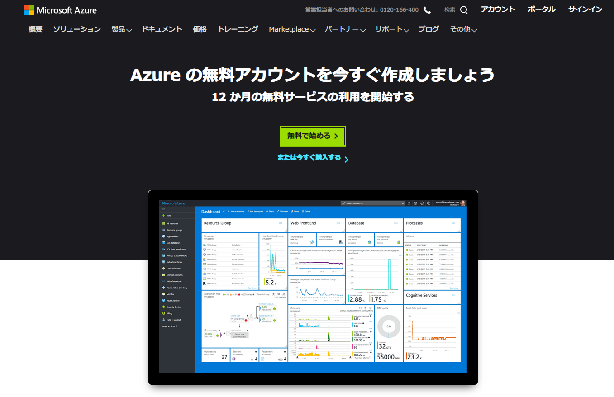
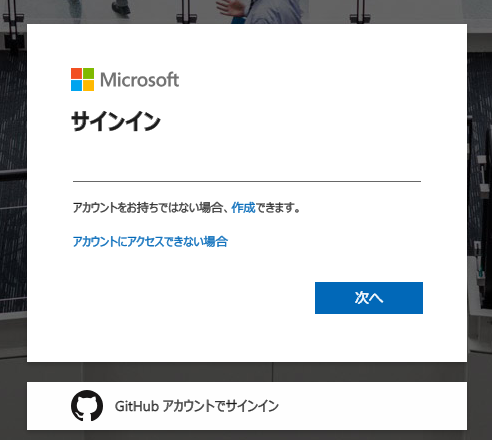
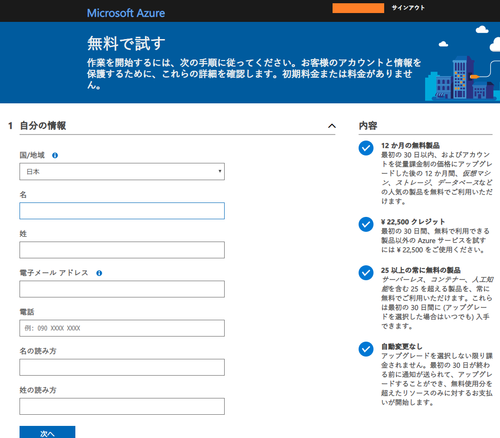
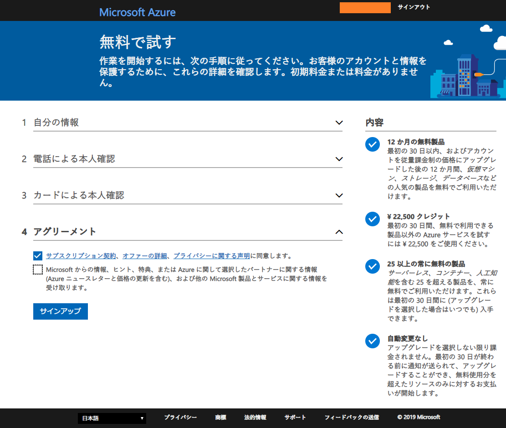
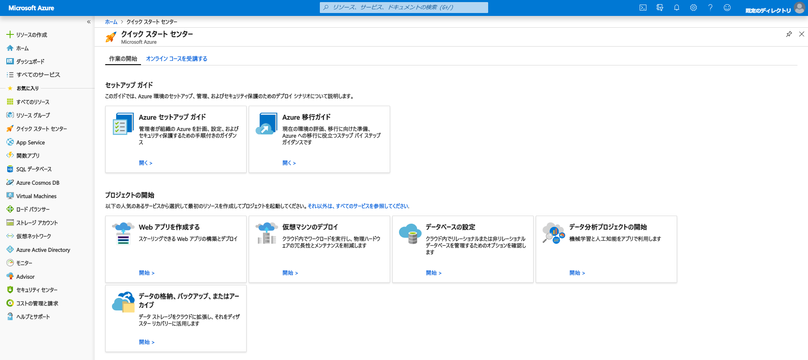

GCP (Google Cloud Platform)、AWS (Amazon Web Services)、OCI (Oracle Cloud Infrastructure) に引き続き、**Microsoft Azure** に登録してみる。

- [Microsoft Azure Cloud Computing Platform & Services](https://azure.microsoft.com/ja-jp/)

↑ 無料で始める。

↑ Microsoft アカウントを持っていればログインして、それと紐付けて Azure アカウントが作れる。

↑ 氏名・住所を入力。続いて SMS (電話番号) による認証と、クレジットカード情報を登録する。

↑ 全部登録できたら進む。

↑ このようなダッシュボードが表示されたら登録完了。

---

Azure は、課金体系を「*サブスクリプション*」という形で表現していて、登録直後は「無料試用版」という無料枠での利用となる。勝手に課金が始まることはないようで、無料試用版から課金型に切り替えて始めて課金が始まる形になる。

- 参考 : [Azureことはじめ〜無料枠で仮想マシンをたててみる〜 ｜ Developers.IO](https://dev.classmethod.jp/etc/azure-first-vm/)
- 参考 : [Azureの無料試用期間が終了したので、無料プランへ移行してみた - Qiita](https://qiita.com/hoshimado/items/3b10a2879d4a6212d320)

Azure は画面のとっつきやすさが特徴的で、Azure DevOps など便利そうなサービスもあるが、料金は少々強めの設定か。Windows OS のサーバを使うとか Office との連携を考えているとかでないと、あまり旨味を感じにくいかもしれない。

ただ、Oracle Cloud とは専用回線で相互接続できるので、「Windows サーバは Azure に、Oracle DB は OCI に」という形でリフト & シフトして、両社のいいとこ取りをするのはアリかもしれない。

- 参考 : [マイクロソフトとオラクル Microsoft Azure と Oracle Cloud の相互接続を発表 – News Center Japan](https://news.microsoft.com/ja-jp/2019/06/10/190610-microsoft-and-oracle-to-interconnect-microsoft-azure-and-oracle-cloud/)
- 参考 : [Microsoft Azure と Oracle CloudをCross-Cloud接続してみてみた - Qiita](https://qiita.com/shirok/items/8a6aa561daa6789fa012)
