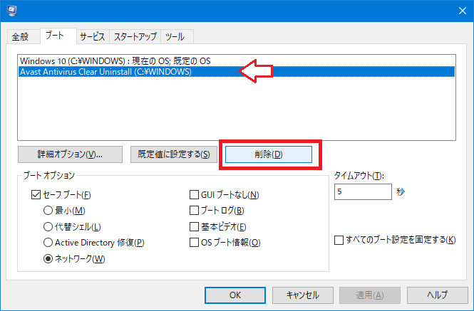

Avast Passwords が便利なので、Avast のアンチウイルス系のコンポーネントはインストールせずに Avast Passwords 部分のみ使っている。

- [Avast Passwords でパスワードを一元管理した](/blog/2018/05/17-01.html)

メインのアンチウイルスソフトは「ウイルスバスター」を使っているので、ウイルスバスターを更新する時に Avast をアンインストールする必要があった。

しかし、どうにもこうにも、Avast のアンインストールが上手くいかない。「プログラムの追加と削除」から削除しても変にゴミが残ったり、ようやくアンインストールできたかと思えば再インストールが成功しない状態になってしまった。

そこで色々調べていたところ、**Avast Clear** という公式のアンインストールツールが存在することが分かった。*公式がココまでしないとアンインストールできないのかよ…。*

- 参考 : [アバスト アンインストール ユーティリティ | aswClear のダウンロード](https://www.avast.co.jp/uninstall-utility)
- 参考 : [Avast Clear｜フリーダウンロード｜使い方 | ソフタロウ](https://softaro.net/avast-clear/)
- 参考 : [【レビュー】「アバスト」をシステムから完全に削除できる公式ツール「Avast Clear」 - 窓の杜](https://forest.watch.impress.co.jp/docs/review/731258.html)

Avast のツール類は「管理者として実行」で動かすのが鉄則。じゃないとたいてい失敗する。Avast Clear を管理者権限で実行してインストールすると、セーフモードで再起動することになり、そこで Avast のアンインストールが行われた。

これでようやくまっさらに削除できたか、と思ったが、その後 PC を起動する度に、

- Windows 10
- Avast Clear Uninstall

のどちらを起動するか、という *OS 選択画面みたいなの*が必ず表示されるようになってしまった。

**アンインストーラがアンインストールできなくなる**というまさかの事態で困っていたが、以下の文献に対処法が書かれていた。

- 参考 : [Avast clear uninstallが削除できません](https://forum.avast.com/index.php?topic=198891.0)

> 1. スタートメニュー -> すべてのプログラム -> アクセサリ -> ファイル名を指定して実行 を起動
> 2. msconfig と入力して「システム構成」ユーティリティを呼び出す
> 3. 「ブート」タブから「Windows 7」を選び、「既定に設定する」をクリック
> 4. 「Avast Clear Uninstall」を選択し、「削除」をクリック
> 5. 「OK」をクリックし、PCを再起動

このとおり、`msconfig` の「ブート」欄から「Avast Clear Uninstall」を削除することで解決できた。

Avast しつこすぎる…
