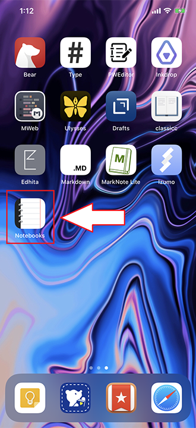
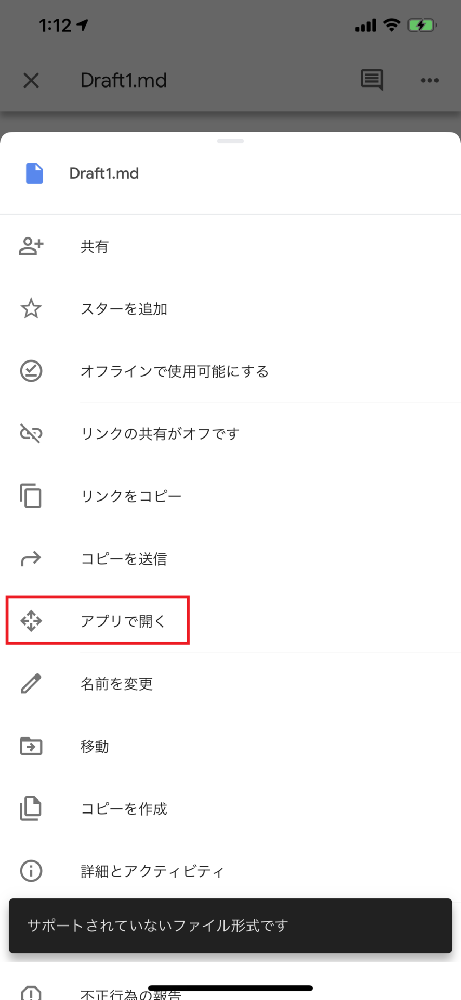
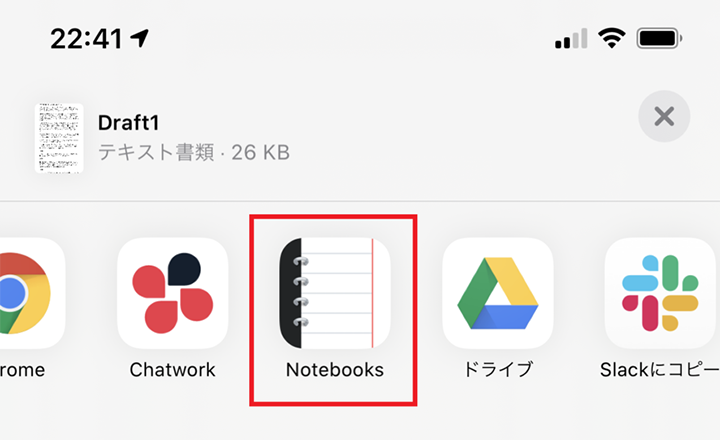
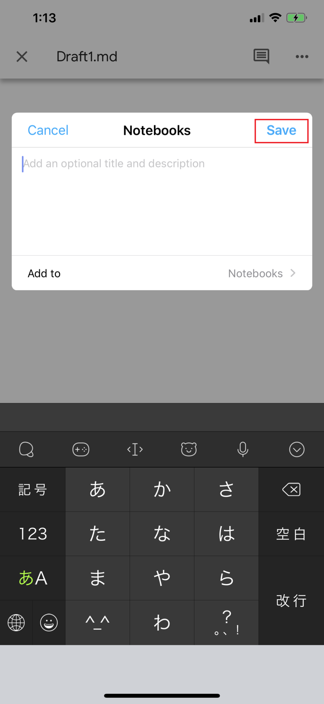
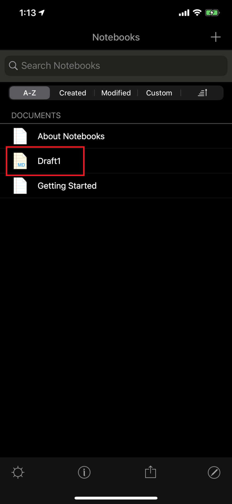
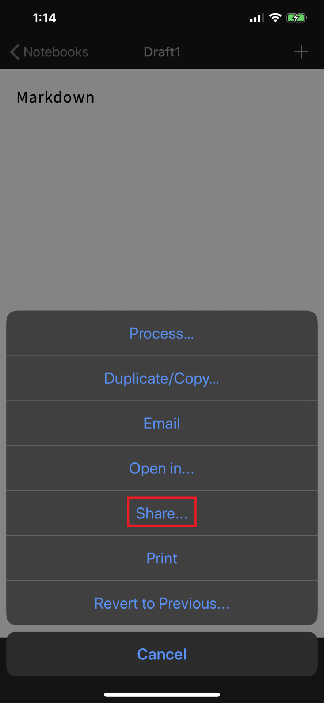
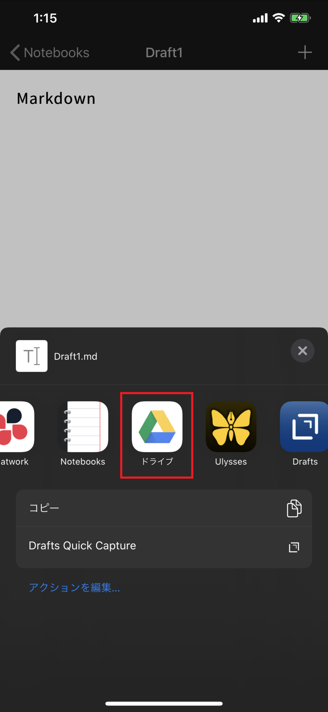
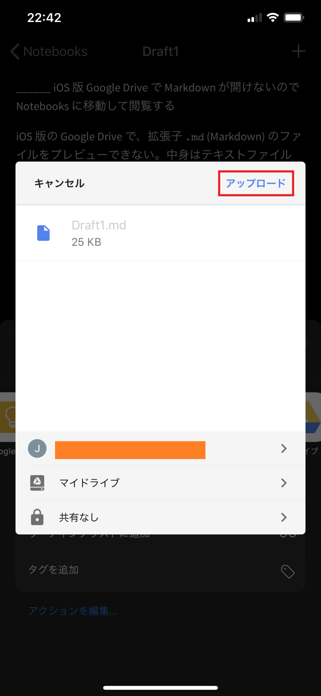

iOS 版の Google Drive で、拡張子 `.md` (Markdown) のファイルをプレビューできない。中身はテキストファイルなのに、テキストファイルとしては表示してくれないようだ。

Google Drive から「ファイルのコピーを送信」という操作ができるので、Markdown ファイルを開ける別のアプリに投げれば良いかな、と思ったのだが、意外と **Google Drive アプリから Markdown ファイルを送りつけられるアプリ**がなくて結構探した。

一番お手頃なところでいくと、*Evernote* アプリに転送すれば、Markdown ファイルを添付したノートが作成されるので、Evernote 内で添付ファイルをタップすれば Markdown がプレビューできる。しかしコレだと、中身を見るためだけに Markdown を添付したノートが作成されてしまい、少々目障りだ。

とりあえず見るだけなら *Evernote* でも良いが、もう少し見やすいのがいいなーと思い探していると、ちょうど良いアプリがあった。それが **Notebooks for iPhone** だ。

↑このアイコンのアプリ。

- 参考 : [「Notebooks for iPhone」をApp Storeで](https://apps.apple.com/jp/app/notebooks-for-iphone/id780442075)

## Google Drive → Notebooks への転送

Google Drive アプリで Markdown ファイルを開こうとすると、「サポートされていないファイル形式です」と表示され、プレビューしてもらえない。ココで「アプリで開く」を選択する (「コピーを送信」でも良いかも)。

すると一覧に Notebooks が出ているので、選択する。

このまま Notebooks に転送する。

Notebooks アプリを開くと、Notebooks 内で管理するノート1枚として取り込まれ、Markdown 書式がキレイにパース表示されている。

## Notebooks → Google Drive への転送

Notebooks で編集したノートを Markdown ファイルとして Google Drive に送り返すこともできる。右下の共有アイコンから「Share...」を選択する。

一覧に Google Drive が表示されるのでコレを選択する。

あとは配置先などを選択すれば OK。

不要な `.txt` テキストファイルも送られてしまうこともあるが、コレくらいなら転送後に Google Drive 側で削除すればよかろう。

このように、双方向に Markdown ファイルがやりとりでき、キレイにプレビューできた。*Notebooks ナイス。*
