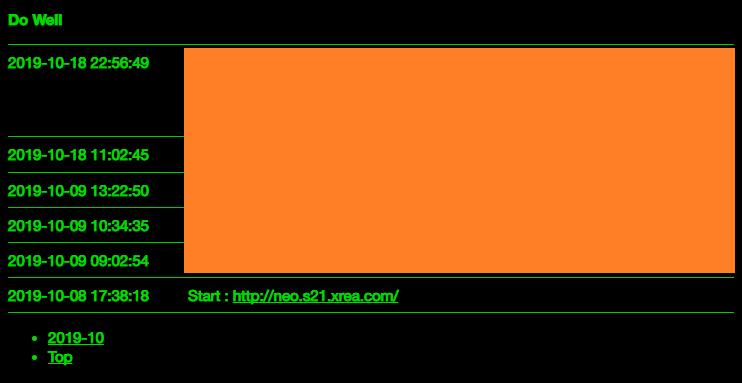
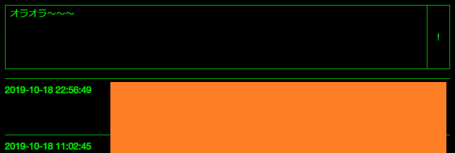

最近、ちょっと過激なツイートをするとすぐにアカウントロックされて1週間とか使えなくなるので、自分だけの Twitter を作ることにした。

無料枠の GCE インスタンスに、Apache と PHP をインストール。単一の PHP ファイルで動作する CGI スクリプトとして組んでみた。



↑スクショ。

そのものズバリではないが、ソースコードは以下に置いた。

- [Neos21/neos-php-micro-blog](https://github.com/Neos21/neos-php-micro-blog)

---

公開しているサイトは、GCE インスタンスの Public IP そのまんま。HTTPS 化もしていない。やろうと思えば Freenom で無料ドメインを取り、Let's Encrypt で無料 HTTPS 化もできるだろうが、ガッツリ作り込む気もなくてこんな感じ。

ツイートはテキストファイルに保存していて、月ごとにファイルを分割するようにしている。テキストファイルは Apache のコンテンツ置き場 (`/var/www/html/`) 以外のところに置いてある。DB とか使わないめんどくさいし。ｗ

通常はツイートを閲覧できるだけの画面なのだが、特別なパラメータを設定すると、投稿フォームが表示される。管理者限定の機能だ。



フォームは自分自身に POST 送信するようになっている。別のパラメータで投稿フォームにパスワードを埋め込むと、そのパスワードをチェックした上で、ツイートがテキストファイルに保存される仕組み。正しいパスワードはスクリプト外に記してある。

テキストエリアに入力された文字列は、`\n` で改行コードが記されている。コレを文字列に変換し、1行のデータとして保存する。文字列置換は `preg_replace()` 関数で行える。

- 参考：[【php】「改行コード」を別文字列に変換する関数を作ってみた](https://nodoame.net/archives/8121)

同様に、`http://` とか `https://` とかいう URL 文字列が出てきたら、それは `a` 要素をかませてリンクとして保存しておきたい。以下の置換スクリプトが参考になった。

- 参考：[【PHP】出力したいテキストからURLを自動で検出し、aタグで囲んでリンク化するコード](https://wemo.tech/2160)

投稿日時を一緒に保存するため、`date()` 関数を利用した。`php.ini` で設定しているかもしれないが、

```php
date_default_timezone_set('Asia/Tokyo');
```

を入れておくとタイムゾーンを確実に合わせられる。

- 参考：[phpで現在日時を取得する方法！ | CodeCampus](https://blog.codecamp.jp/php-datetime)

うまく処理ができず、原因が分からない時は、以下のコードを埋め込んでエラーを画面上に出力させた。

```php
ini_set('display_errors', 'On');
```

- 参考：[PHPのエラー表示設定について - Qiita](https://qiita.com/shotets/items/3c95aef631b2c5eadae5)

色々言語学習しながら作ったモノなので、雑なところがかなり多いが、投稿は自分だけしかしないし、見る人もそういないだろうからこれでおk。
