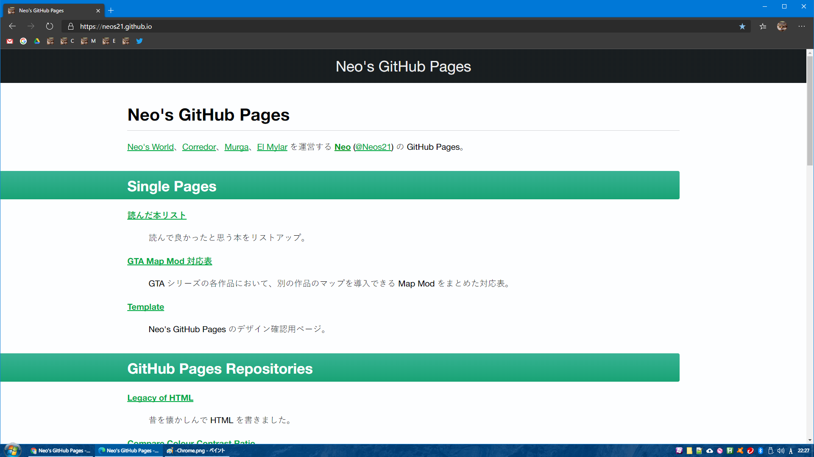
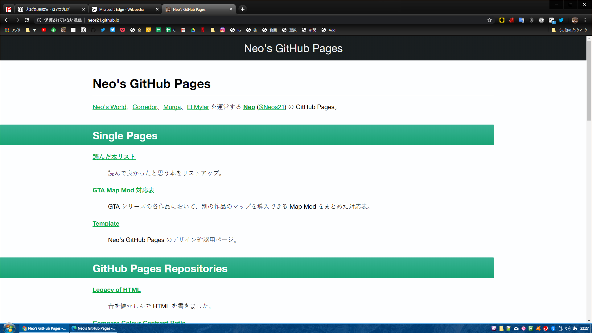

本日 2020-01-16、Chromium ベースの Edge ブラウザ (**Chromium Edge**) がリリースされた。Windows 版だけでなく、Mac・iOS・Android 版も同時リリースされている。現時点では公式サイトよりダウンロードすることでインストールできるが、もう少しすると Windows Update でコレまでの Edge (*Edge Legacy*) に置き換わる形でインストールされるようだ。

- <https://www.microsoft.com/en-us/edge>

早速、Windows・Mac・iOS で触ってみたので、速報をば。

## 目次

## Microsoft アカウントでブックマークなどが同期できる

Chrome の Gmail アカウント、Firefox の Sync アカウントのように、Chromium Edge は Microsoft アカウントでのログインができ、ブックマーク等をデバイス間で同期できるようになっている。Authenticator アプリとの連動も自然で、大変使いやすい。

## Windows・Mac 版は Chrome そのもの

Windows 版と Mac 版の Chromium Edge は、当然といえば当然だが、Chrome とほぼ同じ見た目になる。ウィンドウを重ねてみても、全く同じようにレンダリングされている。

- Windows Chromium Edge  
  
- Windows Chrome  
  

同じ Blink レンダリングエンジンになったので、差がなくて当然だろう。なお、デフォルトのフォント設定などによって、文字の描画はピクセル単位でわずかに異なる箇所が見られるが、要素の配置や行間などはピッタリ一致する。

## iOS 版の Edge は WebKit ベース

iOS 版も新たにリリースされているものの、コチラは iOS の都合により WebKit ベース。本来 Gecko エンジンを使用している Firefox が、iOS 版では WebKit ベースになっているのと同じだ。

自分は試せていないが、Android 版 Edge は、Android Chrome と同じ Blink ベースだという。

- 参考：[Microsoft、Webブラウザ「Edge」をChromiumベースに ブランドは保持 - ITmedia NEWS](https://www.itmedia.co.jp/news/articles/1812/07/news069.html)

## User Agent 文字列が変わっている模様

Edge Legacy と比較して、User Agent 文字列が変わっているようなので、開発者コンソールで `navigator.userAgent` を出力した前後を掲載しておく。

- Windows : *Edge Legacy* (以前の Edge)
  - Microsoft Edge 44.18362.449.0
  - Microsoft EdgeHTML 18.18363

```
"Mozilla/5.0 (Windows NT 10.0; Win64; x64) AppleWebKit/537.36 (KHTML, like Gecko) Chrome/70.0.3538.102 Safari/537.36 Edge/18.18363"
```

- Windows : **Chromium Edge**
  - バージョン 79.0.309.65 (公式ビルド) (64 ビット)

```
"Mozilla/5.0 (Windows NT 10.0; Win64; x64) AppleWebKit/537.36 (KHTML, like Gecko) Chrome/79.0.3945.117 Safari/537.36 Edg/79.0.309.65"
```

コレまで *`Edge/`* と、EdgeHTML のバージョンを表記していたところが、**`Edg/`** と変わっている (`e` がなくなっている)。

下の Chrome の User Agent と見比べてもらえば分かるように、`Chrome/` の後のバージョン番号は Chrome ブラウザの最新版と同じ。`Edg/` 以降のバージョン番号は Chromium Edge のバージョン番号を表記するようになった。

- Windows : Chrome
  - バージョン: 79.0.3945.117（Official Build） （64 ビット）

```
"Mozilla/5.0 (Windows NT 10.0; Win64; x64) AppleWebKit/537.36 (KHTML, like Gecko) Chrome/79.0.3945.117 Safari/537.36"
```

ちなみに Mac 版の Chromium Edge の User Agent は以下のとおり。手前の OS 表記が異なるが、後ろの `Edg/` 部分などは Windows 版と同じ。

- Mac : Chromium Edge
  - バージョン 79.0.309.65 (公式ビルド) (64 ビット)

```
"Mozilla/5.0 (Macintosh; Intel Mac OS X 10_14_6) AppleWebKit/537.36 (KHTML, like Gecko) Chrome/79.0.3945.117 Safari/537.36 Edg/79.0.309.65"
```

## いつの間にか「Windows 游ゴシック Medium 問題」が解消できるようになっている…

Chromium Edge の使い勝手を見るために色々といじくっていたら、あることに気付いた。

このブログでも何回か書いている、*「Windows で游ゴシック Regular が適用されてしまい、文字がかすれて見える」問題*が、上手く解消できるようになっていた。

- [ウェブサイトに適用する游ゴシックフォントを見直しまくった最終解](/blog/2019/01/05-02.html)
  - [Windows・Chrome で游ゴシックフォントを少しだけ太く見せる JavaScript と CSS](/blog/2019/01/27-01.html)
  - [Windows の游ゴシック Regular・Light を Medium フォントに差し替えて太く見せる VBScript](/blog/2019/02/24-01.html)
- 他に Firefox でも対処したことがあるが…
  - [Firefox の Stylish でできるオススメフォント設定](/blog/2018/01/15-03.html)
  - [Windows の Firefox でフォントが汚かったので直した](/blog/2018/02/13-01.html)

Chrome のバージョンアップによって、`font-weight: 500` 指定が効かなくなったり、`@font-face` 指定が効かなくなったり、と、色々あったのだが、現在の v79 で確認したところ、**`@font-face` 指定が効くようになっていた**。この動作は Chromium Edge や Firefox、IE11、おまけに Mac の Safari でも同様で、現行の主要ブラウザのほぼ全てで上手く行くスタイルが作れるようになっていた。

**詳細は明日記事をアップするので、お楽しみに。** → アップした。

- [2020年1月版・かすれない游ゴシックを実現する font-family 指定](/blog/2020/01/17-01.html)

## 以上

未だ IE11 が Windows OS に同梱されているため、中々 IE11 を切り捨てにくいところだし、Edge についても Edge Legacy のシェアはもうしばらく続くと思われるので、一気に Edge Legacy 対応を切ってしまうのは難しいところがある。

だが、確実に「IE や Edge で苦しめられてきた状況」は改善に近付いており、Blink・WebKit・Gecko の3つに対応すれば十分、という時代がもうそこまで来ている。さらに、Firefox は Chrome と同じ WebExtension API をベースとした拡張機能が使えるようになっているし、一見したブラウザの使い勝手というのは大きく差がない (というか中身がどれも同じ) 状態になってきている。かつてのブラウザ競争が落ち着き、安定したユーザ体験を提供できる環境が整いつつあり、嬉しい限り。
