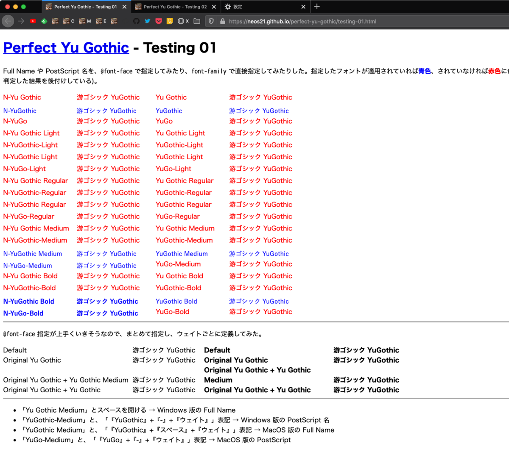

コレまで幾度となく戦ってきた *Windows 游ゴシック*だが、Chromium Edge のリリースに合わせて、現時点の最新の主要ブラウザで改めてレンダリングを確認してみた。すると、**上手く游ゴシック Medium で描画させる `@font-face` 指定が導けた**ので、紹介する。

## 目次

## TL;DR : 先に改良コードを載せる

**2020年1月時点の主要最新ブラウザで游ゴシック Medium を表示するためのコードは以下。**

- *1 : `"Yu Gothic"` の定義を上書きする `@font-face` を指定する方法*

```css
@font-face { font-family: "Yu Gothic"; src: local("Yu Gothic Medium"), local("YuGothic-Medium");                    }
@font-face { font-family: "Yu Gothic"; src: local("Yu Gothic Bold")  , local("YuGothic-Bold")  ; font-weight: bold; }
body { font-family: YuGothic, "Yu Gothic", sans-serif; }
```

詳細は後述するが、*最近の Chrome などで無視されていた `@font-face` 指定が、また解釈されるようになっていた*のだった。

ただ、今後ブラウザの仕様変更によって、また `@font-face` 指定が効かなくなることもあるかもしれない。そんな時に、上のやり方だと Regular ウェイトの游ゴシックで表示されてしまう恐れがある。

**もしも `@font-face` 指定が無視されてしまった時に、Regular ウェイトを適用せず、メイリオなどをフォールバックで適用させるようにするなら、以下のコード。**

- **2 : オリジナルの `font-family` を定義する方法**

```css
@font-face { font-family: "Original Yu Gothic"; src: local("Yu Gothic Medium"), local("YuGothic-Medium");                    }
@font-face { font-family: "Original Yu Gothic"; src: local("Yu Gothic Bold")  , local("YuGothic-Bold")  ; font-weight: bold; }
body { font-family: YuGothic, "Original Yu Gothic", Meiryo, sans-serif; }
```

よく `font-weight` を 100 から 900 まで書くパターンも見られる。そちらで実装しても、表示結果は上の2つと同じだった。*より堅牢に実装したい場合*は次のように実装しても良いだろう。

- *3 : オリジナルの `font-family` で、`font-weight` を精緻に定義する方法*

```css
@font-face { font-family: "Original Yu Gothic"; src: local("Yu Gothic Medium"), local("YuGothic-Medium"); font-weight: 100; }
@font-face { font-family: "Original Yu Gothic"; src: local("Yu Gothic Medium"), local("YuGothic-Medium"); font-weight: 200; }
@font-face { font-family: "Original Yu Gothic"; src: local("Yu Gothic Medium"), local("YuGothic-Medium"); font-weight: 300; }
@font-face { font-family: "Original Yu Gothic"; src: local("Yu Gothic Medium"), local("YuGothic-Medium"); font-weight: 400; }
@font-face { font-family: "Original Yu Gothic"; src: local("Yu Gothic Medium"), local("YuGothic-Medium"); font-weight: 500; }
@font-face { font-family: "Original Yu Gothic"; src: local("Yu Gothic Bold")  , local("YuGothic-Bold")  ; font-weight: 600; }
@font-face { font-family: "Original Yu Gothic"; src: local("Yu Gothic Bold")  , local("YuGothic-Bold")  ; font-weight: 700; }
@font-face { font-family: "Original Yu Gothic"; src: local("Yu Gothic Bold")  , local("YuGothic-Bold")  ; font-weight: 800; }
@font-face { font-family: "Original Yu Gothic"; src: local("Yu Gothic Bold")  , local("YuGothic-Bold")  ; font-weight: 900; }
body { font-family: YuGothic, "Original Yu Gothic", Meiryo, sans-serif; }
```

## 游ゴシックフォントの実験場サイトを作った

游ゴシックフォントの実験場サイト**「Perfect Yu Gothic」**を開いた。GitHub Pages は以下。

- [Perfect Yu Gothic](https://neos21.github.io/poc-perfect-yu-gothic/index.html)

GitHub リポジトリは以下。

- [Neos21/poc-perfect-yu-gothic](https://github.com/Neos21/poc-perfect-yu-gothic)

今回この記事で書く内容は、この実験場サイトで色々と検証した結果となる。

## 検証に使用した OS・ブラウザのバージョン

検証に使用したブラウザは以下のとおり。

- Windows10
  - Chrome : v79 … `バージョン: 79.0.3945.117（Official Build） （64 ビット）`
  - Chromium Edge : v79 … `バージョン 79.0.309.65 (公式ビルド) (64 ビット)`
  - Firefox : v72 … `72.0.1 (64 ビット)`
  - IE : v11 … `バージョン: 11.592.18362.0`・`更新バージョン: 11.0.170 (KB4534251)`
- MacOS Mojave
  - Chrome : v79 … `バージョン: 79.0.3945.117（Official Build） （64 ビット）`
  - Chromium Edge : v79 … `バージョン 79.0.309.65 (公式ビルド) (64 ビット)`
  - Firefox : v72 … `72.0.1 (64 ビット)`
  - Safari : v13 … `バージョン13.0.2 (14608.2.40.1.2)`

## フォント名の「Full Name」と「PostScript 名」

フォント名の表記には「Full Name」と「PostScript 名」という2種類の表記方法がある。

- 参考：[游フォントがとにかくややこしい話 - Acetaminophen's diary](http://acetaminophen.hatenablog.com/entry/2016/02/15/225009)

今回はこの「Full Name」と「PostScript 名」を調べ直し、これらを `@font-face` の `src: local()` で指定した場合と，直接 `font-family` に書いた場合とで、見え方に違いが出るか、各ブラウザで確認してみた。

```css
/* 次のように @font-face で定義してみる */

/* Windows 游ゴシック・Medium ウェイトの Full Name 表記 */
@font-face           { font-family: "Full Name Yu Gothic"; src: local("Yu Gothic Medium"); }
.font-face-full-name { font-family: "Full Name Yu Gothic"; }

/* Windows 游ゴシック・Medium ウェイトの PostScript 表記 */
@font-face             { font-family: "Post Script Yu Gothic"; src: local("YuGothic-Medium"); }
.font-face-post-script { font-family: "Post Script Yu Gothic"; }

/* 次のように font-family で直接指定する */

/* Windows 游ゴシック・Medium ウェイトの Full Name 表記 */
.font-family-full-name   { font-family: "Yu Gothic Medium"; }

/* Windows 游ゴシック・Medium ウェイトの PostScript 表記 */
.font-family-post-script { font-family: "YuGothic-Medium" ; }
```

実際に検証用に作ったページは以下。左半分のカラムが `@font-face` 指定で、右半分が `font-family` 直指定。そのフォントが正しく反映されていると青色、反映されていないと赤色にしている。

- [Perfect Yu Gothic - Testing 01](https://neos21.github.io/poc-perfect-yu-gothic/testing-01.html)

手元で撮ったスクショは以下。

- Windows Chrome
  - 
- Windows Chromium Edge
  - 
- Windows Firefox
  - 
- Windows IE
  - 

Chrome と Chromium Edge は、さすがに同じ Blink エンジンなので、見た目も同じ。Gecko エンジンの Firefox は全体的に Chrome 系より太めに見える。IE だけ無効になっている指定値が結構見られるが、**概ね `@font-face` 指定が上手く効いていることが分かる。**

ついでに、MacOS 向けの Full Name と PostScript 名もテストしているので、スクショを貼っておく。

- MacOS Chrome
  - 
- MacOS Chromium Edge
  - 
- MacOS Firefox
  - 
- MacOS Safari
  - 

MacOS にはそもそも Light・Regular ウェイトが搭載されていないので、見た目は「×」が多いが問題なし。`@font-face` で Full Name や PostScript 名を指定すると、ウェイト込みでの指定も綺麗にできそうだ。ただ、結局のところそれは `font-family: YuGothic` とさえ指定すれば同じことなので、参考までに。

一覧表にするとこんな感じ。


ということで、以前使えなくなっていた `@font-face` 指定に可能性が出たので、追加で細かい検証をしておいた。

## `font-weight` 指定は 100 ごとにしなくても問題なし

`@font-face` でフォントを定義する時、`font-weight` を 100 から 900 まで、9段階で実装しているモノをよく見かける。あれはあれで、精緻で堅牢な実装で、確実さはあるのだが、いささかコード量が多いと感じる。そこで、以前からやっていた簡素な書き方と、レンダリングに違いが出るか確認してみた。

```css
/* 簡素に実装したバージョン */
@font-face  { font-family: "Original Yu Gothic Simplified"; src: local("Yu Gothic Medium"), local("YuGothic-Medium");                    }
@font-face  { font-family: "Original Yu Gothic Simplified"; src: local("Yu Gothic Bold")  , local("YuGothic-Bold")  ; font-weight: bold; }
.simplified { font-family: "Original Yu Gothic Simplified"; }

/* 詳細に実装したバージョン */
@font-face { font-family: "Original Yu Gothic Detailed"; src: local("Yu Gothic Medium"), local("YuGothic-Medium"); font-weight: 100; }
@font-face { font-family: "Original Yu Gothic Detailed"; src: local("Yu Gothic Medium"), local("YuGothic-Medium"); font-weight: 200; }
@font-face { font-family: "Original Yu Gothic Detailed"; src: local("Yu Gothic Medium"), local("YuGothic-Medium"); font-weight: 300; }
@font-face { font-family: "Original Yu Gothic Detailed"; src: local("Yu Gothic Medium"), local("YuGothic-Medium"); font-weight: 400; }
@font-face { font-family: "Original Yu Gothic Detailed"; src: local("Yu Gothic Medium"), local("YuGothic-Medium"); font-weight: 500; }
@font-face { font-family: "Original Yu Gothic Detailed"; src: local("Yu Gothic Bold")  , local("YuGothic-Bold")  ; font-weight: 600; }
@font-face { font-family: "Original Yu Gothic Detailed"; src: local("Yu Gothic Bold")  , local("YuGothic-Bold")  ; font-weight: 700; }
@font-face { font-family: "Original Yu Gothic Detailed"; src: local("Yu Gothic Bold")  , local("YuGothic-Bold")  ; font-weight: 800; }
@font-face { font-family: "Original Yu Gothic Detailed"; src: local("Yu Gothic Bold")  , local("YuGothic-Bold")  ; font-weight: 900; }
.detailed  { font-family: "Original Yu Gothic Detailed"; }
```

実際の検証ページは以下。

- [Perfect Yu Gothic - Testing 02](https://neos21.github.io/poc-perfect-yu-gothic/testing-02.html)

キャプチャは以下。フォントを指定していない「未指定」のところには、9段階のウェイトを持つ「ヒラギノ角ゴシック」(MacOS から Windows に輸入した) をブラウザデフォルトとして指定しているので、比較しやすいかと。

- Windows Chrome
  - 
- Windows Chromium Edge
  - 
- Windows Firefox
  - 
- Windows IE
  - 

このとおり、簡素に実装したバージョンと、詳細に実装したバージョンとで、描画のされ方に違いは見られなかった。簡素に実装したバージョンは、`font-weight: 600` から Bold フォントが使われた。

同検証ページは `font-family: YuGothic` を併記しているので、MacOS での描画も同時に確認しておいた。

- MacOS Chrome
  - 
- MacOS Chromium Edge
  - 
- MacOS Firefox
  - 
- MacOS Safari
  - 

## 結論再掲 : `@font-face` で Full Name と PostScript 名を指定すれば OK

ということで、「TL;DR」で紹介したコードに行き着いたというワケ。

`"Yu Gothic"` を上書きするパターン、オリジナルのフォント名を作る簡素パターン、詳細に実装するパターンと、**3つのバリエーションを掲載したが、どれを選ぶかは完全に好み。**個人的には `"Yu Gothic"` 指定を上書きする1つ目のパターンが気に入っているかな。メイリオはどうしてもモッサリしているので、それだったら Regular ウェイトの游ゴシックが当たってもいいかなーと。

以上が、2020年1月時点で、Web サイト作成者が実施できる対策だ。

## クライアントサイドでできる対策を再度まとめる

### ユーザスタイルシートで `@font-face` 指定を追加する

自分のサイト以外の `"Yu Gothic", "游ゴシック"` 指定についても、Medium を適用して読みやすくしたいと思うだろう。そんな場合は、**Stylish** などのブラウザ拡張機能を使い、次のような*ユーザスタイルシート*を導入してやると良い。

```css
@font-face { font-family: "Yu Gothic"        ; src: local("Yu Gothic Medium"), local("YuGothic-Medium");                    }
@font-face { font-family: "Yu Gothic"        ; src: local("Yu Gothic Bold")  , local("YuGothic-Bold")  ; font-weight: bold; }
@font-face { font-family: "Yu Gothic Medium" ; src: local("Yu Gothic Medium"), local("YuGothic-Medium");                    }
@font-face { font-family: "Yu Gothic Medium" ; src: local("Yu Gothic Bold")  , local("YuGothic-Bold")  ; font-weight: bold; }
@font-face { font-family: "游ゴシック"       ; src: local("Yu Gothic Medium"), local("YuGothic-Medium");                    }
@font-face { font-family: "游ゴシック"       ; src: local("Yu Gothic Bold")  , local("YuGothic-Bold")  ; font-weight: bold; }
@font-face { font-family: "游ゴシック Medium"; src: local("Yu Gothic Medium"), local("YuGothic-Medium");                    }
@font-face { font-family: "游ゴシック Medium"; src: local("Yu Gothic Bold")  , local("YuGothic-Bold")  ; font-weight: bold; }
```

同様の手法は以前も紹介したが、ある時から Chorme で使えなくなっていた。それが現在の Chrome v79 ではまた利用できるようになっていたので、再掲。

- [Firefox の Stylish でできるオススメフォント設定](/blog/2018/01/15-03.html)

手元で試したところ、IE の「インターネットオプション」から指定できる「ユーザスタイルシート」で上のような記述を入れたら、IE がバグった (どのページもレンダリングできなくなり、CSS ファイルを空にしないとハングが解消できなくなった)。Chromium Edge は対応する拡張機能がまだなさげなので、現状は Stylish がインストールできる Chrome と Firefox だけかな。

### ユーザスタイルシートで `-webkit-text-stroke-width` を指定する

コレも以前から何回かお伝えしている方法だが、`-webkit-text-stroke-width` というプロパティを指定すると、文字を太く見せられる。上の `@font-face` 指定と併用すると良いだろう。

```css
* { -webkit-text-stroke-width: .4px !important; }
```

`.4px` 部分をお好みに応じて増減する。手元で試している感じだと、Chrome の場合「游ゴシック Medium」が適用されてもまだ薄く見えるので、**`.5px`** ぐらいを指定しても良いと思う。Firefox は Medium 指定だけで十分太く見えているので、コレを併用するとしても *`.2px`* ぐらいで良いかもしれない。

### 究極 : レジストリ変更

Regular ウェイト・Light ウェイトを Medium ウェイトのフォントファイルと差し替えてしまう、という最終技。以前から紹介しているとおりで、一番効果はある。

- [ウェブサイトに適用する游ゴシックフォントを見直しまくった最終解](/blog/2019/01/05-02.html)
- [Windows の游ゴシック Regular・Light を Medium フォントに差し替えて太く見せる VBScript](/blog/2019/02/24-01.html)

## 効果がなくなった手法 : MacType はどのブラウザも効かなくなっている模様

どういう仕様変更があったのか知らないが、本稿執筆時点の Windows 10 環境で試したところ、**MacType** がページのフォントレンダリングを改善してくれるブラウザが1つもなくなっていた。以下は MacType の有効・無効を切り替えた時のキャプチャ。

- MacType 無効 (Off)
  - 
- MacType 有効 (On)
  - 

左上 Chrome・左下 Chromium Edge・右上 Firefox・右下 IE。IE はメニューバーなどに MacType が効いてはいるが、ページ中のフォントには影響していない。以前は確かアンチエイリアスがかかったと思うんだけど…？

とりあえず、MacType で何とか出来なくなったなら、ホントに CSS で頑張るしかなくなったワケだ。

## 以上

なんだか結局、以前やっていた `@font-face` 指定に戻れることになって、ブラウザに振り回されてる感じ。拙作の *Neo's Normalize* も対応しておこうかな。
