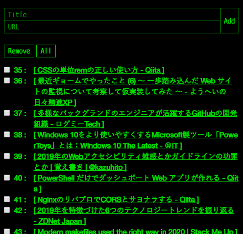

「はてなブックマーク」や「Pocket」など、ログインして利用する系のブックマークサービスを使いたくない場面が出てきたので、オレオレブックマークアプリというか、オレオレ Read It Later アプリを作ってみた。

CentOS の GCE インスタンスに、Apache と Ruby をインストール。Apache 上で Ruby を CGI として動作させられるよう設定変更した上で、単一の Ruby スクリプトファイルだけで動作するアプリを組んだ。Rails やサードパーティモジュールは使っていない。

ソースコードは以下。

- [Neos21/neos-ruby-bookmarks](https://github.com/Neos21/neos-ruby-bookmarks)

## どんなアプリ？

ベースの考え方は、PHP で作った「オレオレ Twitter」アプリに近い。

- [PHP で自分だけの簡易 Twitter を作ってみた](/blog/2019/12/23-01.html)

予め「クレデンシャルファイル」にアクセス用パスワード文字列を書いておき、リクエストパラメータで指定したパスワードをチェックすることで、自分だけがアクセスして閲覧できるアプリにしてある。

パスワードを指定してアクセスすると、次のような画面になる。



上はブックマークの追加フォーム。下に追加してあるブックマークが一覧表示されている。チェックボックスをチェックしていけば削除できる、という仕組み。

パスワードを指定しないと、ブックマーク一覧の閲覧もできないし、ブックマークの追加や削除もできない。

今回も DB は使わず、テキストファイルでブックマーク一覧やシーケンス値を管理している。シーケンスの仕組みは、複数のブックマークを一括削除する際に、削除する行を特定する目的で用意した。

ブックマークの追加・削除の処理を呼び出す時も GET メソッドでリクエストする乱暴な仕様だが、コレのおかげで「ブックマークレット」によるブックマーク追加が可能になっている。

以下のようなブックマークレットを作れば、*閲覧中のページをブックマークに追加できる*という仕組みだ。

```javascript
javascript:(() => {
  window.open(
    'http://【HostName】/index.rb?credential=【Credential】&mode=add&title='
    + encodeURIComponent(document.title)
    + '&url='
    + encodeURIComponent(document.URL)
  );
})();
```

コレがやりたくてこのアプリを作った。

## Ruby CGI 実装に際しての学習メモ

コレまで自分は Rails 中心で、生 Ruby をほとんど触ってきてこなかったので、今回のようにある種レガシーな Ruby CGI を実装してみると、新たな学びも多かった。思いつくままに学習メモを書き残しておこうと思う。

### 命名規則

- メソッド名、変数名 : スネークケース
- 定数 : アッパースネークケース (1文字目が大文字なら定数になる)
- グローバル変数 : `$` 始まりの変数名にする

### 文字列のシングルクォートとダブルクォート

Perl や PHP、Bash などと同じく、シングルクォートだと変数展開がされず、ダブルクォートだと変数展開される。

文字列中に変数を書くには、`#{変数名}` と書く。

### ヒアドキュメント

以下のように書く。コレもシングルクォートで `<<'EOL'` とすると変数展開されず、ダブルクォートで `<<"EOL"` とすると変数展開される。

```ruby
print(<<'EOL')
hoge
fuga
EOL

print(<<"EOL")
#{some_variable}
foo
bar
EOL
```

### Ruby スクリプトファイル自体のエンコーディングを確認する

```ruby
puts __ENCODING__

# 基本は 'UTF-8' と出る
```

- 参考 : [Rubyの内部文字コードはUTF-8ではない…だと…？！｜TechRacho（テックラッチョ）〜エンジニアの「？」を「！」に〜｜BPS株式会社](https://techracho.bpsinc.jp/hachi8833/2016_10_13/26969)

### テキストファイルの読み書き

```ruby
#!/usr/bin/ruby

File.open('./ruby-test.txt', 'w:UTF-8') do |text|
  text.puts('Hello')
end
```

第2引数で `r:UTF-8` (読取専用) とか `a+:UTF-8` (読取・追記) とかのように、`:UTF-8` とエンコーディングを指定すること。コレを忘れると、全角文字を含むファイルを開こうとした時にエラーになる。

- 参考 : [【Ruby入門】ファイルの書き込みと読み込み - Qiita](https://qiita.com/Morio/items/8f0dc0801cfcb98d8269)
- 参考 : [Rubyでファイルの書き込み・読み込みを行う方法 | UX MILK](https://uxmilk.jp/22615)

新規で空ファイルを作るには `FileUtils.touch()` という関数が使える。

```ruby
require 'fileutils'

unless File.exist?(BOOKMARKS_FILE_PATH)
  FileUtils.touch(BOOKMARKS_FILE_PATH)
end
```

`unless` は `if ! 条件`。条件を満たさない場合…というブロックになる。

- 参考 : [新しいファイルを作成する - Ruby Tips!](http://rubytips86.hatenablog.com/entry/2014/04/03/123720)

### `do end` ブロックとブレース `{}` によるブロックの違い

以下の2つの書き方は、同じ結果が得られる。

```ruby
File.open(TARGET_FILE, 'r:UTF-8') do |file|
  puts(file.read)
end

File.open(TARGET_FILE, 'r:UTF-8') { |file|
  puts(file.read)
}
```

`do end` でブロックを作るのと、ブレース `{}` でブロックを作るのと、違いはあるのだろうか。

以下の記事が見つかったが、イマイチ違いが分かんなかった。

- 参考 : [ruby — do block vsブレース{}の使用](https://www.it-swarm.net/ja/ruby/do-block-vs%E3%83%96%E3%83%AC%E3%83%BC%E3%82%B9%E3%81%AE%E4%BD%BF%E7%94%A8/968280608/)

`and`・`or` より `&&`・`||` が優先される、という話もあるし、`do end` より `{}` が優先されると理解しておいたらいいのかな。

### エスケープ関連は `cgi` モジュールを使うと良い

```ruby
require 'cgi'

# CGI オブジェクトをグローバル変数として定義する
$cgi = CGI.new

# リクエストパラメータは以下のように取得できる
raw_my_param = $cgi['my_param']

# アンエスケープする
my_param = CGI.unescape(raw_my_param)

# レスポンスの頭に `content-type` と改行コード2つを書いておくこと
print("content-type: text/html\n\n")

# HTML 出力用にエスケープする
puts("<p>#{CGI.escapeHTML(some_text)}</p>")
```

- `print` は末尾に改行コードなし、`puts` は末尾に改行コードが勝手に付く
- `CGI.escapeHTML()` とか、`CGI.unescape()` とかの関数が良い感じ
- `CGI.unescape()` しても Tab 文字は変換されないみたいだったので、`gsub("\t", ' ')` (スペースに置換) だとか `gsub("\t", '%09')` (`%` エンコーディングに置換) だとか、適宜置換処理を追加しておいた

`cgi` モジュール便利。

- 参考 : [素の Ruby で HTML エスケープするなら cgi/escapeが最強 - Qiita](https://qiita.com/scivola/items/b2d749a5a720f9eb02b1)

### `ENV` でサーバ関連の情報が引っこ抜ける

`ENV.keys` で、取得できる環境変数のキー一覧が確認できる。`ENV['SERVER_NAME']` でホスト部分とか。

### スクリプト自体のファイル名を取得する

`File.basename(__FILE__)` で、`index.rb` だとか、自身のファイル名だけを取得できる。

### Trim 系の関数 : `strip` と `chomp`

- `strip` : 文字列の前後の改行コード、スペース、タブを削除する
- `chomp` : 文字列の前後の改行コードのみを削除する

1行しかないテキストファイルから文字列だけ取り出したい時は、`my_text.chomp` で改行コードだけ消せば十分か。

- 参考 : [【Ruby入門】chomp、chop、strip、gsubによる改行の削除徹底比較！ | 侍エンジニア塾ブログ（Samurai Blog） - プログラミング入門者向けサイト](https://www.sejuku.net/blog/19466)

### 文字列結合

単純に `str1 + str2` と `+` で結合しても良いが、`<<` で `+=` 的な追記ができる。

```ruby
my_text = ''

File.open(TARGET_FILE, 'r:UTF-8') { |file|
  file.each_line { |line|
    my_text << line
  }
}

puts(my_text)
```

### ループ中の `continue` は `next`

`next` で `continue` 相当。

## 以上

かなり作りが甘いところもあるが、自分が欲しかったモノは作れたし、自分しか使わないのでコレでおけおけ。
