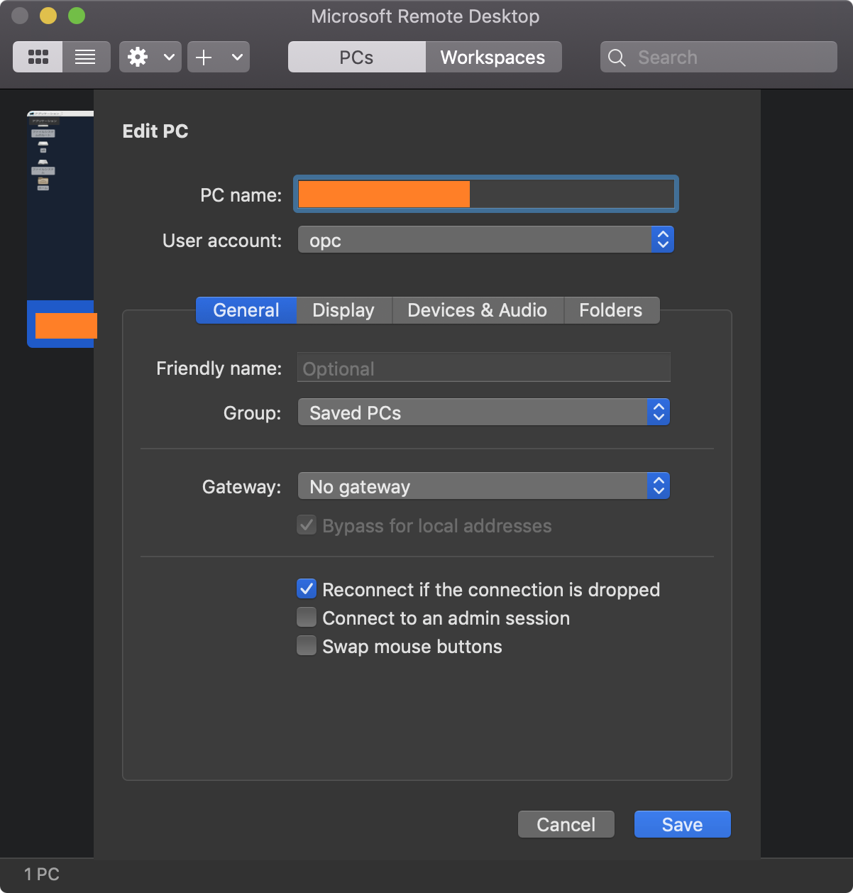
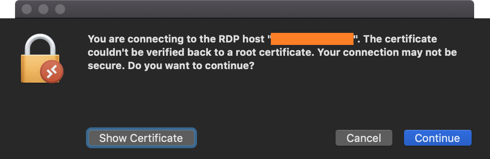
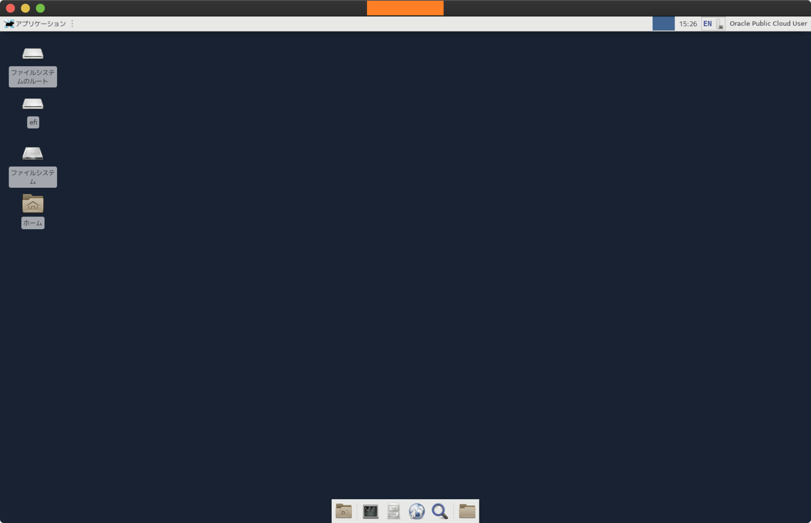
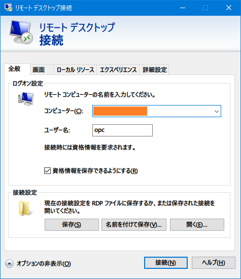
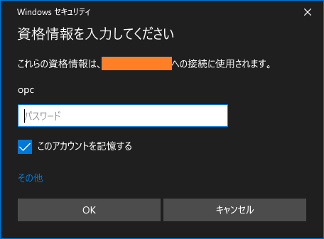
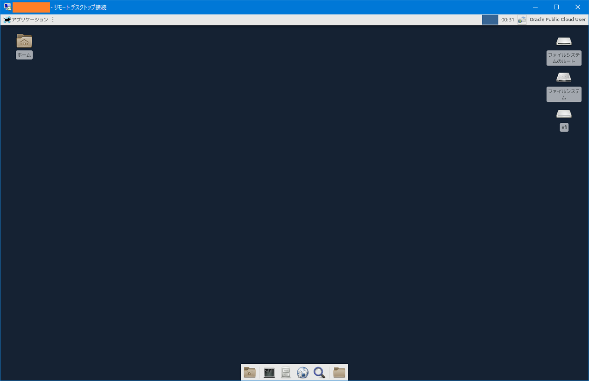

OCI の Always Free な Compute Instance に Xfce をインストールし、GUI 環境を作る。ベースとなる OS は Oracle Linux 7。

ほぼ以下の記事を参考に作業した。

- [Computeインスタンス(Oracle Linux7)をGUI化する - KNOPP's blog](http://knopp.hatenablog.jp/entry/2019/12/12/000000)

## 目次

## Compute Instance での作業

順にコマンドだけ掲載する。

```bash
# Xfce をインストールする
$ sudo yum groupinstall -y 'X Window System'
$ sudo yum groupinstall -y Xfce

# XRDP をインストールする
$ sudo yum -y install xrdp
$ sudo systemctl enable xrdp
$ sudo systemctl start xrdp

# 日本語フォントをインストールする
$ sudo yum install -y vlgothic-* ipa-gothic-fonts ipa-mincho-fonts ipa-pgothic-fonts ipa-pmincho-fonts

# 日本語入力メソッドをインストールする
$ sudo yum install -y ibus-kkc

# ロケールを日本語に変更する
$ sudo localectl set-locale LANG=ja_JP.UTF-8

# XRDP 接続時に Xfce セッションが起動するようにする
$ cat > '/home/opc/.Xclients' << EOL
#!/bin/bash

export LANG='ja_JP.UTF-8'
export XMODIFIERS='@im=ibus'
export XMODIFIER='@im=ibus'
export GTK_IM_MODULE='ibus'
export QT_IM_MODULE='ibus'
export DefaultIMModule='ibus'
ibus-daemon -drx
exec xfce4-session
EOL

# ファイルに権限を付与する
$ chmod +x '/home/opc/.Xclients'

# opc ユーザにパスワードを設定する (XRDP 用)
$ passwd opc
```

XRDP を使用して接続するので、Security List で *3389 番ポート*へのアクセスを許可しておく。

VM 側の準備ができたら、クライアント PC から接続してみる。

## MacOS から RDP 接続する

MacOS の場合は AppStore より「Microsoft Remote Desktop 10」をダウンロードし、以下のように設定する。

- Hostname : OCI VM の Public IP
- User Account : 新規作成し「opc」、先程指定したパスワードを入力する



接続時、次のような警告が出るが、構わず進む。



コレで接続できる。



## Windows から RDP 接続する

Windows の場合は、標準で入っている「リモートデスクトップ接続」を利用する。



初回接続時にパスワードを入力する。



以下のとおり。



## ブラウザをインストールする

このままだとウェブブラウザがないので、デスクトップから「ターミナル」を開き、次のように叩いていく。

```bash
# Firefox はデフォルトで入れられる
$ sudo yum install -y firefox

# Chrome は次のようにリポジトリを追加する
$ sudo vi /etc/yum.repos.d/google.chrome.repo
```

- `/etc/yum.repos.d/google.chrome.repo`

```properties
[google-chrome]
name=google-chrome
baseurl=http://dl.google.com/linux/chrome/rpm/stable/$basearch
enabled=1
gpgcheck=1
gpgkey=https://dl-ssl.google.com/linux/linux_signing_key.pub
```

```bash
$ sudo yum update -y
$ sudo yum install -y google-chrome-stable
```

こうすると「ウェブブラウザー」のアイコンから Firefox と Chrome (表記は Chromium) が起動できるようになる。

- 参考 : [CentOS7にChromeをインストール - Qiita](https://qiita.com/shadowhat/items/af6b973df43d75abfe8e)

## タスクマネージャ xfce4-taskmanager を入れる

ついでにタスクマネージャも入れておく。ターミナルで以下のようにインストールする。

```bash
$ sudo yum install -y xfce4-taskmanager
```

左上の「アプリケーション」 → システム → タスクマネージャー が追加される。

Chrome なんかのブラウザを開くと、CPU 使用率が 4・50% くらい跳ね上がり、もっさりしすぎて使い物にならない。Windows 95 マシンに Windows Me を入れて頑張っていた頃のようだ…。笑

## 以上

Always Free インスタンスだとやはりだいぶモッサリするが、出先でとりあえず GUI 環境が欲しくなった時に使える…かも…？
