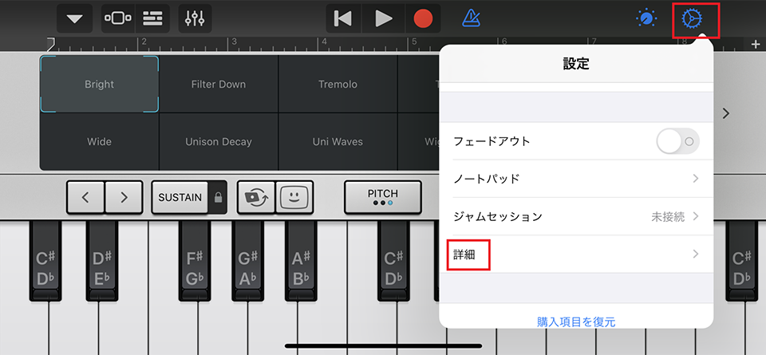
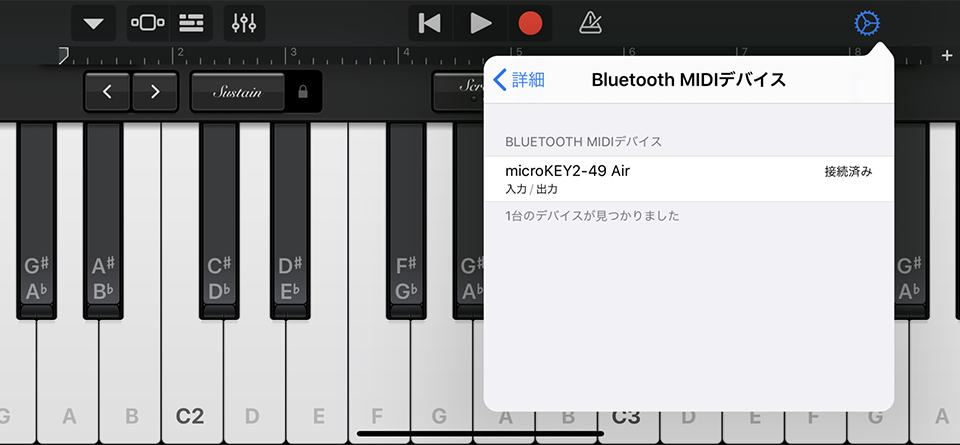

前々からピアノというかキーボードというかシンセを触りたいなーと思っていて、iPhone や Mac の GarageBand で、PC キーボードを鍵盤として使用して音を出して少し遊んでいたのだけど、ついに買ってしまった。

MIDI キーボード、__Korg microKEY Air-49__。新古品で Amazon で1万円なり。2020-02-12 入手。

  

    
  

  

    

      <a href="https://www.amazon.co.jp/dp/B018ATKMFK?tag=neos21-22&amp;linkCode=osi&amp;th=1&amp;psc=1">KORG 定番 ワイヤレス MIDIキーボード microKEY Air-49 音楽制作 DTM 省スペースで自宅制作に最適 すぐに始められるソフトウェアライセンス込み 49鍵</a>
    

  

## 目次

## microKEY Air の概要

Korg microKEY シリーズは、USB 接続のみできる「microKEY 2」シリーズと、Bluetooth 接続もできる「microKEY Air」シリーズとがある。鍵盤の個数別に、25鍵、37鍵、49鍵、61鍵のラインナップがある。

- 参考：[microKEY Air - BLUETOOTH MIDI KEYBOARD | KORG (Japan)](https://www.korg.com/jp/products/computergear/microkey2_air/)

自分が買ったのは、USB 接続の他に Bluetooth 接続もできる microKEY Air の、49鍵バージョン。コレで幅は 70cm ほどあるので、机の幅に合わせて買おう (25鍵で約 40cm、61鍵で約 85cm だ)。

鍵盤の他に、ピッチシフト用のローラーと、モジュレーション効果を操作するためのローラーが付いている。鍵盤全体のオクターブを上下にズラせるボタンも付いているので、49鍵ではあるが音域はそれ以上に出せる。

USB 接続時はバスパワー給電で動作する。Bluetooth 接続時は単三電池2本で動作する。USB を使うか Bluetooth を使うかは本体側面のスイッチで切り替える。付属の USB-B ⇔ USB-A ケーブルは 50cm くらいで短いので、長めのヤツを買うと良いかと。プリンタを繋ぐ時に使うヤツで OK。

Bluetooth 接続をメインに使う場合は、USB を繋がないでおき、「USB 接続」側のスイッチにしておくと電源 OFF 状態になる。「Bluetooth 接続」側のスイッチに切り替えることで、電池駆動が始まる。

## 音を出すには？

「Korg microKEY」のような、いわゆる __MIDI キーボード__というモノは、単独では音を出せない。PC に接続して、PC 側でソフトウェアシンセを起動しておかないと音が出せない。ピアノ鍵盤の形をした「入力装置」というワケだ。

microKEY には、Windows・Mac・iOS 向けに多数のフリーソフトが付属しており、Mac や iPhone の GarageBand との連動も簡単にできるので、ちょっとしたお遊び用キーボードにはもってこいだ。以下で詳しく説明していこう。

## Windows と接続してみる

まずは Windows と接続してみよう。Galleria XG というデスクトップ PC で、Windows 10 Home を使用。Bluetooth 接続は USB 接続している Bluetooth レシーバを使用して検証している。

初めに、本体付属の USB-B ⇔ USB-A ケーブルで USB 接続してやれば、自動的にドライバがインストールされてとりあえず使い始められる。ただし、自動的にインストールされたドライバは「デバイスマネージャ」から削除して、__公式サイトから最新版のドライバをインストール__しておかないと、この後行う「ソフトウェアアップデート」が失敗するので注意。

- 参考：[ダウンロード | microKEY Air | KORG (Japan)](https://www.korg.com/jp/support/download/product/0/530/) … ドライバ類のダウンロードページトップ
- 参考：[ダウンロード | microKEY Air - KORG USB-MIDI Driver (for Windows 10) | KORG (Japan)](https://www.korg.com/jp/support/download/driver/0/530/3540/) … Windows10 用。コレをインストールした
- 参考：[ダウンロード | microKEY Air - KORG USB-MIDI Driver (for Windows 7/8.1) | KORG (Japan)](https://www.korg.com/jp/support/download/driver/0/530/535/) … Windows7・8.1 用

_Bluetooth 用のドライバ_も別途公式サイトからインストール。すると PC に USB 接続している Bluetooth レシーバを経由してキチンとペアリングできた。

- 参考：[ダウンロード | microKEY Air - KORG BLE-MIDI Driver | KORG (Japan)](https://www.korg.com/jp/support/download/driver/0/530/2887/)

とりあえず音を出してみたいなら、付属のフリーソフトの__「Reason Lite」__をインストールすると良いだろう。なお、「付属」といっても昔みたく CD-ROM が付いてきているワケではない。「ソフトウェア・バンドル・コード」というシリアルコードの書かれた紙が入っていて、それを公式サイトで入力すると、各種フリーソフトがダウンロードできる仕組みだ。

Reason Lite を開いたら MIDI 入力や出力の設定を行う。microKEY Air-49 にドンピシャのプロファイルは入っていなかったが、microKEY 系列の製品を選択してやれば特に問題ない。USB 接続でも Bluetooth 接続でも、どちらでもちゃんと認識した。適当な音源 (ソフトウェアシンセ) を選択してやれば、とりあえず音が出せる。録音なども出来るがひとまず音が出せるところまでで。

Bluetooth 接続時のレイテンシ (遅延) は、Bluetooth レシーバを使っているためか若干感じる。伴奏に合わせてリアルタイムに演奏するような用途では少々つらいレイテンシに感じる。

Korg KONTROL Editor というツールで別途 MIDI キーボードの感度などを設定できる。自分は今のところ設定せずとも普通に使えている。

- 参考：[ダウンロード | microKEY Air - KORG KONTROL Editor | KORG (Japan)](https://www.korg.com/jp/support/download/software/0/530/533/)

## Mac と接続してみる

続いて MacOS と接続してみる。12インチ MacBook で、MacOS Mojave。USB-C ポートが1つしかない PC なので、USB 接続時は USB-A を挿せるハブを経由している。

Mac 向けの Korg 付属ソフトウェアもあるが、自分は _GarageBand と接続_することにした。以下の Mac 用有線ドライバを入れておく。

- 参考：[ダウンロード | microKEY Air - KORG USB-MIDI Driver | KORG (Japan)](https://www.korg.com/jp/support/download/driver/0/530/536/)

コレで USB 接続はキチンと認識した。

Bluetooth 接続は「Bluetooth MIDI Connect for Mac」というソフトを入れておくとペアリングがしやすい。

- 参考：[ダウンロード | microKEY Air - Bluetooth MIDI Connect for Mac | KORG (Japan)](https://www.korg.com/jp/support/download/link/0/530/3105/)

コチラもキチンと音が出た。レイテンシは Windows より若干短いかな？ラップトップ内蔵の Bluetooth との相性もあるのかなーと思われる。

## iPhone と接続するために…ソフトウェアアップデートを行う

最後に iPhone11 Pro Max と接続しようと思ったのだが、Korg microKEY シリーズは長らく iOS 13 に対応していなかった。最近になってひっそりとアップデート用ツールが発表されていたので、それを使ってキーボード本体のシステムをアップデートしよう。

- 参考：[ニュース | 弊社製品のiOS13への対応について（コントローラー製品のBLE-MIDI接続不具合に対応しました）。 | KORG (Japan)](https://www.korg.com/jp/news/2019/112903/) … アップデートに関するニュース
- 参考：[iPhone / iPad で、Bluetooth MIDI 機器 が一覧に表示されるのに、接続操作をしても接続できません。 – KORG app ヘルプセンター](https://support.korguser.net/hc/ja/articles/207779093-iPhone-iPad-%E3%81%A7-Bluetooth-MIDI-%E6%A9%9F%E5%99%A8-%E3%81%8C%E4%B8%80%E8%A6%A7%E3%81%AB%E8%A1%A8%E7%A4%BA%E3%81%95%E3%82%8C%E3%82%8B%E3%81%AE%E3%81%AB-%E6%8E%A5%E7%B6%9A%E6%93%8D%E4%BD%9C%E3%82%92%E3%81%97%E3%81%A6%E3%82%82%E6%8E%A5%E7%B6%9A%E3%81%A7%E3%81%8D%E3%81%BE%E3%81%9B%E3%82%93-) … ひっそりとアナウンスされていてなかなか気付きにくかった。

以下から、使用する OS と製品に合わせたシステムアップデート用ツールをダウンロードする。

- 参考：[ダウンロード | microKEY Air - System Updater（microKEY Air 37/49/61 key向け） | KORG (Japan)](https://www.korg.com/jp/support/download/software/0/530/4434/) … __Windows 用__
- 参考：[ダウンロード | microKEY Air - System Updater（microKEY Air 37/49/61 key向け） | KORG (Japan)](https://www.korg.com/jp/support/download/software/0/530/4435/) … _Mac 用_
- microKEY Air-25 のみ以下を使う
  - 参考：[ダウンロード | microKEY Air - 25 System Updater（microKEY Air 25 key向け） | KORG (Japan)](https://www.korg.com/jp/support/download/software/0/530/4436/) … Windows 用
  - 参考：[ダウンロード | microKEY Air - 25 System Updater（microKEY Air 25 key向け） | KORG (Japan)](https://www.korg.com/jp/support/download/software/0/530/4437/) … Mac 用

アップデート時は PC とキーボードを USB 接続するのが必須。__「オクターブ Down」ボタンと、一番左の鍵盤を同時押ししながら USB を接続する__ことで、アップデートモードで接続する必要がある。

自分は初めに __Windows 用__のアップデータを使ってみたのだが、ツールを起動するとそのまま「応答なし」になってしまい、キーボードを有線接続する以前のところで詰まってしまった。

ならばと MacBook に切り替え、_Mac 用_ のアップデータを使ってみたが、USB ハブを経由しているせいか、キーボードを繋いでもうまく認識されなかった。まれに認識される場合もあるのだが、調子が悪く断念。

少し調べてみたら、Windows に自動インストールされるデバイスドライバが悪いっぽいことが分かった。

- 参考：[tadpolizemedia.blog |KORG microKEY-37 + Windows 10 の動作確認 (2015-12-21)](http://tadpolizemedia.blog118.fc2.com/blog-entry-258.html)

「デバイスマネージャ」→「サウンド、ビデオ、およびゲームコントローラー」から_「microKEY」を削除_してやる。そしたら上述の公式の USB ドライバをインストールしてやる。

それからソフトウェアアップデータを起動すると正常に起動した。「アップデートモード」で USB 接続するとキチンと認識された。更新前の本体バージョンは v1.02 だった。

というワケで、結局 __Windows 用__のアップデータを使って v1.04 にアップデートできた。ドライバ系は詰まりやすいな…。

(「Korg Driver Setup Utility」は USB 接続するたびに表示されるので無視して閉じて良い)

## iPhone (iOS 13) と接続してみる

本体バージョンを v1.04 にアップデートできたので、iPhone と接続してみる。iPhone 11 Pro Max、iOS 13.2 で検証。

iOS 用の GarageBand で接続してみることにした。USB 接続するには「Lightning ⇔ USB-B」と接続するコネクタが必要になるが、そんなモノはもっていないので Bluetooth 接続だけ試してみる。

microKEY Air を Bluetooth 接続モードにしておき、GarageBand を開く。ピアノ画面の右上の歯車アイコン「設定」から、「詳細」→「Bluetooth MIDI デバイス」と進むと microKEY を検出するはずなので、コレを選択して接続する。

コレだけで Bluetooth 接続ができた。とっても簡単だ。おまけに__レイテンシは Windows や Mac よりも小さい__ようで、ほぼリアルタイム演奏ができそうな感じだ。

鍵盤の押し心地は、どうしてもオモチャっぽい感じ。実際のピアノのような重さはなく、鍵盤自体も小さめなので、少し慣れが必要か。ただ、_店頭の展示品なんかは押されすぎてふにゃふにゃになっている_が、__新品はもう少し重さがある__ので、思ったよりは使えて良かった。

## かなりコスパ高いぞ microKEY Air！

2016年発売の機種なので、最新の OS に対応するためのアップデートが必要だったりするが、一番高い microKEY Air-61 でも新品が1万7,000円程度。コレに多数のフリーソフトが付属してくるので、大変太っ腹であろう。初心者のお遊び用、お出かけ時のサブ機として試しに買ってみるのはアリだと思う。

  

    
  

  

    

      <a href="https://hb.afl.rakuten.co.jp/hgc/g00pm412.waxyc36e.g00pm412.waxyd0d4/?pc=https%3A%2F%2Fitem.rakuten.co.jp%2Fgakkiwatanabe%2Fa80621%2F&amp;m=http%3A%2F%2Fm.rakuten.co.jp%2Fgakkiwatanabe%2Fi%2F10061820%2F">KORG ( コルグ ) micro KEY Air-49【納期未定 取り寄せ商品／納期数ヶ月以上】 ◆【送料無料】【DAW】【DTM】</a>
    

    

      <a href="https://hb.afl.rakuten.co.jp/hgc/g00pm412.waxyc36e.g00pm412.waxyd0d4/?pc=https%3A%2F%2Fwww.rakuten.co.jp%2Fgakkiwatanabe%2F&amp;m=http%3A%2F%2Fm.rakuten.co.jp%2Fgakkiwatanabe%2F">ワタナベ楽器　楽天SHOP</a>
    

    
価格 : 17050円

  

