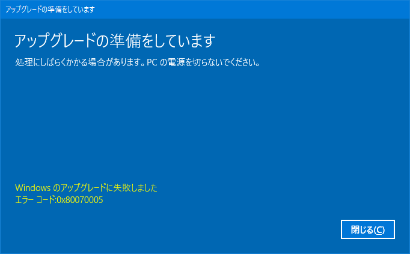
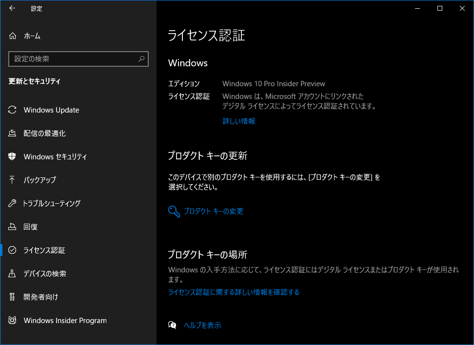

母艦として使用している Galleria XG だが、OS が Windows10 Home なのである。

- [ドスパラのデスクトップゲーミング PC「Galleria XG」を買った！](/blog/2017/08/08-03.html)

Docker-Toolbox や WSL 周りで躓くのがいい加減嫌になってきたので、**Windows10 Pro** にアップグレードすることにした。

以下のサイトを参考に、「設定」アプリ → 更新とセキュリティ → ライセンス認証 → Microsoft Store に移動 と進むと、Windows10 Pro へのアップグレードが購入できる。値段は 13,824円 なり。

- 参考：[Windows 10 HomeからProへアップグレードする方法と価格 | Office Hack](https://office-hack.com/windows/windows10-pro-upgrade/)

アップグレード後、次のようなエラーが出た。

`0x80070005` エラーはセキュリティソフトが邪魔している疑惑らしいのだが、再起動してみたら問題が解消した。

- 参考：[Windows のエラー 0x80070005 の対処方法 - ぼくんちのTV 別館](https://freesoft.tvbok.com/windows7/installation/sp1_80070005.html)

しかし、今度は `0x80070002` エラーが表示されていた。

- 参考：[対処法；Windows Updateのエラー 0x80070002が発生します！](https://jp.easeus.com/todo-backup-resource/windows-update-0x80070002-error-solution.html)

コチラは `sfc /scannnow` したり、`C:\Windows\SoftwareDistribution\` フォルダを削除したりすると直るらしく、やってみたら直った。

というワケで、Insider Preview を有効にしているせいか、なんやかんやおかしな挙動も見受けられたけど、とりあえず Windows10 Pro になったのでよきよき。

  

    
  

  

    

      <a href="https://hb.afl.rakuten.co.jp/hgc/g00r8mv2.waxyc831.g00r8mv2.waxydde7/?pc=https%3A%2F%2Fitem.rakuten.co.jp%2Fr-kojima%2F4348624%2F&amp;m=http%3A%2F%2Fm.rakuten.co.jp%2Fr-kojima%2Fi%2F10733523%2F">マイクロソフト　Microsoft Windows　10　Pro　日本語版 HAV00135</a>
    

    

      <a href="https://hb.afl.rakuten.co.jp/hgc/g00r8mv2.waxyc831.g00r8mv2.waxydde7/?pc=https%3A%2F%2Fwww.rakuten.co.jp%2Fr-kojima%2F&amp;m=http%3A%2F%2Fm.rakuten.co.jp%2Fr-kojima%2F">コジマ楽天市場店</a>
    

    
価格 : 28380円

  

  

    
  

  

    

      <a href="https://www.amazon.co.jp/dp/B07WGM2Y61?tag=neos21-22&amp;linkCode=osi&amp;th=1&amp;psc=1">【新パッケージ】Windows 10 Home 日本語版/May 2019 Update適用/パッケージ版</a>
    

  

