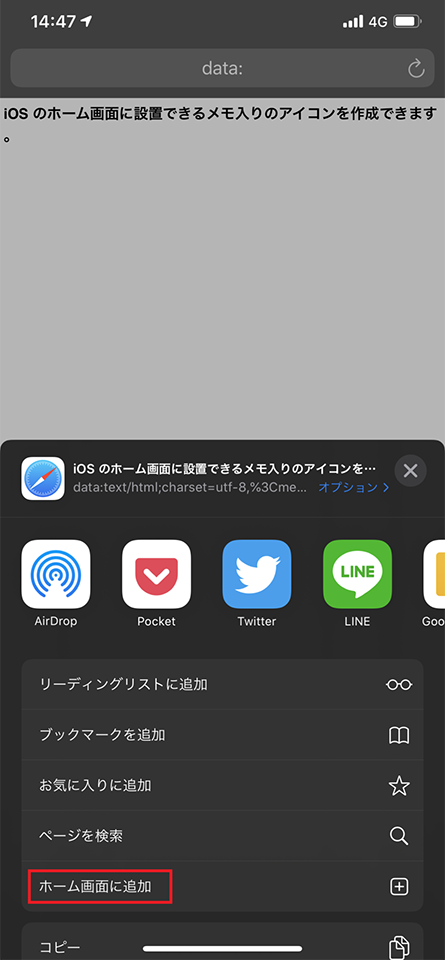
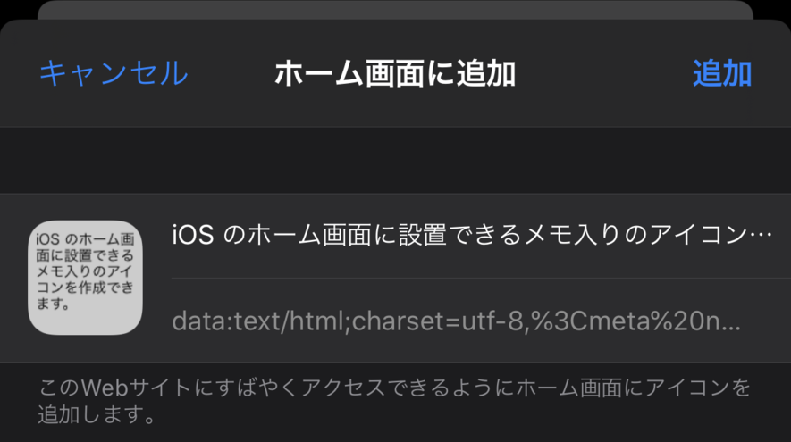
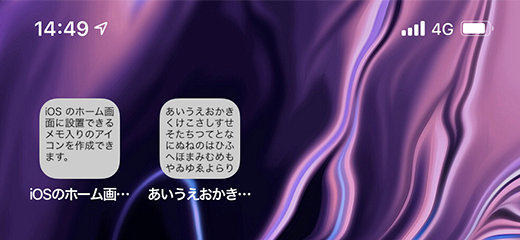

__「ショートカットメモ帳」__というアプリがあり、このアプリの仕組みを見て似たようなモノを作った。

- 参考：[‎「ショートカットメモ帳」をApp Storeで](https://apps.apple.com/jp/app/%E3%82%B7%E3%83%A7%E3%83%BC%E3%83%88%E3%82%AB%E3%83%83%E3%83%88%E3%83%A1%E3%83%A2%E5%B8%B3/id1073850078)

このアプリは、_iOS の「ホーム画面に追加」機能_と、DataURL の仕組みを利用して、「オリジナルのメモが書かれたアイコン」を生成し、ホーム画面に配置できるようになっている。アイコンをタップするとアプリが起動し、アイコン作成時に入力したメモの詳細画面に飛べるというモノ。

実装も調べられたので、コレならアプリの体裁を取らずに、HTML ファイル1つでジェネレーターを作れそうだなと思い、作ってみたのが、以下の__「iOS Memo Icon Generator」__。

- [iOS Memo Icon Generator](https://neos21.github.io/ios-memo-icon-generator/)
- [GitHub - Neos21/ios-memo-icon-generator: iOS のホーム画面に設置できるメモ入りのアイコンを作成できます。](https://github.com/Neos21/ios-memo-icon-generator)

上のページに iOS Safari でアクセスする。

テキストエリアに任意のテキストを入力して「生成する」ボタンを押すと、下にアイコンのプレビューが表示されるので、見栄えを確認し、「ブックマークリンク」を押下する。


すると、入力したメモが記されたページが開くので、この画面で「ホーム画面に追加」メニューを選択する。





すると、自分で作成したアイコンがホーム画面に表示される。



ホーム画面のアイコンをタップすると、入力したメモのテキストが表示される、というモノ。

## 実装解説

実装を概説すると次のとおり。

1. Canvas の `toDataURL()` メソッドを使って PNG 画像の DataURL を生成する
2. この DataURL 文字列を `link` 要素に仕込み、iOS 用の Favicon として表示できるような HTML 文字列を作る
3. その HTML 文字列を DataURL 形式に変換し、ブラウザの URL 欄に入力することで、_「HTML ファイルが存在しない HTML ページ」_をブラウザに表示したり、「ホーム画面に追加」したりできるようにした

一つずつ、もう少し詳しく解説していこう。

### `canvas` 要素の利用

まず、ホーム画面に表示するアイコン自体をどう作るかというと、`canvas` 要素を利用する。大体 114×114px とか、152×152px とかのアイコンを作っておけば、iOS のホーム画面向けのアイコンとなる。

`canvas` 要素に上手いことテキストを入れていくところを、結構こだわった。通常、`canvas.getContext('2d').fillText()` メソッドで Canvas に文字を入れていくと、Canvas の幅に合わせた「折り返し」などが行われない。そこで、折り返しや省略表示を行うよう独自のメソッドを作成した。以下の記事を参考に改変したモノ。

- 参考：[HTML5 Canvas Text Wrap Tutorial](https://www.html5canvastutorials.com/tutorials/html5-canvas-wrap-text-tutorial/)

```javascript
/**
 * canvas 要素に文字列を折り返しながら描画する
 * 
 * - 参考 : https://www.html5canvastutorials.com/tutorials/html5-canvas-wrap-text-tutorial/
 * 
 * @param {CanvasRenderingContext2D} context canvas 要素の Context
 * @param {string} inputText 入力値
 * @param {number} x 文字列を描画し始める X 座標値
 * @param {number} y 文字列を描画し始める Y 座標値。改行の度に本引数の値を更新する
 * @param {number} maxWidth 文字列の描画範囲となる最大幅
 * @param {number} maxHeight 文字列の描画範囲となる最大の高さ
 * @param {number} lineHeight 行の高さ
 */
function fillWrappedText(context, inputText, x, y, maxWidth, maxHeight, lineHeight) {
  const characters = inputText.split('');
  let lineText = '';
  
  for(let i = 0; i < characters.length; i++) {
    // 折り返した後の座標が描画可能範囲を超える場合は中止する
    if(y > maxHeight) {
      break;
    }
    
    // 改行コードの場合
    if(characters[i] === '\n') {
      // 現在行を出力する
      context.fillText(lineText, x, y, maxWidth);
      // 次の行の準備をし次のループに繋ぐ
      y += lineHeight;
      lineText = '';
      continue;
    }
    
    const testLineText = lineText + characters[i];
    const testWidth = context.measureText(testLineText).width;
    
    if(testWidth > maxWidth && i > 0) {
      // 現在行を出力する
      context.fillText(lineText, x, y, maxWidth);
      // 次の行の準備をする
      y += lineHeight;
      lineText = characters[i];
    }
    else {
      // 現在行に1文字追加する
      lineText = testLineText;
    }
  }
  
  // Y 座標が描画可能範囲を超えない場合のみ最終行を書き込む
  if(y <= maxHeight) {
    context.fillText(lineText, x, y, maxWidth);
  }
}
```

Canvas を PNG 形式に変換するため、`canvas.toDataURL('image/png')` メソッドを使用し、PNG 画像の DataURL 文字列を取得している (`data:image/png;base64,` から始まる文字列)。

### HTML の DataURL 文字列を作成する

次に、「HTML ページを DataURL 形式で表現した文字列」を作る。HTML 中に

```html
<link rel="apple-touch-icon-precomposed" href="【PNG 画像】">
```

という `link` 要素を仕込んでおくことで、「ホーム画面に追加」で Web ページをホーム画面に配置した時専用のアイコンを用意できる。

通常は `href` 属性値にファイルパスを渡すワケだが、今回は先程生成した __PNG 画像の DataURL 文字列をココに埋め込んでしまう。__

```html
<link rel="apple-touch-icon-precomposed" href="data:image/png;base64,【… Base64 文字列】">
```

当然、Base64 文字列は結構長くなるので、HTML 全体はなるべく短くしたい。省略できる要素は省略していく。

ホーム画面でアイコンをタップして、何も表示されないのも味気ないので、入力したメモを全文表示できるようにしてみた。_最終的に次のような DataURL 文字列が作れれば OK。_

```html
data:text/html;charset=utf-8,
<meta name="apple-mobile-web-app-capable" content="yes">
<link rel="apple-touch-icon-precomposed" href="【PNG 画像の DataURL 文字列】">
<title>【任意テキスト (ホーム画面にアプリ名として表示される)】</title>
<h1 style="font-family:sans-serif;word-break:break-all">【任意テキスト】</h1>
```

適宜 `encodeURIComponent()` を利用してパーセント・エンコーディングしておく。その値を「ブックマークリンク」の `a` 要素の `href` 属性値にそのままブチ込めば、DataURL 文字列をそのまま Safari ブラウザで表示してくれる。

後は「ホーム画面に追加」を選んでもらうことで、アイコンをホーム画面に追加できるようになる。

## サーバレス

アイコンを生成するための、単一の HTML ファイル内に、全ての必要な JavaScript コードを埋め込んだので、

- <https://neos21.github.io/ios-memo-icon-generator/index.html> (実際に稼動している Web ページ)
- <https://github.com/Neos21/ios-memo-icon-generator/blob/master/index.html> (その実装)

この `index.html` さえ適当な所に配置して iOS からアクセスできるようにしておけば、サーバの用意やアプリの実装などをせずとも、独自のアイコンを作れる環境が整う。

アイコンをタップして表示される「ページ」も、DataURL 文字列で実現しているので、どこにも HTML ファイルを置く必要はないし、ジェネレーターサイトが無くなったりしても、作成済のアイコンの動作には影響がない。

iOS ネイティブっぽい領域にかなり踏み込んでいるのに、真のサーバレスな Web アプリ (単一の HTML ファイル) で実現できているところが面白いところだ。

## 今後改良したいこと

現状、114×114px の Canvas に、14px の `sans-serif` 書体オンリーのメモが書ける状態。背景色もグレー一色。今後は、ユーザがフォントのサイズや書体、背景色などを選んで、自由にレイアウトできるような機能を盛り込みたい。

…ただ、作っておいてなんだが、自分は「ショートカットメモ帳」アプリの仕組みを真似してみたかっただけで、別にこの自作アプリを使っていくつもりはないので、多分もう更新しないかも…ｗ。気が向いたら作ることにする。
