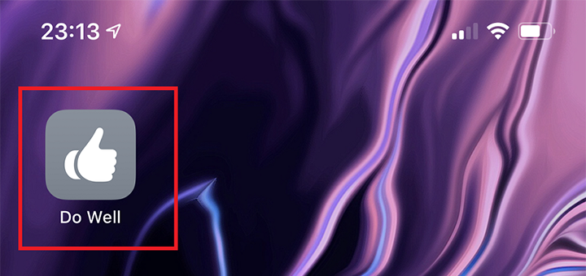

- [オレオレ・マイクロ・ブログ](https://github.com/Neos21/neos-php-micro-blog)
- [オレオレ・ブックマーク](https://github.com/Neos21/neos-ruby-bookmarks)

という2つの Web アプリを作って、自分だけで使っている。

POST メソッドでフォーム送信を受け付ける他、GET メソッドで受け取った URL パラメータも「投稿」処理に使うよう実装したりしているので、ブックマークレットから URL をリクエストするだけで、つぶやきを投稿したり、ブックマークを追加したりできるようにしてある。

ブックマークレットでもさほど不便はしていなかったのだが、iOS の「共有メニュー」から呼び出せたり、ホーム画面にアイコンを設置して投稿フォームを表示したりできたら使いやすいかもなー、と思った。調べてみると、Apple 公式アプリの**「ショートカット」**というアプリを使って、イイカンジに処理ができたので、やり方を紹介する。

## 目次

## 「ショートカット」アプリとは

iOS の「ショートカット」アプリとは、任意の操作を GUI 上で組み立てていくと、その操作を自動化できるというモノ。

- 複数のアプリを開いたり
- アプリからパラメータとか画像とかを取得してみたり
- 値を加工・変換したり
- ダイアログで値が入力できたり
- `if` 文が組み込めたり
- _Web ページに任意の JavaScript を実行してみたり_
- 任意の URL を Safari で開いたり
- **Safari ブラウザを介さず任意の URL と通信だけしてみたり**

と、結構色々なことができるようだった。

そして、そのように作成したショートカットを「共有メニュー」に追加できたり、「ウィジェット」やホーム画面にショートカットを実行するアイコンを配置できたりする。コレは可能性がありそうだ。

作成したショートカットは iCloud アカウントで同期されるようで、作ったそばから、複数の端末で同じショートカットを利用できるようになる。とても便利だ。

## まずは自分で実装してみたモノを紹介

ということで、自分でちょこちょこ実装してみたモノを紹介していく。「ショートカット」アプリは GUI で構築でき、ソースコードのようなテキストベースの成果物に落とせないので、スクショとともに、どんな動きをするモノなのかを紹介する。ショートカットを使ったことがない人も、見ていけばどんな塩梅なのか雰囲気が掴めるはずだ。

### オレオレ・マイクロ・ブログに任意テキストを投稿する

このようなショートカットを作り、ホーム画面にアイコンを設置している。

コレをタップすると以下のようなダイアログが出てくる。

ココに任意テキストを入れて OK を押せば、入力した内容がオレオレ・マイクロ・ブログに向かって POST 送信される。

一番最後に

- `URL の内容` 内の `result` の `値` を取得

というアクションがあるが、この後ろに_「スクリプティング：結果を表示」_というアクションを追加し、

- `辞書の値` を表示

というアクションを置いてやれば、POST 送信のレスポンス JSON から `result` プロパティの値を取得し、OK ボタンのみのダイアログで表示してくれる。`{ "result": "Success!" }` といった JSON がレスポンスされていたら、「Success!」という文字列がダイアログ表示されるというワケだ。

自分はこのようなダイアログ表示のアクションを配置していないので、実行結果を確認できないが、イチイチダイアログが出るのも鬱陶しいので気にしていない。

最初に表示されるダイアログに何もテキストを入れずに「OK」ボタンを押下すると、

- もし `comment` `値がない` ならば

という「if 文」アクションで分岐しているとおり、任意の URL を Safari で開いて終了となる。

### 閲覧中の Web ページをオレオレ・マイクロ・ブログに投稿する

最初の

- 受け入れる

というアクションが重要。コレで、Safari やアプリ内ブラウザのメニューからこのショートカットを呼び出した時に、閲覧中の Web ページのタイトルや URL を取得できるようにしている。

↑こんな風にチェックを入れてある。

コレで閲覧中の Web ページのタイトルと URL を拾ったら、先程と同様に POST 送信のフォームパラメータに設定している。

### 閲覧中の Web ページに任意コメントを沿えてオレオレ・マイクロ・ブログに投稿する

上2つのショートカットの結合版みたいな感じ。

任意コメントを入力した場合は、「任意コメント + **改行** + ページタイトル + URL」という形式になるように、色々と調整している。改行コードだけをうまく仕込むのが難しかったので、一旦

- テキスト

というアクションに、改行だけの文字列を設定し、

- テキストを結合

というアクションを使って、入力した任意コメントの後ろに改行コードを結合している。

実際にどんな風に使うと、こんな感じ。

Safari で共有メニューを開くと、このように自分が作ったショートカット名が並ぶので、それを選択する。

するとこのようにダイアログが出るので、任意コメントを入力して OK を押すと、そのコメント付きでオレオレ・マイクロ・ブログに閲覧中の Web ページの情報が投稿されるというワケ。

### オレオレ・ブックマークに閲覧中の Web ページを投稿する

オレオレ・マイクロ・ブログと違って、オレオレ・ブックマークは、GET メソッドで受け付けた URL パラメータを基にブックマークを投稿できる仕組みになっている。

当初は「Safari で URL を開く」アクションを利用していた。`http://example.com/bookmarks.rb?url=...` といったパラメータ付き URL を構築して Safari で開くことで、GET メソッドによる「投稿」処理を実現し、その結果を Safari で確認するような作りにしていた。

しかし、イチイチ Safari が開くのが鬱陶しいので、POST 送信時と同じく

- URL

アクションと、

- URL の内容を取得

アクションを組み合わせて、Safari ブラウザを開くことなく、GET 送信をバックグラウンドで行うようにした。

ちょっと余計な if 文とかが混じっているので、もう少し簡素に作れそうだ。

## 今日はココマデ…

思いの他長くなってしまったので、今日はココまで。

次回はココで使ったアクションを分解し、もっと汎用的に「やりたいこと」を実現するためのアクション作りの方法を紹介していこう。
