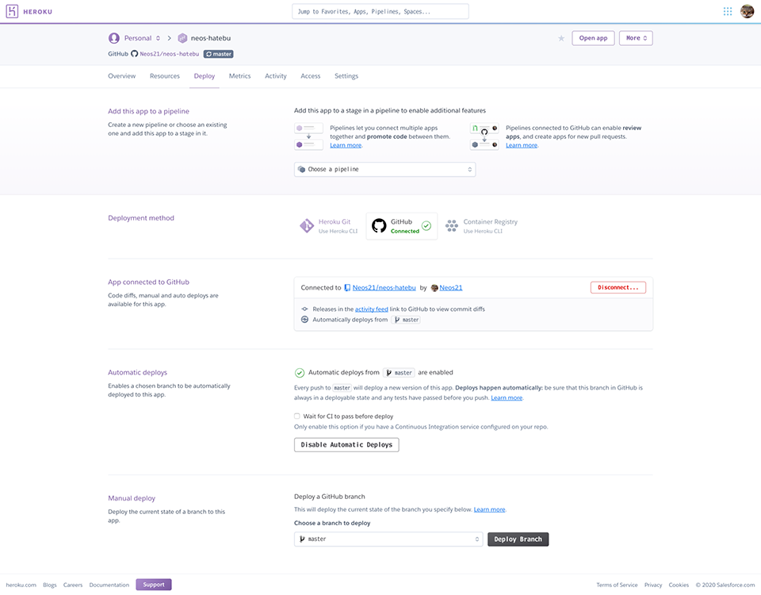

久々に Heroku。

Heroku アプリのソースコードを GitHub で管理していて、master ブランチが更新されたら自動的に Heroku にデプロイしたい、という場合は多いと思う。

最近 GitHub Actions という CI/CD 基盤が登場したので、最初はコレを使って `git push` 時に Heroku へのデプロイを呼ぼうかと思っていたのだが、Heroku の管理画面を見たら GitHub 連携機能があったので、コチラで完結させることにする。

Heroku 管理画面の「Deploy」タブを開き、次のように設定していく。

1. Deployment method : GitHub アカウントを紐付ける
2. App connected to GitHub : GitHub リポジトリ名を選択し、紐付ける
3. Automatic deploys : `master` ブランチの更新時に自動的に Heroku デプロイを行うよう、「Enable Automatic Deploys」ボタンを押す
    - 既に他に CI 連携をしていたりする場合は、`Wait for CI to pass before deploy` にチェックを入れておくと、CI をパスしてからデプロイするよう待機してくれる

設定はコレだけ。

コレで実際に `git push` をトリガーに自動デプロイが動くようになったので、もう `git push heroku master` は不要になった。良き良き。
