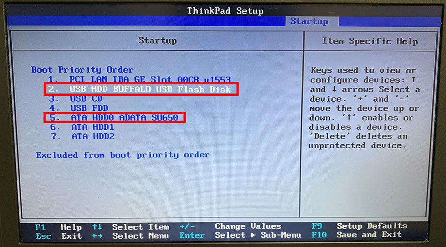
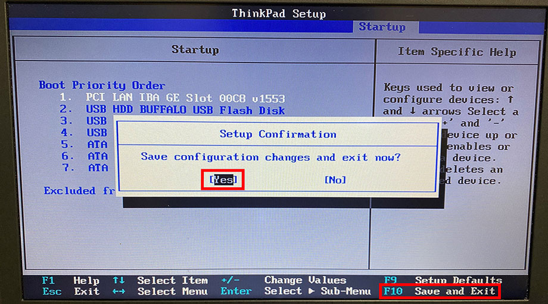
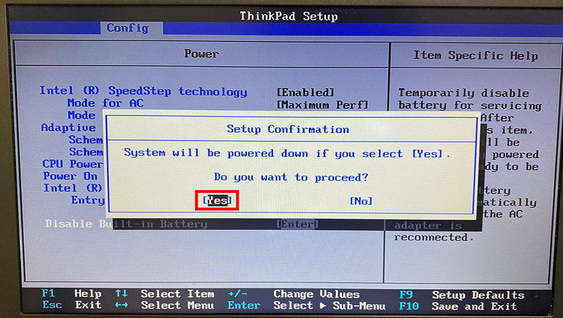
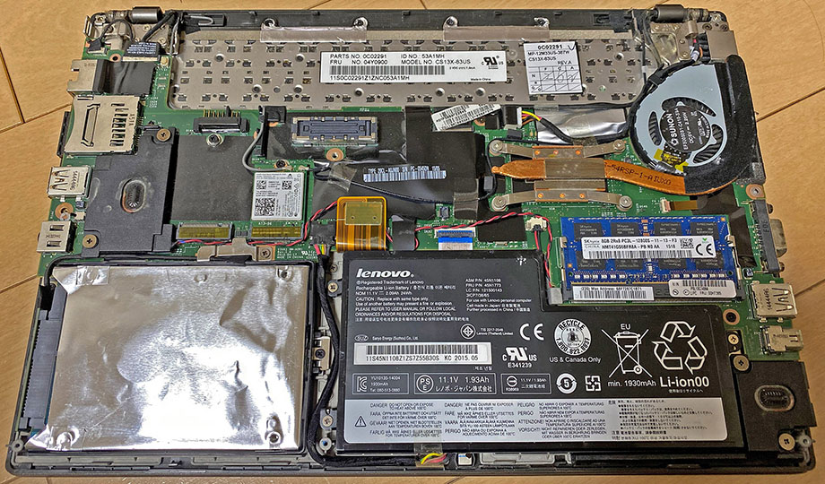
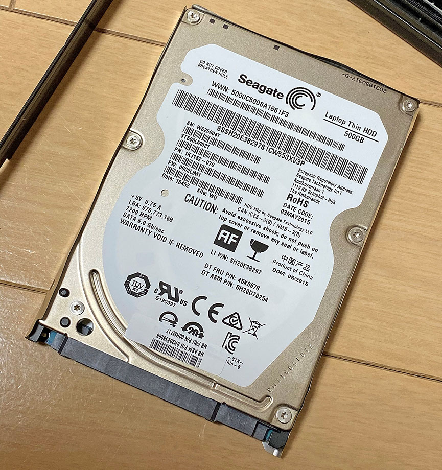

__ThinkPad X250__ というノート PC を購入した。購入時は 500GB の HDD が載っており、Windows 10 Pro 64bit がインストールされていたが、コレを SSD に換装し、Ubuntu をインストールしようと企んでいる。

- [ThinkPad X250 を買った](/blog/2020/02/20-02.html)

今回は内蔵 HDD を SSD に換装するだけ。ネットを探せば同じ機種で同じようなことをやっている記事はたくさん出てくるのだが、自分も試してみたので記録をば。

## 目次

## 必要なモノ

作業に必要なモノは次のとおり。

- __交換用内蔵 SSD__ : _2.5インチ。7.5mm 厚でも 9mm 厚でもどちらでも良い_
  - 7mm 厚のモノでもスペーサーは不要。X250 内蔵 HDD に付属しているプラスチックの枠を取り付ければ固定されるためだ
- プラスドライバー : 本体裏のネジを開け閉めする用

換装作業自体に必要なのはコレだけである。

自分が買った SSD は、__ADATA Ultimate SU650 ASU650SS-240GT-R__ という型番のモノ。240GB・2.5インチ・7mm 厚の SSD だ。ネットで評判を調べると賛否両論だが、4,000円程度の格安 SSD なので、まぁ気にしない。気になる人はサムスンでも選ぶと良い。

  

    
  

  

    

      <a href="https://hb.afl.rakuten.co.jp/hgc/g00r8mv2.waxyc831.g00r8mv2.waxydde7/?pc=https%3A%2F%2Fitem.rakuten.co.jp%2Fr-kojima%2F4018739%2F&amp;m=http%3A%2F%2Fm.rakuten.co.jp%2Fr-kojima%2Fi%2F10815024%2F">ADATA　内蔵SSD　Ultimate　SU650［2．5インチ／240GB］　ASU650SS−240GT−R</a>
    

    

      <a href="https://hb.afl.rakuten.co.jp/hgc/g00r8mv2.waxyc831.g00r8mv2.waxydde7/?pc=https%3A%2F%2Fwww.rakuten.co.jp%2Fr-kojima%2F&amp;m=http%3A%2F%2Fm.rakuten.co.jp%2Fr-kojima%2F">コジマ楽天市場店</a>
    

    
価格 : 4080円

  

  

    
  

  

    

      <a href="https://www.amazon.co.jp/dp/B07HYPWY9R?tag=neos21-22&amp;linkCode=osi&amp;th=1&amp;psc=1">ADATA SSD 240GB SU650 SATA 6Gbps / 3D NAND / 3年保証 / ASU650SS-240GT-REC</a>
    

  

自分は今回、HDD 側の Windows データを全く利用しないので、SSD へのミラーリングは行わない。ミラーリングしたい場合は、以下の記事などを参考に他の材料を用意しよう。

- [NEC LAVIE Note Standard PC-NS750GAR の SSHD を SSD に換装した](/blog/2019/09/09-03.html)

SSD 換装後に Ubuntu をインストールしようと思っているので、インストールに使用する USB メモリなどは別途購入したが、とりあえず換装作業で必要なのは工具と SSD だけだ。

## BIOS でブート順を変更しておこう

自分は空っぽの SSD を装着し、あとで USB メモリから Ubuntu をインストールしようとしているので、先に BIOS でブート順序を変更しておくことをオススメする (この作業は任意だが一応紹介しておく)。

ThinkPad の電源を入れたらすぐに __F1 キー__を数回押下し、BIOS 画面に入る。

BIOS 画面に入ったら、「Startup」→「Boot」と進み、「Boot Priority Order」画面に入る。ココで「+」キーや「-」キーを使って、ブート順を変更する。

換装後、空っぽの SSD を真っ先に見に行っても何もないので、上部に USB ポートを寄せておき、HDD は最後の方に並べておく。

並び替えが終わったら F10 キーを押下し、設定を保存して BIOS を終了する。終わったら一度電源を切ろう。

## BIOS でフロントバッテリーを無効化する

SSD が用意できたからといって、いきなり裏蓋を開けて HDD を換装してはいけない。ThinkPad X250 には、本体内部に内蔵されている「フロントバッテリー」というモノがある。本体裏面の取り外せるバッテリーは、「リアバッテリー」と呼ばれるモノなのだ。

この「フロントバッテリー」を、予め BIOS から無効化しておく必要がある。

まず、AC 電源を外して_バッテリー駆動の状態_にし、ThinkPad の電源を入れる。そしたらすぐに __F1 キー__を数回押下し、BIOS 画面に入る。

BIOS 画面に入ったら、_「Config」→「Power」_と進み、__「Disable Built-in Battery」__を選んで Enter キーを押す。

確認のダイアログが出るので「Yes」を選択すると、電源が落ちる。そして電源ボタンを押下してもマシンが起動しなくなる。

コレでフロントバッテリーが無効化できた。作業を続ける場合は AC 電源を挿してはいけない。

もし作業をせずにフロントバッテリーの無効化を解除するには、AC 電源を挿して電源ボタンを押下すれば、元に戻せる。

## リアバッテリーを外す

フロントバッテリーの無効化ができたら、リアバッテリーを外す。

本体裏面、リアバッテリーの周囲には「1」と「2」の鍵マークがあるだろう。__まずは「2」の鍵マーク__を引っ張って、バッテリーの右半分を上に上げておく。爪が挟まるくらいのわずかな隙間ができたら OK だ。

そうしたら_次に「1」の鍵マーク_を引っ張って、リアバッテリー全体を上にスライドし、外していく。

コレでフロントバッテリーは無効、リアバッテリーは物理的に切り離せたので、安全に HDD を取り外し SSD に換装していけるようになった。

## ネジを外し裏蓋を開ける

本体裏面には8つのプラスネジがあるので、コレをドライバーで外す。個体によっては経年で若干固くなっていたりするかもしれない。ネジを緩め切ってもポロッと落ちてこないこともあるので、ピンセットなどでネジを取り出してやると良いだろう。

ネジを8つとも取ったら、本体側面の隙間に爪を突っ込んでいったり、マイナスドライバーみたいなモノを挟み込んだりして、少しずつ開けていく。一度にパカッとは開かないし、無理に開けようとすると固定しているプラスチックのツメが割れてしまうので、本体側面を一周するように、少しずつ隙間をこじ開けていく。

うまく隙間が作れていくと、最後は手前の方から開くはずだ。左下に銀色のアルミ箔が巻かれた HDD が見えると思う。

## HDD を取り外す

内蔵 HDD は、黒いプラスチックの枠に取り付けられていて、ネジ1本で留めてあるのでまずはこのネジを外す。

HDD が持ち上げられるようになったら、SATA コネクタを慎重に外していく。だいぶ固いが、力ずくで動かして割ったりしないよう注意。

コネクタが外れたら、HDD が取り付けられているプラスチックの黒枠も取り外そう。素手でサクッと取れる。

HDD は 9.5mm 厚のモノが付いていた。

## SSD を取り付ける

ついに、購入した SSD の取り付けだ。

HDD から取り外したプラスチックの黒枠を SSD に取り付ける。コレにより、7mm 厚の SSD でもスペーサーを使わずにキチンと固定できる。もちろん、9.5mm 厚の SSD でも同様に作業すれば良い。

黒枠を取り付けたら SATA コネクタを取り付ける。向きやケーブルに注意して本体に配置し、SSD 用のネジ1つを締めてやる。

## 裏蓋を取り付ける

SSD が装着できたら、裏蓋を閉める。本体上部 (リアバッテリー側) にいくつか小さなツメがあるので、コレを割らないよう、慎重にハメ込んでいく。

ハメ込みが終わったら8つのネジを締めて終了。AC アダプタを接続して電源ボタンを押下すれば、フロントバッテリーの無効化も解除され、マシンが起動し始めるだろう。無論、空っぽの SSD では何も動かないがｗ

## 以上

とりあえず HDD から SSD への換装は以上で終わり。ThinkPad はこうした改造がしやすく、それでいて丈夫なので、改造初心者でも扱いやすいだろう。

SSD も最近は新品が5,000円程度から売っているので、特にこだわりがなければ安いモノを買ってサクッと換装し、高速化できるだろう。

  

    
  

  

    

      <a href="https://www.amazon.co.jp/dp/B07VNW31TS?tag=neos21-22&amp;linkCode=osi&amp;th=1&amp;psc=1">大容量 SSD512GB【Microsoft Office 2016搭載】【Win 10搭載】Lenovo ThinkPad X250 第5世代Core i５5300U 大容量メモリ8GB・SSD512GB搭載bluetooth/12.1型ワイド液晶/USB 3.0無線LAN搭載</a>
    

  

  

    
  

  

    

      <a href="https://hb.afl.rakuten.co.jp/hgc/g00qvs62.waxyccdc.g00qvs62.waxyd989/?pc=https%3A%2F%2Fitem.rakuten.co.jp%2Fcreatenew%2Flenovo-x250-01%2F&amp;m=http%3A%2F%2Fm.rakuten.co.jp%2Fcreatenew%2Fi%2F10013801%2F">【中古】レノボLenovo ThinkPad X250 第五世代Core-i5 新品 SSD 正規版Office　2019付 無線WIFI、USB3.0 中古ノートパソコン Windows10 Pro 64bit 中古パソコン Win10 モバイルパソコン レノボ</a>
    

    

      <a href="https://hb.afl.rakuten.co.jp/hgc/g00qvs62.waxyccdc.g00qvs62.waxyd989/?pc=https%3A%2F%2Fwww.rakuten.co.jp%2Fcreatenew%2F&amp;m=http%3A%2F%2Fm.rakuten.co.jp%2Fcreatenew%2F">創新楽天市場店</a>
    

    
価格 : 29000円

  

## 参考文献

- [ThinkPad 内蔵バッテリーを無効化する方法（フロントバッテリー無効化） | ThinkPad X250を使い倒す シンクパッドのレビュー・カスタマイズ](https://x250.net/x250_faq/thinkpad-%E5%86%85%E8%94%B5%E3%83%90%E3%83%83%E3%83%86%E3%83%AA%E3%83%BC%E3%82%92%E7%84%A1%E5%8A%B9%E5%8C%96/)
- [ThinkPad X250 SSD換装・HDD交換のやり方【動画あり】 | ThinkPad X250を使い倒す シンクパッドのレビュー・カスタマイズ](https://x250.net/thinkpad-x250-ssd%E6%8F%9B%E8%A3%85%E3%83%BBhdd%E4%BA%A4%E6%8F%9B%E3%81%AE%E6%96%B9%E6%B3%95/)
- [高速・省電力化に成功！ノートPC Lenovo X250 HDDをSSDに換装してみた | からあげ隊長の日記](https://karaage.info/2017/11/07/000035/)
- [ThinkPad X250の液晶パネルとSSDを交換する手順と注意点について｜ヨノイログ](https://yonoi.com/cautions-for-replacing-parts-of-thinkpad-x250/)
