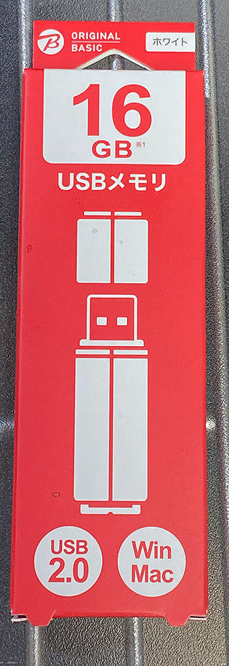
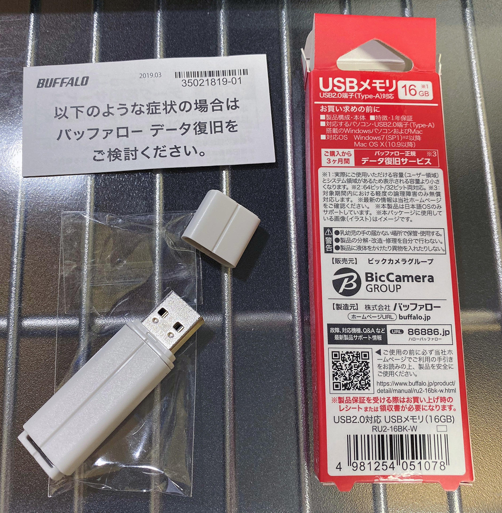
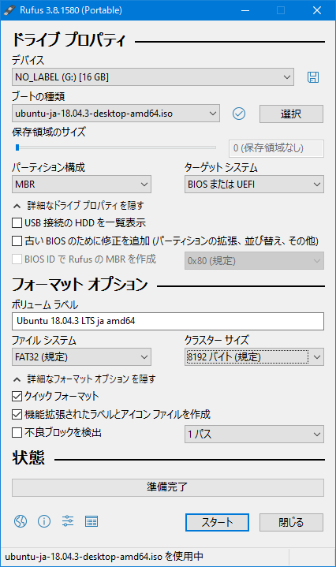
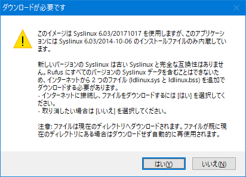
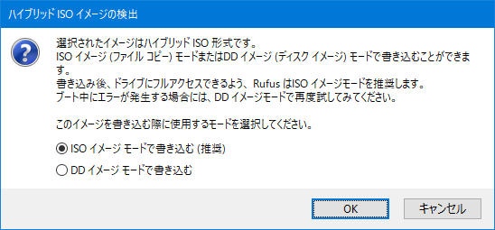
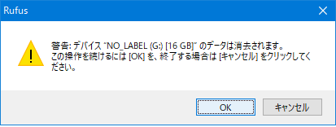
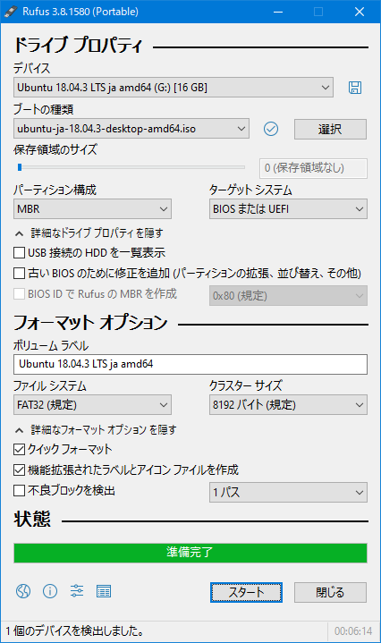

Linux 専用マシンにしようと思って購入した ThinkPad X250。元々 HDD が内蔵されていたが、先日コレを SSD に換装した。元の HDD と SSD との間ではミラーリングやデータ同期等はしていないので、装着した SSD は空っぽだ。

今回は、この空っぽの SSD に Ubuntu をインストールするための「**ライブ USB メモリ**」を作成していく。

## 目次

## ライブメディアとは

Ubuntu の「*ライブメディア*」とは、CD や USB メモリなどに Ubuntu の試用環境とインストーラを入れておいて使用するモノを指す。

Windows が搭載されているようなマシンに「ライブ USB メモリ」を挿して、USB メディアを先に読み込んでブートするような BIOS 設定にしておけば、その USB メモリ内の Ubuntu が起動するという仕組みになっている。

コレでまずは自分の PC に Ubuntu を入れたらどんな具合になるか、ストレージとの相性をチェックしたりして、確認が終わったらインストーラを起動する、という流れで使うと良いだろう。

- 参考：[Ubuntu 18.04 インストール準備 その1 - Ubuntu 18.04をインストールする前に・Ubuntuのライブメディアを作成してUbuntuを起動する - kledgeb](https://kledgeb.blogspot.com/2018/04/ubuntu-1804-1-ubuntu-1804ubuntuubuntu.html)

## USB メモリを購入する

ライブ USB メモリを作るには、**2GB 以上の容量がある USB メモリ**が必要だ。念のため 4GB 程度の USB メモリがあれば十分だが、最近はそんな小さい容量の USB メモリが逆に売っていなくて、自分は *16GB の格安 USB メモリ*をビックカメラで買った。

一応中身は Buffalo 製。800円程度。

  

    
  

  

    

      <a href="https://www.amazon.co.jp/dp/B00TMYO5EM?tag=neos21-22&amp;linkCode=osi&amp;th=1&amp;psc=1">BUFFALO【国内メーカー】 USBメモリ 16GB USB3.2(Gen1)/3.1(Gen 1)/3.0/2.0 充実サポート RUF3-K16GA-BK/N【Amazon.co.jp限定】</a>
    

  

  

    
  

  

    

      <a href="https://hb.afl.rakuten.co.jp/hgc/g00r7ld2.waxycfeb.g00r7ld2.waxyddc5/?pc=https%3A%2F%2Fitem.rakuten.co.jp%2Fbiccamera%2F4981254041932%2F&amp;m=http%3A%2F%2Fm.rakuten.co.jp%2Fbiccamera%2Fi%2F11583087%2F">BUFFALO　バッファロー RUF3-KS16GA-BK USBメモリー USB3.1/3.0/2.0対応 16GB ノックスライド式 オートリターン機能搭載 RUF3-KSAシリーズ ブラック [16GB /USB3.1 /USB TypeA /ノック式][RUF3KS16GABK]</a>
    

    

      <a href="https://hb.afl.rakuten.co.jp/hgc/g00r7ld2.waxycfeb.g00r7ld2.waxyddc5/?pc=https%3A%2F%2Fwww.rakuten.co.jp%2Fbiccamera%2F&amp;m=http%3A%2F%2Fm.rakuten.co.jp%2Fbiccamera%2F">楽天ビック（ビックカメラ×楽天）</a>
    

    
価格 : 1280円

  

## Ubuntu のディスクイメージをダウンロードする

それでは、USB メモリに書き込む Ubuntu のディスクイメージを準備しよう。

自分は今回、**Ubuntu Desktop 18.04.3 LTS 日本語 Remix** というイメージを使うことにした。

- [Ubuntuの日本語環境 | Ubuntu Japanese Team](https://www.ubuntulinux.jp/japanese) … 公式ページトップ

このイメージは、オリジナルの Ubuntu 18.04.3 (本校執筆時点で最新版の LTS) に、日本語環境を追加したモノだ。最初から日本語での動作環境が整えられているらしいので、環境構築が楽になるかなーと思い選択した。

- [Ubuntu Desktop 日本語 Remixのダウンロード | Ubuntu Japanese Team](https://www.ubuntulinux.jp/download/ja-remix)

上のページから `ubuntu-ja-18.04.3-desktop-amd64.iso` というファイルをダウンロードする。ファイルサイズは 2GB 弱だ。

- 参考：[Ubuntu 18.04 その121 - Ubuntu 18.04 LTS 日本語 Remixがリリースされました・ ディスクイメージのダウンロード - kledgeb](https://kledgeb.blogspot.com/2018/05/ubuntu-1804-121-ubuntu-1804-lts-remix.html)

## 専用ソフトで USB メモリにディスクイメージを書き込む

ISO ファイルをダウンロードしたら、USB メモリにこのファイルをコピー…すれば良いワケではない。専用のソフトを使って書き込んでやらないと、ライブ USB メモリとしては動作しないのだ。

今回は Windows 用の **Rufus** という有名なフリーソフトを使用する。

- [Rufus](https://rufus.ie/)

本校執筆時点では Rufus v3.8 が最新版。Rufus v3.8 Portable (ポータブル版) である `rufus-3.8p.exe` をダウンロードした。

exe ファイルを開いてソフトを解凍し、Rufus を開く。

ネット上の記事では古いバージョンの Rufus を使っていて、スクショどおりの設定項目が見当たらないかもしれない。自分は Rufus 公式サイトのトップにあるスクショを参考に、次のように設定した。

- デバイス : USB メモリを挿入し選択する
- ブートの種類 : 先程ダウンロードした `ubuntu-ja-18.04.3-desktop-amd64.iso`
- パーティション構成 : MBR
- ターゲットシステム : BIOS または UEFI
- 詳細オプションを表示する
- ボリュームラベル : お任せのまま
- ファイルシステム : FAT32 (規定)
- クラスターサイズ : 8192バイト (規定)
  - Rufus 公式サイトのスクショは「4096バイト (規定)」が選択されていたが、自分が使った USB メモリだと8192バイトが規定になっていたので、規定のまま設定を変えずに進めた

というワケで基本的にデフォルトのままで OK。「スタート」ボタンを押すと警告ダイアログが出るが、全てそのまま進めていくと、書き込みがスタートする。

プログレスバーが「準備完了」になったら書き込み完了。「閉じる」ボタンを押下して閉じて良い。

- 参考：[Ubuntu 18.04 その88 - UbuntuのライブUSBメモリーを作成するには（Windows/Rufus編） - kledgeb](https://kledgeb.blogspot.com/2018/04/ubuntu-1804-88-ubuntuusbwindowsrufus.html)

## 以上

今回はライブ USB メモリを作成するところまで。

次回はいよいよ ThinkPad X250 に Ubuntu をインストールしていこうと思う。
