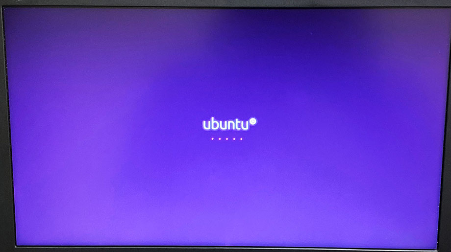
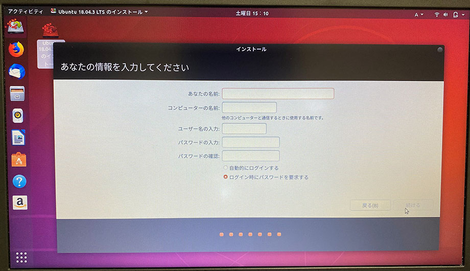

Linux 専用機を作るべく、ThinkPad X250 を購入。内蔵 HDD を SSD に換装し、「Rufus」を使って「Ubuntu Desktop 18.04.3 LTS 日本語 Remix」のイメージを USB メモリに書き込んだ。

今回はこの続きで、ライブ USB メモリを使って Ubuntu のインストールを行っていく。

## 目次

## BIOS でブート順を変更しておく

換装した空の SSD よりも先に、USB メモリを読み込んでブートさせたいので、BIOS でブート順序を変更しておこう。

ThinkPad の電源を入れたらすぐに **F1 キー**を数回押下し、BIOS 画面に入る。

BIOS 画面に入ったら、「Startup」→「Boot」と進み、「Boot Priority Order」画面に入る。ココで「+」キーや「-」キーを使って、ブート順を変更する。

USB メモリを挿した状態でこの画面に入ると、「USB Flash Disk」とかいう表示になっている項目があると思うので、コレを上部に寄せておき、SSD より先に読み込むようにしておく。

SSD は「ATA HDD0 【メーカ名や製品名】」といった項目で表示されていると思うので、コレは下の方に寄せておく。

並び替えが終わったら F10 キーを押下し、設定を保存して BIOS を終了する。

## USB メモリからブートする

ブート順を変更して再起動すると、挿入しているライブ USB メモリから優先的にブートされる。

このように画面が進んでいく。「Ubuntu を試す」を選択すると、USB メモリだけで Ubuntu が動作する。ファイルなどは保存されないので、あくまで試用、という感じ。

「インストール」を選択するとインストールウィザードが始まるが、その前に設定を確認するため、ひとまず「*Ubuntu を試す*」を選択する。

デスクトップが表示されたら、左上の「アクティビティ」を選択し、検索窓に「gnome-disk」と入力、ヒットしたアプリアイコンを選択する。

内蔵 SSD や USB メモリのデバイス情報が表示されるので、内蔵 SSD のデバイスを確認しておく。ココでは `/dev/sda` であることが分かる。

コレが確認できたらアプリを閉じ、デスクトップ上のアイコンをクリックする。先程と同じ二択の画面が開くので、「インストール」を選択する。

「インストール」を選択してウィザードが始まると、最初にキーボードレイアウトを質問される。自分の ThinkPad X250 は英字配列なので、US キーボードを選択する。コレは言語設定とは直接関係しない。

- 自分は「日本語 Remix」イメージを使用しているので若干手順が異なるかもしれない。通常のイメージだとキーボードレイアウトの前に言語を問われる画面があるかもしれない

続いて、Wi-Fi への接続画面が出てくる。インストール時に追加で必要なパッケージをダウンロードしたり、インストール直後のシステムアップデートに使えたりするので、Wi-Fi 接続をしておくと良いだろう。

続いて「アップデートと他のソフトウェア」画面に移動する。ココでは、*「グラフィックスと Wi-Fi ハードウェアと追加のメディアフォーマットのサードパーティ製ソフトウェアをインストールする」にチェック*を入れておくと良い。

次に「インストールの種類」画面が出る。まっさらな内蔵 SSD を装着しているので、「ディスクを削除して Ubuntu をインストール」を選択する。

次のような警告ダイアログが出るので、書き込み先のデバイスが、先程確認した内蔵 SSD のデバイス `sda` であることを確認して進む。

インストール作業が始まる。この間もウィザードは若干続く。時刻設定のために「どこに住んでいますか？」を設定する。日本在住なら Tokyo で良いだろう。

「あなたの情報を入力してください」では、デフォルトのユーザ名とパスワードを設定する。ユーザ名は小文字のみ。パスワードは弱いパスワードでも設定できなくはない。

インストールはそこまで時間はかからない。気楽に待つ。

(↑ USB メモリを繋いでこのように作業している)

インストールが終わったら、再起動するか問われる。

再起動ではなく、*一旦電源を切ってやり、USB メモリを抜いて、BIOS で再度ブート順を SSD 有線に変更*してやると良いだろう。

USB メモリを抜き、SSD を読み込んで起動するようにしたら、めでたく Ubuntu が開くことだろう。

「設定」アプリで様子を見てみる。

自分はどのマシンでも「Yosemite4」の壁紙を使っているので、早速変更。

うぉー、ついに Ubuntu 専用マシンが爆誕した。

---

ということで以上。電源ボタンを押すと Ubuntu が起動する ThinkPad X250 ラップトップが出来上がった。

コレからどんどん使い込んで改造していくので、設定周りのノウハウは随時記事にしていこうと思う。

  

    
  

  

    

      <a href="https://hb.afl.rakuten.co.jp/hgc/g00qvs62.waxyccdc.g00qvs62.waxyd989/?pc=https%3A%2F%2Fitem.rakuten.co.jp%2Fcreatenew%2F191224286302%2F&amp;m=http%3A%2F%2Fm.rakuten.co.jp%2Fcreatenew%2Fi%2F10013823%2F">【中古】レノボLenovo ThinkPad X250 第五世代Core-i5 新品 SSD 正規版Office2019付 無線WIFI、USB3.0 中古ノートパソコン Windows10 Pro 64bit 中古パソコン Win10 モバイルパソコン レノボ</a>
    

    

      <a href="https://hb.afl.rakuten.co.jp/hgc/g00qvs62.waxyccdc.g00qvs62.waxyd989/?pc=https%3A%2F%2Fwww.rakuten.co.jp%2Fcreatenew%2F&amp;m=http%3A%2F%2Fm.rakuten.co.jp%2Fcreatenew%2F">創新楽天市場店</a>
    

    
価格 : 29000円

  

- 参考 : [Ubuntu 18.04 インストール（BIOS） その1 - BIOSのPCにUbuntu 18.04をインストールする（ライブメディアから起動 〜 インストールの種類の選択） - kledgeb](https://kledgeb.blogspot.com/2018/04/ubuntu-1804-bios-1-biospcubuntu-1804.html)
