2台目の ThinkPad X250 を買いました。

- [2代目 ThinkPad X250](https://www.instagram.com/p/B91crmjpPwI/)

## 目次

## キーボードが壊れた

2月に2万円で入手した、中古の ThinkPad X250。

- [ThinkPad X250 を買った](/blog/2020/02/20-02.html)

SSD に換装して Ubuntu を入れてホクホクしていたのだが、購入から1ヶ月も経過していないある日、突然いくつかのキーが認識しなくなった。

認識しなくなったキーは以下あたり。

- 左 Ctrl
- F1・F2・F9
- 5・6・ハイフン・イコール

筐体の左下と、上部のキーの多くが効かなくなった。F1 キーが効かないので起動時に BIOS にも入れず。

ググってみたら、効かなくなっていたキーが全く同じ人を発見。X240 だけど。

- 参考：[キーボードの5と6と-と左Ctrlキーが効かない - 雑記帳](https://yoneyore.hatenablog.com/entry/2018/09/08/222037)

この方はキーボードが壊れていたそうだ。

自分のキーボードもどうなっているのか見てみようと思い、分解して確認していると、何やらケーブルを留めていたピンを割ってしまい、戦意喪失。動揺したのかキーボードの下に敷かれていたプラスチックの板を装着せずに裏蓋を閉めてしまい、廃棄を決意。

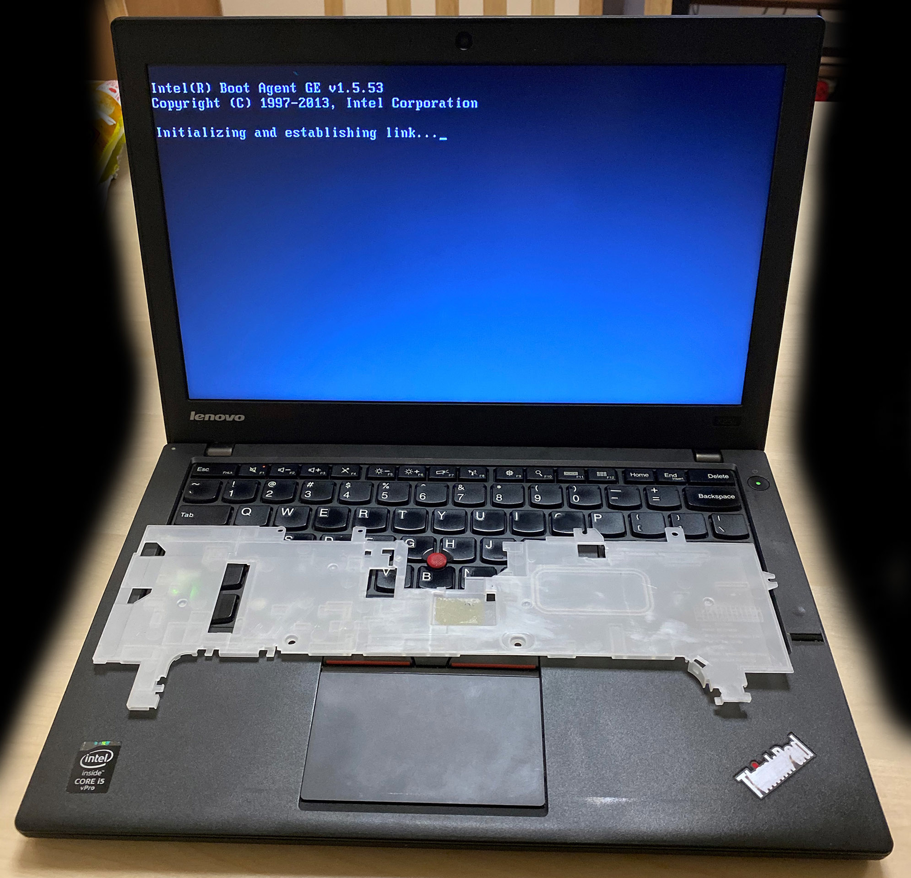

謎のピンが外れたが、とりあえずマシンは起動するし、画面も映る。本体のキーボードが認識しないのが問題。そしてイジくっている内に気付いたのだが、左 Ctrl を強く押し込むと画面表示がバグりまくる。液晶の端子を物理的に触ってるような感じ。なんじゃこりゃ…。

### キーボード換装は自分には無理

今回イジってみて分かったけど、精密ドライバーもなしに X250 のキーボード換装は無理だ。細かな部品が多すぎる。ハンダ付けすらやったことないような人間が手を出せない領域だと思った。

### X250 の筐体はヤワい

ThinkPad X240 以降のシリーズは、どうも筐体の剛性が弱いらしい。キーボードが効かなくなる症状はよくあるらしく、筐体の左パームレスト部分を掴んでマシンを持ち上げたりすると、筐体が歪んで画面が映らなくなったりするらしい。液晶の表示がバグりまくったのはコレに近いモノか。

12インチの X シリーズにおける現在の最新版は X280 だが、本体の剛性は恐らく似たようなモノかと思われる。X3xx 系や X1 Carbon がどうなのかは知らないが、ThinkPad ってもっと頑丈なモンだと思ってたわ…。

## それでも ThinkPad を諦められず…

そういうワケで、壊れた ThinkPad X250 は、[mstdn.jp で募集した人](https://fedibird.com/@otakuman)に差し上げた。この方はメモリなどのパーツ取りに有効活用してくださったそうだ。

買ったばかりの SATA SSD は取り外して控えておいたので、コレを載せられる別のマシンを再購入したい。次は何を選ぼうか迷ったが、もう少し ThinkPad を触りたいし、なんというか半分自分で壊したみたいになったのが悔しいので、全く同じ機種を買うことにした。

またもや US キーボードのモノを探したのでヤフオクでの個体数が少なかったのだが、お目当てのスペックのモノがあったので、2020-03-15 に__4万円__で2台目の ThinkPad X250 を購入した。

## 外観チェック

2台目の ThinkPad X250 の外観を見てみる。

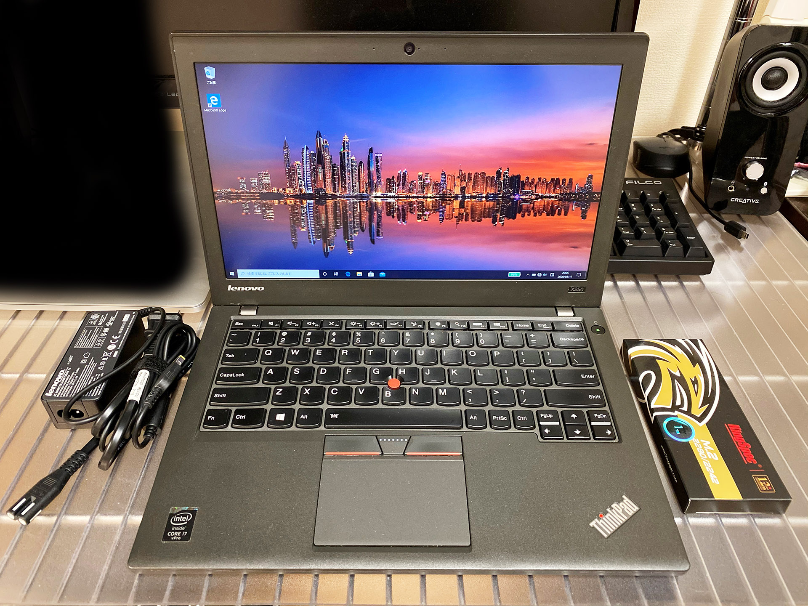

AC 電源と M.2 SSD の外箱が付属。

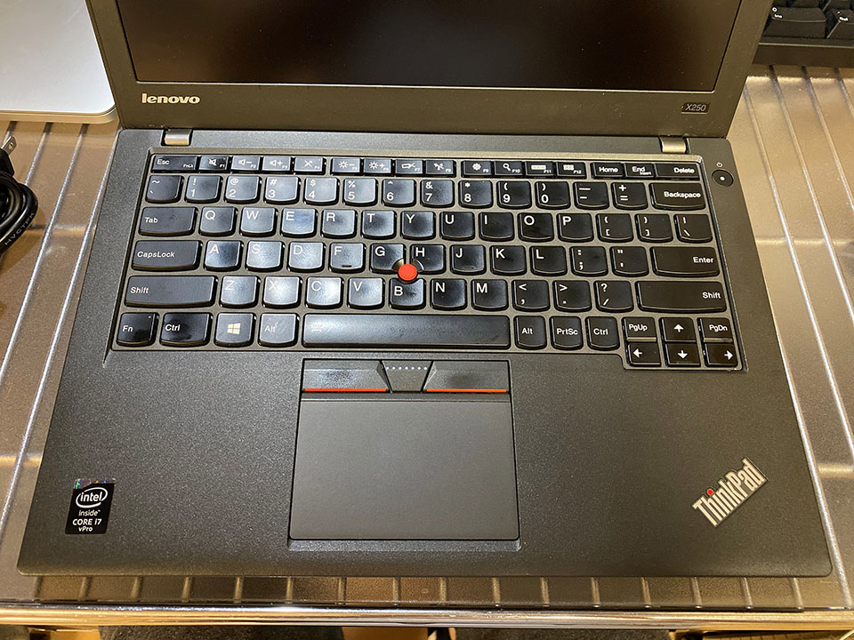

キーボードはキレイ。1台目は右下の部分に、恐らく指紋認証？のセンサーがあったが、2台目にはない。

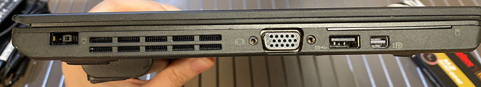

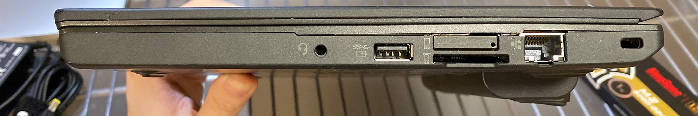

側面。

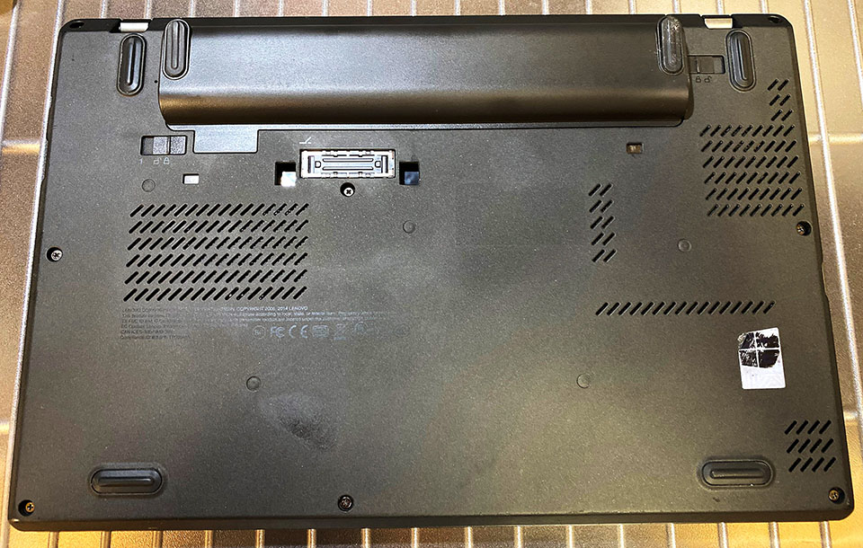

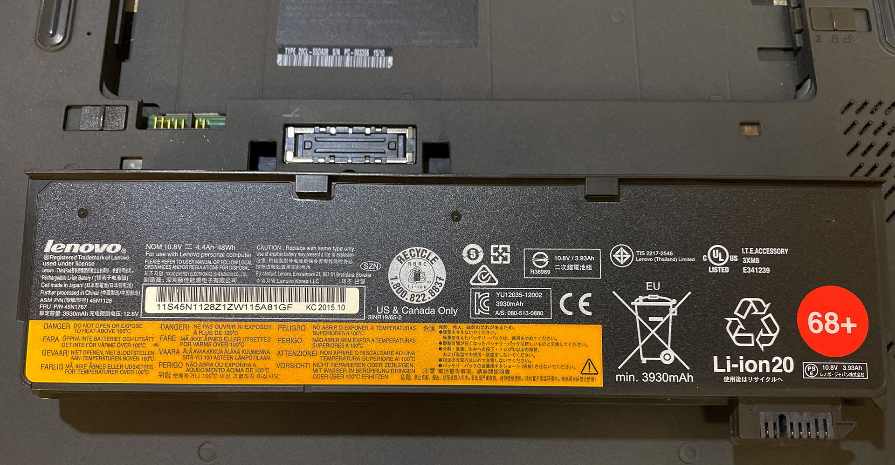

裏面。バッテリーは大きいモノが付いていて、コレのおかげで傾斜ができ、キーボードが打ちやすい。

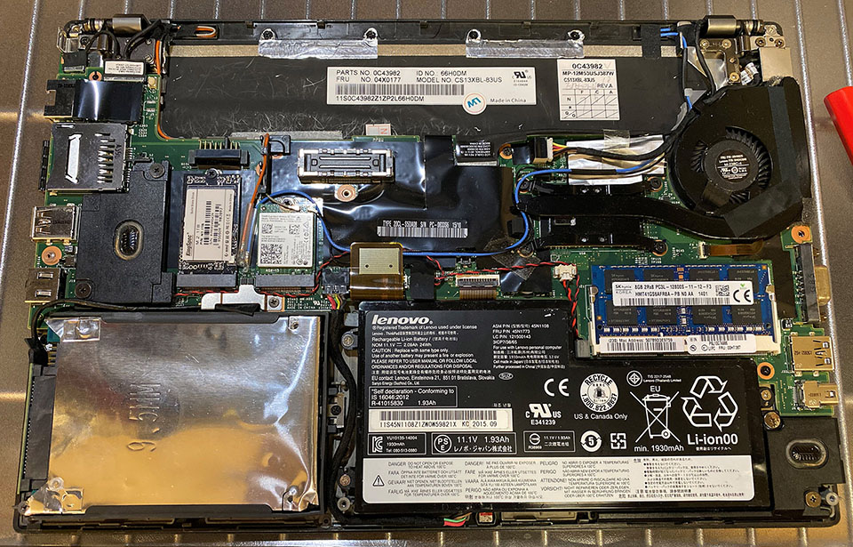

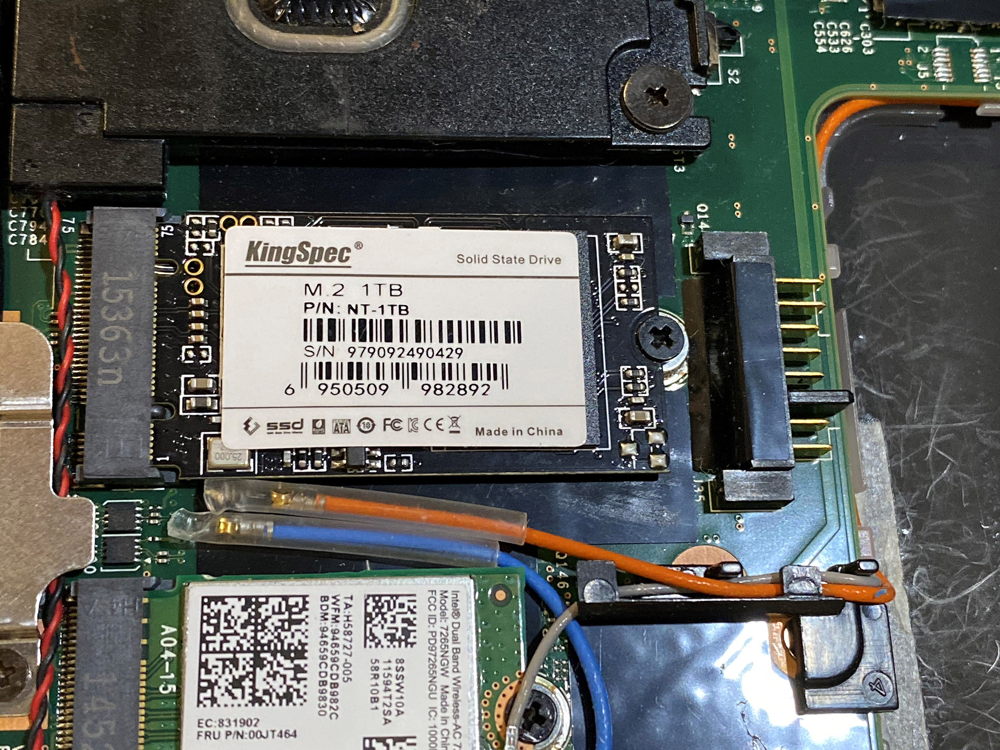

外観チェック～と言いつつ中を開けちゃう。M.2 SSD が装着されている。

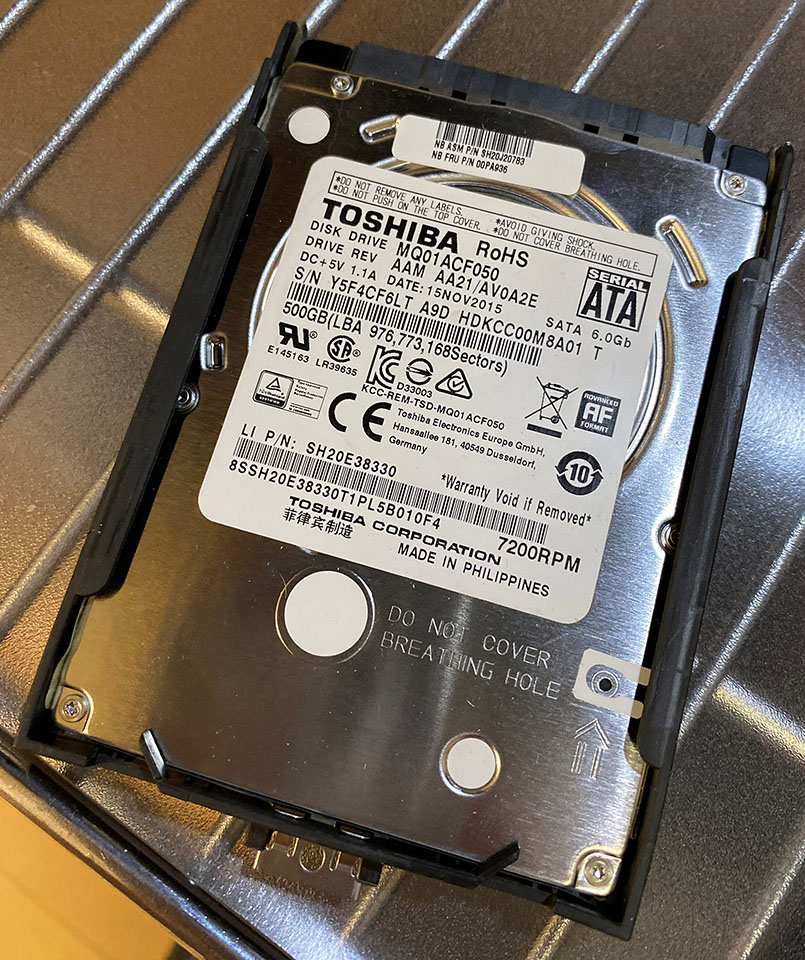

内蔵 HDD の方は1台目と同じ東芝製だったが、スペーサー代わりになる黒いプラスチックの枠が、1台目のヤツよりしっかりしているモノだった。

## 1台目と2台目のスペック比較

手放した1台目と、再購入した2台目の X250 のスペックは以下のとおり。

| 項目         | 1台目         | 2台目           |
|--------------|---------------|-----------------|
| CPU          | Core i5-5300U | _Core i7-5600U_ |
| メモリ       | 8GB           | 8GB             |
| HDD          | 500GB         | 500GB           |
| M.2 SSD      | なし          | __1TB__         |
| 液晶         | 1366x768      | _1920x1080_ IPS |
| キー配列     | US 配列       | US 配列         |
| リアバッテリ | 通常サイズ    | _大型タイプ_    |
| 購入金額     | 21,800        | 41,000          |

CPU が i5 から i7 になった他、改造が施されていて、

- 通常何も挿さっていない M.2 スロットに 1TB の M.2 SSD が挿さっている (コレに Windows10 Pro が載っている)
- 液晶がフル HD の IPS 液晶になっている

というモノだった。

状態も、1台目はキー刻印が消えていたりしたのだが、2台目は美品。値段は倍したけど、最初から状態の良いヤツを買っとけばよかった…と後悔。

## 2台目 ThinkPad X250 をレビュー

ということで、2台目 ThinkPad X250 の使い心地をレビューする。

### IPS 液晶は焼き付き・残像が酷い

早速だが、この換装されている IPS 液晶がちょっとイマイチだ。発色はよく、普段は普通に使えているのだが、_焼き付き・残像がやたらと残ってしまう。_

明るめの画面を開いていると文字などがガッツリ残ってしまい、10分くらい放っておくと消える感じ。ずっと残るワケではないのでまだ許容範囲だが、こういうところも考えるとやっぱ高いマシンちゃんと買うべきだなーとは思った。コイツに関しては仕方なく我慢して使う。

### Core-i7 だからか CPU がブン回る

特に Windows を動かしていて気になるのが、CPU ファンがやたらと回りまくること。1台目の時はそうでもなかったのになー。Core i7 は熱持つのかな。

CPU ファンの回転数を調整する方法もあったりするので、もう少し調整はしてみるが、コレも我慢するしかないかなー。

Ubuntu 使ってる限りだと性能差はそんなにない気もする。

### M.2 SSD と SATA SSD で Windows と Ubuntu のデュアルブートができた

追加で装着されている 1TB の M.2 SSD の方に Windows10 Pro がインストールされていたので、データ用の SATA HDD を取り外し、1台目に装着していた SATA SSD 240GB を取り付けてみた。

この SATA SSD にはコレまで使っていた Ubuntu が入っていたのだが、そのままでは認識してくれなかったので、ライブ USB メモリから再インストールした。すると Grub が M.2 SSD を自動認識して、うまくブート画面を構成してくれた。この辺はまた [Corredor](https://neos21.hatenablog.com/) に記事を書こうと思う。

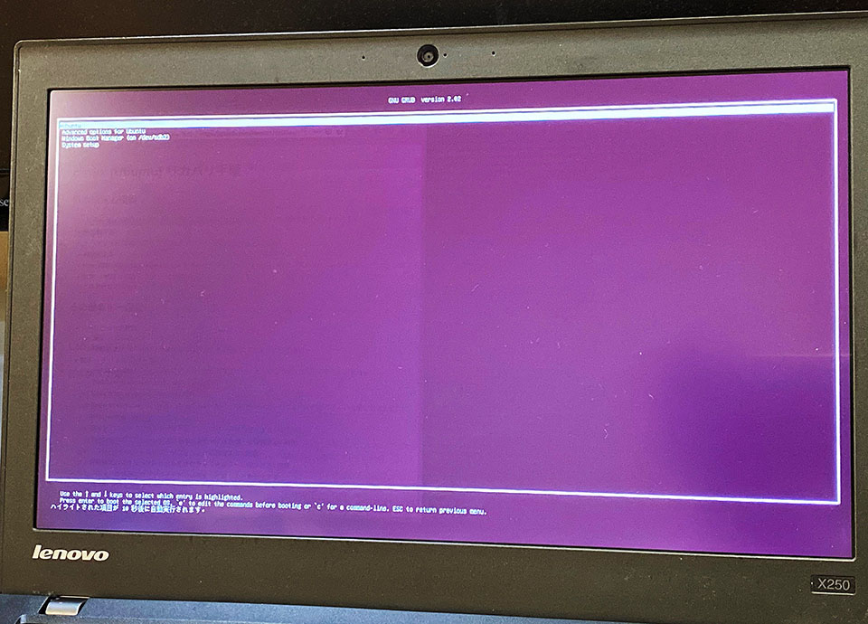

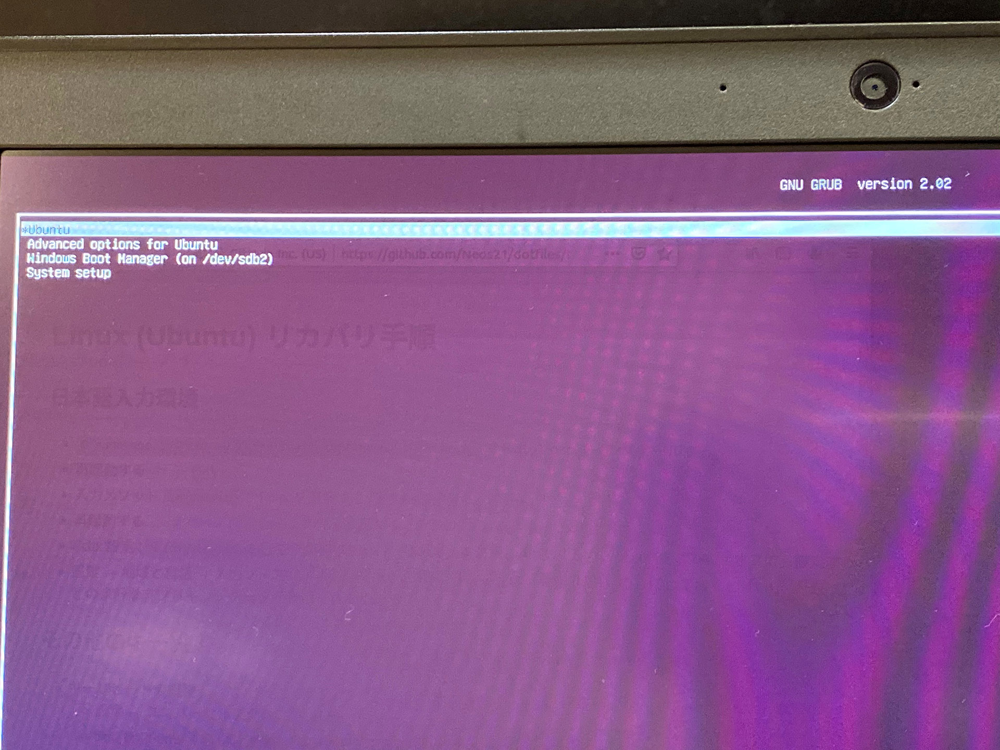

↑PC 起動時はこんな感じで Grub のメニューが表示され、「Windows Boot Manager」を選べば Windows が起動できる。先程話した画面の焼き付き・残像が見えているのが分かるだろうか… (「リカバリ手順」みたいな文字が見えるかと)。

物理的に SSD が別れているので、Windows と Ubuntu を安全に分けて運用できている。相互のデータ移動は難しいが、どうせ GitHub とかネットに上げちゃうので、気にしなくていいかと。

## 今度は壊さず使いたい

液晶の焼き付きが気になって、CPU ファンが若干気になるものの、それ以外は良い買い物をしたと思う。

ThinkPad X250 を使っていて得た知識は、また [Corredor](https://neos21.hatenablog.com/) に技術ネタとしてまとめていくので、お楽しみに。

  

    
  

  

    

      <a href="https://www.amazon.co.jp/dp/B07TT2D84R?tag=neos21-22&amp;linkCode=osi&amp;th=1&amp;psc=1">ThinkPad X250 20CL-A3GLJP Core i5 メモリ8GB SSD240GB Windows10 Pro 64bit</a>
    

  

  

    
  

  

    

      <a href="https://hb.afl.rakuten.co.jp/hgc/g00sivf2.waxycba6.g00sivf2.waxydd96/?pc=https%3A%2F%2Fitem.rakuten.co.jp%2Foasupport%2F19062701%2F&amp;m=http%3A%2F%2Fm.rakuten.co.jp%2Foasupport%2Fi%2F10000690%2F">【20日・25日全品ポイント23倍！楽天大感謝祭限定！】中古パソコン 中古ノートパソコン Windows10 Lenovo ThinkPad X250 軽量モバイル 1.45Kg 薄型堅牢ボディ 第五世代 Corei5 高速SSD SDカード USB3.0対応 Office付【送料無料】</a>
    

    

      <a href="https://hb.afl.rakuten.co.jp/hgc/g00sivf2.waxycba6.g00sivf2.waxydd96/?pc=https%3A%2F%2Fwww.rakuten.co.jp%2Foasupport%2F&amp;m=http%3A%2F%2Fm.rakuten.co.jp%2Foasupport%2F">OAサポート</a>
    

    
価格 : 69999円

  

