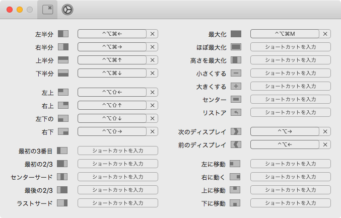
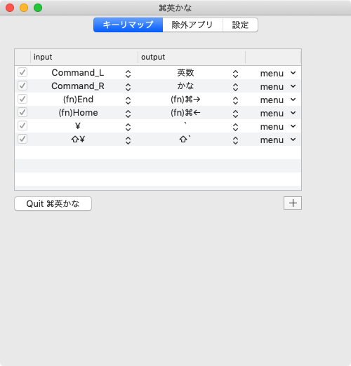
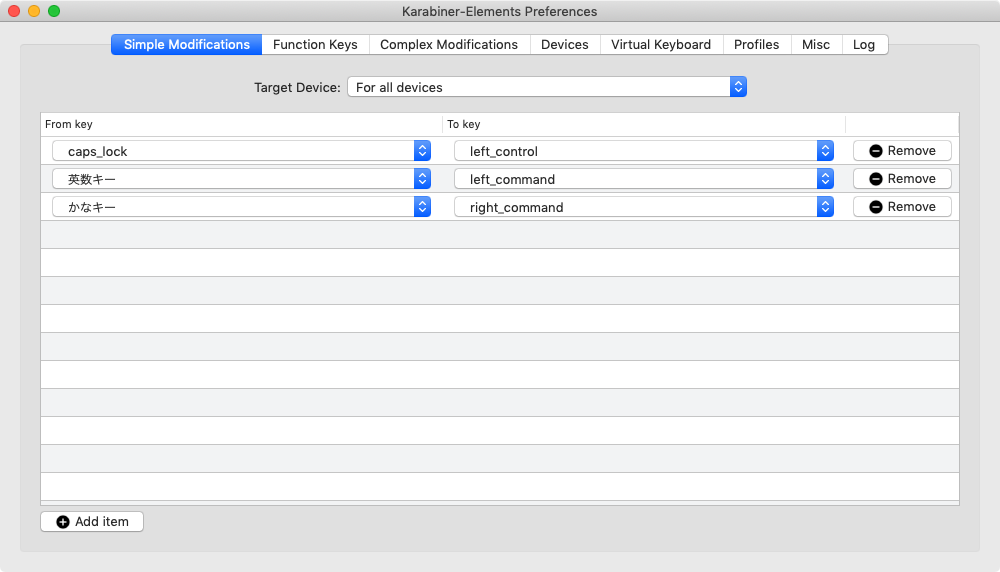
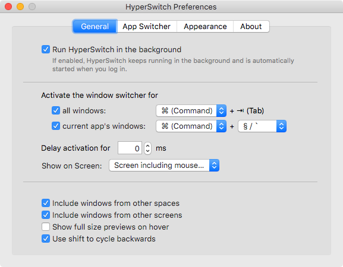

コレまで、MacOS でウィンドウ操作をキーボードで行うためのツールとして、*SizeUp* というモノを使っていた。

- [Irradiated Software - SizeUp - The Missing Window Manager](http://www.irradiatedsoftware.com/sizeup/)

`Control + Option + Command + M` で最大化、`Control + Option + Shift + 矢印キー` でウィンドウを画面の上下左右にリサイズ配置、などなど、色々な操作ができる。

便利なので好んで使ってきたのだが、無料版は時々広告のポップアップが入るのが鬱陶しかった。

そんなある日、**Rectangle** という同様のアプリを見つけた。

- [GitHub - rxhanson/Rectangle: Move and resize windows on macOS with keyboard shortcuts and snap areas](https://github.com/rxhanson/Rectangle)

GitHub でソースも公開されており、インストーラをダウンロードできる他、Homebrew Cask を使ってのインストールもできる。

```bash
$ brew cask install rectangle
```

デフォルトのキーボードショートカットは SizeUp と異なるが、自由にショートカットを変更でき、SizeUp と全く同じキー設定にできた。



なにより、完全無料で広告も出ないので、抜群の使い心地。Rectangle 様々である。

-----

というワケで、自分が常時起動している MacOS 環境を整えるためのツール類は、以下に落ち着いた。

- *英かな* : Cmd キーの押下を「英数」「かな」キーの動きにさせる
  - 自分は JIS 配列の Mac 端末も US 配列に認識させて使っているのだが、そうすると「バッククォート」と「チルダ」を入力するキーがなくなるので、JIS キー右上の「円マーク」キーに「バッククォート」と「チルダ (Shift 押下時)」をアサインするためにも使っている
  - 
- *Karabiner-Elements* : JIS 配列の Mac 端末において、「英数」「かな」キーの押下を Cmd キーの動きにさせるために使用
  - 英かなと Karabiner-Elements を両方起動しておくことで、「英数」「かな」キーの単独押下はそのまま、コンビネーション入力は Cmd キーと認識。Cmd キー単独押下は「英数」「かな」と認識させ、コンビネーション入力はそのまま。という動きを実現している。Cmd キーと「英数」「かな」をデタラメに押しても思ったように動くので、重宝している
  - 
  - US 配列の Mac では「英数」「かな」キー自体が存在しないので、Karabiner-Elements は不要
- *HyperSwitch* : `Cmd + Tab` の動作を Windows チックにする
  - アニメーションなども消してサクサクと `Cmd + Tab` 操作ができるようにしている
  - 自分はコレで事足りているので、仮想デスクトップの類は一切使っていない
  - 
- *Rectangle* : 今回 SizeUp から移行した、ウィンドウ操作をキーボードで行えるようにするツール
  - `Cmd + Tab` で (HyperSwitch を使って) ウィンドウを切り替え、`Control + Option + Command + M` でウィンドウ最大化、みたいなキー入力が板についている
  - 

コレで良き良き。
