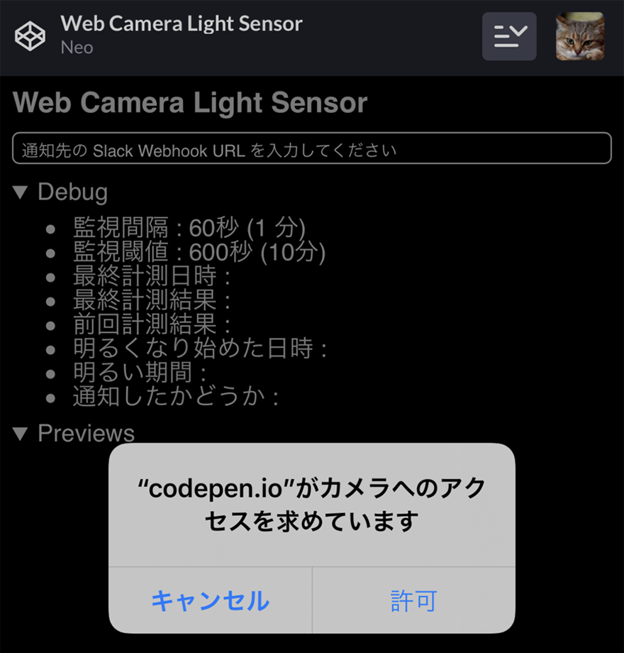
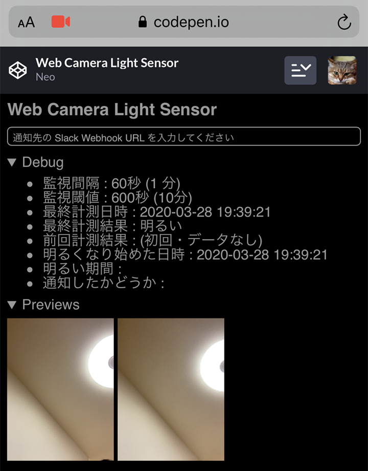
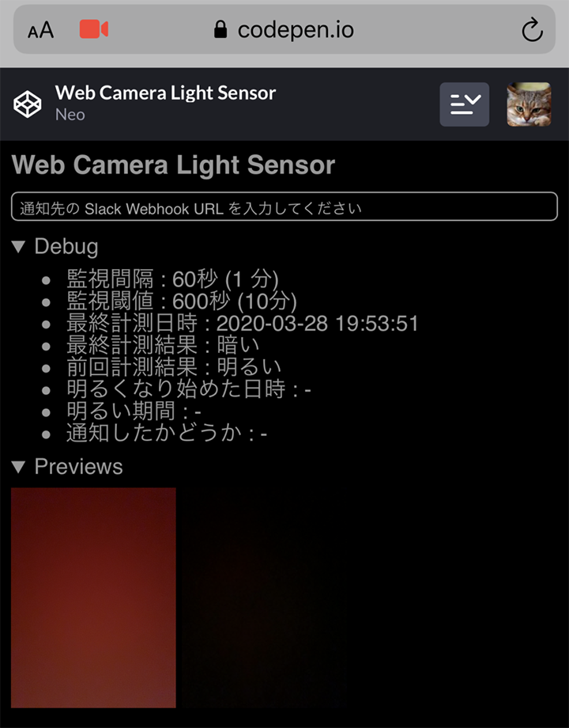
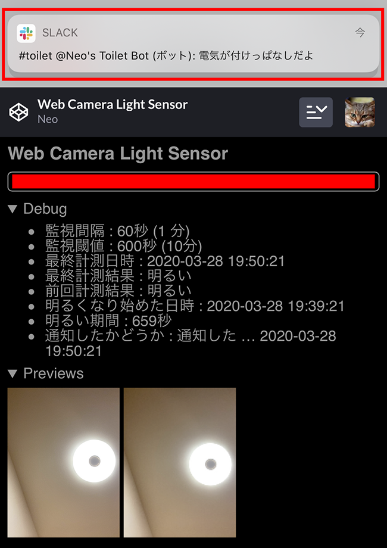
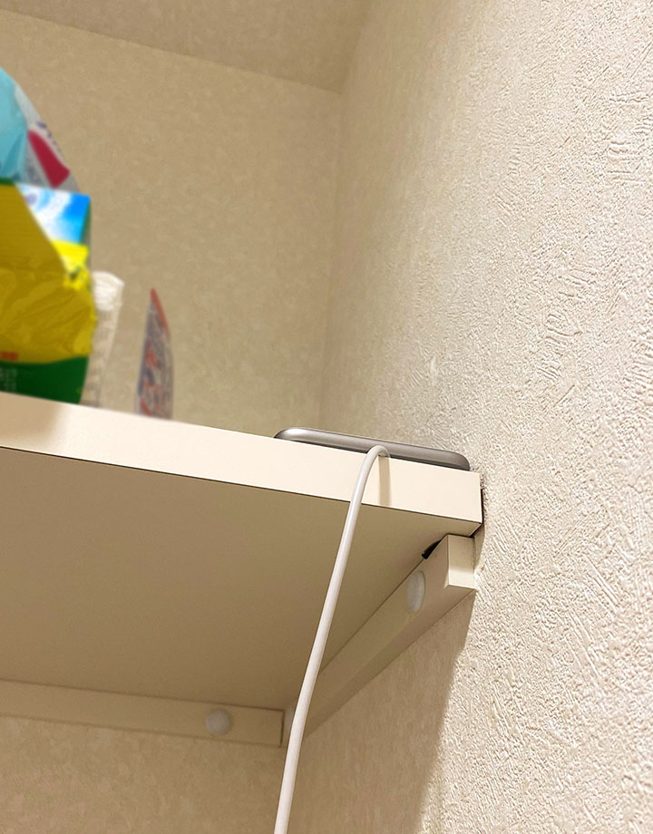

僕はよく*トイレの電気を消し忘れる*。そしてその度に<ins datetime="2021-03-26T00:00Z">元</ins>妻が激昂する。

コレは仕組みでどげんかせんといかん、と思い、トイレの電気が付けっぱなしになっている時に知らせる仕組みを考えてみた。

## 目次

## 仕組みと必要なモノを考える

まずはどのような仕組みで実現していくか考えていこう。

トイレの電気が付いているかどうか、を監視するには、「**光センサー**」を用意したい。よくラズパイなんかと組み合わせる「光センサーモジュール」というモノがあったりする。

しかし今回はお金を使いたくないので、「*カメラで室内を撮影し、その明るさを判定する*」ことができないか考えてみた。

手元には機種変更して使用していない *iPhone6Plus* があったので、コレのフロントカメラを使ってトイレを撮影することにした。トイレにはコンセントがあるので、充電器に繋いで付けっぱなしにすればよかろう。

監視の仕組みは、トイレの室内を定期的に撮影し、明るい状態がしばらく続いたら、電気が付けっぱなしだと判定する。

通知の仕組みについては、スマホは SIM がなくとも Wi-Fi で普通にネットに繋がるので、個人の Slack チャンネルに POST 通知を送ることにした。一度通知を送ったら再通知は行わず、またトイレが暗くなったらリセットとする。

## 実装方法を考える

カメラで室内を定期的に撮影し、その画像の「明るさ」を調べられれば良いので、Web アプリとして実装できそうな気がしてきた。

*ウェブカメラからの映像を取得するには、`MediaDevices.getUserMedia()` メソッド*が使える。ココから**画像を切り出すには、`canvas` 要素に流し込んでやれば良さそう**だ。`canvas` 要素に変換できたらそこから RGB 値が分かるので、撮影した画像が明るいか暗いかの判別は付けられる。

繰り返し監視するなら `setInterval()` で処理を定期実行すれば良さそうだ。Slack への通知は XMLHttpRequest で POST 送信できれば良い。

一応、localhost で動かすワケではないので、HTTPS なサイトで稼動させる必要があるが、CodePen.io や GitHub Pages を使えば大丈夫そうだ。

## というワケで実装

というワケで実装してみた。

最初のバージョンは <del>CodePen.io で作ったので、まずは CodePen の URL を貼っておく。</del><ins>2021-12-20 : GitHub Pages に移植した。</ins>ソースも確認できる。

- [Web Camera Light Sensor](https://neos21.github.io/frontend-sandboxes/web-camera-light-sensor/index.html)
- [frontend-sandboxes/index.html at master · Neos21/frontend-sandboxes](https://github.com/neos21/frontend-sandboxes/blob/master/web-camera-light-sensor/index.html)

同様に GitHub Pages にもアップしておいたので、コチラもドウゾ。

- [Web Camera Light Sensor](https://neos21.github.io/web-camera-light-sensor/)
- [GitHub - Neos21/web-camera-light-sensor: スマホカメラや Web カメラを使用して部屋の明るさを計測し、一定時間明るかったら Slack 通知する](https://github.com/Neos21/web-camera-light-sensor)

## アプリの解説

それでは、上のページで公開している Web アプリの使い方を解説していく。

iPhone Safari で上の GitHub Pages にアクセスすると、カメラの使用許可を求められる。コレに OK すると、フロントカメラの画像を取得し始める。許可を与えなかったり、カメラがないデバイスからアクセスしたりすると、正常に動作しない。

フロントカメラを使えるようにすると、1分おきにカメラの映像を取得し、明るさを計測し始める。この監視間隔は、グローバル定数 `intervalMs` にて設定している。今後はこの値を動的に変更できるようにしても良いかも。

1分おきにカメラの映像から静止画を切り出し、`canvas` 要素を使って RGBA のデータを取得する。そして RGB の値から平均値を取得し、画面全体がどのくらい暗いかを測っている。この値は 0 ～ 255 で決まるので、50 とか 40 とか、数値が小さくて暗めな時に、「電気が付いていない」と判定してやれば良い。

部屋が暗い時は、`function darkFunc()` の処理が実行される。ココでは特段の処理を行っていないが、「明るい状態から暗くなった」時に、Slack 通知をしたかどうかのフラグなどをリセットし、次にまた明るくなった時のために備えている。

電気が付いていると判断した時は、`function lightFunc()` の処理が呼ばれる。ココで「暗い状態から明るくなった」1回目に、「明るくなり始めた時刻」を控えている。

以降、定期的に監視を繰り返し、明るい期間が一定以上続いたと判定したら、「部屋の電気が付けっぱなしである」とみなしている。この期間はグローバル定数 `leavingLightOnSecondsThreshold` で指定している。

一定以上明るい状態が続いたら、Slack 通知を行う。Slack 通知は予め Webhook URL を発行しておき、それをテキストボックスに入力しておくことでそこに POST 送信するようにしている。Slack の Webhook URL はクレデンシャル情報に近いのでアプリ内で保管していない。この辺は LocalStorage を使うとかして、もう少し柔軟な作りにしても良いかな。

↑ Slack 通知が飛んでいることが分かる。

Slack に通知が送れたら、「Slack 通知を行ったフラグ (`isReported`)」を立てておく。コレにより、何度も通知を送らないようにしている。このフラグは、電気が消された後に `darkFunc()` にてリセットされることになる。

以上がこのアプリの使い方・兼・処理フローになる。

## Slack Webhook を作る

Slack 通知する際の通知先として、Slack App を作っておく必要がある。

- [Slack API: Applications | Slack](https://api.slack.com/apps)

上のページから Slack App を作り、「Incoming Webhooks」から「Activate Incoming Webhooks」を On にする。すると Webhook URL が発行されるので、コレを控えておく。

この Webhook URL に POST リクエストを送ると、ココで指定したワークスペースのチャンネルに通知が届くというワケ。

- 参考 : [Javascript で Slack へ通知する手順 - Qiita](https://qiita.com/lmatsul/items/817468a33fa4900d92c1)
- 参考 : [JavaScriptを使ってSlackのチャンネルに投稿してみる - Qiita](https://qiita.com/cawpea/items/98e6271f627c3b9a5e12)

## ついでに : 横向きにした時にウェブカメラの解像度を変更する

iPhone を縦向きにしてウェブカメラの映像を取得した時、解像度は 480x640 (縦長) となった。コレを横向きにすると、解像度も自動的に 640x480 となるので、プレビューの解像度をコレに合わせるため、`orientationchange` イベントを使った。それをやっているのが `updatePreviewSize()` 関数部分になる。

- 参考 : [HTML5 スマホの縦向き/横向きを検知する](https://blog.katsubemakito.net/html5/orientation-angle)

## ついでに : 通知にビープ音を鳴らしてみた

開発は ThinkPad X250 で行っていて、X250 のウェブカメラで動作確認をしていたのだが、イチイチ Slack 通知を飛ばすのは鬱陶しかったので、JavaScript でビープ音を鳴らしてみた。

Chrome ブラウザで試していたのだが、Base64 で音声データを仕込んだ `new Audio()` を実行するだけで、外部ファイルなしに簡単にビープ音を鳴らすことができた。

- 参考 : [JavaScript で Beep 音を鳴らす方法 - Qiita](https://qiita.com/isseium/items/12b215b6eab26acd2afe)

しかし、iOS Safari ではこの方法で音声ファイルを鳴らせなかった。調べてみると、やたらと複雑な条件があったので、端末本体から音を鳴らして通知する仕組みは止めることにした。

iOS でも音を鳴らせないワケではないので、やってみたい人は [howler.js](https://github.com/goldfire/howler.js) などを使ってみると良いだろう。

## 実際にトイレに設置してみた

さてさて、諸々の実装が終わったので、あとは実際にトイレに設置してみた。

作成した画面を Safari で開き、テキストボックスに Slack の Webhook URL を入力したら、**画面の明るさを最も暗くする**。フロントカメラでトイレの映像を取得する際、画面の明るさがライト代わりになってしまうのを防ぐためだ。アクセシビリティ設定から「*ホワイトポイントを下げる*」を有効にしておくと、さらに明るさを下げられる。プレビューの類も、`details` 要素を使って非表示にできるようにしてあるので、閉じておくとより暗くできるだろう。

画面を真っ暗にしたら、トイレの収納棚にスマホを置き、充電ケーブルを繋いだ。ケーブルは 3m くらいある長いモノで、充電器は iPhone 純正品。フロントカメラがトイレの電気を撮影できるよう、配置にちょっと気を付ける。

↑ 下から見るとこんな感じ。

コレで無事、監視の仕組みができた。

↑ 右下のコンセントから電源を取り、右上に置いた iPhone6Plus が明るさを計測している。

我が家のトイレは窓がないので、昼間でも電気を消して扉を閉じれば真っ暗になり、しっかり「暗い状態」と判定される。そして電気を付けっぱなしにして10分ほど経過すると、ちゃんと Slack 通知も行われた。トイレから Wi-Fi が繋がるか心配だったが、大丈夫そうだ。

## しかし、すぐに設置を取り止めた

うまく動作していたので、仕組み的には全く問題なかったのだが、結局この仕組みは**1時間程度で取り止めてしまった。**

何がダメだったかというと、30分くらいで充電器が熱々になっていて、「**夜な夜なトイレに置いたスマホから出火したらどうしよう…**」と心配になったから、止めたのだった。

画面は真っ暗にしているし、`setInterval` での処理は1分おきにしているから動作の負荷は高くないものの、やはりスマホの画面を24時間付けっぱなしにしているワケだ。さすがに何日もスマホを付けっぱなしにしたことはなく、この機能がずっとうまく動くのか、何かの拍子に火事にでもなったらどうしよう、ななどと思う内に、怖くなって撤去してしまった。

## トイレの電気は自分でちゃんと消そう

…というワケで、ウェブカメラを使って簡易的に部屋の明るさを計測するセンサーは作れた。定期監視して Slack に通知する仕組みもちゃんと動作した。しかしコレをスマホで24時間運用するのは、**火事が怖い。**

このトイレは人感センサー付きの電球が設置できないタイプだったので、今回このような仕組みを組んでみたものの、やっぱり自分で気を付けて電気を消すしかないのだな、と諦めたのだった。惜しい…。

  

    
  

  

    

      <a href="https://www.amazon.co.jp/dp/B06XRV17NH?tag=neos21-22&amp;linkCode=osi&amp;th=1&amp;psc=1">パナソニック LED電球 E26口金 電球60形相当 電球色相当(7.8W) 一般電球・人感センサー LDA8LGKUNS</a>
    

  

  

    
  

  

    

      <a href="https://hb.afl.rakuten.co.jp/hgc/g00qkgt2.waxyc6d5.g00qkgt2.waxyda8b/?pc=https%3A%2F%2Fitem.rakuten.co.jp%2Farimas%2F1904607%2F&amp;m=http%3A%2F%2Fm.rakuten.co.jp%2Farimas%2Fi%2F11057889%2F">【2個セット】LED電球 人感センサー付 E26 60形相当 LDR9N-H-SE25 LDR9L-H-SE25 昼白色 電球色防犯 工事不要 節電 自動 消灯 自動 照明 LED 電球 しょうめい あかり でんきゅう 防犯 人感センサー 人感 センサー センサー付 廊下 階段 トイレ 玄関 アイリスオーヤマ</a>
    

    

      <a href="https://hb.afl.rakuten.co.jp/hgc/g00qkgt2.waxyc6d5.g00qkgt2.waxyda8b/?pc=https%3A%2F%2Fwww.rakuten.co.jp%2Farimas%2F&amp;m=http%3A%2F%2Fm.rakuten.co.jp%2Farimas%2F">工具ワールド ARIMAS</a>
    

    
価格 : 1680円

  

