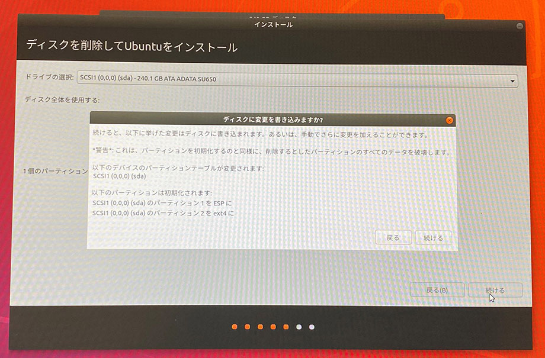

先日故障して処分した、_1台目の ThinkPad X250_。コチラは元あった SATA HDD を取り外し、240GB の SATA SSD に換装して Ubuntu をインストールして使っていた。

- [ThinkPad X250 を買った](/blog/2020/02/20-02.html)
- [ThinkPad X250 を HDD から SSD に換装する](/blog/2020/03/17-02.html)
- [ThinkPad X250 に載せた空の SSD に、ライブ USB メモリを使って Ubuntu をインストールする](/blog/2020/03/19-02.html)

1台目の ThinkPad X250 が壊れた際、SATA SSD は取り外して保管しておいた。

そんで、__2台目の ThinkPad X250__ を買った。

- [ThinkPad X250 が壊れたので ThinkPad X250 を買った](/blog/2020/04/04-01.html)

この2台目 ThinkPad X250 には、通常取り付けられていない M.2 スロットに 1TB の SSD が取り付けられており、コチラに Windows 10 Pro がインストールされていた。元々搭載されていた SATA HDD は完全にデータ保存用となっていた。

---

今回は、2台目 X250 から SATA HDD を取り外し、1台目の X250 に乗せていた SATA SSD を換装。__物理的にストレージが別れたデュアルブート環境__を構築してみた。

## 目次

## HDD から SSD への換装

HDD の取り外しと SSD への換装は、1台目 X250 の記事で紹介したとおりなので割愛。取り付け自体は難しくはない。

## BIOS でブート順を変更する

続いて、BIOS でブート順を変更する。

色々試したのだが、_1台目の X250 でインストールしていた Ubuntu は、2台目の X250 に載せただけでは正しく認識してくれなかった。_そこで、__SATA SSD をフォーマットして、Ubuntu を再インストールする__ことにした。

とりあえず、SATA SSD (Ubuntu を入れる方) を優先的に配置し、M.2 SSD に入っている「Windows Boot Manager」と「SSD」は後ろの方に配置しておく。

Ubuntu の再インストール時は「USB」を最優先にしておいた他、M.2 SSD は無効化しておいた。Ubuntu の再インストール後は以下の状態のまま正常にデュアルブートできている。

## ライブ USB メモリで Ubuntu をインストールする

USB メモリに入れた Ubuntu を起動し、Ubuntu を再インストールしていく。大まかなインストールの流れは以下の記事がベースになる。

- [Ubuntu をインストールするためのライブ USB メモリを作成する](/blog/2020/03/18-02.html)
- [ThinkPad X250 に載せた空の SSD に、ライブ USB メモリを使って Ubuntu をインストールする](/blog/2020/03/19-02.html)

予めストレージがどのように認識されているかを確認しておく。Ubuntu を再インストールしたい SATA SSD は `/dev/sda1` とみなされており、Windows がインストールされている M.2 SSD は `/dev/sdb2` とみえている。

インストールウィザードを開いて進めていく。

すると、SATA SSD に既に Ubuntu が入っていることを認識してくれるので、「ディスクを削除して Ubuntu をインストール」を選択する。コレで一度 SSD がフォーマットされ、新たに Ubuntu がインストールされ直される。

次の画面で、間違いなく SATA SSD の方を選択すること。

以下が最終確認。コレで「続ける」を押すと SSD がフォーマットされ、Ubuntu がインストールされていく。

## Linux のブートローダ「GRUB」が開くようになる

Ubuntu がインストールできると、同時に M.2 SSD の方も認識してくれたようで、次回起動時からは __GRUB__ によるブートローダの画面が開くようになった。

項目が4つあるが、

- 一番上の__「Ubuntu」__を選べば、SATA SSD に再インストールした Ubuntu 環境が起動し、
- 上から3つ目の_「Windows Boot Manager (on /dev/sdb2)」_を選べば、M.2 SSD にインストールされている Windows 10 Pro 環境が起動する

という状態になった。

## 以上

GRUB が勝手に構成されて、特に設定変更も要らないのは助かる。

2台目のセットアップ時は、1台目のセットアップ時と同じライブ USB メモリを使ったのだが、上述のようにインストールウィザードの動きが少し変わってくれたりと、ちゃんと接続されているデバイスをみて最適な設定に構成してくれるので、Ubuntu とてもありがたい。
