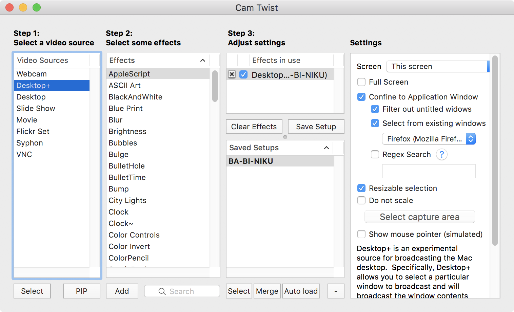
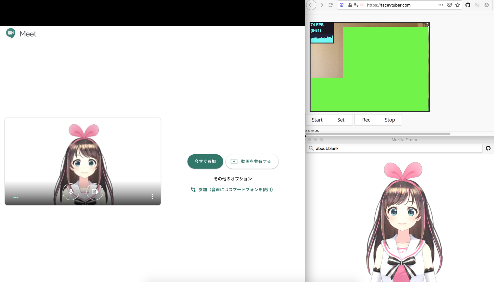

VTuber の中でも、美少女モデルに変身することを**「バ美肉 (バーチャル美少女セルフ受肉)」**と言うらしい。

今回、それを簡単に実現する方法を試してみたので紹介する。

## 目次

## 仕組み

今回バ美肉を行う主要な仕組みには、**FaceVTuber** という Web アプリを使う。

- [FaceVTuber](https://facevtuber.com/)

ブラウザのみで簡単に動作するのでお手軽だ。コレにより、ウェブカメラで捉えた人物の動きに合わせて 3D モデルが動くところまで実現できる。

FaceVTuber の映像を「ウェブカメラの映像」としてビデオチャットツールに配信するため、*CamTwist* というツールを使う。このソフトは MacOS 用だが、Windows 環境でもこのソフトと同様の機能を持つソフトが用意できれば、バ美肉配信できるはずだ。

## CamTwist をインストールする

まずは以下のページから CamTwist をダウンロードし、インストールする。

- [CamTwist | Download](http://camtwiststudio.com/download/)

## 3D モデリングデータをダウンロードする

次に、バ美肉する 3D モデルをダウンロードする。今回は「キズナアイ」ちゃんのモデリングデータを使用する。

- [DOWNLOAD | Kizuna AI official website](https://kizunaai.com/download/)

Zip ファイルをダウンロードしたら、解凍は不要。そのままにしておく。

## FaceVTuber をセットアップする

Chrome や Firefox ブラウザで、以下の FaceVTuber のサイトにアクセスする。

- [FaceVTuber](https://facevtuber.com/)

アクセスしたら次の手順でセットアップしていく。

1. ファイルアップロード欄より、用意したモデリングデータの Zip ファイルをアップロードする
2. 何度かアラートダイアログで確認が入るので、「OK」を選んで進めていく
3. モデリングデータが読み込まれたら「Start」ボタンを押下しウェブカメラを起動する
4. 顔のトラッキングが始まるので、それを確認したら「Set」ボタンを謳歌する。コレにより顔の動きに合わせて 3D モデルが動作するようになる
5. 「popWindow」ボタンを押下し、ポップアップウィンドウを開く。後で CamTwist を使い、このウィンドウをキャプチャさせることになる
6. お好みで「モデルの位置調整」を行ったり、「手の操作」の有効・無効を切り替えて「ResetPose」ボタンを押下したりする。顔のトラッキング位置が微妙になったら「Set」ボタンを押せば再セットされる

## CamTwist を起動・設定する

ポップアップウィンドウが用意できたら、コレをビデオチャットツールで配信できるようにするため、CamTwist を設定する。

Camtwist を起動したら、次のようにセットアップしていく。

1. 「Step1」欄で「Desktop+」を選んで「Select」ボタンを押下する
2. 「Step2」欄は「AppleScript」のまま、「Step3」欄もそのままにする
3. 「Settings」欄で「Confine to Application Window」を選ぶ
4. 「Select from existing windows」より、でポップアップ起動した FaceVTuber のウィンドウを選択する
5. 「Save Setup」ボタンで保存する
6. 「Auto load」ボタンでロードする

## ビデオチャットツールを設定する

ココまで設定すると、ビデオチャットツールのデバイス設定で「CamTwist」と書かれた項目が選べるようになっているはずだ。「2YUV」と書かれたモノと2つ見つかるかと思うが、どちらを選んでも良い。

- FaceVTuber でウェブカメラをキャプチャしているウィンドウ
- FaceVTuber から開いたポップアップウィンドウ
- ビデオチャットツールのウィンドウ

の3つのウィンドウが重ならないよう、上手くウィンドウを並べておこう。

また、Chrome ブラウザで Hangouts Meet なんかに参加する場合は、FaceVTuber を Firefox など別のブラウザで開いておいた方が安定するだろう。

## 以上

コレで簡単にバ美肉できてよきよき。キズナアイちゃんになれて楽しい。ｗ

- 参考：[【Mac】30分でミライアカリにバ美肉してビデオ会議するまでのログ - Qiita](https://qiita.com/tktktktk/items/a024b9df15efe7b36ad6)
- 参考：[バ美肉！バ美肉！バ美肉 - Qiita](https://qiita.com/eve1224/items/5d75d9e3fa506c04050e)
