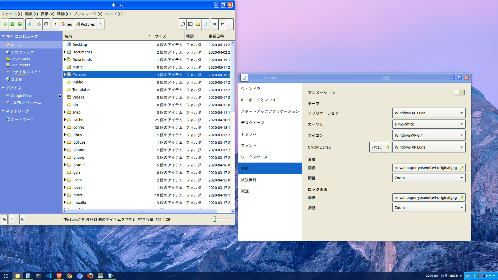

Ubuntu 18.04 日本語 Remix を使っている。デスクトップ環境は特にイジっていないので、Ubuntu 標準の GNOME (GNOME Shell) を使っており、ツールキットには GTK が使われている状態。

今回、Linux デスクトップを Windows XP 風に変更するテーマとアイコン集を見つけたので、インストールしてみた。

## 目次

## ユーザテーマ用ディレクトリを作る

独自にダウンロードしたテーマやアイコンを格納するためのディレクトリを作る。

```bash
$ mkdir ~/.themes
$ mkdir ~/.icons
```

## GNOME Shell 拡張機能「User Themes」をインストールする

GNOME Shell 拡張機能の本体 (`gnome-shell-extensions`) はインストール済だと思うので省略。以下の「**User Themes**」という拡張機能をインストールする。

- 参考 : [User Themes - GNOME Shell Extensions](https://extensions.gnome.org/extension/19/user-themes/)

コレをインストールすると、GNOME Tweaks (`gnome-tweaks`) の「外観」のところで、先程用意したユーザテーマ用ディレクトリを参照して、テーマやアイコンを設定できるようになる。

## 任意のテーマやアイコンをダウンロードする

あとは好きなテーマやアイコンをダウンロードし、先程作ったディレクトリ配下に配置すれば良い。

Windows XP 風のテーマにする *XP Professional* は、以下のサイトからダウンロードできる。

- [XP Professional - pling.com](https://www.pling.com/p/1230964/)
  - 右側の「Download」から `Windows-XP-3.1.zip` をダウンロードする
  - Zip を解凍すると、中に色々なフォルダがあるので、それらを `~/.themes/` 配下にコピーする
  - Luna テーマの場合、`~/.themes/Windows XP Luna/` という感じでディレクトリごと配置できたら OK
- 参考 : [GitHub - B00merang-Project/Windows-XP: Windows XP themes](https://github.com/B00merang-Project/Windows-XP) … GitHub リポジトリ
  - 上のページから作者のリンクを選択すると、他にも MacOS 風など様々なテーマがあるので、探してみると良いだろう

同じく、Windows XP 風のアイコンセットを提供する *XP Icons* は、以下のサイトからダウンロードできる。

- [XP Icons - pling.com](https://www.pling.com/p/1158349/)
  - `Windows-XP-3.1.zip` をダウンロードしたら解凍し、`~/.icons/` ディレクトリ配下にコピーする
  - `~/.icons/Windows-XP-3.1/` という感じで配置できていれば OK
- 参考 : [GitHub - B00merang-Artwork/Windows-XP: Remake of classic YlmfOS theme with some mods for icons to scale right](https://github.com/B00merang-Artwork/Windows-XP) … GitHub リポジトリ

## GNOME Tweaks でテーマを選んで適用する

「GNOME Tweaks」を開き、「外観」を選ぶと、

- 「アプリケーション」の中から「Windows XP Luna」など、
- 「GNOME Shell」の中から「Windows XP Luna」など、
- 「アイコン」の中から「Windows-XP-3.1」など

がそれぞれ選択できるようになっているはずだ。

「アプリケーション」と「GNOME Shell」は `~/.themes/` 配下に置いたテーマを、「アイコン」は `~/.icons/` 配下に置いたアイコンセットをそれぞれ参照できるようになっている。

配置したはずのテーマが見えていない場合は、一度「GNOME Tweaks」を閉じて再度起動してみよう。

テーマやアイコンを選択すると、即座にテーマが切り替わる。

## 以上

Windows XP 風なテーマを適用してみた結果はこんな感じ。



ウィンドウのタイトルバーの色味や、右下のタスクトレイの色味なんかはテーマのおかげで Windows XP 風になっている。

Files がエクスプローラのアイコンになっていたり、Gedit がメモ帳のアイコンになっていたりするのはアイコンセットのおかげ。

GNOME だと Start ボタン周りが再現できていないが、Cinnamon なんかだとうまくいくっぽい。色々試してみると良いかと。

- 参考 : [How to Install Themes in Ubuntu 18.04 & 16.04](https://itsfoss.com/install-themes-ubuntu/)
