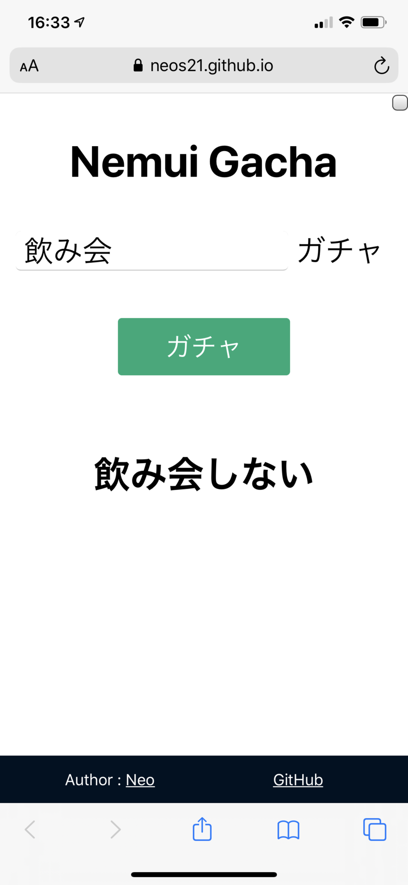

ちょっと前に、Python ベースに MeCab で形態素解析を行い、「ねむい」という単語を「ねむくない」に変換したり、しなかったりする_「ねむいガチャ」_というプログラムを作って紹介した。

- [Neos21/nemui-gacha](https://github.com/Neos21/nemui-gacha)

MeCab を用意しないといけないので環境構築が手間だし、ウェブアプリみたいにしようにも Python が動作するところに置かないといけないので、イマイチ手軽さに欠けていた。

そこで、ブラウザオンリーで動作するような、JavaScript 製の形態素解析ツールを探したところ、__[kuromoji.js](https://github.com/takuyaa/kuromoji.js)__ というライブラリを発見したので、コイツを使ってみることにした。

フロントエンドは [Create React App](https://github.com/facebook/create-react-app) を使い、久々に React.js を触った。ついでに TypeScript と SCSS が使える環境にし、Angular CLI や Vue CLI と同等の環境構築に成功した。

ウェブアプリとして GitHub Pages 上に動作するモノを置いた他、リポジトリをクローンしてローカルで CLI からも実行できる仕組みを作った。その名も __[「ねむいガチャ.js」](https://github.com/Neos21/nemui-gacha-js)__。TypeScript 製だけど「.js」。笑

## 目次

## Web アプリ版の紹介

Web アプリ版は以下のページから試せる。

- [Nemui Gacha JS](https://neos21.github.io/nemui-gacha-js/)

最初は辞書ファイルの取得に時間がかかるので、若干「Loading」表示が続くと思うが、それが終わるとメイン画面が開く。

テキストボックスに任意の文言を入れ、「ガチャ」ボタンを押すと、ランダムに肯定形 (元の文のまま) か否定形の文章を返すというモノ。



画面右上にコッソリチェックボックスを配置しているのだが、コレにチェックを入れると、必ず否定形に変換した文言を返すようになる。

大抵の形容詞や動詞には対応できるようにしたが、否定形変換に失敗した場合はエラーとしている。ぜひ GitHub Issues で報告してほしい。

GitHub リポジトリの README にも書いたが、URL パラメータで `?q=帰る` とか指定すれば、その文言を初期表示時にいきなりガチャれる。さらに、`?force=true` を同時に指定すれば、必ず否定形に変換するチェックボックスにチェックを入れた状態で起動できる。

- 例 : <https://neos21.github.io/nemui-gacha-js/?q=%E5%B8%B0%E3%82%8B&force=true>

## CLI 版の紹介

CLI 版はまだ手抜きしていて、`ts-node` を使ってトランスパイルなしに実行するようにしている。

GitHub リポジトリをクローンしたら、`npm install` で依存パッケージを取り込み、以下のように実行する。

```bash
$ npm run cli 'ねむい'
# → 「ねむくない」or「ねむい」

# スペースで区切って複数の値を渡した場合は結合する
$ npm run cli とても ねむい
# → 「とても ねむくない」
```

以下のように_第1引数で_ `--force` と指定すると、強制的に否定形に変換できる。第1引数として分けて記述してやらないと認識しないガバ実装なので注意。

```bash
# 引数として認識させるため `--` が必須
$ npm run cli -- --force 'ねむい'
$ npm run cli -- --force とても ねむい
```

## バグ報告などお待ちしております

否定表現への変換処理は、Python 製の「ねむいガチャ」の実装を移植・改良したモノで、機械学習のようなモノは一切入れていない。変わった文言だとうまく変換できないこともあると思うので、もしうまく変換できない文言が見つかったら、GitHub Issues で報告をお待ちしている。

- [Neos21/nemui-gacha-js](https://github.com/Neos21/nemui-gacha-js)

以上。
