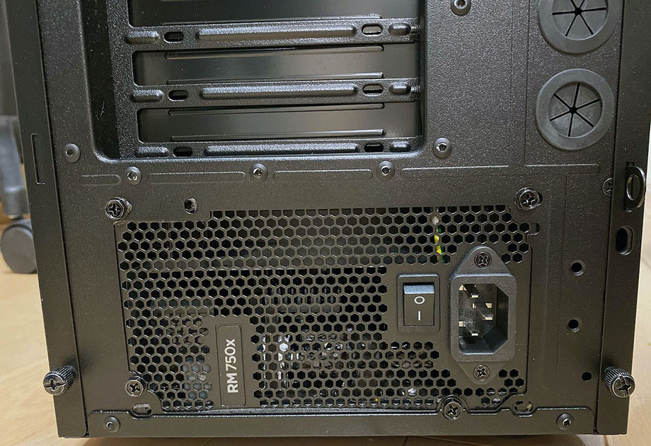

自分のメインマシンが故障したので、有償修理を依頼したレポ。

## 目次

## 事の発端

自分は、約3年前に買ったドスパラのゲーミング PC、__Galleria XG__ をメインマシンとして使っている。

- [ドスパラのデスクトップゲーミング PC「Galleria XG」を買った！](/blog/2017/08/08-03.html)

購入から2年半が過ぎた 2020-04-12。その日は PC 周辺を掃除していて、コンセントを一度抜いて本体をどかしたりした。

掃除が終わり、本体にコンセントを繋いだ時、「パチン」という音がした。当然、電源ユニット側のスイッチは OFF の状態でコンセントを抜き差ししたのだが、何か通電したのか？と思った。しかしその後も、本来なら電源 OFF 時でもマザーボード上の LED がオレンジ色に光っているはずなのに、コレが光っていなかったりと様子がおかしい。電源ボタンを押してみると、ウンともスンとも言わない。

電源ボタンを押しっぱなしにして放電してみたり、家の壁コンセントから直接電源を取ってみたり、色んなことを試してみたが、一切電源は付かず。

…

__…あー、終わったか。__

一切通電していないようだったので、電源ユニットが死んだんだろうなーと推測。

↑ 死んだ子。

↑ 裏面。

しかし、この手の修理を自分の手でやれる自信がなかったので、_ドスパラの「パソコンなんでも相談所」_を利用してみることにした。

- [パソコン修理 - ドスパラ パソコン修理詳細・修理料金表・PC修理情報](https://www.dospara.co.jp/service/share.php)

この修理サービスは、ドスパラで買った PC に限らず、自作パソコンでも修理をしてくれるという。診断やクリーニング等もやってくれるそうなので、いくらお金がかかってもいいやと思い依頼してみた。

## 集荷依頼を出すも梱包が合わず

診断と修理を依頼する時に、PC を梱包する箱がなかったので、ヤマト運輸の集荷サービスも同時にドスパラへお願いすることにした。

依頼を出して2日後、ヤマトの集荷が来た。PC 本体を渡したが、向こうが用意したダンボール箱にどうしても入らない。

自分からドスパラへは、PC の型番および寸法を伝えていた。ドスパラ自身が売っている PC なので、筐体サイズもよく知っているはずだ。そして、ドスパラ経由で集荷依頼を受けたヤマトは、「パソコンボックス F」という、ヤマトが持っている一番大きなダンボール箱を用意していた。

- 参考：[パソコン宅急便 | ヤマト運輸](http://www.kuronekoyamato.co.jp/ytc/customer/send/services/pasotaku/)

それなのに、このダンボールには PC が入り切らなかった。正確には、PC 本体だけならダンボールには入るのだが、PC 本体を挟み込むフィルム式の緩衝材を使おうとすると、ダンボールの蓋が閉まらなくなるのだ。ヤマト的には、緩衝材込みでダンボールのフタを閉められない場合は、移送中の破損には責任を持てないという。そりゃそうだろうな。

ヤマトの人が気を使って、「専用の緩衝材を使わず、コチラでプチプチとかでなるべく厳重に梱包しておくことは可能です、責任は負いかねますが…」と言ってくれたので、移送中に破損したとしても自己責任、ということで、配送を依頼した。ドスパラには電話で「そっちが手配したダンボールは大きさが十分でなかった、返送時はこのダンボールを使うな」と連絡。すると返送時は「ガレリア」を販売する際に使うダンボールを使用する、ということで話がついた。

ドスパラは今までもこのダンボール・このサイズの筐体で頻繁に配送したりしているみたいなので、ガレリア XG の__「KT ケース」サイズの筐体を利用している人は、梱包に要注意。__

## 異常が見られず返送される

集荷で一悶着あった2日後、ドスパラから連絡があり、_「電源が正常に付いていて、負荷試験もクリアしていて異常が見つからない」_とのこと。

ホントかよ自宅じゃ何しても付かなかったぞ、と言ってみたが、電話ごしにログイン画面も突破してデスクトップが表示されたことが確認できたので、どうやらドスパラの修理センターで正常に動作しているのは本当らしかった。

事象が再現しないのに、何か部品を交換したりすることもできず。一定期間内なら再修理も無料対応可能ということだったので、ひとまず内部クリーニングだけしてもらって、返送してもらうことにした。

## 電源ケーブルに問題？

2020-04-20、PC が返ってきた。自宅で試してみたが、やはり__どうしても自宅では通電しなかった。__

集荷の際は電源ケーブルも送っていて、電源ケーブル側にも問題が見られなかったという。しかし、自宅では結局通電しない。どこが悪いのか分からないのだ。

内部クリーニングについては十分な仕上がりで、排気口にホコリ避けのメッシュを貼ってもらえたり、キレイになって返ってきて良かった。動かないけど。ｗ

↑ 両側面・上面の排気口にメッシュが取り付けられている

↑ 上面

↑ 内部クリーニングもしてもらった

この頃には電源ユニット以外の原因も考えていて、

- 電源ケーブル (他にケーブルを持っていないので比較調査ができず)
- マザーボード (どこかショートした？可能性も)
- メモリ (抜き差しはしてみたが見た目は問題なし)
- グラボ (グラボが死んでても起動しないことがあるらしい)

このあたりを疑っていた。

一番手っ取り早く比較調査できそうなのは「電源ケーブル」かなと思い、Amazon で似たような電源ケーブルを注文することにした。Powseed なるメーカの 7.5A のヤツを適当に選んだ。Amazon で999円なり。

## 新たな事象が発生・そして再修理へ…

電源ケーブルを注文した夜、どうしても納得がいかず、電源ユニットの電源ケーブル差込口をグリグリいじくったりしていた。すると_たまに通電_する瞬間があることが分かった。

通電後、電源を付けてみると、繰り返しビープ音が鳴り、BIOS は起動しない状態。ビープ音の鳴り方は__「ピーッ (長)、ピッ (短)、ピッ (短)」__という音が繰り返し流れていた。

この音は何かと思い調べてみると、「ビデオカードかモニタにエラーがある場合」に鳴る音らしいのだ。

- 参考：[BIOS 警告音一覧](http://www.redout.net/data/bios.html)

__…うーん、もしかしたらグラボが死んだ？GTX1080 君が…？__だとしたら修理費用つらいな…。

ドスパラに再度連絡し、「送り返してもらった PC が、今度は通電し、ビープ音が流れた」と伝えると、再度引き取り調査となった。今度は返送時に使われたドスパラのダンボールで配送。

## 原因判明

ドスパラに再度配送した 04-22 に、Amazon で買ったケーブルが届いた。多分ケーブルの問題ではなさそうなので、買うだけ無駄だったが、今後のトラブル発生時に使うとしよう。

↑ ケーブル来た。

で、今度はドスパラでも事象が再現し、__電源ユニットが故障している__ことが判明した。

ということで電源ユニットを同等の新品に交換してもらい、04-26 に再度返送された。今度は無事に電源が付き、正常動作してくれた。よかった。

↑ 左下の電源ユニットが取り替えられている。ケーブル類も電源ユニット付属のモノに差し替えられているようだ

↑ 電源は __Corsair RM750X__ に取り替えられていた

↑ 背面。

↑ ケーブル類も付属。

↑ 死んだ元々の電源ユニットは _AcBel iPower 85 750_ というモノ

## 費用

修理にかかった費用は以下のとおり。

- 引取修理・集荷依頼 : ￥5,500
- トラブル診断 : ￥3,300
- クリーニング なっとくコース : ￥3,300
- フィルタ取り付け : ￥2,200
- 代引き手数料 : ￥660 × 2回
- 電源ユニット代 : ￥13,900
- 電源ユニット交換作業代 : ￥8,360
- アフターケアプレミアム mini プラン (加入後1年間保証) : ￥8,800

__合計 ￥46,680 なり。__

まぁこんなもんかなぁ。自分ではどうせ出来なかっただろうから、高いとは思わない。

## ドスパラ「パソコンなんでも相談所」の評価

集荷依頼の段ボール箱がイマイチだったのが残念ポイントだが、あとは特に悪いところもなかったかな。電話連絡も迅速で親切丁寧だったし、昨今のウイルス流行の中でもスピーディに対応してもらえたと思う。

今回自分のマシンで発生した事象によるモノだが、1回目にドスパラで事象が再現しなかったのが面倒だった。しかし、再修理を依頼してもその部分に費用がかからなかったのは良かった。

前述のとおり費用もそれなりに安く、内部クリーニングなどもよくしてもらえていたので、最終的に修理されて不満はなし。

ドスパラ以外の PC でも、自作 PC でも修理してもらえるというのは頼りになるところ。今後も、このガレリア XG に何か問題が発生したら頼るとするかな。

  

    
  

  

    

      <a href="https://www.amazon.co.jp/dp/B07XFVZZZB?tag=neos21-22&amp;linkCode=osi&amp;th=1&amp;psc=1">mouse ゲーミング デスクトップパソコン G-Tune NM-S711SHR6SZI/Corei7 9700/2060Super/16GB/256GB/1TB/Win10</a>
    

  

  

    
  

  

    

      <a href="https://www.amazon.co.jp/dp/B07WNW2SWC?tag=neos21-22&amp;linkCode=osi&amp;th=1&amp;psc=1">Dell ゲーミングデスクトップパソコン G5 5090 Core i7 RTX 2060 ブラック 20Q33/Windows 10/16GB/256GB SSD+2TB HDD</a>
    

  

