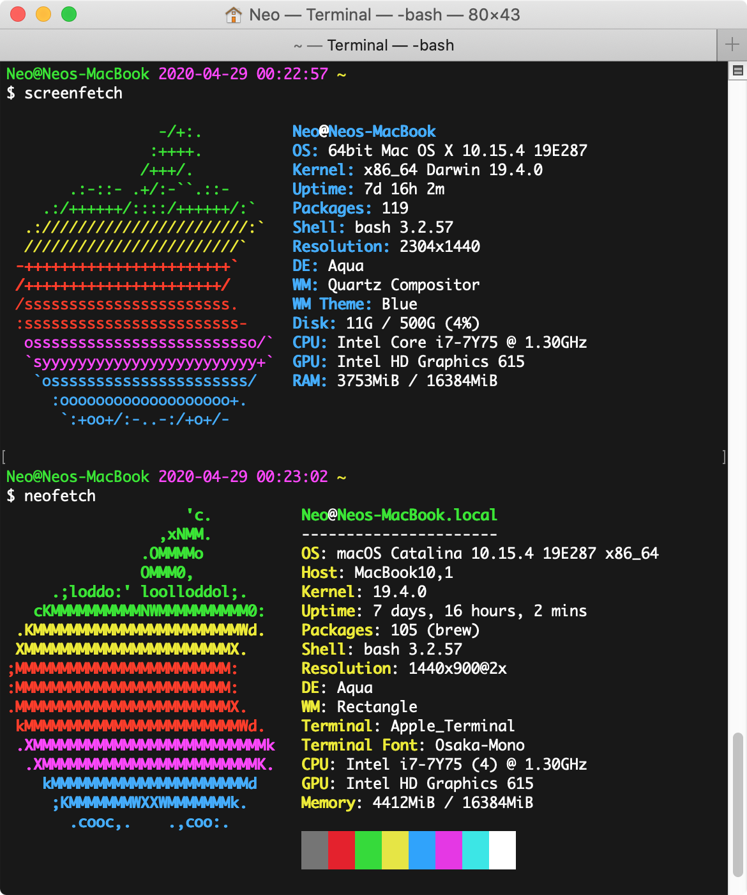
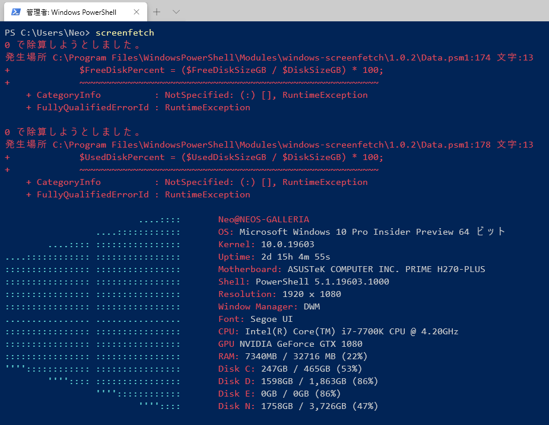
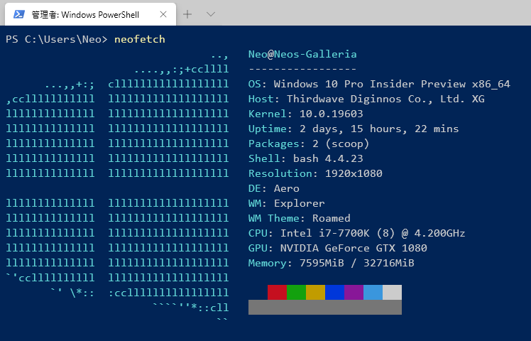
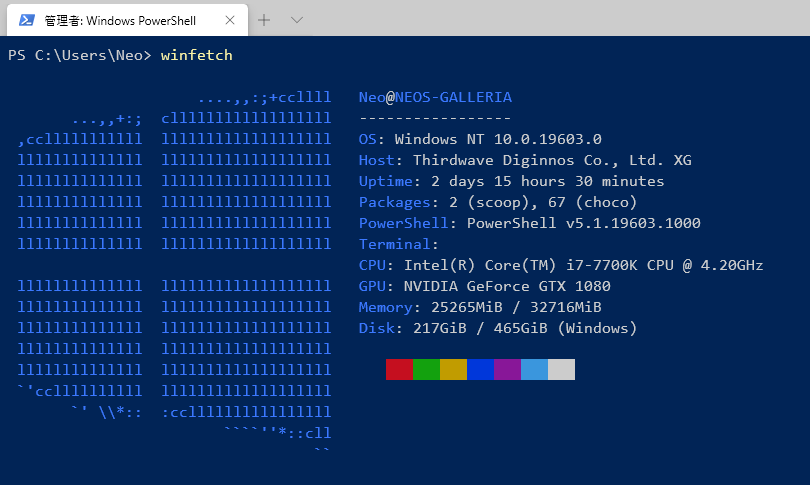

OS 情報をイイカンジに表示してくれる *screenfetch* と **neofetch** という CLI ツールがある。自分の PC の情報なんて自分が一番知ってるから別に要らないんだけど、何となくテンションが上がるので入れてみる。

Linux 系の場合はサクッと入ると分かっているので、今回は MacOS と Windows とでインストール方法を確認してみる。

## 目次

## MacOS で screenfetch と neofetch を使う

…といっても MacOS の場合はシンプルで、Homebrew から2つともインストールできる。

```bash
$ brew install screenfetch neofetch

$ screenfetch
$ neofetch
```



簡単。

## Windows で screenfetch を使う

Windows の場合はそれぞれのパッケージをインストールする手順が違う。screenfetch は Windows 版があり、ワンライナーでインストールできた。

```powershell
PS> Install-Module -Name windows-screenfetch

PS> screenfetch
```

手元で試したら、なんかゼロ除算エラーが出たけど気にしない。



- 参考 : [GitHub - JulianChow94/Windows-screenFetch: Powershell port of bash/unix screenfetch.](https://github.com/JulianChow94/Windows-screenFetch)

## Windows で neofetch を使う

neofetch が面倒だった。

*scoop* という、Chocolatey に似たパッケージマネージャを使うとインストールできるのだが、scoop でも Git をインストールしてやらないと、依存関係が解決できなかった。

```powershell
# scoop というパッケージマネージャをインストールする
PS> Set-ExecutionPolicy RemoteSigned -scope CurrentUser
PS> iex (new-object net.webclient).downloadstring('https://get.scoop.sh')

# 依存する git パッケージと一緒にグローバルオプションを付与してインストールする
PS> scoop install --global neofetch git

PS> neofetch
```



- 参考 : [I just learned that neofetch is available for Windows : Windows10](https://www.reddit.com/r/Windows10/comments/a2evi1/i_just_learned_that_neofetch_is_available_for/)
- 参考 : [Scoop](https://scoop.sh/)

## オマケ : winfetch も試してみる

Windows 向けには *winfetch* というモノもあるみたいなので試してみた。コレも Scoop を使うので、Scoop 自体はインストールしておくこと。

```powershell
PS> scoop bucket add extras
PS> scoop install winfetch

PS> winfetch
```



neofetch に近いかなー。

- 参考 : [WinFetch v1.0 released! Support for custom configuration + new info fields : PowerShell](https://www.reddit.com/r/PowerShell/comments/b9effr/winfetch_v10_released_support_for_custom/)

## 以上

やはり後発の neofetch の方が見た目はリッチかな？
