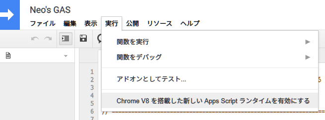

Google Apps Scripts が V8 エンジンに対応した、というニュースは2020年2月末頃に流れていたと思う。

- 参考 : [祝！Google Apps Scriptが「V8ランタイム」をサポート！モダンなECMAScript構文が使えるようになった](https://tonari-it.com/gas-v8-runtime/)

自分はレガシーな JavaScript も気にせず書けるので、なるほどー最新の ECMAScript 構文が書けるようになって便利になったわねー、ぐらいにしか思っていなかったのだが、最近また GAS を使う機会があったので、触ってみた。

## 目次

## コレまでの GAS は `let` が使えなかった

面白いことに、コレまでの GAS は、`const` は書けたのに、`let` は書けなかったのだ。自分は普段 `let` をほぼ使わないので気付かなかったが、今回ようやく `let` が書けるようになったワケだ。

`const` については、コレまでの Rhino ランタイムでは `const` に再代入してもエラーが発生せず、最初に代入した値が保持されるという挙動だったが、コレが V8 ランタイムになって、再代入時に TypeError が発生するように変わった。

- 参考 : [GASがV8エンジンに対応したのでドキュメント読んだ - Qiita](https://qiita.com/UtaMori/items/ce83672cecca20964899)

## V8 ランタイムを有効にするには

V8 ランタイムを使うには、自分で明示的にランタイムを切り替えてやらないといけない。

GAS のエディタ画面を開き、上部のメニューから「*実行*」→「**Chrome V8 を搭載した新しい Apps Script ランタイムを有効にする**」を選ぶ。

切り替え作業はコレだけ。ランタイムが変わるので、細かな言語仕様により既存のコードは実行結果に差異が出るかもしれない。一度有効にしたあとも、V8 から Rhino に戻すこともできるので、動作確認してみてほしい。

実行速度などの変化はあまり感じないが、新し目の構文がすんなり書けるようになったのは良いかも。
