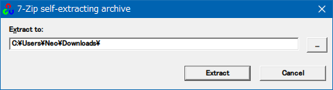
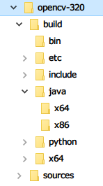

以前、MacOS に OpenCV をインストールし、Java アプリで使用するための JAR ファイルを生成する手順を紹介した。

- 過去記事 : 2020-05-13 [MacOS に OpenCV をインストールし JAR ファイルを生成する](/blog/2020/05/13-02.html)

この時紹介したのはソースコードからビルドする方法で、Ubuntu などの Linux マシンでもほぼ同様の手順でビルド・インストールができる。Linux の場合はネイティブライブラリは `libopencv_java320.so` というファイルで、MacOS の場合は `libopencv_java320.dylib` というファイルで出力される。JAR ファイル `opencv-320.jar` はどちらでも同じモノが出力されているようだった。

で、今回は OpenCV を Windows に導入し、MacOS や Linux で検証したように JAR ファイルを用意して Java アプリに組み込む準備をしてみる。

## Windows 向け OpenCV をダウンロードする

OpenCV は、Windows 向けにはビルド済のファイル群をまとめて提供してくれている。以下のサイトよりバージョン別にダウンロードできる。

- [Releases](https://opencv.org/releases/)

今回は v3.2.0 をダウンロードした。上の公式ページよりリンクされている、リンク先ページを以下に直接リンクしておく。

- [OpenCV - Browse /opencv-win/3.2.0 at SourceForge.net](https://sourceforge.net/projects/opencvlibrary/files/opencv-win/3.2.0/)
  - `opencv-3.2.0-vc14.exe` をダウンロードする

## `exe` を開き解凍・任意の場所に配置する

ダウンロードした `opencv-3.2.0-vc14.exe` を開くと、解凍先ディレクトリを問われる。



とりあえずはどこに解凍しておいても良いが、あとで*ネイティブライブラリファイルへのパス*を通す必要があるので、どこか決まった場所に配置した方が良いだろう。



解凍すると上のようなファイルツリーが登場する。

## JAR ファイルとネイティブライブラリを確認する

解凍したファイルツリーの中から `build/java/` に進むと、`opencv-320.jar` が存在する。OpenCV を Java アプリで使う時はこの JAR ファイルを依存関係に含めれば良い。

一方、ネイティブライブラリは `build/java/x64/` 配下に *`opencv_java320.dll`* というファイルで置かれている (32bit 版は `x86/` ディレクトリ内)。

アプリ内で OpenCV ライブラリを読み込むには、

```java
import org.opencv.core.Core;

System.loadLibrary(Core.NATIVE_LIBRARY_NAME);
```

このような実装を加えておき、実行時にネイティブライブラリへのパスを渡してやれば良い。

```bash
$ java -Djava.library.path='C:\PATH\TO\opencv\build\java\x64' -jar .\example.jar
```

ノリはこんな感じ。

ネイティブライブラリへのパス通しには色々な方法があって、

- (上述のように) `java` コマンドでの実行時に `-Djava.library.path` オプションで渡す
- 環境変数 `_JAVA_OPTIONS` に `-Djava.library.path` オプションを書いておく (非公式な変数)
- Windows の場合は環境変数 `PATH` から検索される
- Linux の場合は環境変数 `LD_LIBRARY_PATH` に書く
- Linux の場合は `/etc/ld.so.conf` に書いて `$ ldconfig` で反映すれば永続化できる

などなど、いずれかの方法でネイティブライブラリが検索できれば良い。`.dll`・`.so`・`.dylib` ファイルの名前は一定の命名規則に沿って付けられているので、勝手にリネームしてはならない。

ということで今回はココまで。Windows でも OpenCV の準備ができたので、あとはコレを使った Java アプリを作るのみ。

- 参考 : [JNIメモ(Hishidama's Java native interface Memo)](https://www.ne.jp/asahi/hishidama/home/tech/java/jni.html)
- 参考 : [共有ライブラリの追加 - 祈れ、そして働け ～ Ora et labora](https://tetsuyai.hatenablog.com/entry/20111201/1324792477)
- 参考 : [JNI、JNAの使い方 - ふなWiki](https://blue-red.ddo.jp/~ao/wiki/wiki.cgi?page=JNI%A1%A2JNA%A4%CE%BB%C8%A4%A4%CA%FD)
- 参考 : [Javaの使用する環境変数 | GWT Center](https://www.gwtcenter.com/env-vars-used-by-java)
- 参考 : [EclipseでJava用のOpenCVを使う(for windows) - Qiita](https://qiita.com/livlea/items/a853c374d6d91b33f5fe)
- 参考 : [Visual Studio 2017にOpenCV3.2.0とopencv_contribを導入する方法 - Qiita](https://qiita.com/tomochiii/items/fa26404ebc5fcd4481b9)
- 参考 : [how to set java library path for processing - Stack Overflow](https://stackoverflow.com/questions/1734207/how-to-set-java-library-path-for-processing)
